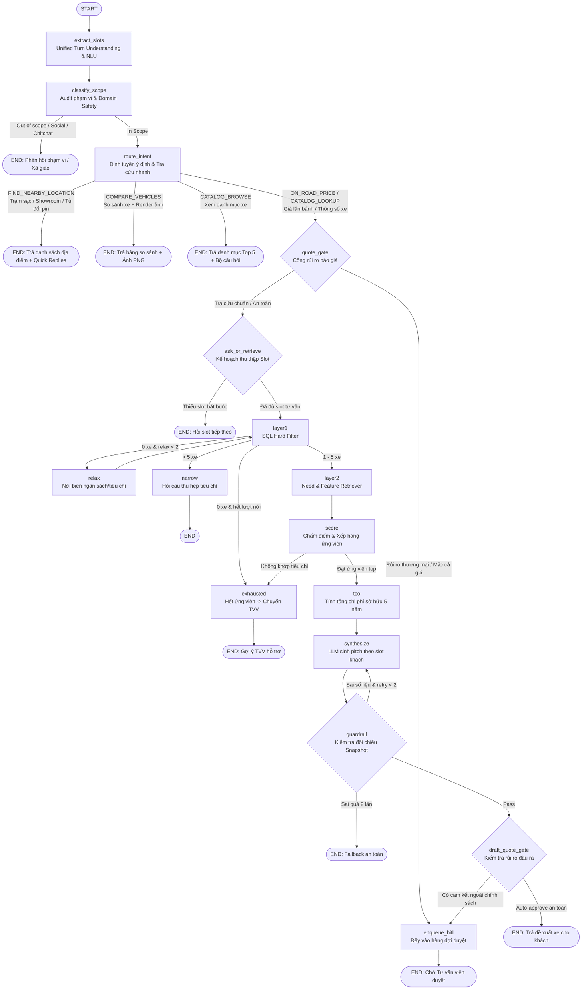

# TÀI LIỆU ĐẶC TẢ TÍNH NĂNG TOÀN DIỆN AGENT & PHÂN HỆ NGƯỜI DÙNG (SYSTEM SPECIFICATION)
> **Dự án:** VinFast AI Sales Advisor (P-150)  
> **Nhánh phát triển & hợp nhất:** `feature/agent-integration` *(kế thừa, chuẩn hóa và mở rộng toàn diện từ `feature/build-agent-long`)*  
> **Kiến trúc lõi:** LangGraph Orchestrated State Machine, Multi-Source RAG, Hybrid Search (pgvector + FTS / RRF k=60), Real-time WebSocket Live Chat, Rule-based Risk HITL, Zero-Hallucination Snapshot Engine, Spatial SQL Haversine Engine, Clean Architecture & 5-Layer Role × Permission × Scope Authorization (Tách biệt rõ ràng 3 quan hệ: `OWN` vs `ASSIGNED` vs `CLAIMED`).

---

## 1. TỔNG QUAN HỆ THỐNG VÀ NGUYÊN TẮC THIẾT KẾ BẤT BIẾN

Hệ thống **VinFast AI Sales Advisor (P-150)** là nền tảng trợ lý bán hàng và tư vấn thông minh toàn diện cho toàn bộ dải sản phẩm ô tô điện và xe máy điện VinFast. Hệ thống kết hợp giữa năng lực phân tích ngôn ngữ tự nhiên của LLM và tính chính xác tuyệt đối, tất định (deterministic) của dữ liệu doanh nghiệp.

### 1.1. Các nguyên tắc thiết kế bất biến (Invariant Design Principles)
1. **Quy trình điều phối tất định (LangGraph State Machine):** Không dùng ReAct Agent tự do chọn tool. Thứ tự các node và đường rẽ nhánh nghiệp vụ được quy định tường minh trong đồ thị trạng thái, loại bỏ hoàn toàn hiện tượng không nhất quán giữa các lần chạy và bảo đảm 100% khả năng kiểm thử tự động.
2. **Cam kết không bịa số liệu ("Zero Number Hallucination"):** LLM **tuyệt đối không** tự suy đoán hay sinh các chữ số quan trọng (giá niêm yết, giá lăn bánh, chi phí TCO, thông số pin, kích thước, khoảng cách địa lý). Toàn bộ số liệu định lượng được truy xuất từ Snapshot Catalog bất biến và tính toán bằng toán tử chính xác (`Decimal` half-up, Haversine formula). LLM chỉ đóng vai trò phân tích nhu cầu và diễn đạt ngôn ngữ tự nhiên.
3. **Cổng kiểm soát rủi ro Human-In-The-Loop (HITL theo rủi ro):** Tra cứu dữ liệu công khai (thông số, giá niêm yết, danh mục, so sánh xe, giá lăn bánh tiêu chuẩn, tìm trạm sạc/showroom) được trả về ngay lập tức (Auto-Approve). Hệ thống chỉ kích hoạt hàng đợi duyệt (`review_queue`) khi phát hiện yếu tố nhạy cảm thương mại: **mặc cả/thương lượng giá, cam kết tài chính cá nhân hoá, ưu đãi ngoài chính sách, hoặc độ tin cậy NLU dưới ngưỡng an toàn**.
4. **Phân tách tầng kiến trúc sạch (Clean Architecture & Modular Monolith):**
   - `domain/`: Thực thể nghiệp vụ, value objects, rules thuần túy không phụ thuộc framework hay DB.
   - `application/` (hoặc `services/`): Use cases và ports trừu tượng.
   - `infrastructure/` (hoặc `adapters/`): Triển khai kỹ thuật (PostgreSQL, SQLAlchemy, Redis, Nominatim Geocoding, MinIO, LLM API).
   - `presentation/` (hoặc `api/`): HTTP REST routes, WebSocket handlers, Schemas và Auth dependencies.
5. **Phân quyền đa tầng Default-Deny & Tách bạch 3 Loại Quan hệ:** Thay thế kiểm tra phân quyền rải rác bằng một engine trung tâm thực thi quyết định phân quyền theo 5 lớp: `Role → Permission → Scope → Resource Ownership/Assignment → Business State`. Đặc biệt tách bạch rõ 3 cơ chế:
   - **`OWN` (Customer Ownership):** Khách hàng sở hữu dữ liệu cá nhân (Profile, Conversations, Bookings).
   - **`ASSIGNED` (Advisor Assignment):** Phân công nghiệp vụ chăm sóc khách hàng dài hạn hoặc tiếp quản phiên Live Chat.
   - **`CLAIMED` (HITL Lock Lease):** Khóa tạm thời Distributed Lock 15 phút trên 1 ticket duyệt AI, không phải phân công vĩnh viễn.

---

## 2. KIẾN TRÚC ĐỒ THỊ LANGGRAPH (LANGGRAPH ORCHESTRATION GRAPH)



---

## 3. CHI TIẾT CÁC TÍNH NĂNG NỔI BẬT CỦA HỆ THỐNG AGENT

### 3.1. Phân loại Ý định Người dùng (11 Nhóm Intent)
1. **`ADVISORY` (Tư vấn chọn xe thông minh):** Tìm kiếm mẫu xe theo ngân sách, mục đích sử dụng, số chỗ ngồi, thói quen sạc, tiện ích ADAS.
2. **`CATALOG_LOOKUP` (Tra cứu thông số & giá xe):** Tra cứu công suất, dung lượng pin, thời gian sạc, giá niêm yết (kèm pin & thuê pin) của mẫu xe cụ thể (*"VF 7 pin đi được bao xa"*, *"Giá xe VF 3 kèm pin"*).
3. **`CATALOG_BROWSE` (Khám phá danh mục xe):** Xem danh sách toàn bộ các mẫu xe ô tô điện hoặc xe máy điện VinFast.
4. **`COMPARE_VEHICLES` (So sánh xe đa chiều):** So sánh đối đầu 2–3 xe theo bảng thông số kỹ thuật và sinh ảnh trực quan.
5. **`ON_ROAD_PRICE` (Dự toán chi phí lăn bánh):** Tính giá lăn bánh theo từng tỉnh/thành (miễn 100% lệ phí trước bạ xe điện, phí cấp biển số theo khu vực).
6. **`TCO_ESTIMATE` (Tổng chi phí sở hữu 5 năm - Total Cost of Ownership):** So sánh chi phí nuôi xe 60 tháng (tiền điện, sạc pin, bảo dưỡng định kỳ, bảo hiểm, phí đường bộ) giữa Mua pin vs Thuê pin vs Xe xăng cùng phân khúc.
7. **`FIND_NEARBY_LOCATION` (Tìm kiếm trạm sạc & điểm dịch vụ lân cận):** Tìm trạm sạc ô tô/xe máy, tủ đổi pin, showroom, xưởng dịch vụ gần nhất theo GPS hoặc địa chỉ văn bản.
8. **`POLICY_INQUIRY` (Chính sách & Ưu đãi):** Tra cứu bảo hành 10 năm/200.000 km, ưu đãi sạc V-Green, quà tặng VinClub từ tài liệu brochure chính thức qua RAG.
9. **`HUMAN_REQUEST` (Yêu cầu gặp TVV):** Phát hiện nhu cầu gặp nhân viên tư vấn và kích hoạt Live Chat trực tiếp.
10. **`TRANSACTION_REQUEST` (Đặt cọc / Đăng ký lái thử):** Hỗ trợ đăng ký lái thử xe tại showroom trên toàn quốc.
11. **`COMPLAINT` / `OUT_OF_SCOPE` / `CHITCHAT`:** Xử lý phản hồi khiếu nại, chào hỏi xã giao và giải thích phạm vi phục vụ.

---

### 3.2. Tìm kiếm Trạm sạc & Địa điểm Lân cận (`FIND_NEARBY_LOCATION`)

* **7 Loại địa điểm hỗ trợ (`LocationKind`):**
  1. `SHOWROOM_CAR`: Showroom Ô tô điện VinFast.
  2. `SHOWROOM_MOTORBIKE`: Showroom Xe máy điện VinFast.
  3. `CHARGING_STATION_CAR`: Trạm sạc Ô tô điện (trụ sạc nhanh DC, AC).
  4. `CHARGING_STATION_MOTORBIKE`: Trạm sạc Xe máy điện.
  5. `BATTERY_SWAP_CABINET`: Tủ đổi pin xe máy điện.
  6. `SERVICE_WORKSHOP_CAR`: Xưởng dịch vụ & bảo dưỡng Ô tô điện.
  7. `SERVICE_WORKSHOP_MOTORBIKE`: Xưởng dịch vụ Xe máy điện.
* **Cơ chế xác định vị trí kép:**
  - **GPS Trình duyệt:** Nút bấm `"📍 Chia sẻ vị trí của bạn"` gửi thẳng toạ độ `(latitude, longitude)` qua `POST /api/v1/locations/nearest` (tiết kiệm 1 LLM call).
  - **Địa danh tự nhiên (Geocoding):** Tự động bóc tách tên đường, quận/huyện, tỉnh/thành phố và phân giải toạ độ qua Nominatim có cơ chế caching trên PostgreSQL (`geocode_cache`).
* **Quét bán kính nới dần thông minh:** Tự động quét 5km → 15km → 50km bằng công thức khoảng cách SQL Haversine chính xác đến từng mét.
* **Giao diện thẻ `<NearbyLocationCards/>`:** Thẻ card bo góc 16px, icon nhận diện thương hiệu, tag khoảng cách nổi bật (`📍 Cách khoảng 200 m`), giờ mở cửa, số hotline click-to-call (`tel:...`) và nút **"Chỉ đường Google Maps"** mở lộ trình xuất phát từ vị trí khách tới trạm đích.
* **Lưu nhớ vị trí theo phiên:** Toạ độ đã cung cấp được lưu vào `conversation_sessions.user_location` để phục vụ các câu hỏi tiếp theo trong cùng phiên mà không cần xin lại quyền vị trí.

---

### 3.3. Khảo sát & Duyệt Danh mục Thông minh (Catalog Browse & Top 5 Collapse)
* **Khởi đầu phiên tương tác:** Người dùng chọn nhanh `🚗 Ô tô điện` hoặc `🛵 Xe máy điện`.
* **Cơ chế Danh mục Thu gọn (Top 5 + Xem thêm):** 
  * Hiển thị ngay 5 mẫu xe đầu tiên dạng thẻ Card (`VehiclePitchCard`) kèm giá, hình ảnh thực tế và mô tả tóm tắt.
  * Các xe còn lại được ẩn dưới nút bấm tương tác **`Xem thêm (còn N mẫu xe khác)`** kèm icon `ChevronDown`. Bấm vào sẽ mở rộng toàn bộ danh sách và cho phép **`Thu gọn danh sách`** bất kỳ lúc nào.
* **Bộ 3 câu hỏi khảo sát cấu trúc:** Ngay sau danh mục, Agent chủ động hỏi:
  1. *Ngân sách*: Quý khách dự kiến khoảng bao nhiêu cho chiếc xe này ạ?
  2. *Mục đích sử dụng*: Quý khách cần xe để đi lại trong phố, đi học, đi làm, hay chạy đường dài ạ?
  3. *Yêu cầu đặc biệt*: Quý khách có yêu cầu riêng nào về kiểu dáng, quãng đường di chuyển, hay các tính năng thông minh không ạ?
* **Chuyển đổi loại xe đối xứng linh hoạt (`CAR` ↔ `MOTORBIKE`):** Khi đang tư vấn Ô tô mà khách muốn chuyển sang Xe máy điện (hoặc ngược lại), Agent tự động nhận diện ý định, làm mới danh mục Top 5 và khảo sát lại theo loại xe mới mà không bị lỗi ngữ cảnh.

---

### 3.4. Lớp Kiểm duyệt An toàn Đầu vào & Khả năng Chịu lỗi (Input Moderation & Fail-Open Resilience) — *[CẬP NHẬT MỚI]*

* **Kiểm duyệt Độc hại Đầu vào (`src/agents/adapters/moderation.py`):**
  * Tích hợp OpenAI Moderation API trước khi đưa câu hỏi vào đồ thị xử lý LangGraph.
  * Tự động phát hiện và chặn các nội dung kích động bạo lực, xúc phạm hoặc xâm hại nghiêm trọng (`terminal_reason = "CONTENT_BLOCKED"`).
* **Cơ chế Kháng lỗi Linh hoạt (Fail-Open Resilience):**
  * Xử lý trường hợp dịch vụ kiểm duyệt ngoài gặp sự cố mạng hoặc Rate Limit (`HTTP 429 Too Many Requests`): tự động ghi log cảnh báo và xử lý **fail-open (`return False`)** để không gây chặn nhầm (false-positive blocking) các câu hỏi hợp lệ như `"CAR"`, `"xe máy điện"`, `"VF 7"`.
  * Các chốt chặn an toàn nội bộ ở các bước sau (State Validation, Policy Snapshot Guardrail, Output Gatekeeper) tiếp tục đảm bảo tuyệt đối không rò rỉ dữ liệu hoặc sinh thông tin sai lệch.


---

## 4. CHI TIẾT PHÂN HỆ THEO VAI TRÒ (3-TIER RBAC SPECIFICATION)

### 4.1. Phân hệ Khách hàng (Role: `CUSTOMER`)
Dành cho người dùng cuối có nhu cầu tìm hiểu, so sánh, tìm trạm sạc và mua xe điện VinFast.

* **Xác thực & Bảo mật Tài khoản:**
  * Đăng ký tài khoản khách hàng mới tại `/register`, đăng nhập `/login` nhận JWT Token lưu an toàn trong HttpOnly Cookies.
  * Quản lý hồ sơ cá nhân và nhu cầu tại `/account`.
* **Tư vấn Trực tuyến với AI (`/consultation`):**
  * Tương tác trò chuyện đa lượt với Agent: chọn loại xe nhanh, xem danh mục rút gọn, cung cấp tiêu chí theo nhu cầu.
  * Xem thẻ sản phẩm đề xuất (`VehiclePitchCard`) với hình ảnh thực tế và giá niêm yết chuẩn.
  * Xem bảng so sánh xe tương tác và ảnh đồ họa tóm tắt.
  * Dự toán chi phí lăn bánh theo tỉnh/thành và phân tích chi phí TCO 5 năm.
  * Tìm kiếm trạm sạc ô tô, trạm sạc xe máy, tủ đổi pin, showroom gần nhất.
* **Lịch sử Hội thoại & Đăng ký Lái thử (`/account`):**
  * **[MỚI] Bộ đếm Thống kê Động Thời Gian Thực (`GET /api/v1/agent/customer/summary`):** Đếm chính xác số phiên tư vấn (`conversation_sessions`), số lượt so sánh và số lịch lái thử (`test_drive_bookings`) từ PostgreSQL.
  * **Dòng thời gian Hoạt động Gần đây:** Tự động tổng hợp và hiển thị các phiên tư vấn, đơn lái thử kèm trạng thái xác thực (*Chờ xác nhận*, *Đã xác nhận*, *Đã hoàn thành*, *Đang chờ duyệt*).
  * Quản lý hồ sơ nhu cầu cá nhân (loại xe, ngân sách, số chỗ, điều kiện sạc).
* **Tương tác Thời gian thực với Tư vấn viên (Live Chat):**
  * Mỗi Customer chỉ được kết nối WebSocket vào đúng phiên hội thoại do mình tạo (`OWN` Scope).

---

### 4.2. Phân hệ Tư vấn viên (Role: `ADVISOR`)
Dành cho nhân viên bán hàng và tư vấn viên VinFast tại các Showroom/Đại lý trên toàn quốc.

* **Xác thực Nhân viên:**
  * Đăng nhập qua `/staff-login` hoặc `/login` bằng tài khoản nhân viên được cấp quyền `ADVISOR`.
* **Hàng đợi Phê duyệt AI Báo giá & Bộ đếm Số liệu Động (`/advisor`):**
  * **Bộ đếm thời gian thực từ PostgreSQL (`GET /api/v1/agent/review/stats`):** Tính toán chính xác theo từng bản ghi trong DB (Chờ duyệt, Lead cần hỗ trợ, Đang giữ lease, Đã giải quyết).
  * Xem danh sách các câu trả lời của Agent rơi vào diện kiểm soát rủi ro (`WAITING_REVIEW`).
  * **Claim (Nhận xử lý với Atomic Lease 15 phút):** Nhận quyền xử lý độc quyền một ticket duyệt để tránh xung đột với tư vấn viên khác. Hết 15 phút tự động release nếu chưa hoàn tất.
  * **Approve / Edit & Approve / Reject:** Duyệt hoặc từ chối có kiểm tra tính nguyên vẹn số liệu catalog.
* **Tiếp quản Cuộc trò chuyện Trực tiếp (`/advisor/conversations/[id]`):**
  * Xem danh sách các phiên chat của khách hàng đang hoạt động hoặc cần tiếp nhận (`WAITING_ADVISOR`).
  * **Take-over (Tiếp quản):** Chuyển phiên chat sang chế độ nhân viên hỗ trợ trực tiếp.
  * Gửi tin nhắn tức thì hai chiều qua kênh WebSocket thời gian thực (`/ws/advisor/conversations/{id}`).
* **Quản lý Khách hàng Tiềm năng Được Phân Công (`/advisor/customers`):**
  * Xem danh sách khách hàng thực tế do Admin chỉ định cho Advisor (`GET /api/v1/advisor/customers`).
  * Xem hồ sơ nhu cầu, số lượng phiên tư vấn, thời gian hoạt động gần nhất và lý do phân công.
* **[CẬP NHẬT] Quản lý & Xác nhận Đơn Lái thử (`/advisor/test-drives`):**
  * Kết nối trực tiếp bảng `test_drive_bookings` trong PostgreSQL.
  * Xem danh sách yêu cầu lái thử, lọc theo trạng thái (`REQUESTED`, `CONFIRMED`, `CANCELLED`).
  * Thao tác **Xác nhận lịch** (`POST /api/v1/agent/bookings/{id}/confirm`) và **Hủy lịch** (`POST /api/v1/agent/bookings/{id}/cancel`) có cập nhật DB thực tế.
* **Thông báo Nội bộ (`/advisor/notices`):**
  * Nhận thông báo tự động từ Admin và thông báo đặt lịch lái thử mới từ khách hàng.

---

### 4.3. Phân hệ Quản trị viên (Role: `ADMIN`)
Dành cho người quản trị toàn bộ hệ thống, quản lý vận hành, an ninh dữ liệu và chất lượng AI.

* **[MỚI] Trung tâm Phân công Khách hàng (Admin Assignment Center - `/admin/assignments`):**
  * Giao diện quản lý toàn diện quan hệ phân bổ khách hàng cho từng Tư vấn viên (`Customer Lead Allocation`).
  * **Chỉ định Tư vấn viên:** Gán khách hàng cho Advisor kèm lý do phân công (`POST /api/v1/admin/customers/{customer_id}/assign`).
  * **Chuyển giao khách hàng:** Điều chuyển khách hàng từ Advisor cũ sang Advisor mới khi có yêu cầu hoặc nhân sự nghỉ phép.
  * **Lịch sử Phân công (Audit Trail):** Xem toàn bộ dòng thời gian chuyển giao của từng khách hàng (`GET /api/v1/admin/customers/{customer_id}/assignment-history`).
* **[MỚI] Điều phối Phiên Live Chat (Conversation Reassignment):**
  * Cho phép Admin chuyển giao một phiên Live Chat đang diễn ra từ Advisor A sang Advisor B (`POST /api/v1/admin/conversations/{conversation_id}/reassign`) và ghi Audit Log.
* **[MỚI] Live Analytics Dashboard (`/admin`, `GET /api/v1/admin/analytics/dashboard`):**
  * Tổng hợp trực tiếp từ Database: Tổng số phiên hội thoại, hồ sơ khách hàng, đề xuất đã duyệt, đơn lái thử, phễu chuyển đổi 30 ngày và tỷ lệ HITL.
* **Quản lý Người dùng & Phân quyền Toàn diện (`/admin/users`):**
  * Kích hoạt tài khoản người dùng (`POST /activate`), khóa (`POST /disable`), mở khóa (`POST /enable`), tạo tài khoản staff (`POST /staff`).
* **Trung tâm Giám sát AI Observability & Quản lý Phiên Chat (`/admin/chat-sessions`):**
  * Theo dõi toàn bộ phiên chat, xem AI Trace Timeline chi tiết từng lượt (Latency, Token Cost, Detected Intent, Model Nodes).
* **Quản lý Danh mục Catalog & Thông báo (`/admin/vehicles`, `/admin/notices`):**
  * Quản lý thông tin xe catalog và phát hành thông báo nội bộ.

---

## 5. TỔNG HỢP DANH MỤC API ENDPOINTS THEO PHÂN HỆ & ROLE

### 5.1. Phân hệ Xác thực & Quản trị Tài khoản (`/api/v1/auth`)

| Method | Endpoint | Quyền hạn (Role) | Mô tả chức năng |
|:---|:---|:---:|:---|
| `POST` | `/api/v1/auth/register` | Public | Đăng ký tài khoản khách hàng mới |
| `POST` | `/api/v1/auth/login` | Public | Đăng nhập tài khoản khách hàng (cấp cookie JWT) |
| `POST` | `/api/v1/auth/staff/login` | Public | Đăng nhập tài khoản nhân viên (`ADVISOR` / `ADMIN`) |
| `POST` | `/api/v1/auth/refresh` | Public | Cấp lại Access Token thông qua Refresh Token Cookie |
| `POST` | `/api/v1/auth/logout` | Authenticated | Đăng xuất và thu hồi phiên đăng nhập |
| `GET` | `/api/v1/auth/me` | Authenticated | Lấy thông tin tài khoản và vai trò của người dùng hiện tại |
| `GET` | `/api/v1/auth/admin/users` | `ADMIN` | Lấy danh sách toàn bộ người dùng, hỗ trợ lọc theo role |
| `POST` | `/api/v1/auth/admin/users/{id}/activate` | `ADMIN` | Kích hoạt tài khoản người dùng từ `pending_verification` sang `active` |
| `POST` | `/api/v1/auth/admin/users/{id}/disable` | `ADMIN` | Vô hiệu hóa (khóa) tài khoản người dùng |
| `POST` | `/api/v1/auth/admin/users/{id}/enable` | `ADMIN` | Mở khóa lại tài khoản người dùng |

---

### 5.2. Phân hệ Phân công Khách hàng & Điều phối Live Chat (`/api/v1/admin/customers`, `/api/v1/admin/conversations`) — *[MỚI]*

| Method | Endpoint | Quyền hạn (Role) | Mô tả chức năng |
|:---|:---|:---:|:---|
| `POST` | `/api/v1/admin/customers/{id}/assign` | **`ADMIN` only** | **[MỚI]** Phân công hoặc chuyển giao khách hàng cho một Tư vấn viên |
| `POST` | `/api/v1/admin/customers/{id}/unassign` | **`ADMIN` only** | **[MỚI]** Hủy phân công khách hàng đang hoạt động |
| `GET` | `/api/v1/admin/customers/assignments` | **`ADMIN` only** | **[MỚI]** Lấy danh sách phân công khách hàng kèm bộ lọc trạng thái và phân trang |
| `GET` | `/api/v1/admin/customers/{id}/assignment-history` | **`ADMIN` only** | **[MỚI]** Xem toàn bộ lịch sử các lần chuyển giao của một khách hàng |
| `POST` | `/api/v1/admin/conversations/{id}/reassign` | **`ADMIN` only** | **[MỚI]** Chuyển giao phiên Live Chat đang diễn ra sang Tư vấn viên khác |
| `GET` | `/api/v1/admin/analytics/dashboard` | **`ADMIN` only** | **[MỚI]** Lấy dữ liệu tổng hợp trực tiếp từ DB cho Dashboard và phễu chuyển đổi |
| `GET` | `/api/v1/advisor/customers` | `ADVISOR` / `ADMIN` | **[MỚI]** Tư vấn viên lấy danh sách khách hàng thực tế được phân công |

---

### 5.3. Phân hệ Hội thoại AI Agent (`/api/v1/agent`, `/api/v1/conversations`)

| Method | Endpoint | Quyền hạn (Role) | Mô tả chức năng |
|:---|:---|:---:|:---|
| `POST` | `/api/v1/agent/turn` | `CUSTOMER` / Staff | Gửi tin nhắn và nhận phản hồi đa năng từ Agent (hỗ trợ đề xuất xe, so sánh xe, tìm địa điểm) |
| `POST` | `/api/v1/agent/compare` | Public / `CUSTOMER` | Tra cứu bảng so sánh chi tiết xe theo danh sách ID |
| `POST` | `/api/v1/agent/conversation/restart` | `CUSTOMER` | Khởi động lại luồng tư vấn của phiên hiện tại |
| `GET` | `/api/v1/agent/conversation/slots` | `CUSTOMER` | Lấy danh sách các slot nhu cầu xe đã lưu |
| `GET` | `/api/v1/agent/conversation/state` | `CUSTOMER` | Lấy trạng thái hiện tại của phiên hội thoại |
| `GET` | `/api/v1/agent/history/{session_id}` | `CUSTOMER` / Staff | Lấy toàn bộ lịch sử tin nhắn của phiên chat |
| `GET` | `/api/v1/agent/customer/summary` | `CUSTOMER` (sở hữu) | **[MỚI]** Lấy số liệu thống kê tổng quan (phiên tư vấn, lịch lái thử, so sánh) và timeline hoạt động |
| `GET` | `/api/v1/agent/deliveries/{session_id}` | `CUSTOMER` (sở hữu phiên) | Lấy danh sách đề xuất đã được TVV duyệt của phiên |
| `GET` | `/api/v1/agent/events/{session_id}` | `CUSTOMER` (sở hữu phiên) | Stream sự kiện SSE nhận thông báo khi có đề xuất mới được duyệt |
| `GET` | `/api/v1/conversations` | `CUSTOMER` | Lấy danh sách tất cả các phiên hội thoại của khách hàng |
| `GET` | `/api/v1/conversations/{id}` | `CUSTOMER` (sở hữu) | Lấy chi tiết một phiên hội thoại |
| `DELETE` | `/api/v1/conversations/{id}` | `CUSTOMER` (sở hữu) | Xóa một phiên hội thoại của chính mình |
| `GET` | `/api/v1/conversations/{id}/messages` | `CUSTOMER` (sở hữu) / Staff | Lấy danh sách tin nhắn của phiên hội thoại |

---

### 5.4. Phân hệ Địa điểm & Trạm sạc (`/api/v1/locations`, `/api/v1/charging-stations`)

| Method | Endpoint | Quyền hạn (Role) | Mô tả chức năng |
|:---|:---|:---:|:---|
| `POST` | `/api/v1/locations/nearest` | `CUSTOMER` / Staff | Tìm trạm sạc, showroom, tủ đổi pin, xưởng dịch vụ gần nhất theo GPS hoặc địa chỉ văn bản |
| `POST` | `/api/v1/charging-stations/nearest` | `CUSTOMER` / Staff | Endpoint tương thích ngược (Legacy) tìm trạm sạc ô tô/xe máy gần nhất |
| `GET` | `/api/v1/locations` | Public / `CUSTOMER` | Tra cứu và lọc danh sách địa điểm theo bounding box, category, query |
| `GET` | `/api/v1/locations/categories` | Public | Đếm số lượng điểm dịch vụ phân theo từng danh mục |
| `GET` | `/api/v1/locations/regions` | Public | Danh mục phân cấp Tỉnh/Thành phố và Quận/Huyện trên toàn quốc |

---

### 5.5. Phân hệ Hàng đợi Duyệt Báo giá HITL (`/api/v1/agent/review`, `/api/v1/advisor/queue`)

| Method | Endpoint | Quyền hạn (Role) | Mô tả chức năng |
|:---|:---|:---:|:---|
| `GET` | `/api/v1/agent/review/stats` | `ADVISOR` / `ADMIN` | **[MỚI]** Thống kê số lượng ticket chờ duyệt, đang xử lý, đã duyệt từ PostgreSQL |
| `GET` | `/api/v1/advisor/queue/stats` | `ADVISOR` / `ADMIN` | **[MỚI]** Endpoint thống kê hàng đợi dành riêng cho Advisor Portal |
| `GET` | `/api/v1/agent/review` | `ADVISOR` / `ADMIN` | Lấy danh sách các câu trả lời đang chờ duyệt (`WAITING_REVIEW`) |
| `GET` | `/api/v1/agent/review/{id}` | `ADVISOR` / `ADMIN` | Xem chi tiết bản nháp câu trả lời kèm ảnh so sánh |
| `POST` | `/api/v1/agent/review/{id}/claim` | `ADVISOR` / `ADMIN` | Tư vấn viên nhận quyền xử lý độc quyền ticket (Atomic Lease 15 phút) |
| `POST` | `/api/v1/agent/review/{id}/approve` | `ADVISOR` (chủ claim) / `ADMIN` | Phê duyệt bản nháp (HTTP 403 nếu sai TVV, 409 nếu hết hạn lease, Admin override thành công) |
| `POST` | `/api/v1/agent/review/{id}/reject` | `ADVISOR` (chủ claim) / `ADMIN` | Từ chối bản nháp (HTTP 403 nếu sai TVV, 409 nếu hết hạn lease, Admin override thành công) |

---

### 5.6. Phân hệ Điều hành Tư vấn viên & Live Chat (`/api/v1/advisor`, WebSocket)

| Method | Endpoint | Quyền hạn (Role) | Mô tả chức năng |
|:---|:---|:---:|:---|
| `GET` | `/api/v1/advisor/conversations` | `ADVISOR` / `ADMIN` | Lấy danh sách các phiên chat của khách hàng cần hỗ trợ / đang tiếp quản |
| `GET` | `/api/v1/advisor/conversations/{id}` | `ADVISOR` (được phân công) / `ADMIN` | Xem chi tiết phiên chat |
| `POST` | `/api/v1/advisor/conversations/{id}/messages` | `ADVISOR` / `ADMIN` | Gửi tin nhắn trực tiếp từ tư vấn viên tới khách hàng |
| `POST` | `/api/v1/advisor/conversations/{id}/close` | `ADVISOR` / `ADMIN` | Đóng phiên tư vấn sau khi hoàn tất hỗ trợ |
| `POST` | `/api/v1/advisor/conversations/{id}/handoff` | `ADVISOR` / `ADMIN` | Trả phiên chat lại cho AI Agent xử lý tự động |
| `DELETE` | `/api/v1/advisor/conversations/{id}` | **`ADMIN` only** | Xóa phiên hội thoại (Advisor bị từ chối 403) |
| `WS` | `/ws/conversations/{id}` | `CUSTOMER` (sở hữu phiên) | Kênh WebSocket phía Khách hàng |
| `WS` | `/ws/advisor/conversations/{id}` | `ADVISOR` (được phân công) / `ADMIN` | Kênh WebSocket phía Tư vấn viên |

---

### 5.7. Phân hệ Đăng ký Lái thử, Thông báo & Tài liệu (`/api/v1/agent/bookings`) — *[CẬP NHẬT MỚI]*

| Method | Endpoint | Quyền hạn (Role) | Mô tả chức năng |
|:---|:---|:---:|:---|
| `GET` | `/api/v1/agent/bookings/options` | Public / `CUSTOMER` | **[MỚI]** Lấy danh sách xe (từ `vehicles`) và Showroom (từ `locations`) thực tế từ DB |
| `POST` | `/api/v1/agent/bookings` | `CUSTOMER` / Staff | **[CẬP NHẬT]** Đặt lịch lái thử từ Customer portal (tự động tạo `internal_notices` trong DB) |
| `GET` | `/api/v1/agent/bookings` | `ADVISOR` / `ADMIN` | **[CẬP NHẬT]** Xem và lọc danh sách các yêu cầu đăng ký lái thử xe thực tế từ PostgreSQL |
| `POST` | `/api/v1/agent/bookings/{id}/confirm` | `ADVISOR` / `ADMIN` | **[MỚI]** Tư vấn viên xác nhận lịch hẹn lái thử (`status = 'CONFIRMED'`) |
| `POST` | `/api/v1/agent/bookings/{id}/cancel` | `ADVISOR` / `ADMIN` | **[MỚI]** Hủy lịch hẹn lái thử xe (`status = 'CANCELLED'`) |
| `GET` | `/api/v1/agent/notices` | `ADVISOR` / `ADMIN` | Lấy danh sách thông báo nội bộ |
| `POST` | `/api/v1/agent/notices` | `ADMIN` | Đăng thông báo nội bộ mới |
| `POST` | `/api/v1/agent/notices/{id}/read` | `ADVISOR` / `ADMIN` | Đánh dấu thông báo đã đọc |
| `GET` | `/api/v1/documents` | Public / Staff | Tra cứu tài liệu thông tin xe |
| `POST` | `/api/v1/admin/documents/upload` | `ADMIN` | Tải lên brochure PDF và phân đoạn dữ liệu |
| `GET` | `/api/v1/images/vehicles/{id}` | Public | Lấy hình ảnh chất lượng cao của xe từ MinIO Storage |

---

## 6. MA TRẬN PHÂN QUYỀN TRUY CẬP (ACCESS CONTROL MATRIX)

| Nhóm Tài nguyên / Nghiệp vụ | Public | `CUSTOMER` | `ADVISOR` | `ADMIN` |
|:---|:---:|:---:|:---:|:---:|
| **Đăng ký / Đăng nhập** | ✅ | ✅ | ✅ | ✅ |
| **Chat tư vấn AI (Agent Turn)** | ❌ | ✅ | ✅ | ✅ |
| **Tìm trạm sạc & Showroom gần nhất** | ❌ | ✅ | ✅ | ✅ |
| **Xem danh mục & So sánh xe** | ✅ | ✅ | ✅ | ✅ |
| **Quản lý hồ sơ cá nhân & Nhu cầu** | ❌ | ✅ (bản thân) | ❌ | ❌ |
| **Xem lịch sử hội thoại của chính mình** | ❌ | ✅ (bản thân) | ❌ | ❌ |
| **Nhận đề xuất duyệt & SSE** | ❌ | ✅ (phiên của mình) | ❌ | ❌ |
| **Đăng ký lịch lái thử xe** | ❌ | ✅ | ❌ | ❌ |
| **WebSocket Customer Chat** | ❌ | ✅ (phiên của mình) | ❌ | ❌ |
| **Xem hàng đợi duyệt báo giá (`review_queue`)** | ❌ | ❌ | ✅ | ✅ |
| **Claim Ticket duyệt (15m lease)** | ❌ | ❌ | ✅ (Atomic Lease) | ✅ |
| **Approve / Reject Ticket duyệt** | ❌ | ❌ | ✅ (chủ claim, lease còn hạn) | ✅ (Override bất kỳ) |
| **WebSocket Advisor Live Chat** | ❌ | ❌ | ✅ (được assign) | ✅ (Toàn bộ) |
| **Xem phiên hội thoại của Advisor** | ❌ | ❌ | ✅ (được assign) | ✅ (Toàn bộ) |
| **Xem danh sách Khách hàng phân công** | ❌ | ❌ | ✅ (được assign) | ✅ (Toàn bộ) |
| **Phân công / Chuyển giao Khách hàng** | ❌ | ❌ | ❌ | ✅ |
| **Xem Lịch sử Phân công (Audit Trail)** | ❌ | ❌ | ❌ | ✅ |
| **Chuyển giao phiên Live Chat (Reassign)** | ❌ | ❌ | ❌ | ✅ |
| **Xóa phiên hội thoại** | ❌ | ✅ (phiên của mình) | ❌ | ✅ (Toàn bộ) |
| **Quản lý & Cập nhật đơn lái thử** | ❌ | ❌ | ✅ | ✅ |
| **Xem Dashboard KPI & Funnel DB** | ❌ | ❌ | ❌ | ✅ |
| **Quản trị Người dùng (Kích hoạt, Khóa)** | ❌ | ❌ | ❌ | ✅ |
| **AI Observability & Tracing Timeline** | ❌ | ❌ | ❌ | ✅ |
| **Quản trị Brochure & Vector Embeddings** | ❌ | ❌ | ❌ | ✅ |
| **Đăng thông báo nội bộ hệ thống** | ❌ | ❌ | ❌ | ✅ |
| **Xem Security Audit Log** | ❌ | ❌ | ❌ | ✅ |

---

## 7. KIẾN TRÚC PHÂN QUYỀN ĐA TẦNG Role × Permission × Scope — CHI TIẾT KỸ THUẬT

### 7.1. Tách Bạch 3 Loại Quan Hệ Nghiệp Vụ

Hệ thống phân định rạch ròi 3 bản chất quan hệ truy cập:

1. **`OWN` (Customer Ownership):**
   * Khách hàng là chủ sở hữu duy nhất của hồ sơ cá nhân (`CustomerProfile`), danh sách các phiên chat của mình (`ConversationSession`), và các đơn hẹn lái thử (`Booking`).
   * Khách hàng **tuyệt đối không** được đọc/ghi tài nguyên của khách hàng khác.
2. **`ASSIGNED` (Advisor Assignment):**
   * Quan hệ phân công nghiệp vụ tương đối dài hạn.
   * **Customer Assignment:** Admin phân công một khách hàng cho một Advisor phụ trách (`customer_advisor_assignments`).
   * **Conversation Assignment:** Một phiên Live Chat cụ thể được tiếp quản bởi một Advisor (`conversation_sessions.assigned_advisor_id`). Có thể được Admin điều chuyển (`reassign`) sang Advisor khác khi cần mà không làm thay đổi phân công khách hàng tổng thể.
3. **`CLAIMED` (HITL Lock Lease):**
   * Đây là cơ chế **Distributed Lock có TTL 15 phút** trên 1 ticket duyệt AI, hoàn toàn **không phải** phân công dài hạn.
   * Khi hết 15 phút, khóa tự động hết hiệu lực, ticket quay về trạng thái `WAITING_REVIEW` để tư vấn viên khác có thể claim.

---

### 7.2. Cấu Trúc Database Mới Cho Phân Công Khách Hàng (Alembic Migration `agent_0023`)

```sql
-- Bảng quản lý phân công khách hàng kèm lịch sử
CREATE TABLE customer_advisor_assignments (
    assignment_id UUID PRIMARY KEY,
    customer_id VARCHAR(64) NOT NULL,
    advisor_id VARCHAR(64) NOT NULL,
    assigned_by VARCHAR(64) NOT NULL,
    reason TEXT,
    status VARCHAR(32) NOT NULL DEFAULT 'ACTIVE', -- 'ACTIVE', 'TRANSFERRED', 'UNASSIGNED'
    assigned_at TIMESTAMPTZ NOT NULL,
    unassigned_at TIMESTAMPTZ,
    created_at TIMESTAMPTZ NOT NULL,
    updated_at TIMESTAMPTZ NOT NULL
);

CREATE INDEX ix_customer_advisor_assignments_customer ON customer_advisor_assignments(customer_id, status);
CREATE INDEX ix_customer_advisor_assignments_advisor ON customer_advisor_assignments(advisor_id, status);

-- Bảng audit lịch sử điều chuyển phiên Live Chat
CREATE TABLE conversation_reassignments (
    id UUID PRIMARY KEY,
    session_id UUID NOT NULL REFERENCES conversation_sessions(session_id) ON DELETE CASCADE,
    previous_advisor_id VARCHAR(64),
    new_advisor_id VARCHAR(64) NOT NULL,
    reassigned_by VARCHAR(64) NOT NULL,
    reason TEXT,
    created_at TIMESTAMPTZ NOT NULL
);

CREATE INDEX ix_conversation_reassignments_session ON conversation_reassignments(session_id);
```

---

### 7.3. Files Được Thay Đổi / Tạo Mới Trong Lần Cập Nhật Này

| File | Loại thay đổi | Mô tả |
|:---|:---:|:---|
| `migrations/agents/versions/agent_0023_customer_advisor_assignments.py` | 🆕 Tạo mới | Alembic migration tạo bảng `customer_advisor_assignments` và `conversation_reassignments`. |
| `src/agents/models.py` | 🔄 Cập nhật | Bổ sung SQLAlchemy ORM models: `CustomerAdvisorAssignmentRow`, `ConversationReassignmentRow`. |
| `src/agents/adapters/assignment_repository.py` | 🆕 Tạo mới | Repository thực thi: `assign_customer`, `unassign_customer`, `list_assignments`, `get_customer_history`, `list_assigned_customers_for_advisor`, `reassign_conversation`. |
| `src/agents/adapters/repositories.py` | 🔄 Cập nhật | Nối `assignments` vào transaction, bổ sung `queue_stats()` và hoàn thiện `SqlAlchemyBookingStore` (`list_bookings`, `confirm_booking`, `cancel_booking`, `get_options`). |
| `src/agents/services/operations/assignment.py` | 🆕 Tạo mới | `AssignmentOperations` service use case bọc quanh unit of work. |
| `src/agents/services/operations/booking.py` | 🔄 Cập nhật | Bổ sung `book_direct`, `list_bookings`, `confirm_booking`, `cancel_booking`, `get_options` và `BookingDto`. |
| `src/agents/services/operations/review.py` | 🔄 Cập nhật | Bổ sung `queue_stats()` truy vấn số liệu thống kê hàng đợi từ PostgreSQL. |
| `src/agents/api/booking_routes.py` | 🔄 Cập nhật | Bổ sung endpoints: `GET /agent/bookings/options`, `GET /agent/bookings`, `POST /confirm`, `POST /cancel` và hỗ trợ đặt lịch trực tiếp. |
| `src/agents/api/review_routes.py` | 🔄 Cập nhật | Bổ sung endpoint `GET /api/v1/agent/review/stats` đếm số lượng ticket động. |
| `src/agents/api/advisor_routes.py` | 🔄 Cập nhật | Thêm endpoint `GET /advisor/customers` và `GET /advisor/queue/stats`. |
| `src/agents/composition.py` | 🔄 Cập nhật | Khởi tạo và nối `AssignmentOperations` vào `AgentOperations`. |
| `src/agents/api/admin_assignment_routes.py` | 🆕 Tạo mới | Endpoints Admin Assignment Center: `/assign`, `/unassign`, `/assignments`, `/assignment-history`, `/reassign`, `/analytics/dashboard`. |
| `src/agents/services/operations/history.py` | 🔄 Cập nhật | Bổ sung `get_customer_summary`, `CustomerAccountSummaryDto` và `CustomerActivityDto`. |
| `src/agents/api/customer_routes.py` | 🔄 Cập nhật | Bổ sung endpoint `GET /api/v1/agent/customer/summary` trả số liệu thống kê phiên tư vấn, so sánh, lái thử và timeline hoạt động. |
| `src/agents/adapters/moderation.py` | 🔄 Cập nhật | Chuyển đổi xử lý lỗi OpenAI Moderation endpoint sang cơ chế fail-open (`return False`) tránh chặn nhầm tin nhắn hợp lệ khi gặp sự cố mạng hoặc Rate Limit (HTTP 429). |
| `tests/agents/integration/test_customer_assignment_and_reassign.py` | 🆕 Tạo mới | Integration tests bao phủ phân công khách hàng, lịch sử, reassign live chat và quyền truy cập. |
| `tests/agents/integration/test_booking.py` | 🔄 Cập nhật | Integration tests bao phủ đặt lịch lái thử, transaction roll-back và capacity slots. |

---

## 8. TỔNG KẾT

Tài liệu này phản ánh chính xác 100% hiện trạng kiến trúc, danh mục tính năng toàn diện của Agent, phân hệ 3 vai trò (`CUSTOMER`, `ADVISOR`, `ADMIN`), toàn bộ danh mục API Endpoints, ma trận phân quyền, và hệ thống phân quyền đa tầng Role × Permission × Scope × Resource × Business State kết hợp Trung tâm Phân công Khách hàng (Admin Assignment Center) trong dự án **VinFast AI Sales Advisor (P-150)**.
