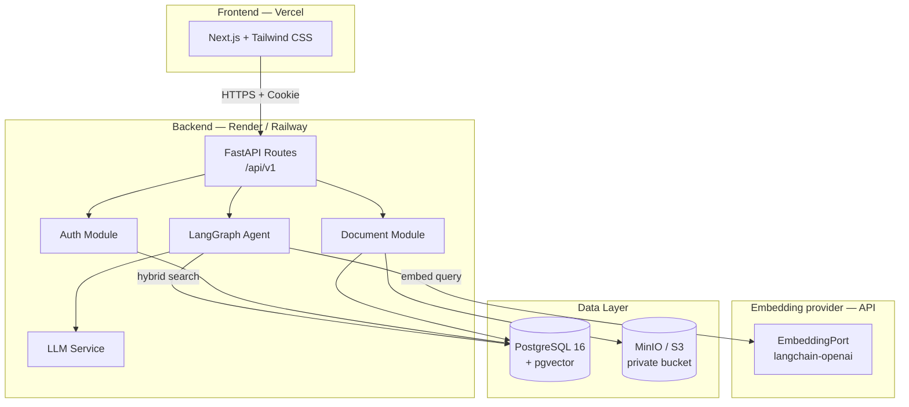
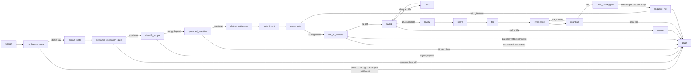
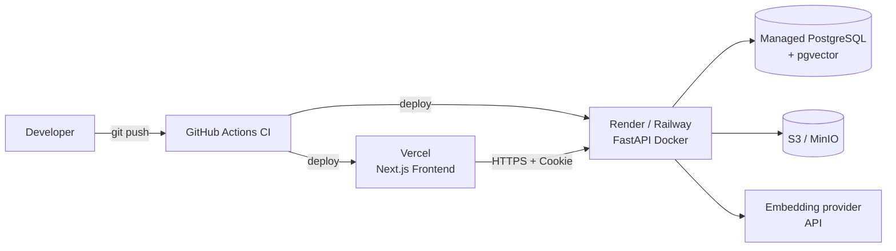

# Architecture Document

## System Overview

P-150 là **Agentic RAG dạng orchestrated workflow, có human-in-the-loop và multi-source retrieval**: frontend Next.js gọi REST API của FastAPI, backend điều phối agent bằng LangGraph, và toàn bộ dữ liệu (nghiệp vụ + vector) nằm trên một PostgreSQL duy nhất nhờ pgvector. Truy hồi tài liệu dùng hybrid search (dense pgvector + lexical full-text) hợp nhất bằng RRF (k=60); MVP **không** rerank (mục 3 `docs/vinfast-agent-mvp.md`).

> Chữ "graph" trong dự án là **LangGraph** — đồ thị các *bước xử lý* (state machine). Đây **không phải GraphRAG**: không có bảng entity, không bảng relation, không traversal trên đồ thị tri thức. Xem mục 6.8 `docs/vinfast-agent-mvp.md`.

> **Ghi chú trạng thái:** phần đã chạy trong repo hiện tại là FastAPI + LangGraph + PostgreSQL + pgvector (Auth, Document, Product, Agent, MinIO). Frontend Next.js là **stack mục tiêu đã chốt**. Embedding đi qua API provider (`langchain-openai`) sau `EmbeddingPort`; model local và reranker thuộc PRD 6.2 — **ngoài phạm vi MVP**. Chi tiết thiết kế dữ liệu/RAG xem `docs/vehicle-catalog-schema.md` và `docs/vinfast-agent-mvp.md`.

## Tech Stack

| Layer | Technology | Trạng thái |
|-------|-----------|:---:|
| Frontend | Next.js + Tailwind CSS | 🎯 mục tiêu |
| Backend | FastAPI + Uvicorn (Python 3.11, `uv`) | ✅ đã có |
| Agent orchestration | LangGraph + LangChain | ✅ đã có |
| Database | PostgreSQL 16 + pgvector | ✅ Postgres / 🎯 pgvector |
| ORM & Migration | SQLAlchemy 2 (async, asyncpg) + Alembic | ✅ đã có |
| Embedding | API provider qua `langchain-openai`, sau `EmbeddingPort` | ✅ đã có port / 🎯 adapter |
| Reranking | **ngoài phạm vi MVP** (PRD 6.2) — Lớp 2 dừng ở hybrid + RRF | ⛔ ngoài phạm vi |
| Object storage | MinIO (S3-compatible), bucket private | ✅ đã có |
| DevOps | Docker multi-stage + GitHub Actions | ✅ đã có |
| Testing | pytest + pytest-asyncio, ruff, mypy, pip-audit | ✅ đã có |

## Architecture Diagram



## Components

### 1. Frontend (Next.js + Tailwind CSS) — 🎯

- **Purpose:** giao diện chat và quản lý tài liệu cho CUSTOMER / ADVISOR / ADMIN.
- **Key Features:** đăng nhập bằng cookie, chat streaming, upload/tải tài liệu.
- **State Management:** state cục bộ theo page; session nằm ở cookie HttpOnly do backend cấp, frontend không giữ token.

### 2. Backend (FastAPI)

- **Purpose:** cổng HTTP duy nhất, gom Auth + Document + Agent.
- **API Design:** RESTful, prefix `/api/v1`, validate bằng Pydantic v2.
- **Authentication:** JWT ký HS256 đặt trong cookie `__Host-` / `__Secure-`, kèm CSRF double-submit.

### 3. AI Agent (LangGraph)

- **Agent Type:** Agentic RAG dạng orchestrated workflow — thứ tự node cố định ở `graph.py`, LLM **không** tự chọn tool (mục 6.8 `docs/vinfast-agent-mvp.md`). Không phải agent tự trị: agent tự trị chọn đường khác nhau giữa các lần chạy nên không tái lập được E2E đóng băng (A9-2) và không truy vết được từng con số (tiêu chí hoàn thành 2).
- **State:** `AgentState` (`src/agents/state.py`) — TypedDict chỉ đựng domain value và DTO, không đựng object SQLAlchemy.
- **Nodes:** 20 node, mỗi node gọi đúng một service, thân ≤15 câu lệnh: `exhausted`, `confidence_gate`, `extract_slots`, `semantic_escalation_gate`, `classify_scope`, `grounded_reaction`, `detect_bottleneck`, `route_intent`, `quote_gate`, `ask_or_retrieve`, `layer1`, `relax`, `narrow`, `layer2`, `score`, `tco`, `synthesize`, `guardrail`, `draft_quote_gate`, `enqueue_hitl`.
- **HITL theo rủi ro, không theo thao tác (A7-4):** chạm database **không** còn là lý do bắt khách chờ người duyệt. `quote_gate`/`draft_quote_gate` chặn một lượt khi báo giá gửi khách mang **cá nhân hoá, thương lượng, ưu đãi ngoài chính sách chuẩn, cam kết tài chính, hoặc confidence dưới ngưỡng**; giá niêm yết render deterministic từ catalog đi thẳng tới khách. Quy tắc là **rule-based** (`domain/quote_risk.py`), **default-deny** — chỉ một đường duy nhất dẫn tới auto-approve và nó đòi mọi điều kiện an toàn bật tường minh. Mọi quyết định, kể cả auto-approve, ghi `quote_audit_log` bất đồng bộ kèm kết quả luồng cũ để so sánh shadow-mode.
- **Truy xuất hai lớp** (không phải ba): Lớp 1 SQL hard filter theo nhu cầu; Lớp 2 "Need & Feature Retriever" gồm 5 nhánh 2a–2e ẩn trong adapter. Node `layer3` không tồn tại — nhánh đọc tài liệu (2e) nằm *bên trong* `layer2` sau `FeatureRetrievalPort`, nên rẽ nhánh của nó là chi tiết triển khai, không phải cạnh trong graph.
- **Một câu, một lượt (lớp nắn lỗi gõ đã gỡ):** node `recognize_intent` từng viết lại câu khách rồi để riêng `classify_scope` chấm bản viết lại, trong khi `extract_slots`, guardrail (A6-1) và audit báo giá (A7-4) vẫn đọc `user_message` nguyên văn. Hai văn bản cho cùng một lượt là một **mặt tấn công**: soạn được chuỗi nào mà lớp nắn viết lại thành câu trong phạm vi là lách được cổng phạm vi. Node đã bị gỡ khỏi cây; nay mọi bước chấm và trích đều đọc đúng một chuỗi — chữ khách đã viết. **`confidence_gate` (2026-08-25) KHÔNG phá luật này**: nó gọi `services/nlu_pipeline` để chấm độ tin cậy, nhưng bản viết lại của Lớp 1 chỉ sống bên trong pipeline để KHỚP entity và không bao giờ đi tiếp xuống graph. Nút "Đúng rồi" của câu xác nhận mang thẳng câu đề xuất làm giá trị, nên khách bấm nút là **tự gửi** câu đó — không có đường nào thay `user_message` bằng chữ mô hình viết.
- **Vai của LLM** bó lại còn ba việc: hiểu ý khách (`extract_slots`), phân loại (intent, in/out of scope), diễn đạt (`synthesize`). LLM không viết SQL, không tự quyết hỏi gì tiếp, không gõ chữ số trong câu trả lời.
- **Flow:**



### 4. Database (PostgreSQL 16)

- **Type:** PostgreSQL, async qua `postgresql+asyncpg`. Auth **không** fallback SQLite.
- **Tables:** users, sessions, refresh tokens, rate limits (Auth); documents, metadata (Document); chunks + embedding (RAG).
- **Migrations:** Alembic (`alembic-auth.ini` cho Auth).

### 5. Vector Store (pgvector) — 🎯

- **Type:** extension `pgvector` ngay trong PostgreSQL — không thêm Qdrant/Chroma vì quy mô dữ liệu vừa, giữ một nguồn dữ liệu duy nhất.
- **Embeddings:** qua API provider sau `EmbeddingPort` — không model local ở MVP (bài toán tối ưu chi phí, PRD 6.2).
- **Purpose:** hybrid search — dense (pgvector) + lexical (Postgres full-text) hợp nhất bằng RRF (k=60) → top-k đưa vào LLM. **Không có bước rerank** ở MVP.

## Data Flow

1. User gửi request từ Frontend (cookie session + header `X-CSRF-Token` nếu là mutation).
2. FastAPI validate input bằng Pydantic, xác thực và phân quyền.
3. Agent embed câu hỏi qua `EmbeddingPort`, hybrid search trên pgvector + full-text (chỉ khi Lớp 2 cần nhánh 2e).
4. Hợp nhất hai nguồn bằng RRF (k=60), lấy top-k làm context — không rerank.
5. LLM sinh câu trả lời; tool thực thi action nếu cần.
6. Response trả về Frontend kèm `Cache-Control: no-store` cho route nhạy cảm.

## Cơ chế bảo mật

Ngắn gọn: **mật khẩu băm mạnh, phiên đặt trong cookie, mọi mutation phải có CSRF, quyền mặc định là từ chối, file lưu ở bucket private.**

**Mật khẩu & phiên**
- Băm bằng **Argon2id** (`src/auth/infrastructure/argon2_hasher.py`), có dummy-hash cho tài khoản không tồn tại để chặn dò tài khoản qua thời gian phản hồi.
- **JWT HS256/384/512** bắt buộc đúng `issuer` + `audience` (`src/auth/infrastructure/security.py`). Access 900s, refresh-family tối đa 2592000s, xoay vòng refresh token mỗi lần gia hạn.
- Cookie: `__Host-p150_access`, `__Secure-p150_refresh`, `__Host-p150_csrf` — Secure, SameSite=Lax, host-only, access/refresh là HttpOnly nên JS không đọc được.

**Chống tấn công qua HTTP**
- **CSRF double-submit:** mọi mutation dùng cookie phải gửi lại giá trị cookie CSRF trong header `X-CSRF-Token`; sai hoặc thiếu là chặn trước khi ghi dữ liệu.
- **CORS chặt:** chỉ whitelist origin chính xác, không wildcard, `allow_credentials=true` (`src/main.py`).
- **Rate limiting** lưu ở Postgres theo cửa sổ cố định, khoá được HMAC (`src/auth/infrastructure/rate_limit.py`): login 5 lần/900s, recovery 3 lần/3600s. Vượt ngưỡng trả `429` kèm `Retry-After`.
- Lỗi trả về **thông điệp chung chung** (`invalid_request`, `rate_limited`, `auth_unavailable`) để không lộ nội bộ; mọi response Auth có `Cache-Control: no-store`.

**Phân quyền**
- Vai trò `CUSTOMER` / `ADVISOR` / `ADMIN`, trạng thái tài khoản `PENDING_VERIFICATION` / `TEMPORARY_PASSWORD` / `ACTIVE` / `DISABLED`.
- **Default-deny:** không có quyền khai báo rõ ràng thì bị từ chối (`src/document/application/authorization.py`). Không thể vô hiệu hoá Admin active cuối cùng.

**Tài liệu & lưu trữ**
- Bucket MinIO **private**, cấu hình từ chối bật public (`bucket_private` bắt buộc `true`).
- Giới hạn **25 MB**/file, allow-list MIME (`pdf`, `docx`, `txt`, `csv`).
- Object key **sinh ngẫu nhiên**, bỏ hẳn tên file gốc → không path traversal, không lộ tên file.
- Tải xuống qua **presigned URL sống 60 giây**.

**Secrets & vận hành**
- Toàn bộ khoá nằm ở biến môi trường (`.env` không commit); `AUTH_JWT_SIGNING_KEY` và `AUTH_CSRF_SECRET` phải sinh độc lập.
- Container chạy bằng user **không phải root** (`appuser` trong `Dockerfile`).
- CI chạy `pip-audit`, **fail khi có CVE** trong dependency đã khoá.

> **Chưa có trong MVP:** OAuth, MFA, xoay khoá nhiều replica, backup/restore tự động. Xem mục "Deferred hardening" trong `README.md`.

## Deploy

### Kiến trúc triển khai



### Local

```bash
cp .env.example .env
uv sync --locked
docker compose up -d postgres minio   # + pgadmin nếu cần
uv run alembic -c alembic-auth.ini upgrade head
uv run uvicorn src.main:app --reload --port 8000
```

### CI (`.github/workflows/ci.yml`)

Chạy trên push `main`/`develop` và PR vào `main`: `uv lock --check` → `uv sync --locked` → Alembic migrate → `ruff check` → architecture gate test → `pip-audit` → `pytest tests/auth`.

### Production

| Thành phần | Nơi chạy | Ghi chú |
|---|---|---|
| Frontend | **Vercel** | Build Next.js, set `NEXT_PUBLIC_API_URL` trỏ về backend. |
| Backend | **Render** hoặc **Railway** | Deploy từ `Dockerfile` multi-stage, health check `/health`. |
| Database | Managed PostgreSQL (Render/Railway/Neon/Supabase) | Bật extension `pgvector`, backend inject `AUTH_DATABASE_URL` riêng. |
| Object storage | S3 hoặc MinIO tự host | Bucket private. |
| Embedding | API provider (`langchain-openai`) | Backend chỉ gọi qua `EmbeddingPort`; đổi nhà cung cấp là thay adapter, không sửa code agent. |

**Checklist trước khi lên production**
- `APP_ENV=production`, `AUTH_COOKIE_SECURE=true`.
- `AUTH_CORS_ORIGINS` và `AUTH_FRONTEND_ORIGIN` là domain Vercel chính xác (không wildcard).
- Sinh mới `AUTH_JWT_SIGNING_KEY` + `AUTH_CSRF_SECRET`, không dùng lại giá trị local.
- Chạy Alembic migration trước khi mở traffic.

## Design Decisions

| Decision | Choice | Reason |
|----------|--------|--------|
| Framework | FastAPI | Async, auto-docs, type-safe với Pydantic |
| Agent | LangGraph | Quản lý state và nhánh điều kiện linh hoạt |
| Database | PostgreSQL + pgvector | Một DB cho cả dữ liệu nghiệp vụ lẫn vector; quy mô vừa nên không cần vector DB riêng |
| Embedding | BGE-M3 | Đa ngôn ngữ (tốt tiếng Việt), hỗ trợ hybrid dense + sparse, self-host được |
| Reranking | **cắt khỏi MVP** | Nhánh 2e chỉ chạy trên tài liệu của candidate còn sống sau Lớp 1 + 2c — tập rất nhỏ, rerank gần như không thêm giá trị; thuộc "tối ưu retrieval quy mô lớn" (PRD 6.2) |
| Frontend | Next.js + Tailwind | SSR sẵn, deploy Vercel một bước, styling nhanh |
| Kiến trúc module | Hexagonal (presentation/domain/application/infrastructure) | Tách business logic khỏi hạ tầng, dễ test |
| Deploy | Vercel + Render/Railway | Free tier đủ cho demo, CI/CD tự động từ Git |
