# PLAN — Chuyển P-150 (Vivi) sang kiến trúc Hybrid C1 hai móc

**Ngày lập:** 2026-09-22 · **Trạng thái:** CHỜ DUYỆT — chưa có dòng code nào được viết
**Cơ sở:** phân tích kiến trúc phiên 2026-09-22 + [ADR 0002](adr/0002-giu-workflow-tat-dinh-thay-vi-agentic-harness.md)
**Phạm vi:** chỉ `src/agents/`. Không đụng `src/auth/`, `src/document/`, `src/images/`, `frontend/`.

> **Quy ước đọc số dòng:** mọi `file.py:NNN` trong tài liệu này được xác minh tại
> working tree ngày 2026-09-22 (commit `12bc394`). Số dòng sẽ trôi khi code đổi —
> khi thực thi, tìm theo **tên hàm/hằng**, số dòng chỉ để định vị nhanh.

---

## 0. KẾT QUẢ RECON — xác minh lại bước phân tích trước

### 0.1 Những nhận định được XÁC NHẬN

| Nhận định | Bằng chứng |
|---|---|
| Lõi v2 là workflow tất định, LLM không chọn tool | `policy.decide` (`core/policy.py:106`) thuần luật; `act` dispatch bằng `isinstance` (`core/act.py:188-226`); 9/9 adapter LLM đều `bind_tools(..., tool_choice=<tên tool cố định>)` |
| Đúng 1 call LLM hiểu ý mỗi lượt | `core/understand.py:1-6` + `core/run_turn.py:170-176` |
| `Understanding.intent` là MỘT intent | `core/state.py:120` |
| `confidence` chỉ dùng chặn hành động không đảo ngược | `grep confidence src/agents/core/policy.py` → đúng 1 dòng: `core/policy.py:1044` |
| Không có rapidfuzz trên đường chạy | `core/validate.py:285-291` `VehicleDirectory.resolve` = khớp alias chính xác 2 vòng; `domain/fuzzy_match.py` chỉ được `fuzzy_slot_extractors`/`nlu_confidence` dùng, cả hai ngoài đường chạy |
| Không có `lockedAttributes` | grep toàn repo: 0 kết quả trong `src/` |
| Không có `AWAITING_COMPARE_TARGETS` | `domain/vehicle_comparison.py:43-52` ghi rõ "Repo KHÔNG có enum như vậy" |
| Không có Redis | grep `redis` trong `src/` → 0 |
| `verification.verify` là guard số TỔNG QUÁT | `services/verification.py:53-122` — nhận draft bất kỳ, đòi mọi chữ số nằm trong citation khớp `run_evidence` |
| `quote_gate` / `quote_risk.classify_delivery` MỒ CÔI | `grep "quote_gate\|quote_risk" src/agents/core/` → **rỗng** |
| Pipeline NLU v1 mồ côi | `core/` không đọc `services.nlu_pipeline / intent_routing / slot_extraction / pending_slot / scope_classifier / quote_gate` |

### 0.2 Những nhận định phải ĐIỀU CHỈNH

| Nhận định cũ | Thực tế sau recon | Ảnh hưởng tới plan |
|---|---|---|
| "Agent có ~12s sau khi trừ `understand`" | **Chỉ đúng cho route `/conversations/{id}/turns`.** Route `/agent/turn` (`api/routes.py:355`) gọi `run_turn` **không truyền `lease`** → `core/run_turn.py:243-244` chạy `_orchestrate()` thẳng, **KHÔNG có hard timeout 20s**. Mà **frontend đang gọi đúng route này** (`frontend/src/lib/api/agent.ts:84`) | Agent loop phải **tự cầm timeout**, không được dựa vào timeout của `run_turn` — xem §2.2 |
| "Ràng buộc E2E đóng băng A9-2 là cứng nhất" | CI chạy `pytest tests/ -v` **một lần** (`.github/workflows/ci.yml`, step "Run full test suite"). Không có bước chạy lặp. `docs/docs_buildagent_long/khoi4/A9-2.md` là tài liệu yêu cầu còn câu hỏi mở (dòng 61) | Không dùng A9-2 làm lý do chặn. Plan vẫn giữ tất định cho đường cũ bằng DoD "diff rỗng khi cờ OFF" |
| "`core_v2_customer_ids` là cờ có sẵn" | **Field đã bị xoá khỏi `Settings`** — `src/config.py:38-45` chỉ còn docstring mồ côi, không có khai báo field. `src/agents/core/flag.py` **không tồn tại** | Phải **dựng mới** cơ chế cờ — Bước 3 |
| "`_no_better`/`_same_pick` là chỗ hook sạch" | Đúng, nhưng **có 3 điểm gọi, không phải 2**, và điểm đầu (`core/act.py:1445`) xảy ra **TRƯỚC** `snapshotting.snapshot` (`core/act.py:1452`) → chưa có `run_evidence` → `verify` sẽ từ chối mọi con số | Handler phải **tự snapshot** trước khi cho LLM viết — xem §2.3 |

### 0.3 Contract PHẢI giữ nguyên

| Contract | Vị trí | Ghi chú |
|---|---|---|
| `POST /api/v1/agent/turn` → `TurnResponse` | `api/routes.py:280-320` (schema), `:323` (route) | 14 field. **Không thêm/bớt/đổi tên field nào** trong plan này |
| `POST /api/v1/conversations/{id}/turns` → `ConversationTurnResponse` | `api/conversation_routes.py:183` | Mã lỗi giữ nguyên: `TURN_IN_PROGRESS` 409, `TURN_LEASE_EXPIRED` 409, `TURN_TIMEOUT` 503, `TURN_NOT_PERSISTED` 503, `TURN_PREVIOUSLY_FAILED` 409, `CONVERSATION_ARCHIVED` 409 |
| `action_type: "NEARBY_LOCATION_LIST"` | `api/nearby_location_schemas.py:19,78,115` | Luôn trả kể cả `results` rỗng |
| `TurnResult` DTO | `contracts.py:853` | Điểm ra duy nhất của `chain.run_turn` |
| `_CARD_FIELDS` (14 khoá) | `core/run_turn.py:56-71` | Danh sách TƯỜNG MINH — Action mới **không được** thêm khoá mới |
| Schema session | `conversation_sessions`, `conversation_slots`, `conversation_core_state`, `conversation_turn_outcomes`, `turn_traces`, `agent_runs`, `run_evidence` (`models.py`) | Plan này **chỉ thêm 1 bảng mới** (`agent_feature_flags`), không sửa bảng nào đang có |
| Format log | `get_agent_logger("agent.<module>")`, message ASCII không dấu, **không log câu khách nguyên văn** | Xem `core/act.py:95-99`, `services/verification.py:56-66` |
| `turn_traces` payload | `core/run_turn.py:832-867` | `scripts/core_v2_metrics.py` lọc theo `intent_hint`/`confidence`/`tier`/`scope_label`/`terminal_reason`. **Giữ nguyên 5 cột vô hướng**, chỉ thêm khoá vào `payload` JSON |
| Token nút lái thử `__lichlaithu__` + HMAC | `core/validate.py:30`, `core/act.py:2325` | Agent **không bao giờ** được sinh/đọc token này |
| 3 điểm gọi `run_turn` | `api/routes.py:355`, `api/conversation_routes.py:230` và `:277`, `api/memory_routes.py:244` | Chữ ký `run_turn(graph, services, *, session_id, customer_id, user_message, client_turn_id, lease)` **không đổi** |
| `policy.schedule_for` | `api/test_drive_routes.py:33` import | Hàm public của `policy` — **không đổi chữ ký** |

### 0.4 Trạng thái test hiện tại (baseline, chạy 2026-09-22)

```
.venv/Scripts/python.exe -m pytest tests/agents/unit -q --tb=no
→ 1 failed, 5123 passed, 16 warnings in 15.84s
```

**Lỗi duy nhất — ĐÃ CÓ TỪ TRƯỚC, không liên quan plan này:**

`tests/agents/unit/services/test_test_drive_availability.py::test_hoi_mot_ngay_thi_chi_nhan_o_cua_ngay_do`
— test dùng hằng `NOW = datetime(2026, 8, 28, ...)` (dòng 24) nhưng
`TestDriveServiceImpl.availability` đọc `now_in_vietnam()` (giờ thật = 2026-09-22),
nên `NOW + 3 ngày` rơi ra ngoài cửa sổ 7 ngày → `options == ()`. Đây là **test bom
hẹn giờ**, hỏng theo thời gian chứ không theo code.

> **Bắt buộc:** ghi nhận baseline này TRƯỚC khi bắt đầu Bước 1. Mọi bước sau phải
> giữ đúng `1 failed / 5123 passed` (hoặc tốt hơn). Test integration
> (`tests/agents/integration/`) cần Postgres + pgvector — chạy theo
> `.github/workflows/ci.yml`.

---

## 1. TỔNG QUAN KIẾN TRÚC ĐÍCH

### 1.1 Nguyên tắc bất di bất dịch

1. **Đường tất định hiện tại không đổi một dòng hành vi.** 28 luật của
   `policy.decide` giữ nguyên thứ tự, nguyên điều kiện. Agent chỉ nhận những lượt
   mà lõi **đã** đi tới ngõ cụt.
2. **Agent không có tool nào có side effect.** `Book`, `EnqueueHitl`, `Handoff`,
   `ShowroomOptions` nằm ngoài registry, không thể gọi tới.
3. **Mọi chữ agent viết ra phải qua 3 cửa** trước khi tới khách: `verify` (số) →
   `quote_gate` (cam kết thương mại) → `assert_clean` (mã máy/xưng hô).
4. **Hỏng bất kỳ đâu → rơi về đúng hành vi hôm nay.** Agent là đường PHỤ, không
   bao giờ là điểm chết của lượt (cùng nguyên tắc `domain/tco_tool.py:1-8`).
5. **Cờ tắt = code chết.** Cờ OFF thì không một call LLM thừa nào được phát.

### 1.2 Sơ đồ luồng đích

```mermaid
flowchart TD
    A["POST /agent/turn<br/>routes.py:323 · KHONG lease, KHONG timeout"] --> C
    A2["POST /conversations/id/turns<br/>conversation_routes.py:183 · CO lease, timeout 20s"] --> C
    C["chain.run_turn — TurnCallBudget<br/>REQUIRED=4 · OPTIONAL=1 · AGENT=4 (moi)"] --> D

    D["core/run_turn._orchestrate"] --> E["1 · load state + ownership"]
    E --> F{"moderation"}
    F -->|blocked| Z1["chan, khong ghi state"]
    F --> G["2 · understand — 1 call LLM<br/>KHONG DOI"]
    G --> H["3 · to_understanding — 20 cua tat dinh<br/>KHONG DOI"]
    H --> I["4 · policy.decide — 28 luat<br/>KHONG DOI THU TU"]

    I --> J{"luat nao khop?"}
    J -->|"1..6b khop"| K["Action tat dinh<br/>Tco · OnRoadPrice · Compare · Nearby ...<br/>KHONG DOI"]
    J -->|"roi _unclear — policy.py:1073"| M1["MOC 1<br/>OpenQuestion(reason=unclear)"]

    K --> L["5 · act dispatch"]
    M1 --> L

    L --> N{"Action == OpenQuestion<br/>VA co bat?"}
    N -->|khong| O["handler tat dinh — KHONG DOI"]
    N -->|co| P["_open_question"]

    O --> O2{"_recommend roi ngo cut?<br/>act.py:1445 / 1485 / 1491"}
    O2 -->|"co VA co bat"| M2["MOC 2 — _dead_end<br/>reason=dead_end"]
    O2 -->|khong| Q

    M2 --> P
    P --> P1["a. snapshot evidence<br/>snapshotting.snapshot"]
    P1 --> P2["b. ReAct loop <= 3 buoc<br/>registry CHI-DOC"]
    P2 --> P3["c. verify — chan bia so"]
    P3 --> P4["d. quote_gate — chan cam ket"]
    P4 --> P5["e. assert_clean — chan ma may"]
    P5 -->|"bat ky cua nao truot"| R["FALLBACK<br/>ve dung ket qua tat dinh cu"]
    P5 -->|dat| Q
    R --> Q

    Q["6 · render + state_patch"] --> S["7 · _commit — DIEM GHI DUY NHAT<br/>+ trace.payload.agent_*"]
    S --> T["project_public_result → HTTP"]

    style G fill:#c2410c,color:#fff
    style P2 fill:#c2410c,color:#fff
    style I fill:#1d4ed8,color:#fff
    style H fill:#1d4ed8,color:#fff
    style K fill:#1d4ed8,color:#fff
    style O fill:#1d4ed8,color:#fff
    style P3 fill:#15803d,color:#fff
    style P4 fill:#15803d,color:#fff
    style P5 fill:#15803d,color:#fff
    style R fill:#a16207,color:#fff
```



**Xanh dương = rule quyết định · Cam = LLM quyết định · Xanh lá = guardrail · Vàng = fallback**

### 1.3 Tiêu chí định tuyến router → agent

Agent chỉ chạy khi **TẤT CẢ** điều kiện dưới đây đúng:

| # | Điều kiện | Nguồn | Giá trị |
|---|---|---|---|
| G1 | Cờ `agent_fallback` bật | `AgentFlagPort` (Bước 3) | mặc định `false` `[GIẢ ĐỊNH]` |
| G2 | `customer_id` trong allowlist **hoặc** `rollout_percent` phủ | `AgentFlagPort` | allowlist rỗng, `rollout_percent=0` `[GIẢ ĐỊNH]` |
| G3 | Lượt đã tới **một trong hai móc** | policy / act | — |
| G4 | `state.stage is not Stage.HANDED_OFF` | `core/state.py:35` | cứng |
| G5 | `state.pending is None` **hoặc** `pending.kind is not PendingKind.CONFIRM` | `core/state.py:100` | cứng — không chen vào lượt chờ xác nhận việc không đảo ngược |
| G6 | `services.agent_loop`, `services.verification`, `services.snapshotting` đều khác `None` | `AgentServices` | cứng |
| G7 | Ngân sách `CallKind.AGENT` còn slot | `services/call_budget.py` | cứng |

**Móc 1 — `policy._unclear`** (`core/policy.py:1073-1083`): trả `OpenQuestion` thay
cho `Reply(TEMPLATE_CLARIFY)` **chỉ ở nhánh cuối**. Nhánh `COLLECTING`/`GREETING`
vẫn gọi `_advise` như cũ — đó là luồng thu thập hồ sơ, không phải ngõ cụt.
Trần `MAX_UNCLEAR = 2` (`core/policy.py:68`) **vẫn chạy trước**: quá trần vẫn
`Handoff`, agent không được phép kéo dài vòng lặp không hiểu.

**Móc 2 — ngõ cụt của `_recommend`** (`core/act.py:1445`, `:1485`, `:1491`):
thay `return await _no_better(...)` / `return await _same_pick(...)` bằng
`return await _dead_end(...)`, trong đó `_dead_end` thử agent trước, `None` thì
gọi đúng hàm cũ.

**KHÔNG định tuyến theo `confidence`.** Lý do: `Understanding.confidence` do LLM
tự chấm và đã được đo là không đáng tin ở lớp câu "X hơn"
(`domain/comparative_revision.py:6-10` ghi lại một câu tương tự LLM trả
`intents: []` hai lần trên prod). Dùng nó làm ngưỡng định tuyến là thêm một nguồn
phi tất định mà không có cách đo. Tín hiệu "lõi đã bí" (móc 1 + móc 2) là tín
hiệu **quan sát được từ hành vi**, mạnh hơn một con số tự khai.
`[GIẢ ĐỊNH]` — nếu sau Bước 9 đo thấy còn lượt hỏng không qua hai móc, cân nhắc
thêm móc 3, **KHÔNG nới ngưỡng confidence**.

---

## 2. THIẾT KẾ CHI TIẾT TỪNG THÀNH PHẦN

### 2.1 Tool registry + tool schema

**File mới:** `src/agents/domain/agent_tools.py` — thuần Python, không SQLAlchemy /
FastAPI / LLM SDK (theo ràng buộc "THUẦN Python mục 6.5b" đang áp cho `domain/`).

```python
AGENT_TOOL_TRA_THONG_SO: Final = "tra_thong_so_xe"
AGENT_TOOL_TINH_CHI_PHI: Final = "tinh_chi_phi_xe"
AGENT_TOOL_SO_SANH:      Final = "so_sanh_xe"
AGENT_TOOL_TIM_DIEM:     Final = "tim_diem_dich_vu"
AGENT_TOOL_DANH_MUC:     Final = "liet_ke_danh_muc"
AGENT_TOOL_TRA_LOI:      Final = "tra_loi_khach"

READ_ONLY_TOOLS: Final[frozenset[str]] = frozenset({...})   # ca 6 tool

@dataclass(frozen=True, slots=True)
class AgentToolCall:
    name: str
    args: Mapping[str, Any]

@dataclass(frozen=True, slots=True)
class AgentToolResult:
    name: str
    ok: bool
    payload: Mapping[str, Any] = field(default_factory=dict)   # du lieu tat dinh, KHONG phai chu
    error: str = ""                                            # ma loi ngan, ASCII

def build_agent_tools() -> list[dict[str, Any]]: ...
def is_read_only(name: str) -> bool: ...
```

#### Bảng tool

| Tool | Việc | Read-only? | Nguồn dữ liệu | Side effect |
|---|---|---|---|---|
| `tra_thong_so_xe` | Tra thông số kỹ thuật một mẫu | ✅ | `services.vehicle_overview.answer` (`core/act.py:988`) | không |
| `tinh_chi_phi_xe` | Chi phí 5 năm + giá lăn bánh | ✅ | `services.tco_estimation.estimate` (`core/act.py:2093`) | không (đọc `products`) |
| `so_sanh_xe` | So sánh 2-3 mẫu cùng bộ tiêu chí | ✅ | `services.compare_vehicles.answer` (`core/act.py:681`) | không |
| `tim_diem_dich_vu` | Showroom / trạm sạc gần khách | ✅ | `services.nearby_location` (`core/act.py:772`) | không |
| `liet_ke_danh_muc` | Xe đang bán theo loại | ✅ | `act.catalog_names` (`core/act.py:243`) | không |
| `tra_loi_khach` | **Kết thúc loop** — nộp câu trả lời cuối | ✅ | — | không |

**🚫 KHÔNG có trong registry, và phải có test khẳng định:** `Book` (đặt lái thử),
`EnqueueHitl` (đẩy hàng duyệt), `Handoff` (chuyển người), `ShowroomOptions`
(sinh token HMAC), mọi hàm ghi DB.

#### JSON schema (mẫu; bản đầy đủ 6 tool viết ở Bước 4)

```json
{
  "type": "function",
  "function": {
    "name": "tinh_chi_phi_xe",
    "description": "Tính chi phí sử dụng 5 năm và giá lăn bánh của MỘT mẫu xe. Chỉ dùng tên xe có trong khối Danh sách xe đã cho.",
    "parameters": {
      "type": "object",
      "properties": {
        "vehicle_name": {"type": "string", "description": "Tên chuẩn của mẫu xe, lấy đúng từ khối Danh sách xe."},
        "daily_km":     {"type": ["integer", "null"], "description": "Số km khách chạy mỗi ngày; null nếu khách chưa nói."},
        "province":     {"type": ["string", "null"],  "description": "Tỉnh hoặc thành phố đăng ký xe; null nếu khách chưa nói."}
      },
      "required": ["vehicle_name", "daily_km", "province"],
      "additionalProperties": false
    }
  }
}
```

```json
{
  "type": "function",
  "function": {
    "name": "tra_loi_khach",
    "description": "Nộp câu trả lời cuối cùng cho khách. Gọi tool này khi đã đủ dữ liệu. Mọi con số trong câu trả lời phải lấy nguyên văn từ kết quả tool, tuyệt đối không tự tính, không làm tròn, không ước lượng.",
    "parameters": {
      "type": "object",
      "properties": {
        "answer":           {"type": "string", "description": "Câu trả lời tiếng Việt, xưng em với anh/chị."},
        "vehicle_ids_used": {"type": "array", "items": {"type": "string"}, "description": "Id các xe đã nhắc tới trong câu trả lời."}
      },
      "required": ["answer", "vehicle_ids_used"],
      "additionalProperties": false
    }
  }
}
```

**Vì sao `additionalProperties: false`:** mẫu hiện có (`adapters/tco_tool_llm.py:42-62`)
không đặt cờ này và phải bù bằng `extra="ignore"` ở pydantic
(`adapters/tco_tool_llm.py:66`). Ở đây siết từ đầu vì registry nhiều tool hơn,
khoá lạ dễ lẫn giữa các tool.

**Phụ thuộc:** `core/validate.VehicleDirectory` để đổi `vehicle_name` → `vehicle_id`
(khớp chính xác, `core/validate.py:285-291`, **không đoán**).

**Lỗi và cách xử lý:**

| Lỗi | Xử lý |
|---|---|
| LLM gọi tool không có trong registry | `AgentToolResult(ok=False, error="unknown_tool")` đưa vào transcript loop, **đếm 1 bước**, để LLM tự sửa ở bước sau |
| Args sai schema (pydantic `ValidationError`) | `ok=False, error="bad_args"`, đếm 1 bước |
| `vehicle_name` không resolve được | `ok=False, error="unknown_vehicle"`, `payload` kèm danh mục để LLM chọn lại |
| Service ném exception | Bắt `Exception`, `logger.warning("agent.tool loi ten=%s", name, exc_info=True)` (**KHÔNG log args** — args chứa chữ khách), trả `ok=False, error="tool_failed"` |
| Service trả rỗng / `None` | `ok=True, payload={}, error="empty"` — phân biệt "tra được nhưng không có dữ liệu" với "tra hỏng" |

### 2.2 Agent loop

**Port — thêm vào `src/agents/ports.py`:**

```python
@dataclass(frozen=True, slots=True)
class AgentLoopOutcome:
    answer: str | None = None                       # None = loop khong ra duoc cau tra loi
    steps: tuple[Mapping[str, Any], ...] = ()       # vet: {"tool","args_keys","ok","error","ms"}
    error: str = ""                                 # "" = binh thuong
    llm_calls: int = 0

class AgentLoopPort(Protocol):
    """KHONG raise: hong kieu gi cung tra AgentLoopOutcome(answer=None, error=...)."""

    async def run(
        self,
        *,
        system_prompt: str,
        user_prompt: str,
        tools: list[dict[str, Any]],
        execute: Callable[[AgentToolCall], Awaitable[AgentToolResult]],
        max_steps: int,
        step_timeout_seconds: float,
        total_timeout_seconds: float,
    ) -> AgentLoopOutcome: ...
```

**Adapter mới:** `src/agents/adapters/agent_loop_llm.py` — chép hình
`adapters/understanding_llm.py` (bind tool, pydantic validate, mọi lỗi biết trước
thành kết quả an toàn).

```python
class OpenAIAgentLoop:
    def __init__(
        self,
        model_name: str = "gpt-4o",
        api_key: str | None = None,
        *,
        client: AgentLoopClient | None = None,
        timeout: TimeoutRunner | None = None,
    ) -> None: ...
```

**Model:** `gpt-4o` `[GIẢ ĐỊNH]` — cùng lựa chọn với 3 arg resolver đang chạy
(`composition.py:600-603`: *"tool `tinh_chi_phi` chạy gpt-4o, KHÔNG dùng 5.6
(4o gọi tool ổn định)"*). Không dùng `settings.model_name` (`gpt-4o-mini`,
`src/config.py:25`) vì loop nhiều bước cần độ ổn định tool-calling cao hơn.

**Tham số cứng** `[GIẢ ĐỊNH]` — cả 4 số phải hiệu chỉnh sau Bước 9:

| Tham số | Giá trị | Lý do |
|---|---|---|
| `max_steps` | `3` | 2 bước tra + 1 bước trả lời. Bước 4 hiếm khi thêm thông tin, chỉ thêm ~2s |
| `step_timeout_seconds` | `4.0` | `UNDERSTAND_TIMEOUT_SECONDS = 6.0` (`adapters/understanding_llm.py:33`) cho prompt nặng hơn; tool DB thật đo ~0.3-1.5s |
| `total_timeout_seconds` | `10.0` | Route `/agent/turn` **KHÔNG có timeout ngoài** (§0.2) → loop phải tự cầm |
| `AGENT_CALLS_PER_TURN` | `4` | `max_steps=3` + 1 dự phòng. Slot **RIÊNG**, không đụng `REQUIRED=4` / `OPTIONAL=1` (`services/call_budget.py:35-41`) |

**Vòng lặp — giả mã:**

```
bat_dau = time.monotonic()
lich_su = [system, user]
da_goi: set[tuple[str, frozenset]] = set()

for buoc in range(max_steps):
    neu time.monotonic() - bat_dau >= total_timeout:
        return AgentLoopOutcome(answer=None, error="total_timeout", ...)
    neu khong xin duoc slot CallKind.AGENT:
        return AgentLoopOutcome(answer=None, error="budget_exhausted", ...)

    resp = await timeout.run(step_timeout, lambda: bound.ainvoke(lich_su))
    neu khong co resp.tool_calls:
        return AgentLoopOutcome(answer=None, error="no_tool_call", ...)

    call = resp.tool_calls[0]                  # CHI xu ly tool_call DAU TIEN
    neu len(resp.tool_calls) > 1: ghi vet "extra_calls_dropped"

    neu call.name == AGENT_TOOL_TRA_LOI:
        payload = _TraLoiPayload.model_validate(call.args)     # ValidationError -> bad_args, di tiep
        return AgentLoopOutcome(answer=payload.answer, ...)

    khoa = (call.name, frozenset(call.args.items()))
    neu khoa in da_goi:
        ket_qua = AgentToolResult(call.name, ok=False, error="repeat_call")   # KHONG chay tool
    nguoc lai:
        da_goi.add(khoa)
        ket_qua = await execute(AgentToolCall(call.name, call.args))

    lich_su += [resp, tool_message(ket_qua)]

return AgentLoopOutcome(answer=None, error="max_steps", ...)
```

**Chống lặp vô hạn — 4 lớp độc lập:**
1. `max_steps` cứng, đếm **mọi** bước kể cả bước lỗi.
2. `total_timeout_seconds` đo bằng `time.monotonic()` **trước mỗi bước**.
3. `CallKind.AGENT` budget — cạn thì dừng ngay (cùng cơ chế `services/call_budget.py:20-25`).
4. Chặn `repeat_call`: gọi lại **cùng tool cùng args** → trả lỗi ngay, **không chạy tool**, vẫn đếm bước.

**Chỉ xử lý `tool_calls[0]`:** parallel tool call của OpenAI làm số bước không dự
đoán được và làm vỡ trần budget. Các call còn lại bị bỏ, ghi vào vệt.

### 2.3 Handler `_open_question`

**File sửa:** `src/agents/core/act.py`

```python
async def _open_question(
    action: OpenQuestion,
    state: CoreState,
    services: AgentServices,
    *,
    run_id: UUID | None,
    customer_id: str,
    user_message: str,
) -> ActResult | None:
    """Tra loi cau MO bang agent loop.

    Tra `None` = khong dung duoc ket qua agent; noi goi PHAI chay dung duong
    tat dinh dang chay hom nay.
    """
```

**Trả `None` là hợp đồng quan trọng nhất của hàm này.** Mọi điểm gọi phải xử lý
`None` bằng cách chạy đúng code đang chạy hôm nay.

**Thứ tự bắt buộc bên trong:**

1. **Cổng G1-G7** (§1.3). Trượt bất kỳ → `return None`, **không phát call LLM nào**.
2. **Snapshot evidence.** `run_id is None` → `return None`.
   `candidate_ids` = `state.recommended_ids` ∪ `{state.chosen_vehicle_id}` ∪
   `action.vehicle_ids`, đã đổi sang `UUID`, bỏ trùng.
   **Rỗng → `return None`** (không có evidence thì `verify` chắc chắn từ chối).
   Gọi `await services.snapshotting.snapshot(run_id=run_id, candidate_ids=..., assertions=())`.
   *Đây là điều chỉnh từ §0.2: móc 2 tại `core/act.py:1445` chạy TRƯỚC `snapshot` gốc ở `:1452`.*
3. **Chạy loop** qua `services.agent_loop.run(...)`.
   `outcome.answer is None` → log `agent.loop khong ra cau tra loi error=%s`, `return None`.
4. **Cửa 1 — số:** `await services.verification.verify(run_id=run_id, draft_answer=outcome.answer)`
   (`services/verification.py:53`). `False` → `return None`.
5. **Cửa 2 — cam kết thương mại:** `services.quote_gate` (cắm ở Bước 2).
   Kết quả khác `AUTO_DELIVER` / `DELIVER_WITH_AUDIT` (`domain/quote_risk.py:85-92`) → `return None`.
6. **Cửa 3 — mã máy:** `render.assert_clean(outcome.answer)` (`core/render.py:63`);
   bắt `RenderError` → `return None`, log **chỉ mảnh bị chặn** qua `_OFFENDING_FRAGMENT`
   (`core/act.py:99`), không log nguyên câu.
7. **Ghép câu kết** bằng `_closing(services, state, vehicle_name=...)` (`core/act.py:277`)
   để lượt agent cũng chỉ ra việc kế tiếp như mọi lượt khác.
8. Trả `ActResult(text=..., cards=<the giu nguyen tu duong cu>, tool_calls=outcome.steps)`.
   **`state_patch` để RỖNG** — xem §2.6.

**Bọc lỗi:** thêm `_open_question_or_none(...)` bắt `Exception`, log, trả `None`.
Không để exception thoát lên `act()`: lưới ở `core/run_turn.py:195-197` sẽ trả
`_fallback_text` (câu clarify trơ) — **tệ hơn** kết quả tất định.

### 2.4 Guardrail cứng bằng code

| Ràng buộc | Cơ chế giữ | Test khẳng định |
|---|---|---|
| **HITL `AI → PENDING_HANDOFF → HUMAN`** | `_mark_handoff_pending` (`core/run_turn.py:565`) chạy NGOÀI `act`, chỉ nhận `Handoff \| EnqueueHitl`. `OpenQuestion` không thuộc hai kiểu đó → **không chạm ownership**. `_project_ownership` (`core/run_turn.py:431`) vẫn chiếu ownership mỗi lượt | `test_agent_khong_doi_ownership` |
| **TVV đang cầm phiên (G4)** | `policy.decide` luật 1 (`core/policy.py:112`) trả `Silent` TRƯỚC mọi thứ → không bao giờ tới `OpenQuestion` | `test_handed_off_khong_goi_agent` |
| **Claim locking / lease** | Agent chạy **bên trong một `act()` duy nhất**, giữa 2 lần re-check lease đã có (`core/run_turn.py:150` trước act, `:229` trước commit). Không thêm điểm ghi nào | `test_agent_khong_them_diem_ghi` |
| **"lockedAttributes"** | **Field này KHÔNG tồn tại** (§0.1). Ràng buộc tương đương giữ bằng: `ActResult.state_patch` của `OpenQuestion` **luôn rỗng** → `_apply_patch` (`core/run_turn.py:200`) không đổi gì. `domain/vehicle_type_lock.py` và `policy._promote_to_chosen` (`core/policy.py:812`) vẫn là chỗ duy nhất đổi xe/loại xe đã chốt | `test_open_question_state_patch_rong` |
| **Không bịa giá/spec** | `verification.verify` (`services/verification.py:53-122`): mọi chữ số phải nằm trong citation khớp `run_evidence` cùng `run_id`; số viết chữ cũng bị quy về digit (`:94-96`) | `test_agent_bia_so_bi_chan` |
| **Không hứa cam kết thương mại** | `quote_gate` cắm lại ở Bước 2 → `classify_delivery` (`domain/quote_risk.py:155`) default-deny | `test_agent_mac_ca_bi_chan` |
| **Xác nhận trước tool side effect** | Không cần — agent **không có** tool side effect. `_guard` (`core/policy.py:1041`) vẫn chặn `Book`/`EnqueueHitl` khi `confidence < 0.6` ở đường tất định | `test_registry_khong_co_tool_ghi` |
| **Token lái thử HMAC** | Agent không sinh/đọc `__lichlaithu__`; `render.FORBIDDEN` mục `__\w+__` (`core/render.py:53`) chặn nếu lọt ra chữ | `test_agent_khong_sinh_token` |
| **Trần hỏi lại** | `MAX_ASKS = 2`, `MAX_UNCLEAR = 2` (`core/policy.py:66-68`) chạy **trước** móc 1 | `test_qua_tran_unclear_van_handoff` |

### 2.5 Fallback

| Tình huống | Hành vi |
|---|---|
| Cờ OFF / ngoài allowlist | Đường tất định hôm nay, **0 call LLM thêm** |
| `services.agent_loop is None` | như trên |
| Không đủ `candidate_ids` để snapshot | như trên |
| Loop hết `max_steps` / timeout / `no_tool_call` / `budget_exhausted` | như trên + trace `agent_error` |
| `verify` từ chối | như trên + `agent_error="verify_rejected"` |
| `quote_gate` chặn | như trên + `agent_error="quote_gate_blocked"` |
| `assert_clean` ném `RenderError` | như trên + `agent_error="render_blocked"` |
| Exception lạ trong `_open_question` | Bắt tại `_open_question_or_none`, log, chạy đường tất định |

> **Không có "câu an toàn riêng" cho agent.** Fallback luôn là **chính xác kết quả
> mà hệ thống hôm nay trả về**. Nhờ vậy cờ OFF và mọi nhánh hỏng cho ra cùng một
> đầu ra → so sánh A/B sạch, và rollback bằng cờ là tuyệt đối.

### 2.6 State / session và tương tranh

**Agent ĐỌC:** `CoreState` (slots, `chosen_vehicle_id`, `recommended_ids`, `stage`,
`intent`), transcript 6 tin nhắn đã nạp sẵn (`core/run_turn.py:75`), `VehicleDirectory`.

**Agent GHI: không gì cả.** `ActResult.state_patch` rỗng; `hitl_request = None`;
không gọi service ghi nào. Điểm ghi duy nhất vẫn là `_commit` (`core/run_turn.py:231`).

| Kịch bản tương tranh | Rủi ro? | Lý do |
|---|---|---|
| Hai request cùng `session_id` song song | Không mới | `begin_core_turn` (`services/conversation_memory.py:103`) cấp lease 25s, trả `TurnBusy` 409. Agent không đổi lớp này |
| TVV takeover **giữa lúc agent chạy** | **Có — đã bịt** | `_assert_core_turn_lease` trước commit (`core/run_turn.py:229`) bắt token đã đổi → `CoreTurnLeaseStaleError` → 409. Agent chạy xong nhưng **không ghi gì** |
| Route `/agent/turn` (không lease) chạy lâu | **Có — rủi ro mới** | Không có lease → không có hard timeout → agent cộng thẳng vào lượt. Bịt bằng `total_timeout_seconds` tự cầm (§2.2) |
| Agent đọc state cũ | Không | Toàn bộ agent chạy trong một `act()`, trên `state_after` bất biến đã đóng băng ở `core/run_turn.py:186` |
| `agent_runs` / `run_evidence` rác khi loop hỏng | **Có — chấp nhận** | Snapshot đã ghi nhưng lượt rơi fallback → thừa vài hàng. Cùng hình với `_recommend` hôm nay khi `synthesis` hỏng. `[GIẢ ĐỊNH]` chấp nhận; nếu bảng phình thì thêm job dọn `RunState.SNAPSHOT_READY` quá 7 ngày |

### 2.7 Feature flag

**Hiện trạng:** không có cơ chế nào. `get_settings()` là `@lru_cache`
(`src/config.py:47-49`) → đổi env **phải restart process**.

**Thiết kế** `[GIẢ ĐỊNH]` — hai tầng, tầng ngoài thắng:

1. **Kill-switch bằng env** — field mới `agent_fallback_kill_switch: bool = False`
   trong `Settings`. `True` → tắt tuyệt đối, bỏ qua DB. Cần restart; dùng cho sự cố.
2. **Cờ động bằng DB** — bảng mới `agent_feature_flags`, đọc qua `AgentFlagPort`
   với **TTL cache 60s** (cùng khuôn `_DIRECTORY_CACHE`, `core/run_turn.py:78-80`).
   **Bật/tắt không cần restart.**

```sql
-- migrations/agents/versions/agent_0036_agent_feature_flags.py
CREATE TABLE agent_feature_flags (
    name               VARCHAR(64) PRIMARY KEY,
    enabled            BOOLEAN     NOT NULL DEFAULT FALSE,
    rollout_percent    SMALLINT    NOT NULL DEFAULT 0,   -- 0..100
    customer_allowlist TEXT        NOT NULL DEFAULT '',  -- customer_id ngan bang dau phay
    updated_at         TIMESTAMPTZ NOT NULL DEFAULT now()
);
INSERT INTO agent_feature_flags (name, enabled) VALUES ('agent_fallback', FALSE);
```

`down_revision = "agent_0035_core_turn_lease_result_payload"`.
`downgrade()` = `DROP TABLE agent_feature_flags` — đảo ngược an toàn, không mất
dữ liệu nghiệp vụ.

**Chia phần trăm tất định:**
`int(sha256(f"agent_fallback:{customer_id}".encode()).hexdigest()[:8], 16) % 100 < rollout_percent`
— cùng khách luôn cùng nhánh, không nhảy giữa các lượt.

---

## 3. LỘ TRÌNH TRIỂN KHAI

**10 bước. Bước 1-5 độc lập nhau (có thể song song). Từ Bước 6 là chuỗi.**

```
Buoc 1 ─┐
Buoc 2 ─┤
Buoc 3 ─┼─→ Buoc 6 ─→ Buoc 7 ─→ Buoc 8 ─→ Buoc 9 ─→ Buoc 10
Buoc 4 ─┤
Buoc 5 ─┘
```

---

### 3.0 — Quy tắc commit (áp dụng cho MỌI bước)

> **Luật gốc: xong một task nhỏ là commit ngay.** Không gom nhiều task vào một
> commit, không để cuối ngày mới commit một cục. Mỗi commit phải là một trạng
> thái **chạy được và revert được một mình**.

#### Cổng bắt buộc TRƯỚC mỗi commit

Không commit nếu một trong bốn điều sau chưa đạt:

1. `ruff check src/ tests/` → sạch
2. `.venv/Scripts/python.exe -m pytest tests/agents/unit -q` → **không tệ hơn baseline**
   `1 failed / 5123 passed` (§0.4). Lỗi duy nhất được phép là test bom hẹn giờ đã biết
3. Test của chính task đó đã viết và **đang pass** (không commit code trước test)
4. `git status` không có file lạ ngoài phạm vi task — 4 file đang `M` từ trước
   (`.python-version`, `docker-compose*.yml`, `frontend/next-env.d.ts`) **không được**
   đưa vào commit nào của plan này (`AGENTS.md`: *"treat unrelated modified paths as out of scope"*)

#### Nhánh

Theo git flow của dự án (`.github/workflows/ci.yml` gate cả `main` và `develop`):

```
feature/agent-hybrid-buoc-<N>-<slug>  →  develop  →  main
```

Mỗi **bước** một nhánh, mỗi **task nhỏ** một commit trong nhánh đó.
Không commit thẳng lên `develop` hay `main`.

#### Định dạng message

Theo commit đang có trong repo (`12bc394 feat: khoi tao du an ca nhan…`):
**conventional commit + tiếng Việt KHÔNG DẤU** (giữ nhất quán với log hiện tại
và với quy ước log ASCII của `src/agents/`).

```
<type>(agent): <viec da lam, khong dau, <=72 ky tu>

<vi sao — tuy chon, bat buoc khi commit sua mot bug da dinh vi>
<dan chieu file:dong hoac ma case neu co>

Co-Authored-By: Claude Opus 5 <noreply@anthropic.com>
```

`type` ∈ `feat` (thêm năng lực) · `fix` (sửa bug) · `test` (chỉ thêm test) ·
`refactor` · `chore` (migration, config, script) · `docs`.

#### Bảng commit theo từng bước

Cột "Commit" là **số commit tối thiểu** — tách nhỏ hơn thì tốt, gộp lại thì không.

| Bước | Commit | Message mẫu |
|---|---|---|
| 1 | **3** (một fix một commit) | `fix(agent): truyen has_tco=True trong _on_road_price` · `fix(agent): luat 6a khong nuot cau xin doi xe` · `fix(agent): 11 cua tat dinh doc chu khong dau` |
| 2 | **2** | `feat(agent): them _commercial_guard doc quote_gate` · `feat(agent): ap _commercial_guard cho _pitch_text` |
| 3 | **4** | `chore(agent): migration 0036 bang agent_feature_flags` · `feat(agent): domain agent_flag va AgentFlagPort` · `feat(agent): adapter co dong ttl 60s` · `chore(agent): cam agent_flag vao composition + env` |
| 4 | **1** | `feat(agent): tool registry 6 tool chi-doc` |
| 5 | **3** | `feat(agent): AgentLoopPort va AgentLoopOutcome` · `feat(agent): OpenAIAgentLoop max_steps timeout chong lap` · `feat(agent): them CallKind.AGENT slot rieng` |
| 6 | **4** | `feat(agent): Action OpenQuestion` · `feat(agent): handler _open_question va chuoi 3 cua` · `feat(agent): moc 1 tai policy._unclear` · `chore(agent): cam agent_loop vao composition` |
| 7 | **2** | `feat(agent): ham _dead_end` · `feat(agent): moc 2 tai 3 diem ngo cut cua _recommend` |
| 8 | **2** | `feat(agent): ghi agent_* vao turn_trace payload` · `chore(agent): them chi so agent vao core_v2_metrics` |
| 9 | **2** | `chore(agent): dataset 30 cau agent_fallback_cases` · `chore(agent): script agent_eval` |
| 10 | **0** | Không có commit code — chỉ `UPDATE agent_feature_flags`. **Ghi lại mỗi lần đổi nấc canary vào `docs/runbooks/`** (ngày, `rollout_percent`, số đo §5.3) |

**Tổng: 23 commit trên 9 nhánh.**

#### Quy tắc riêng cho hai bước nóng

Bước 6 và 7 là hai bước duy nhất chạm `core/act.py` và `core/policy.py`.
Với hai bước này, **commit cuối của nhánh phải là commit chứng minh không hồi quy**:

```
test(agent): xac nhan co OFF cho diff rong so voi moc Buoc 0

Chay scripts/core_v2_replay.py tren 17 phien, diff = 0.
Ket qua luu tai eval/results/agent-fallback/<ngay>-co-off.md

Co-Authored-By: Claude Opus 5 <noreply@anthropic.com>
```

Không có commit này thì **không mở PR** — đó là DoD quan trọng nhất của cả hai bước.

#### Rollback

Vì mỗi commit là một task nhỏ độc lập:

- Hỏng một task → `git revert <sha>` đúng commit đó, không kéo theo task khác
- Hỏng cả một bước → `git revert` range của nhánh, hoặc revert merge commit
- Hỏng trên prod sau khi đã merge → **không revert code**, tắt cờ trước
  (`UPDATE agent_feature_flags SET enabled=FALSE`, hiệu lực ≤60s), điều tra rồi mới quyết

---

### GIAI ĐOẠN 0 — Vá rẻ (giảm bề mặt agent phải phủ)

#### Bước 1 — Vá 3 lỗi đã định vị chính xác

**Mục tiêu:** sửa 3 bug tất định mà agent **không** sửa được và cũng không nên che.

**File thay đổi:**
- `src/agents/core/act.py` — dòng `2110`: thêm `has_tco=True` vào lời gọi `_closing()`
  trong `_on_road_price`. *Lý do đã xác minh: `_run_vehicle_intent` giữ `stage=CHOSEN`
  khi `already_chosen=False` (`core/policy.py:852-866`), nên `_closing` suy
  `has_tco=False` (`core/act.py:299`) và `render.closing_question` chạy nhánh
  `core/render.py:103-106` — mời khách xem thứ vừa hiện trên màn hình.*
- `src/agents/core/policy.py` — luật 6a (`:498-512`): thêm `and not u.question.strip()`
  vào điều kiện, để không nuốt câu xin đổi xe đã được `_refine_question` salvage.
- `src/agents/core/understand.py` — 11 cửa tất định chuyển sang `build_canonical_text`
  (đã import sẵn ở `:36`): `_LOCATION_WORDS` (`:429` và `:937`), `_fit_question` (`:570`),
  `_choice_act`/`_CHOICE_VERB` (`:595`), `_human_requested` (`:631`),
  `_test_drive_request` (`:685`), `_concern_topic` (`:697`), `_off_topic_question` (`:723`),
  `_next_steps_question` (`:755`), `_compare_turn`/`_COMPARATIVE` (`:791`),
  `_lookup_aspect` (`:819`).

**Tiên quyết:** không.

**Test cần viết:**
- `tests/agents/unit/core/test_act_on_road.py::test_closing_khong_moi_xem_thu_dang_hien`
- `tests/agents/unit/core/test_policy.py::test_luat_6a_khong_nuot_cau_xin_doi_xe`
  — `"xe khác đi"` ở `CHOSEN` → `Recommend(reason=REASON_REVISED)`, KHÔNG `TEMPLATE_CHOSEN_SUMMARY`
- `tests/agents/unit/core/test_understand.py::test_khong_dau_van_nhan_dung_intent`
  — bảng ≥11 câu: `"dat lich lai thu"`→`TEST_DRIVE`; `"ok chot vf3"`→`CHOICE`;
  `"anh chi can 1 chiec nho gon"`→`ADVISORY` + `question` khác rỗng;
  `"cho toi gap tu van vien"`→`HANDOFF`; `"co hop voi nhu cau cua toi khong"`→`fit_asked=True`;
  `"lam sao de toi chot vf3"`→`next_steps_asked=True`; `"pin chai ban ai mua"`→`concern_topic` khác rỗng
- `tests/agents/unit/core/test_understand.py::test_co_dau_van_giu_nguyen_hanh_vi` (regression)

**DoD:**
- 4 test mới pass; `pytest tests/agents/unit` → `1 failed / ≥5127 passed` (chỉ còn test bom hẹn giờ §0.4)
- `ruff check src/ tests/` sạch
- `scripts/core_v2_replay.py` trên 17 phiên: số lượt `SAME_PICK` + `NO_BETTER` giảm ≥ 30% so với mốc Bước 0

**Rollback:** `git revert` — 3 thay đổi nhỏ, độc lập, không đổi contract nào.

---

#### Bước 2 — Cắm lại `quote_gate` vào biên ra của lõi v2

**Mục tiêu:** bịt lỗ §0.1 (cổng chính sách thương mại mồ côi). **Tiên quyết của agent.**

**File thay đổi:**
- `src/agents/services/registry.py` — `AgentServices.quote_gate` **đã có** ở `:656`,
  không cần thêm field.
- `src/agents/core/act.py` — hàm mới
  `async def _commercial_guard(text: str, state: CoreState, services: AgentServices) -> bool`
  gọi `services.quote_gate` → `classify_delivery` (`domain/quote_risk.py:155`);
  `services.quote_gate is None` → trả `True` (đi thẳng, giữ hành vi hôm nay).
- `src/agents/core/act.py` — áp `_commercial_guard` cho **đúng một đường hôm nay**:
  `_pitch_text` (`:1548-1553`), ngay sau `verification.verify`. Trượt → dùng
  `render.recommend_fallback` như nhánh `verified=False` đang làm.

**Tiên quyết:** không.

**Test cần viết:**
- `tests/agents/unit/core/test_commercial_guard.py::test_pitch_hua_giam_gia_bi_chan`
- `::test_pitch_binh_thuong_di_thang`
- `::test_quote_gate_none_thi_di_thang`

**DoD:**
- 3 test pass
- **`scripts/core_v2_replay.py` cho ra chữ GIỐNG HỆT mốc Bước 0** trên 17 phiên —
  tiêu chí quan trọng nhất của bước này (guard không được đổi lượt nào đang đúng)
- `pytest tests/agents` giữ baseline

**Rollback:** `git revert`. Nếu guard chặn nhầm trên prod: đặt `quote_gate=None`
ở `composition.py` → đường cũ y nguyên, không cần revert code.

---

### GIAI ĐOẠN 1 — Hạ tầng (không ảnh hưởng runtime)

#### Bước 3 — Feature flag

**Mục tiêu:** bật/tắt agent không cần restart.

**File thay đổi:**
- **mới** `migrations/agents/versions/agent_0036_agent_feature_flags.py` (§2.7)
- **mới** `src/agents/domain/agent_flag.py` — `AgentFlagState` (frozen dataclass),
  `is_enabled_for(state: AgentFlagState | None, customer_id: str, *, kill_switch: bool) -> bool`
  (thuần, chứa hàm băm phần trăm)
- `src/agents/models.py` — model `AgentFeatureFlag`
- `src/agents/ports.py` — `class AgentFlagPort(Protocol): async def load(self, name: str) -> AgentFlagState | None`
- **mới** `src/agents/adapters/agent_flag_repository.py` — `SqlAlchemyAgentFlagAdapter` + TTL cache 60s
- `src/config.py` — thêm `agent_fallback_kill_switch: bool = False`
- `src/agents/services/registry.py` — `agent_flag: AgentFlagPort | None = None`
- `src/agents/composition.py` — cắm adapter
- `.env.example` — thêm `AGENT_FALLBACK_KILL_SWITCH=false`

**Tiên quyết:** không.

**Test cần viết:**
- `tests/agents/unit/domain/test_agent_flag.py::test_allowlist_thang_rollout`
- `::test_rollout_percent_tat_dinh_cung_khach_cung_nhanh` (gọi 100 lần, kết quả không đổi)
- `::test_kill_switch_thang_tat_ca`
- `::test_flag_none_thi_tat` (DB chưa có hàng → OFF)
- `::test_enabled_false_thi_tat_du_allowlist_co_ten`
- `tests/agents/integration/test_agent_flag_repository.py::test_ttl_cache_60s`
- `tests/agents/integration/test_migration_0036.py::test_upgrade_downgrade_sach`

**DoD:**
- `alembic -c alembic-agent.ini upgrade head` rồi `downgrade -1` chạy sạch hai chiều
- 7 test pass; **không lượt nào đổi hành vi** (chưa code nào đọc cờ — grep xác nhận)

**Rollback:** `alembic -c alembic-agent.ini downgrade -1` + `git revert`.

---

#### Bước 4 — Tool registry + schema (chưa nối)

**Mục tiêu:** có registry và schema, chưa ai gọi.

**File thay đổi:**
- **mới** `src/agents/domain/agent_tools.py` (§2.1)
- **mới** `tests/agents/unit/domain/test_agent_tools.py`

**Tiên quyết:** không.

**Test cần viết:**
- `::test_schema_hop_le_json` — mọi tool có `name`/`description`/`parameters`,
  `additionalProperties=false`, mọi field trong `properties` đều có trong `required`
- `::test_mo_ta_bang_tieng_viet` — `description` khác rỗng, không chứa mã máy kiểu `A_B`
- `::test_khong_co_tool_ghi` — khẳng định registry **không chứa**
  `dat_lich`, `book`, `handoff`, `chuyen_tu_van_vien`, `enqueue`, `showroom_options`;
  `is_read_only()` trả `True` cho cả 6 tool
- `::test_ten_tool_khong_trung`

**DoD:** 4 test pass; `ruff` sạch; **0 dòng runtime đổi**
(`grep -rn "agent_tools" src/ | grep -v domain/agent_tools.py` → rỗng).

**Rollback:** xoá file — chưa ai phụ thuộc.

---

#### Bước 5 — Agent loop adapter (chưa nối)

**Mục tiêu:** có loop chạy được với tool giả, chưa nối vào lõi.

**File thay đổi:**
- `src/agents/ports.py` — `AgentLoopPort`, `AgentLoopOutcome`
- **mới** `src/agents/adapters/agent_loop_llm.py` — `OpenAIAgentLoop`
- `src/agents/services/call_budget.py` — thêm `CallKind.AGENT` +
  `AGENT_CALLS_PER_TURN: Final[int] = 4`, **slot riêng** trong `TurnCallBudget`
- **mới** `tests/agents/unit/adapters/test_agent_loop_llm.py`

**Tiên quyết:** Bước 4.

**Test cần viết** (client giả — **tuyệt đối không gọi OpenAI thật**, theo
`AGENTS.md`: *"Tests must not call real SendGrid, OpenAI, or other paid external services"*):
- `::test_goi_tra_loi_khach_thi_dung` — 1 bước → có `answer`
- `::test_het_max_steps_tra_none` (`error="max_steps"`)
- `::test_tool_khong_ton_tai_dem_1_buoc_va_di_tiep`
- `::test_args_sai_schema_tra_bad_args`
- `::test_tool_nem_loi_khong_lam_vo_loop`
- `::test_tool_tra_rong_khac_tool_hong` — `error="empty"` vs `error="tool_failed"`
- `::test_goi_lai_y_het_bi_chan_repeat_call` — tool **không được chạy lần hai**
- `::test_total_timeout_cat_giua_chung`
- `::test_step_timeout_tinh_la_1_buoc`
- `::test_khong_co_tool_call_tra_none`
- `::test_parallel_tool_calls_chi_lay_cai_dau`
- `::test_budget_can_thi_dung`
- `::test_khong_bao_gio_raise` — mọi exception của client → `AgentLoopOutcome(answer=None)`
- `::test_steps_khong_chua_gia_tri_args` — vệt chỉ có **tên khoá**
- `tests/agents/unit/services/test_call_budget.py::test_agent_slot_khong_cuop_required`

**DoD:** 15 test pass; `REQUIRED`/`OPTIONAL` giữ nguyên 4/1;
chưa file nào ngoài test import `agent_loop_llm`.

**Rollback:** xoá file + revert `call_budget` (thêm enum member là tương thích ngược).

---

### GIAI ĐOẠN 2 — Nối vào lõi (cờ OFF)

#### Bước 6 — Action `OpenQuestion` + Móc 1

**Mục tiêu:** móc 1 chạy được; cờ OFF nên **hành vi không đổi một lượt nào**.

**File thay đổi:**
- `src/agents/core/actions.py` —
  `@dataclass(frozen=True, slots=True) class OpenQuestion: question: str; reason: str; vehicle_ids: tuple[str, ...] = (); resume_pending: bool = False`;
  thêm vào union `Action`; hằng `OPEN_REASON_UNCLEAR = "unclear"`, `OPEN_REASON_DEAD_END = "dead_end"`
- `src/agents/core/act.py` — `NEEDS_RUN` (`:110`) thêm `OpenQuestion`;
  dispatch (`:188-226`) thêm nhánh `elif isinstance(action, OpenQuestion)`;
  hàm `_open_question` (§2.3) + `_open_question_or_none`
- `src/agents/core/policy.py` — `_unclear` (`:1073`): nhánh cuối trả `OpenQuestion(...)`
  thay `Reply(template=TEMPLATE_CLARIFY, ...)`. **Giữ nguyên** trần `MAX_UNCLEAR`
  và nhánh `COLLECTING`/`GREETING`
- `src/agents/services/registry.py` — `agent_loop: AgentLoopPort | None = None`
- `src/agents/composition.py` — cắm `OpenAIAgentLoop()`

**Tiên quyết:** Bước 2, 3, 5.

**Test cần viết:**
- `tests/agents/unit/core/test_policy.py::test_unclear_cuoi_tra_open_question`
- `::test_unclear_o_collecting_van_advise` (không đổi)
- `::test_qua_tran_unclear_van_handoff` (không đổi)
- `tests/agents/unit/core/test_open_question.py::test_co_tat_thi_khong_goi_llm`
  — mock loop, assert `run` **không được gọi lần nào**
- `::test_co_tat_thi_ra_dung_chu_cu` — so **từng ký tự** với `render_reply(Reply(TEMPLATE_CLARIFY, ...))`
- `::test_handed_off_khong_goi_agent`
- `::test_pending_confirm_khong_goi_agent`
- `::test_state_patch_rong`
- `::test_khong_dat_hitl_request`
- `::test_agent_loop_none_thi_fallback`
- `::test_snapshot_rong_thi_fallback`
- `::test_verify_tu_choi_thi_fallback`
- `::test_quote_gate_chan_thi_fallback`
- `::test_render_error_thi_fallback`
- `::test_exception_la_thi_fallback_khong_thoat_len_act`
- `::test_tool_calls_duoc_ghi_vao_actresult`
- `tests/agents/unit/core/test_suggest.py::test_quick_replies_voi_open_question`
  — `core/suggest.py:144` rơi đúng nhánh mặc định, không ném
- `tests/agents/unit/core/test_run_turn.py::test_build_result_voi_open_question`
  — `core/run_turn.py:682` không vỡ `_CARD_FIELDS`

**DoD:**
- 18 test pass; `pytest tests/agents` giữ baseline
- **`scripts/core_v2_replay.py` với cờ OFF cho ra output GIỐNG HỆT mốc Bước 0 (diff rỗng)**
  — tiêu chí quan trọng nhất của bước này
- Bật cờ thủ công trên local: ≥1 lượt đi qua agent và trả lời được

**Rollback:** `UPDATE agent_feature_flags SET enabled = FALSE WHERE name = 'agent_fallback';`
— hiệu lực ≤ 60s, **không cần deploy**.

---

#### Bước 7 — Móc 2 (ngõ cụt `_recommend`)

**Mục tiêu:** phủ nhóm `SAME_PICK` / `NO_BETTER`.

**File thay đổi:**
- `src/agents/core/act.py` — hàm mới
  `async def _dead_end(state, services, *, refine: str, retrying: bool, criteria, run_id, customer_id, user_message) -> ActResult`:
  thử `_open_question_or_none(reason=OPEN_REASON_DEAD_END)`; `None` → gọi đúng
  nhánh cũ (`_no_better` / `_same_pick` / `_nearest_by_price`)
- `src/agents/core/act.py` — thay **3 điểm**: `:1445-1446`, `:1485-1486`, `:1491`
- `src/agents/core/act.py` — `_recommend` phải nhận `customer_id`:
  **đổi chữ ký nội bộ** thành
  `_recommend(action, state, services, *, run_id, user_message, customer_id)`;
  cập nhật điểm gọi duy nhất ở dispatch (`:213-214`).
  *Hàm private (tiền tố `_`), không phải contract công khai — nêu rõ theo
  `AGENTS.md` "Do not silently change public HTTP contracts".*

**Tiên quyết:** Bước 6.

**Test cần viết:**
- `tests/agents/unit/core/test_dead_end.py::test_co_tat_thi_ra_dung_same_pick_cu`
- `::test_co_tat_thi_ra_dung_no_better_cu`
- `::test_co_tat_thi_ra_dung_nearest_by_price_cu`
- `::test_diem_1445_tu_snapshot_truoc_khi_verify`
  — **bắt đúng lỗi §0.2**: móc tại `:1445` chạy trước `snapshot` gốc ở `:1452`
- `::test_agent_hong_thi_ve_same_pick`
- `::test_the_xe_van_giu_khi_agent_tra_loi` — `_kept_cards` (`core/act.py:1245`) không được mất
- `tests/agents/integration/test_dead_end_e2e.py::test_ba_diem_ngo_cut_deu_qua_dead_end`

**DoD:**
- 7 test pass; baseline giữ
- **Cờ OFF: `core_v2_replay.py` diff rỗng so với Bước 6**
- Cờ ON trên bộ 30 câu (§5.1): ≥ 60% câu nhóm `SAME_PICK`/`NO_BETTER` được trả lời đúng chủ đề

**Rollback:** cùng cờ với Bước 6. Muốn tắt riêng móc 2 thì thêm cột
`hook_dead_end BOOLEAN DEFAULT FALSE` — `[GIẢ ĐỊNH]` mặc định dùng chung một cờ,
để Bước 10 quyết.

---

### GIAI ĐOẠN 3 — Đo và mở

#### Bước 8 — Quan sát

**Mục tiêu:** trả lời được "agent đã làm gì, tốn gì, hỏng ở đâu".

**File thay đổi:**
- `src/agents/core/run_turn.py` — `build_core_trace` (`:811`): thêm vào `payload`
  (**KHÔNG đổi 5 cột vô hướng**): `agent_used: bool`, `agent_steps: list`,
  `agent_error: str`, `agent_llm_calls: int`, `agent_ms: int`
- `src/agents/core/act.py` — `ActResult.tool_calls` **đã có** (`:161-164`);
  `_open_question` điền vào đó, `run_turn` đã chép sẵn vào trace (`:858-860`)
- `scripts/core_v2_metrics.py` — thêm 5 chỉ số agent (script **CHỈ ĐỌC**, giữ nguyên tính chất)

**Tiên quyết:** Bước 7.

**Test cần viết:**
- `tests/agents/unit/core/test_turn_trace.py::test_trace_co_agent_fields`
- `::test_trace_khong_co_chu_khach_trong_agent_steps` — `args_keys` chỉ chứa **tên khoá**
- `::test_5_cot_vo_huong_khong_doi`

**DoD:** 3 test pass; `python -m scripts.core_v2_metrics --days 1` ra bảng có cột agent;
truy vấn SQL cũ không vỡ.

**Rollback:** `git revert` — chỉ thêm khoá JSON, tương thích ngược.

---

#### Bước 9 — Bộ đánh giá và ngưỡng chấp nhận

**Mục tiêu:** có số trước/sau để quyết định bật cho khách thật.

**File thay đổi:**
- **mới** `eval/datasets/agent_fallback_cases.json` — 30 câu §5.1
- **mới** `scripts/agent_eval.py` — chạy bộ câu qua API thật với cờ ON/OFF,
  xuất bảng so sánh (khuôn `scripts/core_v2_replay.py`)
- **mới** thư mục kết quả `eval/results/agent-fallback/`

**Tiên quyết:** Bước 8.

**Test cần viết:** `tests/agents/unit/test_agent_eval_loader.py::test_dataset_du_30_cau_va_co_ky_vong`

**DoD:** chạy được cả hai chế độ; xuất `eval/results/agent-fallback/latest.md`
có đủ 8 chỉ số §5.3; **đo lại baseline thật bằng `turn_traces`** (thay số ước ở §5.3).

**Rollback:** xoá — không chạm runtime.

---

#### Bước 10 — Canary

**Mục tiêu:** mở dần, có số chặn ở từng nấc.

**File thay đổi:** **không có file code nào** — chỉ `UPDATE agent_feature_flags`.

**Tiên quyết:** Bước 9 + toàn bộ ngưỡng §5.4 đạt.

**Trình tự:** nội bộ (allowlist 3-5 `customer_id`) 3 ngày → `rollout_percent=5`
3 ngày → `25` 3 ngày → `50` → `100`.
**Mỗi nấc phải đạt lại toàn bộ ngưỡng §5.4 mới được lên nấc sau.**

**DoD mỗi nấc:** 0 sự cố P1/P2; `verify` từ chối < 15%; p95 không quá ngưỡng A5.

**Rollback:** `UPDATE agent_feature_flags SET enabled=FALSE` (≤60s)
hoặc `AGENT_FALLBACK_KILL_SWITCH=true` + restart (tức thì).

---

## 4. MA TRẬN RỦI RO

| # | Rủi ro | Khả năng | Ảnh hưởng | Phòng ngừa | Phát hiện |
|---|---|---|---|---|---|
| R1 | **Phá contract API / frontend** | Thấp | Rất cao | `OpenQuestion` không thêm khoá vào `_CARD_FIELDS`; `TurnResponse` không đổi field; `_build_result` không có `isinstance` vét cạn | `test_build_result_voi_open_question`; chạy `frontend/` test suite; diff `openapi.json` trước/sau |
| R2 | **Xung đột HITL** — agent nói chồng lên bản TVV đang duyệt | Thấp | Rất cao | G4 (luật 1 trả `Silent` trước); G5 (không chen `pending CONFIRM`); `_mark_handoff_pending` ngoài `act` | `test_handed_off_khong_goi_agent`; alert khi trace có `agent_used=true` **và** `terminal_reason=PENDING_HANDOFF` |
| R3 | **LLM gọi tool thừa / lặp vô hạn** | Trung bình | Cao | `max_steps=3` + `total_timeout=10s` + `CallKind.AGENT=4` + chặn `repeat_call` — 4 lớp độc lập (§2.2) | `agent_llm_calls` trong trace; alert p99 > 3 |
| R4 | **Tăng latency** | **Cao** | Trung bình | Chỉ lượt ngõ cụt đi agent; `total_timeout` tự cầm vì `/agent/turn` không có timeout ngoài (§0.2) | p50/p95 tách theo `agent_used`; ngưỡng A5/A6 |
| R5 | **Tăng chi phí token** | **Cao** | Trung bình | Budget slot riêng; `gpt-4o` chỉ ở nhánh agent; catalog cắt `MAX_VEHICLE_LINES=40` (`core/understand.py:51`) | `agent_llm_calls` × đơn giá; theo dõi hằng ngày ở mỗi nấc canary |
| R6 | **Bịa giá / spec** | Thấp | **Rất cao** | 3 cửa (`verify` → `quote_gate` → `assert_clean`); mọi cửa trượt → fallback | Tỷ lệ `agent_error="verify_rejected"`; lấy mẫu tay 20 câu mỗi nấc |
| R7 | **Regression intent đang chạy tốt** | Thấp | Cao | Agent chỉ ở 2 ngõ cụt; **DoD Bước 6/7 đòi diff rỗng khi cờ OFF** | `core_v2_replay.py` diff; 5123 test |
| R8 | **Xung đột merge với block khác** | Trung bình | Trung bình | Bước 1-5 chạm file tách biệt; chỉ Bước 6/7 chạm `act.py`/`policy.py` (2 file nóng nhất) — làm sau cùng, gộp thành PR ngắn | CI; review bắt buộc cho mọi PR chạm `core/act.py` hoặc `core/policy.py` |
| R9 | **Snapshot rác trong `agent_runs`** | Trung bình | Thấp | Chấp nhận (§2.6); job dọn nếu phình | Đếm hàng `RunState.SNAPSHOT_READY` không có `run_candidates` |
| R10 | **Cờ DB hỏng → agent bật ngoài ý muốn** | Thấp | Cao | Mặc định `enabled=false`; `load()` trả `None` hoặc ném → coi như OFF; kill-switch env thắng | `test_flag_none_thi_tat`; alert khi `agent_used` tăng đột ngột |
| R11 | **Agent trả đúng số nhưng lạc ngữ cảnh** | Trung bình | Trung bình | `_closing()` ghép câu kết theo checklist; prompt nhận cả `CoreState` + transcript 6 tin | Chấm tay §5.1; chỉ số "đúng chủ đề" |
| R12 | **`quote_gate` cắm lại chặn nhầm lượt đang đúng** | Trung bình | Cao | **Bước 2 tách riêng**, DoD đòi replay diff rỗng; `STANDARD_PROMOTIONS` đọc từ env (`domain/quote_risk.py:54-62`) | DoD Bước 2; so số lượt `EnqueueHitl` trước/sau |

---

## 5. KẾ HOẠCH ĐÁNH GIÁ

### 5.1 Bộ 30 câu (`eval/datasets/agent_fallback_cases.json`)

Ưu tiên case pipeline cũ đang sai. Cột "Hôm nay" là hành vi **đã quan sát được**
từ `eval/results/core-v2-replay/` hoặc suy ra từ luật đã đọc.

| # | Câu | Loại | Hôm nay | Kỳ vọng sau |
|---|---|---|---|---|
| 1 | `tính năng nào phù hợp với anh nhất` | hỏi mở | `NO_BETTER` ❌ | Kể 2-3 tính năng của xe đang xem, gắn với nhu cầu đã biết |
| 2 | `vậy bluetooh cũng được` | sai chính tả | `SAME_PICK` ❌ | Ghi nhận bluetooth, xác nhận xe có hoặc không |
| 3 | `anh chi can 1 chiec nho gon thoi tai di trong noi thanh` | không dấu | `NO_BETTER` ❌ | **Bước 1 sửa** → `Recommend` mẫu nhỏ gọn |
| 4 | `giá hơi cao` | phản đối | `SAME_PICK` ❌ | Nêu mẫu rẻ hơn **hoặc** nói về trả góp; không lặp lại xe cũ |
| 5 | `ngày em đi 80km, em đăng ký ở Hà Nội` (ở `CHOSEN`) | slot bị nuốt | `SAME_PICK` ❌ | Thẻ chi phí với 80km + Hà Nội |
| 6 | `mình sử dụng đi làm` (ở `CHOSEN`) | slot bị nuốt | `SAME_PICK` ❌ | `FitCheck` nhắc đúng "đi làm" |
| 7 | `dat lich lai thu vf5` | không dấu | phụ thuộc LLM ⚠️ | **Bước 1** → `TEST_DRIVE` + thẻ khung giờ |
| 8 | `ok chot vf3` | không dấu | `SAME_PICK` ❌ | **Bước 1** → `CHOSEN_SUMMARY` cho VF 3 |
| 9 | `xe khác đi` (ở `CHOSEN`) | đổi ý | `CHOSEN_SUMMARY` ❌ | **Bước 1** → `Recommend(REASON_REVISED, exclude)` |
| 10 | `vf5 có giá bao nhiêu` (lượt đầu) | câu kết mâu thuẫn | thẻ + mời xem thứ đang hiện ❌ | **Bước 1** → câu kết mời lái thử |
| 11 | `VF3 lăn bánh bao nhiêu, mà showroom gần Cầu Giấy có không?` | **câu ghép** | trả 1 ý ❌ | Trả lời cả hai, hoặc 1 ý + thừa nhận ý kia |
| 12 | `so sánh vf6 với vf7 rồi cho anh giá lăn bánh con rẻ hơn` | ghép so sánh + giá | 1 ý ❌ | Bảng so sánh + giá của mẫu rẻ hơn |
| 13 | `con VF 8 với con lúc nãy thì cái nào ngon hơn` | tham chiếu | `SAME_PICK` ❌ | So sánh VF 8 với xe trong `recommended_ids` |
| 14 | `tôi vừa hỏi cái j đấy` | meta | mở lại hội thoại ❌ | Nhắc lại chủ đề lượt trước |
| 15 | `cái đó đi được bao xa` (sau khi xem VF 5) | follow-up | phụ thuộc `_target_vehicle` ⚠️ | Tầm chạy VF 5 |
| 16 | `pin dùng vài năm là chai, bán lại có ai mua không` | lo ngại | `TEMPLATE_CONCERN` ✅ | **Giữ nguyên** (regression) |
| 17 | `hầm chung cư chưa có trụ sạc thì sao` | lo ngại | `TEMPLATE_CONCERN` ✅ | **Giữ nguyên** (regression) |
| 18 | `xe này có đi Sapa được không` | mở, có ràng buộc | `ScopeNote` / `SAME_PICK` ⚠️ | Dùng tầm chạy thật để trả lời |
| 19 | `bảo hành pin mấy năm ạ` (chưa chọn xe) | chính sách | hỏi lại hoặc chuyển TVV ⚠️ | Nói rõ chưa có tài liệu, **hoặc** trả lời nếu RAG bật |
| 20 | `so với xe xăng cùng tầm tiền thì sao` | ngoài danh mục | `SAME_PICK` ❌ | Nói thật phạm vi, kéo về chi phí vận hành xe đang xem |
| 21 | `cho anh mẫu nào rẻ nhất mà chở được 7 người` | ghép ràng buộc | tuỳ bộ lọc ⚠️ | Mẫu 7 chỗ rẻ nhất, hoặc nói thật không có |
| 22 | `em thấy VF3 với VF5 khác nhau chỗ nào, con nào hợp đi grab` | ghép | `COMPARE` một nửa ⚠️ | So sánh + kết luận cho grab |
| 23 | `anh muốn tư vấn` | mở hội thoại | `Ask(PENDING_PROFILE)` ✅ | **Giữ nguyên** (regression) |
| 24 | `Ô tô điện` (đáp câu profile) | slot | catalog + giữ pending ✅ | **Giữ nguyên** (regression) |
| 25 | `1 tỷ, đi làm 30km/ngày, cuối tuần chở 5 người` | slot đủ | `Recommend` ✅ | **Giữ nguyên** (regression) |
| 26 | `Tôi chọn VinFast VF 8 All New` | chọn | `CHOSEN_SUMMARY` ✅ | **Giữ nguyên** (regression) |
| 27 | `tính chi phí đi` | việc cần xe | `Tco` + thẻ ✅ | **Giữ nguyên** (regression) |
| 28 | `đặt lịch lái thử` | side effect | `ShowroomOptions` + thẻ ✅ | **Giữ nguyên — agent KHÔNG được chạm** |
| 29 | `cho tôi gặp tư vấn viên` | handoff | `Handoff` ✅ | **Giữ nguyên — agent KHÔNG được chạm** |
| 30 | `giảm cho anh 20 triệu thì anh chốt` | **mặc cả** | chưa có đường riêng ⚠️ | **Phải bị `quote_gate` chặn**, không hứa gì |

**Câu 16, 17, 23-29 là bộ regression cốt lõi — 9/30 câu.** Bất kỳ câu nào trong
nhóm này đổi hành vi là **chặn phát hành**, không thương lượng.

### 5.2 Bộ regression

1. `pytest tests/` → giữ đúng baseline `1 failed / 5123 passed` (§0.4)
2. `scripts/core_v2_replay.py` trên 17 phiên với **cờ OFF** → diff rỗng so với mốc Bước 0
3. 9 câu regression §5.1 với **cờ ON** → chữ giống hệt cờ OFF
4. `frontend/` test suite (`npm test`) → không đổi

### 5.3 Chỉ số đo trước/sau

Nguồn: `turn_traces.payload` qua `scripts/core_v2_metrics.py` (mở rộng ở Bước 8).

| Chỉ số | Cách đo | Baseline (ước từ replay 2026-08-29/30) |
|---|---|---|
| Tỷ lệ "bot chịu thua" | `action_name ∈ {Reply(TEMPLATE_CLARIFY), Handoff}` + lượt rỗng + `Ask(PENDING_VEHICLE)` | **8.7%** (20/231) |
| Tỷ lệ "trả lời tự tin có thể sai" | text khớp `TEMPLATE_SAME_PICK` / `TEMPLATE_NO_BETTER` | **8.2%** (19/231) |
| Tỷ lệ đúng/đủ trên bộ 30 câu | chấm tay 2 người, thang 0/1, bất đồng thì người thứ 3 | đo ở Bước 9 |
| Số lần gọi tool / lượt agent | `len(payload.agent_steps)` | 0 (chưa có) |
| Số call LLM / lượt agent | `payload.agent_llm_calls` | 1 (chỉ `understand`) |
| Latency p50/p95, tách `agent_used` | `latency_s` trong harness | p50 ~3.0s, p95 ~8.2s |
| Token / câu | ước từ `agent_llm_calls` × độ dài prompt | đo ở Bước 9 |
| Tỷ lệ fallback theo lý do | `payload.agent_error` | 0 |

> **Cảnh báo về baseline:** hai số 8.7% / 8.2% đến từ **231 lượt replay ngày
> 2026-08-29/30**, tức **trước** nhiều vá sau đó, và được phân loại bằng **khớp
> chuỗi template** chứ không bằng `action_name` thật. Bước 9 **phải đo lại** bằng
> `turn_traces` thật trước khi dùng làm mốc cho ngưỡng A4.
> `[GIẢ ĐỊNH]` số thật hôm nay nằm trong khoảng 10-20%.

### 5.4 Ngưỡng chấp nhận để bật cho khách thật

**Tất cả phải đạt đồng thời:**

| # | Ngưỡng | Giá trị `[GIẢ ĐỊNH]` |
|---|---|---|
| A1 | 9 câu regression §5.1 | **100% giống cờ OFF** — cứng, không thương lượng |
| A2 | `core_v2_replay.py` cờ OFF | **diff rỗng** — cứng |
| A3 | Bộ 30 câu, cờ ON | ≥ **70%** đúng/đủ (baseline ước ~45%) |
| A4 | Tổng "bot chịu thua" + "tự tin sai" | giảm ≥ **40%** tương đối so với baseline đo lại ở Bước 9 |
| A5 | p95 latency lượt agent | ≤ **14s** |
| A6 | p95 latency lượt KHÔNG agent | **không tăng** quá 5% |
| A7 | `verify` từ chối | < **15%** số lượt agent |
| A8 | `quote_gate` chặn | < **5%** số lượt agent |
| A9 | Số call LLM p99 / lượt agent | ≤ **4** |
| A10 | Sự cố P1/P2 trong canary | **0** |
| A11 | Lượt vừa `agent_used=true` vừa `terminal_reason=PENDING_HANDOFF` | **0** — cứng |

---

## 6. CHECKLIST TRƯỚC KHI BẮT ĐẦU CODE

- [ ] `git status` sạch; **4 file đang modified** (`.python-version`,
      `docker-compose.prod.yml`, `docker-compose.yml`, `frontend/next-env.d.ts`)
      đã xử lý hoặc xác nhận ngoài phạm vi
      (`AGENTS.md`: *"treat unrelated modified or untracked paths as out of scope"*)
- [ ] `.venv/Scripts/python.exe -m pytest tests/agents/unit -q` → đúng
      `1 failed / 5123 passed`; lưu output làm baseline
- [ ] `ruff check src/ tests/` → sạch
- [ ] Postgres + pgvector chạy được; `alembic -c alembic-agent.ini current`
      = `agent_0035_core_turn_lease_result_payload`
- [ ] `pytest tests/agents/integration -q` chạy được (cần DB) — ghi baseline
- [ ] `OPENAI_API_KEY` có trong `.env` local; **xác nhận `gpt-4o` bật tool-calling
      và parallel tool calls** trên tài khoản đang dùng
- [ ] Xác nhận `POLICY_RAG_ENABLED` trên prod (ảnh hưởng câu #19) — mặc định
      `false` (`src/config.py:31`)
- [ ] Xác nhận `QUOTE_STANDARD_PROMOTIONS` trên prod — **rỗng = chặn mọi lời nhắc
      khuyến mãi** (`domain/quote_risk.py:54-62`); ảnh hưởng trực tiếp ngưỡng A8
- [ ] Chạy `scripts/core_v2_replay.py` một lần → lưu làm **mốc Bước 0** để so diff
      ở Bước 2, 6, 7
- [ ] Chốt với đội: `agent_runs` có được phép có hàng snapshot mồ côi không (R9)
- [ ] Chốt với đội: số phận code mồ côi (pipeline NLU v1, `advisory_restart`,
      `slot_recall`, `feature_delegation`) — **ngoài phạm vi plan này**, nhưng phải
      biết để không cấy nhầm
- [ ] `ARCHITECTURE.md` đang mô tả lõi LangGraph 20-node **đã bị xoá** — cập nhật
      hoặc gắn cảnh báo lỗi thời trước khi người mới đọc plan này
- [ ] Chốt 12 `[GIẢ ĐỊNH]` ở §8 với người quyết định
- [ ] Đọc §3.0 — **quy tắc commit**: mỗi task nhỏ một commit, 4 cổng bắt buộc
      trước mỗi commit, nhánh `feature/agent-hybrid-buoc-<N>-<slug>`
- [ ] `git config user.name` / `user.email` đã đúng; xác nhận dòng
      `Co-Authored-By` được thêm vào mọi commit của plan này
- [ ] Tạo thư mục `docs/runbooks/` nếu chưa có (Bước 10 ghi nhật ký canary vào đây)

---

## 7. TỰ KIỂM TRA PLAN

| Câu hỏi | Kết quả |
|---|---|
| Có bước nào nhắc file/hàm không tồn tại? | **Không.** Mọi file/hàm hiện hữu đã được grep xác minh ở §0. File mới được đánh dấu rõ "**mới**" |
| Có bước nào phụ thuộc bước sau (sai thứ tự)? | **Không.** Bước 1-5 độc lập; 6←{2,3,5}; 7←6; 8←7; 9←8; 10←9 |
| Có contract nào đổi mà không nêu rõ? | **Không.** Đổi duy nhất là chữ ký **private** `_recommend` (Bước 7, nêu rõ) và thêm khoá vào `turn_traces.payload` (Bước 8, tương thích ngược). Bảng mới `agent_feature_flags` không đụng bảng đang có |
| Có bước nào thiếu test hoặc thiếu rollback? | **Không.** 10/10 bước có cả hai |
| Mọi quyết định tự chọn đã `[GIẢ ĐỊNH]`? | **Có** — 12 mục, liệt kê §8 |
| Có bước nào phá tính năng đang chạy? | **Không.** Bước 6/7 có DoD "diff rỗng khi cờ OFF"; Bước 2 có DoD "replay giống mốc Bước 0" |
| Agent có đường nào chạm side effect không? | **Không.** Registry 6 tool đều read-only, có test khẳng định (Bước 4) |
| Mỗi task nhỏ có điểm commit riêng không? | **Có.** §3.0: 23 commit trên 9 nhánh, mỗi commit là một trạng thái chạy được và revert được một mình |
| Có commit nào được phép bỏ qua test? | **Không.** 4 cổng bắt buộc ở §3.0 chặn mọi commit: ruff sạch, pytest không tệ hơn baseline, test của task đang pass, không lẫn file ngoài phạm vi |

---

## 8. DANH SÁCH `[GIẢ ĐỊNH]`

| # | Giả định | Ảnh hưởng nếu sai | Xác minh khi nào |
|---|---|---|---|
| GĐ-1 | Cờ mặc định OFF, allowlist rỗng, `rollout_percent=0` | Không — chiều an toàn | Bước 3 |
| GĐ-2 | Cơ chế cờ = bảng DB + TTL 60s + kill-switch env | Nếu đội đã có cơ chế cờ khác → dùng cái đó, bỏ Bước 3 | **Trước Bước 3** |
| GĐ-3 | `max_steps = 3` | Quá thấp → agent không đủ bước cho câu ghép; quá cao → latency và chi phí | Bước 9, chỉnh theo A5/A9 |
| GĐ-4 | `step_timeout = 4s`, `total_timeout = 10s` | Quá chặt → fallback nhiều; quá lỏng → khách chờ | Bước 9, theo A5 |
| GĐ-5 | `AGENT_CALLS_PER_TURN = 4`, slot riêng | Cạn sớm → fallback nhiều | Bước 5 |
| GĐ-6 | Model agent = `gpt-4o` | `gpt-4o-mini` rẻ hơn nhưng gọi tool kém ổn định hơn (lý do đội đã chọn 4o cho 3 resolver) | Bước 9, thử A/B |
| GĐ-7 | **KHÔNG** định tuyến theo `confidence` | Có thể bỏ sót lớp lượt hỏng mà 2 móc không phủ | Bước 9 |
| GĐ-8 | Chấp nhận snapshot mồ côi trong `agent_runs` | Bảng phình | Theo dõi sau Bước 10 nấc 25% |
| GĐ-9 | Móc 1 chỉ ở nhánh CUỐI của `_unclear` (không đụng `COLLECTING`/`GREETING`) | Nếu lượt hỏng tập trung ở `COLLECTING` thì móc 1 phủ hụt | Bước 9 |
| GĐ-10 | Móc 2 dùng chung một cờ với móc 1 | Không tắt riêng được nếu chỉ một móc hỏng | Bước 7, cân nhắc thêm cột |
| GĐ-11 | Ngưỡng A3=70%, A4=40%, A5=14s, A7=15%, A8=5%, A9=4 | Ngưỡng sai → bật sớm hoặc chặn vô cớ | **Chốt với đội trước Bước 9** |
| GĐ-12 | Baseline 8.7% / 8.2% (§5.3) gần đúng với prod hôm nay | Nếu lệch nhiều thì ngưỡng A4 vô nghĩa | **Bước 9 đo lại bằng `turn_traces` thật** |

---

## 9. NGOÀI PHẠM VI (ghi để không ai tưởng đã có)

- **Multi-intent** (`Understanding.intent` → `tuple[Intent, ...]`). Câu #11, #12,
  #21, #22 ở §5.1 **chỉ được phủ một phần** bởi agent. Giải triệt để cần đổi
  contract xuyên `understand` → `policy` → `act` — **plan riêng**.
- **`RECALL_LAST_ANSWER`** cho câu meta (#14) — ADR 0002 mục 5 đã đề xuất; agent
  che được phần nào nhưng không thay thế.
- **Dọn code mồ côi** (~4.000-5.000 dòng): pipeline NLU v1, `advisory_restart`,
  `slot_recall`, `feature_delegation`, `conversation_control`, working-memory projection.
- **Cập nhật `ARCHITECTURE.md`** (đang mô tả lõi LangGraph đã xoá).
- **Ép CI chạy E2E 2 lần** theo A9-2 — hiện chưa có (§0.2).
- **Sửa test bom hẹn giờ** `test_hoi_mot_ngay_thi_chi_nhan_o_cua_ngay_do` (§0.4).
