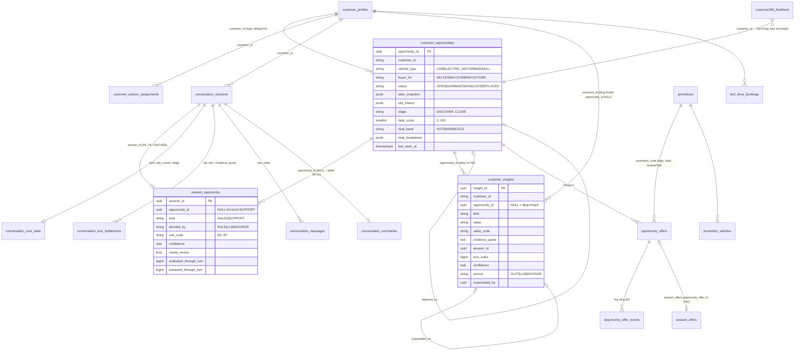
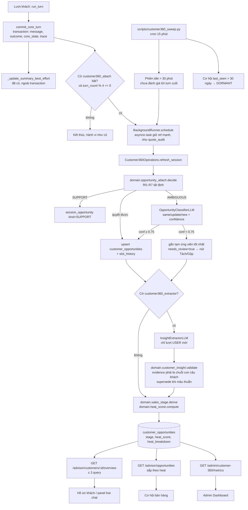

# PLAN — Customer 360 + Cơ hội bán hàng + Ưu đãi (P-150)

**Ngày lập:** 2026-09-24 · **Trạng thái:** ĐÃ THỰC THI Phase 0–6 (chưa commit) — xem §11 Nhật ký thực thi
**Cơ sở:** `prompt_plan_customer_360.md` (các quyết định thiết kế đã chốt ở mục 2 của prompt)
**Phạm vi:** `src/agents/`, `src/products/`, `migrations/agents/`, `migrations/products/`, `frontend/src/` (advisor + admin), `scripts/`. **Không** đụng `src/agents/core/` (trừ hạng mục tuỳ chọn 4.G, cờ tắt), `src/auth/`, `src/document/`.

> **Quy ước đọc số dòng:** mọi `file:NNN` được xác minh tại working tree ngày 2026-09-24
> (HEAD `7aa0a14`, có thay đổi chưa commit ở `src/agents/core/*`, `composition.py`,
> `services/registry.py`, xem §2.5). Số dòng sẽ trôi khi code đổi. Khi thực thi, tìm
> theo **tên hàm/hằng**, số dòng chỉ để định vị nhanh.

---

## 1. TÓM TẮT

1. Dựng hồ sơ khách 3 tầng **Khách → Cơ hội → Phiên** chỉ từ dữ liệu hội thoại: 3 bảng mới (`customer_opportunities`, `session_opportunity`, `customer_insights`) + 1 bảng phản hồi TVV.
2. Gắn phiên vào cơ hội bằng **luật tất định R0–R7** trước, LLM sau, TVV quyết khi `confidence` thấp. Tất cả chạy **nền, sau khi lượt đã commit**, không bao giờ trong luồng trả lời.
3. `stage` (5 bậc) và `heat_score` (0–100, ba mức Nóng/Ấm/Lạnh) tính **ở backend** bằng hàm thuần. Frontend chỉ đọc.
4. Ưu đãi: bổ sung cột rào chắn cho `promotions` (products), thêm trạng thái `UNVERIFIED`, bộ đánh giá **DSL tất định** 3 kết quả, vòng đời `opportunity_offers` có log sự kiện.
5. Frontend: giữ 6 mục menu Advisor, Admin chỉ thêm mục "Ưu đãi". Thêm route hồ sơ `/advisor/customers/[id]` và `/admin/customers/[id]` (readOnly). Component dùng chung có prop `role`/`readOnly`.
6. **Recon phát hiện 3 lỗ hổng quyền/PII phải vá trước (Phase 0).** Advisor đang thấy **mọi** phiên. `advisor_id` trên `/advisor/customers` không bị kiểm quyền. `redact_sensitive` **không** che SĐT/email.
7. Thứ tự: Phase 0 (vá) → 1 (FE tách component) → 2 (trang hồ sơ) → 3 (panel live chat) → 4 (backend Customer 360) → 5 (ưu đãi) → 6 (chất lượng trích xuất). Mọi phần mới nằm sau `agent_feature_flags`, **mặc định TẮT**.

---

## 2. KẾT QUẢ RECON

### 2.1 Giả định trong prompt ↔ thực tế trong code

| # | Giả định trong prompt | Thực tế | Bằng chứng |
|---|---|---|---|
| 1 | `conversation_slots` có các cột vehicle_type, budget_min/max/stated, purpose… | ⚠️ **Bảng key–value**, không phải cột: `(session_id, slot_name, slot_value_text, slot_value_number)`. Tên slot thật: `budget_max_vnd`, `budget_min_vnd`, `budget_stated_vnd`, `registration_province` (**không phải** `province`), `interest_vehicle`… | `src/agents/models.py:95-107`, `src/agents/domain/values.py:231-282` |
| 2 | `conversation_slots` là nguồn slot chính | ⚠️ Lõi v2 giữ slot ở `conversation_core_state.slots` (JSONB). `conversation_slots` chỉ là **bản sao** do `commit_core_turn` ghi mỗi lượt | `src/agents/models.py:723-747`, `src/agents/services/conversation_memory.py:397`, `:460-461` |
| 3 | `slot_ask_attempts` đếm số lần hỏi | ⚠️ Lõi v2 **không** ghi bảng này. Đếm nằm ở `conversation_core_state.ask_counts` (JSONB). `slot_ask_attempts` chỉ được đường cũ `ConversationServiceImpl.record_ask` ghi | `src/agents/services/conversation.py:562-567`, `src/agents/core/policy.py:698-700`, `src/agents/core/run_turn.py:986` |
| 4 | `conversation_turn_bottlenecks` PRICE/CHARGING/BATTERY/RANGE + `evidence_quote` | ✅ Khớp (CHECK label, status PENDING/CORRECT/INCORRECT) | `src/agents/models.py:224-298` |
| 5 | `conversation_turn_outcomes.recommendations` | ✅ JSONB list | `src/agents/models.py:209` |
| 6 | `pending_feature_mentions`, `out_of_scope_log` | ✅ Có | `src/agents/models.py:301-345` |
| 7 | `last_quote_evaluation`, `quote_audit_log` | ✅ `last_quote_evaluation` + `last_quote_sent_at` là cột của `conversation_sessions` | `src/agents/models.py:75-76`, `:348-379` |
| 8 | `test_drive_bookings`, `session_offers` | ✅ Có. `session_offers.status` chỉ `ACTIVE/EXPIRED`, `source_kind` chỉ `CONTENT_REVIEW/BOTTLENECK_SIGNAL` | `src/agents/models.py:540-573`, `:643-670` |
| 9 | `conversation_summaries` | ✅ Một hàng/phiên, `commit_core_turn` cập nhật best-effort **sau** transaction | `src/agents/models.py:159-171`, `src/agents/services/conversation_memory.py:513-555` |
| 10 | `customer_profiles` có tên/SĐT | ⚠️ Chỉ có `display_name/phone/email`, và **không có code nào trong `src/` ghi bảng này** (chỉ đọc ở `adapters/repositories.py:944`). Tên/SĐT thật nằm ở `auth_user_profiles.full_name/phone_number` (module auth) | `src/agents/models.py:315-325`, `src/auth/infrastructure/models.py:115-123` |
| 11 | `customer_advisor_assignments` | ✅ Có (`status` ACTIVE/…). Adapter khớp `advisor_id` theo **cả id lẫn email** | `src/agents/models.py:605-623`, `src/agents/adapters/assignment_repository.py:157-167` |
| 12 | `escalation_signals.human_requested` | ❌ **Không có bảng/cột lưu**. `human_requested` chỉ là field DTO (`contracts.py:134`, `:260`) và giá trị tính trong lượt (`domain/escalation.py:223-254`, `core/understand.py:732`). Tín hiệu bền vững thay thế: `conversation_sessions.ownership IN ('PENDING_HANDOFF','HUMAN')`, `review_queue.handoff_requested`, `turn_traces.payload.stage_after='HANDED_OFF'` | `src/agents/models.py:41-43`, `:535` |
| 13 | "Phiên kết thúc" | ⚠️ Phiên khách **gần như không bao giờ kết thúc**: `status='COMPLETED'` chỉ được đặt khi TVV đóng phiên. Không có job/scheduler nào trong `src/agents` | `src/agents/adapters/conversation_repository.py:293`, `:344`; grep `scheduler/sweep` → 0 |
| 14 | Enum giai đoạn `DISCOVER→…→CLOSE` | ❌ Chưa có. Đang có `core.state.Stage` (GREETING…HANDED_OFF) là **chặng hội thoại**, khác nghĩa với giai đoạn bán hàng. Plan ánh xạ, không dùng lẫn | `src/agents/core/state.py:17-25` |
| 15 | `promotions` là CSV seed | ⚠️ **Đã là bảng DB** thuộc module products (`PromotionRow`), status `DRAFT/ACTIVE/EXPIRED/CANCELLED`, có `approved_by/approved_at`, `gift_group`. CSV chỉ là nguồn seed | `src/products/infrastructure/models.py:275-330` |
| 16 | `eligibility_rules` đang là `{}` | ⚠️ 8/14 dòng là `{}` (`refactor_seed`). **6 dòng `created_by=vinfast_policy_crawler` chứa metadata tự do** (`eligible_group: POLICE_MILITARY…`, `source_url`…), **không phải luật**. `_eligibility_matches` chỉ đọc khoá `province`, nên 6 ưu đãi có điều kiện đối tượng (công an/quân đội, VNPost, VinClub, chủ xe xăng VinFast) **đang khớp với MỌI khách** | `data-p150/catalog/promotions.csv`, `src/products/domain/offer_matching.py:58-65` |
| 17 | `adjustment_policies` | ⚠️ Là bảng `offer_adjustment_policies` (products), khoá theo **`promotion_type`**, không theo từng ưu đãi. Có sẵn `offer_adjustment_log` | `src/products/infrastructure/models.py:333-370` |
| 18 | `fetchSalesOpportunities` | ⚠️ `GET /agent/sales-opportunities`, trả **theo PHIÊN**: phiên `ACTIVE`, hoạt động trong 24h, có ≥ 2 nhãn bottleneck `CORRECT` khác nhau. Chỉ `require_staff`, **không lọc theo phân công** | `src/agents/api/sales_opportunity_routes.py:23-76`, `src/agents/services/sales_opportunity.py` (window 24h), `src/agents/adapters/opportunity_query_repository.py` (`having count(distinct label) >= 2`), `frontend/src/lib/api/agent.ts:317`, `frontend/src/types/agent.ts:485-491` |
| 19 | `advisor-customers.tsx` ~dòng 71 hardcode mật khẩu | ✅ **Xác nhận**: `login(email, "Admin@123456")` tại `:69`, gọi từ nút "Đăng nhập TVV (advisor@gmail.com)" tại `:179` | `frontend/src/components/advisor/advisor-customers.tsx:68-78`, `:177-182` |
| 19b | (phát hiện khi làm Phase 1) | ⚠️ Còn **2 chỗ nữa** hardcode `"Admin@123456"`: `advisor-conversation-list.tsx:100` (TVV) và `assignment-center.tsx:89` (`login("admin@vinfast.vn", …)`). **Đã gỡ cả hai ở Phase 1** | — |
| 20 | `mock-dialog` hồ sơ khách | ✅ `:229-231`. `getNeedSummary` đọc `budget_vnd/model_name/usage_purpose` mà backend **không bao giờ trả**, nên luôn rơi về `reason` | `advisor-customers.tsx:111-120`, `assignment_repository.py:182-190` |
| 21 | Admin dashboard hardcode `2_480`, `2_068` | ✅ FE `admin-dashboard.tsx:11-17`, `:39-60`. **Backend cũng bịa số**: `/admin/analytics/dashboard` trả `rec_count = total_conv*0.73`, fallback `74/83/1814/54/13` khi rỗng, SQL viết thẳng trong route | `src/agents/api/admin_assignment_routes.py:282-323` |
| 22 | `chat-session-list` và `advisor-conversation-list` cùng gọi `listAdvisorConversations` | ✅ `chat-session-list.tsx:132`, `:329`; `advisor-conversation-list.tsx:65` | — |
| 23 | Cơ chế "đã lược danh tính" của `bottleneck-signal-panel` | ❌ **Chỉ là nhãn UI** (`bottleneck-signal-panel.tsx:106`). `redact_sensitive` chỉ xoá mẫu **bí mật** (password/token/API key/DSN/Bearer), **không** che SĐT, email, CCCD | `src/agents/domain/conversation_memory.py:280-290`, `:348-354` |
| 24 | Menu advisor 6 mục | ✅ `operational-shell.tsx:30-35`. Admin hiện có **8 mục** (`:39-46`) | — |
| 25 | `agent_feature_flags` | ✅ Có (migration `agent_0036`), đọc qua `AgentFlagPort` với TTL 60s | `src/agents/models.py:750-770`, `src/agents/ports.py:594-602`, `src/agents/domain/agent_flag.py:26-58` |
| 26 | Tín hiệu restart ở `advisory_restart.py` | ✅ `classify_advisory_flow()` → `AdvisoryFlowAction.RESTART_ADVISORY`. Lõi v2 dùng `DialogueAct.RESTART` (`core/policy.py:127`, `core/understand.py:1020`) | `src/agents/domain/advisory_restart.py:63-72`, `:221` |
| 27 | Revision agent mới nhất | ✅ `agent_0036_agent_feature_flags`. Products head: `b2c3d4e5f6a7` (tên hash, không theo số) | `migrations/agents/versions/`, `migrations/products/versions/b2c3d4e5f6a7_*.py` |

### 2.2 Lỗi/lỗ hổng phát hiện thêm (ngoài câu hỏi của prompt)

| Mức | Vấn đề | Bằng chứng | Xử lý |
|---|---|---|---|
| **Cao (quyền)** | `list_staff_sessions` chỉ lọc khi role **không** phải admin/advisor, nên **advisor thấy toàn bộ phiên** (docstring route nói "advisor sees assigned only") | `src/agents/adapters/conversation_repository.py:297-308` (điều kiện `:305`), `src/agents/api/advisor_routes.py:135-161` | Phase 0 |
| **Cao (quyền)** | `GET /advisor/customers?advisor_id=X`: advisor bất kỳ xem được khách của TVV khác | `src/agents/api/advisor_routes.py:352-375` (`:367-370`) | Phase 0 |
| Trung bình (quyền) | `staff_conversation_detail` cho advisor đọc mọi phiên có `assigned_advisor_id IS NULL` | `src/agents/services/conversation.py:298-315` | Phase 0 (có `[GIẢ ĐỊNH]`) |
| **Cao (PII)** | SĐT/email của khách đi nguyên văn vào `evidence_quote`, transcript, trace, tóm tắt. Màn admin ghi "đã lược danh tính" nhưng không che gì | #23 ở trên | Phase 0 (hàm `redact_pii`) + áp ở Phase 4 |
| Trung bình (dữ liệu) | `_announce_offer` chèn `session_offers` với `approved_by=None`, trong khi cột `NOT NULL`. Insert sẽ hỏng và bị `except` nuốt, nên luồng CONTENT_REVIEW **không** ghi được `session_offers` `[CHƯA XÁC MINH bằng chạy thật]` | `src/agents/services/operations/review.py:497-512`, `migrations/agents/versions/agent_0026_session_offers.py:33` | Phase 5 |
| Trung bình (nghiệp vụ) | 6 ưu đãi có điều kiện đối tượng khớp mọi khách (#16) | `offer_matching.py:58-65` | Phase 5 + câu hỏi mở Q1 |
| Hiệu năng | N+1: `_enrich_summary` 2 query/phiên, **không LIMIT** | `src/agents/services/conversation.py:287-296`, `:515-537` | Phase 3 (batch) |
| Hiệu năng | N+1: `list_assigned_customers_for_advisor` 2 query/khách | `src/agents/adapters/assignment_repository.py:176-200` | Phase 3 |
| Kiến trúc | Route dashboard viết SQL trực tiếp, vi phạm `docs/backend-module-standard.md` §2 (presentation không chứa SQL) | `admin_assignment_routes.py:292-323` | Phase 4 |
| Tài liệu | `docs/backend-module-standard.md` §11 và `ARCHITECTURE.md` vẫn mô tả LangGraph, nhưng dependency đã bị gỡ (`d5674a5`) | — | Ngoài phạm vi, chỉ ghi nhận |

### 2.3 Xung đột với `docs/PLAN_AGENT_MIGRATION.md`

- Plan đó đã xong **9/10 bước về code** (`docs/AGENT_MIGRATION_REPORT.md` §1). Bước 10 (canary) chưa bắt đầu và chỉ là `UPDATE agent_feature_flags`.
- **Không xung đột schema:** plan này thêm hàng cờ mới vào `agent_feature_flags` (cùng khuôn `INSERT` ở `agent_0036:33`) và nối revision từ `agent_0036`.
- **Không xung đột `core/`:** Customer 360 chạy **sau** `commit_core_turn`, không sửa `core/run_turn.py`, `core/act.py`, `core/policy.py`. Ngoại lệ duy nhất là hạng mục tuỳ chọn 4.G (hỏi lồng thời điểm mua), cờ tắt, **làm sau** khi lớp conversational chưa commit đã được merge.
- **Rủi ro merge:** working tree đang có thay đổi chưa commit ở `src/agents/composition.py` và `src/agents/services/registry.py` (lớp conversational `vivi_persona`). Phase 4 cũng phải sửa `composition.py`, nên **phải commit/merge phần đang dở trước khi bắt đầu Phase 4** (xem R8).
- `turn_traces.payload` chỉ được **đọc** (lấy `stage_after`), không thêm khoá. Giữ nguyên contract §0.3 của plan migration.

### 2.4 Baseline test phải ghi trước khi bắt đầu

Theo `docs/AGENT_MIGRATION_REPORT.md` §2: unit `1 failed / 5224 passed` (lỗi bom hẹn giờ đã biết), integration `33 failed / 366 passed` với `AGENT_DATABASE_URL` cổng **5433** (không export thì ~486 test skip im lặng), `ruff` baseline 5 lỗi. **Chạy lại và ghi con số thật trước Phase 0.**

### 2.5 Trạng thái working tree lúc lập plan

Có sửa đổi chưa commit: `src/agents/{composition.py, core/act.py, core/policy.py, core/state.py, core/understand.py, services/registry.py, services/vehicle_overview.py}` + file mới `adapters/conversational_llm.py`, `domain/conversational.py`, `prompts/vivi_persona.*`, `services/conversational.py`. **Plan này không đụng các file đó ngoài `composition.py`/`registry.py` ở Phase 4.**

---

## 3. SƠ ĐỒ DỮ LIỆU



---

## 4. SƠ ĐỒ LUỒNG



---

## 5. THIẾT KẾ CHI TIẾT BẮT BUỘC

### 5.1 Giai đoạn bán hàng (`SalesStage`) — nguồn duy nhất `src/agents/domain/sales_stage.py`

Thứ tự `DISCOVER < COMPARE < QUOTE < TEST_DRIVE < CLOSE`. Giai đoạn của cơ hội = **max** của các tín hiệu (đơn điệu, không lùi, trừ khi TVV đặt tay).

| Tín hiệu (nguồn) | Giai đoạn tối thiểu |
|---|---|
| Mặc định | DISCOVER |
| `core_state.stage ∈ {RECOMMENDED, CHOSEN}` hoặc outcome có `recommendations` khác rỗng | COMPARE |
| `core_state.stage ∈ {COSTING, SCHEDULING, OFFER_REVIEW}` hoặc `conversation_sessions.last_quote_sent_at IS NOT NULL` | QUOTE |
| `test_drive_bookings.status IN ('REQUESTED','CONFIRMED')` của khách, xe thuộc `vehicle_type` của cơ hội | TEST_DRIVE |
| `opportunity_offers.status IN ('ENGAGED','CONVERTED')` hoặc cơ hội `WON` | CLOSE |

`HANDED_OFF`/`GREETING` không nâng giai đoạn. `[GIẢ ĐỊNH G6]` `SCHEDULING` chỉ tính QUOTE vì chưa có lịch thật.

### 5.2 Heat score — `src/agents/domain/heat_score.py` (thuần, `HEAT_VERSION = "h1"`)

| # | Tín hiệu | Nguồn | Điểm |
|---|---|---|---|
| H1 | Giai đoạn cao nhất | §5.1 | DISCOVER 0 · COMPARE 10 · QUOTE 25 · TEST_DRIVE 35 · CLOSE 45 |
| H2 | Thời điểm định mua (khách nói ra) | insight `purchase_timeframe` | ≤ 1 tháng +20 · 1–3 tháng +10 · > 3 tháng / chưa rõ 0 |
| H3 | Có SĐT | `customer_profiles.phone` hoặc insight `contact_phone_given` | +10 |
| H4 | Đòi gặp người thật | phiên từng `ownership ∈ {PENDING_HANDOFF, HUMAN}` hoặc trace `stage_after='HANDED_OFF'` | +10 |
| H5 | Quay lại nhiều lần | số phiên SALES gắn cơ hội trong 14 ngày | 2 phiên +5 · ≥ 3 phiên +10 |
| H6 | Nêu ngân sách cụ thể | slot `budget_stated_vnd` hoặc `budget_max_vnd` | +5 |
| H7 | Hỏi thanh toán/trả góp | insight `payment_method` | +5 |
| H8 | Né câu hỏi | mỗi slot có `ask_counts[slot] ≥ 2` mà vẫn trống | −5/slot, tối đa −10 |
| H9 | Độ mới | `last_seen_at` | ≤ 3 ngày 0 · 4–7 ngày −5 · 8–14 ngày −15 · 15–30 ngày −25 · > 30 ngày: DORMANT, `heat = min(heat, 15)` |

Kẹp `0..100`. **Ngưỡng `[GIẢ ĐỊNH G7]`: Nóng ≥ 60 · Ấm 30–59 · Lạnh < 30.** Độ nóng khách = max độ nóng các cơ hội `OPEN`. `heat_breakdown` lưu `[{code:"H1", points:35, detail:"TEST_DRIVE"}…]` để UI giải thích "vì sao nóng".

**3 ví dụ tính tay:**

| Ca | Dữ kiện | Tính | Kết quả |
|---|---|---|---|
| A | VF 6, đã đặt lái thử (TEST_DRIVE), nói "tháng này chốt", có SĐT, nêu 800 triệu, hoạt động hôm qua | 35 + 20 + 10 + 5 + 0 = **70** | **Nóng** |
| B | VF 5, đã nhận báo giá lăn bánh (QUOTE), 2 phiên trong 14 ngày, nêu 550 triệu, hỏi trả góp, lần cuối 5 ngày trước | 25 + 5 + 5 + 5 − 5 = **35** | **Ấm** |
| C | Xe máy điện, mới được đề xuất (COMPARE), nêu 30 triệu, bị hỏi 2 lần vẫn né `purpose` và `required_range_km`, lần cuối 10 ngày trước | 10 + 5 − 10 − 15 = −10 → kẹp **0** | **Lạnh** |

### 5.3 Luật gộp/tách cơ hội — `src/agents/domain/opportunity_attach.py` (thuần)

Đầu vào: `SessionFacts` (vehicle_type, buyer_for, purpose_bucket, budget, restart_seen, intents trong phiên, có slot tư vấn hay không) + danh sách `OpportunityView` của khách (OPEN/DORMANT). Đầu ra: `AttachDecision(kind, target, rule_code, confidence, slot_changes)`.

`buyer_for` do hàm tất định `domain/buyer_for.py` phát hiện từ câu khách: "cho con/vợ/chồng/bố/mẹ…" → FAMILY, "cho công ty/doanh nghiệp/chạy dịch vụ công ty" → COMPANY, "cho bạn/người quen" → OTHER, không có → SELF. `[GIẢ ĐỊNH G8]`

| Luật | Điều kiện (xét theo thứ tự, luật đầu khớp thắng) | Quyết định | decided_by / confidence |
|---|---|---|---|
| **R0** | Phiên không có slot tư vấn nào (vehicle_type, budget_*, purpose, passenger_count, interest_vehicle đều trống) **và** intent chỉ thuộc {POLICY_QA, NEARBY, VEHICLE_QA không có interest_vehicle, HANDOFF, NONE} | `SUPPORT`: không tạo cơ hội, timeline gắn nhãn "Hỗ trợ" | RULE / 1.0 |
| **R1** | Khách chưa có cơ hội OPEN/DORMANT nào | `NEW` | RULE / 1.0 |
| **R2** | `vehicle_type` phiên ≠ `vehicle_type` của **mọi** cơ hội (cả hai đều biết) | `NEW` (cơ hội cũ giữ nguyên) | RULE / 1.0 |
| **R3** | `buyer_for` phiên ≠ SELF và không cơ hội nào cùng `buyer_for` | `NEW` | RULE / 1.0 |
| **R4** | Có tín hiệu restart (`classify_advisory_flow` = RESTART_ADVISORY hoặc trace `DialogueAct.RESTART`), cùng vehicle_type + buyer_for với đúng 1 cơ hội, `purpose_bucket` trùng hoặc thiếu | `UPDATE` cơ hội đó. Slot mới ghi đè, slot cũ vào `slot_history` | RULE / 0.9 |
| **R5** | Đúng 1 cơ hội cùng vehicle_type + buyer_for + purpose_bucket (hoặc phiên thiếu purpose), khác biệt **chỉ** ở budget_* | `UPDATE` + lưu vết "850tr (trước: 700tr)" | RULE / 1.0 |
| **R6** | Đúng 1 cơ hội cùng vehicle_type + buyer_for + purpose_bucket, không slot nào đổi | `SAME` | RULE / 1.0 |
| **R7** | Còn lại: purpose_bucket khác, nhiều ứng viên, vehicle_type phiên chưa rõ, cơ hội ứng viên DORMANT… | `AMBIGUOUS`: gọi LLM | — |

**Sau LLM** (`same | update | new` + `confidence`): `confidence ≥ 0.75` thì áp dụng (`decided_by=LLM`). `< 0.75` thì gắn tạm vào ứng viên có `last_seen_at` mới nhất, `needs_review=true`, hồ sơ hiện nút **Tách / Gộp** `[GIẢ ĐỊNH G9]`. LLM lỗi/timeout thì xử như `< 0.75`. TVV bấm thì ghi `decided_by=ADVISOR`, `decided_by_actor=<advisor_id>`, kèm một hàng `customer360_feedback`. Cơ hội DORMANT được gắn lại thì chuyển `OPEN`. Cơ hội bị gộp vào cơ hội khác thì `REPLACED` + `replaced_by`.

**6 test case bắt buộc** (`tests/agents/unit/domain/test_opportunity_attach.py`):

| TC | Tình huống | Đầu vào rút gọn | Kỳ vọng |
|---|---|---|---|
| 1 | Cùng xe đổi ngân sách | O1 {CAR, SELF, FAMILY, max 700tr}; phiên {CAR, FAMILY, max 850tr} | R5 `UPDATE O1`, `slot_changes=[budget_max_vnd: 700tr→850tr]`, RULE/1.0 |
| 2 | Ô tô → xe máy | O1 {CAR}; phiên {ELECTRIC_MOTORBIKE, 30tr} | R2 `NEW`, O1 không đổi |
| 3 | Mua cho con | O1 {CAR, SELF}; phiên "tìm thêm ô tô nhỏ cho con gái đi làm", {CAR} | `buyer_for=FAMILY` → R3 `NEW` |
| 4 | Phiên chỉ hỏi bảo hành | không slot tư vấn; intent {POLICY_QA} | R0 `SUPPORT`, không tạo/đổi cơ hội |
| 5 | "tư vấn lại từ đầu" | O1 {CAR, SELF, FAMILY, 700tr}; phiên có RESTART rồi {CAR, FAMILY, 1 tỷ} | R4 `UPDATE O1`, lịch sử giữ 700tr, RULE/0.9 |
| 6 | Mơ hồ cần TVV | O1 {CAR, SELF, FAMILY} DORMANT 40 ngày; phiên {CAR, purpose thiếu, 1,2 tỷ}. Fake LLM trả `update` 0.55 | R7 → gắn tạm O1, `needs_review=true`, O1 → OPEN. Test tiếp: TVV "Tách" → O2 mới, `decided_by=ADVISOR` |

### 5.4 Extractor insight

- **Chạy ở đâu:** `Customer360Operations.refresh_session` (`src/agents/services/operations/customer_360.py`), **sau** bước gắn cơ hội, trong background task. Mỗi 4 lượt USER, hoặc khi sweep thấy phiên idle > 30 phút. Không bao giờ chạy trong `run_turn`.
- **Adapter:** `src/agents/adapters/insight_extractor_llm.py`, cùng khuôn `bottleneck_detector.py` (forced tool call, `budgeted_llm`, model `settings.model_name` = `gpt-4o-mini`, `src/config.py:25`). Prompt ở `src/agents/prompts/insight_extraction.py`, `INSIGHT_PROMPT_VERSION="insight-v1"`.
- **Đầu vào:** chỉ tin nhắn `role='USER'` có `turn_index > extracted_through_turn`, tối đa 12 lượt/lần, mỗi câu kèm số `turn_index`. **Đã qua `redact_pii`** (Phase 0), vì LLM không cần SĐT thật: có SĐT hay không là tín hiệu tất định, bắt bằng regex `domain/pii.py` trước khi redact.
- **Prompt khung:**

```text
Bạn là bộ trích xuất THÔNG TIN KHÁCH TỰ NÓI trong hội thoại mua xe VinFast.
Chỉ ghi điều khách NÓI RA TRỰC TIẾP. CẤM suy diễn.
Ví dụ CẤM: "chở con đi học" KHÔNG suy ra "đã có gia đình", "thu nhập khá", "tuổi".
Mỗi mục PHẢI có evidence_quote là đoạn CHÉP NGUYÊN VĂN (không sửa chữ) từ đúng câu có turn_index đó.
Không có bằng chứng nguyên văn → không ghi. Không chắc → không ghi.
Chỉ dùng các field trong schema. Không có gì để ghi → trả insights: [].
<các câu của khách, dạng [turn 7] ...>
```

- **JSON schema đầu ra** (tool `ghi_thong_tin_khach`):

```json
{
  "type": "object",
  "additionalProperties": false,
  "required": ["insights"],
  "properties": {
    "insights": {
      "type": "array", "maxItems": 12,
      "items": {
        "type": "object", "additionalProperties": false,
        "required": ["field", "value", "evidence_quote", "turn_index", "confidence"],
        "properties": {
          "field": {"enum": ["purchase_timeframe", "payment_method", "current_vehicle", "trade_in",
                              "decision_maker", "competitor_brand", "other_concern", "buyer_for", "customer_group"]},
          "value": {"type": "string", "maxLength": 120},
          "value_code": {"type": ["string", "null"],
            "description": "purchase_timeframe: WITHIN_1_MONTH|1_3_MONTHS|3_6_MONTHS|OVER_6_MONTHS|UNDECIDED; payment_method: CASH|INSTALLMENT|UNDECIDED; trade_in: YES|NO; decision_maker: SELF|SPOUSE|PARENTS|COMPANY|OTHER; buyer_for: SELF|FAMILY|COMPANY|OTHER; customer_group: POLICE_MILITARY|VNPOST|VINCLUB|OTHER"},
          "evidence_quote": {"type": "string", "minLength": 2, "maxLength": 300},
          "turn_index": {"type": "integer", "minimum": 0},
          "confidence": {"type": "number", "minimum": 0, "maximum": 1}
        }
      }
    }
  }
}
```

- **Chống suy diễn (3 lớp, lớp 2–3 bằng code trong `domain/customer_insight.py`):**
  1. Prompt cấm + schema **không có** field nhạy cảm (tình trạng hôn nhân, thu nhập, tuổi, giới tính, nghề nghiệp).
  2. `evidence_quote` sau khi chuẩn hoá (`canonical_text`, gập dấu, gộp khoảng trắng) **phải là chuỗi con** của câu USER ở đúng `turn_index`. Không khớp thì **loại**, đếm `insight_rejected_no_evidence`.
  3. `value_code` phải khớp bảng enum của field. Với field enum, thêm lexicon tối thiểu (`purchase_timeframe=WITHIN_1_MONTH` phải có "tháng này|tuần|ngay|sớm" trong evidence…). Không qua thì loại. `confidence < 0.6` cũng loại.
- **Giá trị mâu thuẫn:** khoá hiện hành = `(customer_id, opportunity_id, field)` với field đơn trị. Hàng mới có `value_code/value` khác hàng hiện hành thì hàng cũ `superseded_by = new.insight_id`, UI hiện "Trả góp (trước: Trả thẳng, 12/09)". Trùng giá trị thì bỏ (idempotent nhờ unique `(session_id, turn_index, field, value)`). Field đa trị (`competitor_brand`, `other_concern`) không supersede, chỉ dedupe. Field tầng Khách (`decision_maker`, `payment_method`, `current_vehicle`, `trade_in`, `customer_group`) ghi `opportunity_id NULL`. `purchase_timeframe`/`buyer_for`/`other_concern` gắn cơ hội. Slot khách (tỉnh, sạc tại nhà) cũng ghi vào `customer_insights` với `source='SLOT'` để có lịch sử, lấy evidence = câu USER của lượt slot đổi giá trị.
- **Chi phí ước tính `[GIẢ ĐỊNH G10: giá gpt-4o-mini $0.15/1M input, $0.60/1M output, cần kiểm lại bảng giá hiện hành]`:** mỗi lần gọi khoảng 1.800 token vào + 250 ra ≈ $0.00042. Phiên trung bình 12 lượt USER cho 3 lần extractor + 0,3 lần phân loại cơ hội (chỉ R7) ≈ **$0.0014/phiên** (≈ 35 VND). Chặn trên: tối đa 6 lần extractor/phiên (`MAX_EXTRACTIONS_PER_SESSION`), vượt thì bỏ qua và ghi log.

### 5.5 DSL `eligibility_rules` — `src/products/domain/eligibility_rules.py` (thuần)

- **Cú pháp:** node = `{"all":[node…]}` | `{"any":[node…]}` | lá `{"field":F, OP:V}` với đúng một OP. `{}` = không điều kiện.
- **Toán tử:** `eq`, `in` (list), `gte`, `lte` (số), `exists` (bool), `all`, `any`.
- **Field hợp lệ (whitelist, có kiểu):** `vehicle_type` (enum), `vehicle_model` (mã mẫu, lấy từ `interest_vehicle`/xe được chọn), `budget_max_vnd` (int), `registration_province` (mã tỉnh `pricing_intent.PROVINCES`), `purpose_bucket` (enum), `home_charging` (bool), `passenger_count` (int), `payment_method`, `trade_in`, `current_vehicle_brand`, `customer_group`, `purchase_timeframe` (enum từ insight). Field lạ hoặc sai kiểu thì `validate_rules` báo lỗi (admin nhận 422 lúc lưu).
- **Đánh giá 3 trị (Kleene):** lá thiếu field thì `UNKNOWN(field)`. `all`: có FALSE thì FALSE, không thì có UNKNOWN thì UNKNOWN, không thì TRUE. `any`: có TRUE thì TRUE, không thì có UNKNOWN thì UNKNOWN, không thì FALSE. `exists:true` gặp field thiếu thì UNKNOWN (để ra câu hỏi), `exists:false` gặp field thiếu thì TRUE.
- **Trả về:** `ELIGIBLE(reasons=[“Tỉnh đăng ký HN thuộc {HN, HCM}”…])` · `NEED_INFO(missing_fields=[…], question_hints=[…])` (câu hỏi gợi ý tra từ `FIELD_QUESTION_HINTS`, ví dụ `registration_province` → "Anh/chị dự định đăng ký xe ở tỉnh nào ạ?") · `INELIGIBLE(failed=[lá sai đầu tiên])`.
- **Tiền kiểm trước luật:** `status='ACTIVE'`, trong `valid_from..valid_to`, `used_count < max_uses`, và nếu ưu đãi có `promotion_vehicles` thì xe của cơ hội phải thuộc danh sách (thiếu xe thì NEED_INFO `vehicle_model`). `UNVERIFIED/DRAFT` không bao giờ vào kết quả cho agent.
- **Luật cũ không phải DSL** (6 dòng crawler): `parse_rules` trả `INVALID_RULE`, ưu đãi bị **loại khỏi** kết quả của bộ đánh giá mới và hiện ở `/admin/promotions` với nhãn "Cần dựng luật". Hàm cũ `_eligibility_matches` giữ nguyên khi cờ tắt.
- **Test case** (`tests/products/unit/test_eligibility_rules.py`):

| # | Luật | Ngữ cảnh | Kỳ vọng |
|---|---|---|---|
| D1 | `{"all":[{"field":"registration_province","in":["HN","HCM"]}]}` | province=HN | ELIGIBLE, reason nhắc HN |
| D2 | như D1 | province thiếu | NEED_INFO `["registration_province"]` + câu hỏi gợi ý |
| D3 | `{"all":[{"field":"vehicle_type","eq":"CAR"},{"field":"budget_max_vnd","gte":500000000}]}` | vehicle_type=ELECTRIC_MOTORBIKE, budget thiếu | INELIGIBLE (FALSE thắng UNKNOWN trong `all`) |
| D4 | `{"any":[{"field":"customer_group","in":["POLICE_MILITARY"]},{"field":"trade_in","eq":"YES"}]}` | trade_in=YES, customer_group thiếu | ELIGIBLE (TRUE thắng trong `any`) |
| D5 | `{"all":[{"field":"income","gte":1}]}` | bất kỳ | `validate_rules` báo `UNKNOWN_FIELD:income`. Evaluator trả INVALID_RULE, ưu đãi bị loại |
| D6 (thêm) | `{}` | rỗng | ELIGIBLE "Không có điều kiện" |

### 5.6 Endpoint tổng hợp hồ sơ — `GET /advisor/customers/{customer_id}/overview`

**Đúng 3 query**, adapter `src/agents/adapters/customer_360_query.py`:

1. **Header + cơ hội:** `WITH c AS (SELECT :cid AS customer_id)` LEFT JOIN `customer_profiles` LEFT JOIN `customer_advisor_assignments` (ACTIVE) LEFT JOIN `customer_opportunities` (status ≠ REPLACED). Mỗi hàng là một cơ hội, cột hồ sơ lặp lại. Luôn có ≥ 1 hàng.
2. **Sự kiện (view mới `customer_360_facts`):** `UNION ALL` các nguồn cùng hình `(kind, customer_id, opportunity_id, session_id, code, value, value_code, evidence_quote, turn_index, status, at)`. Gồm: `customer_insights` (superseded_by IS NULL); `conversation_turn_bottlenecks` (status ≠ INCORRECT) join `conversation_sessions` (lấy customer_id) + `session_opportunity` (lấy opportunity_id) + `conversation_turn_outcomes` (lấy turn_number); `test_drive_bookings`; `opportunity_offers` (từ Phase 5). Lọc `WHERE customer_id=:cid ORDER BY at`.
3. **Phiên:** `conversation_sessions WHERE customer_id=:cid ORDER BY last_activity_at DESC LIMIT 50` LEFT JOIN `session_opportunity` LEFT JOIN `conversation_core_state` (`turn_count`, `ask_counts`, `slots`) LEFT JOIN `conversation_summaries` (`left(content, 280)`).

Phần ghép (nhu cầu đã có/còn thiếu/né, gợi ý mở lời, việc cần làm) do **hàm thuần** `domain/customer_overview.py` tính từ 3 kết quả trên. Không query thêm. Tên/SĐT lấy từ `customer_profiles`, được job nền đồng bộ từ `auth_user_profiles` qua `CustomerIdentityPort` (§ Phase 4), **không** đọc auth trên đường đọc. Index dùng: `ix_conversation_sessions_customer` (có sẵn), `ix_conversation_turn_bottlenecks_session_status_created` (có sẵn), `ix_customer_opportunities_customer_status`, `ix_customer_insights_customer_current` (mới).

---

## 6. KẾ HOẠCH THEO PHASE

> Quy ước đường dẫn: `A` = `src/agents`, `P` = `src/products`, `FE` = `frontend/src`.

### PHASE 0 — Vá quyền và PII (điều kiện tiên quyết) · **S** · không phụ thuộc

1. **Mục tiêu:** Advisor chỉ thấy khách/phiên của mình. Dữ liệu hiển thị cho admin không lộ SĐT/email. Là nền cho quy tắc quyền của mọi phase sau.
2. **Phạm vi:** sửa lọc phiên, chặn `advisor_id` cho non-admin, thêm `redact_pii`/`mask_phone`, che SĐT ở danh sách. **Không** đổi schema, không đổi hình response (chỉ đổi giá trị `phone`).
3. **File:**
   - *sửa* `A/adapters/conversation_repository.py`: `list_staff_sessions` lọc advisor theo `assigned_advisor_id = requester` **hoặc** `customer_id IN (assignment ACTIVE của requester)` **hoặc** (`assigned_advisor_id IS NULL AND ownership='PENDING_HANDOFF'`) `[GIẢ ĐỊNH G1]`. Thêm `limit` mặc định 200.
   - *sửa* `A/services/conversation.py`: `staff_conversation_detail` dùng cùng vị từ quyền.
   - *sửa* `A/api/advisor_routes.py`: `list_assigned_customers` trả 403 khi non-admin truyền `advisor_id` khác mình, log bằng `log_authorization_denied`.
   - *tạo* `A/domain/pii.py`: `redact_pii(text)` (SĐT VN `0/+84` 9–10 số, có dấu cách/chấm; email; CCCD 12 số), `mask_phone("0912345678") → "0912***678"`, `contains_phone(text) -> bool`.
   - *sửa* `A/adapters/assignment_repository.py`: trả `phone` đã mask trong danh sách.
   - *sửa* `FE/components/advisor/bottleneck-signal-panel.tsx`: hiển thị `evidence_quote` qua backend đã `redact_pii` (backend sửa ở `A/api/bottleneck_signal_routes.py`).
4. **Migration:** không.
5. **API:** không thêm route. Thay đổi hành vi: `GET /advisor/conversations` (advisor-scope thật), `GET /advisor/customers` (403 khi lạm quyền), `profile_payload.phone` bị mask.
6. **Component:** không thêm.
7. **Test:** *tạo* `tests/agents/unit/domain/test_pii.py` (8 mẫu SĐT/email/CCCD + câu không có PII giữ nguyên). *Tạo* `tests/agents/integration/test_staff_scope.py` (advisor A không thấy phiên của khách giao cho B, admin thấy hết, advisor gọi `advisor_id=B` nhận 403). **Bị ảnh hưởng:** `tests/agents/unit/services/test_staff_conversations_preview.py`, `tests/agents/integration/test_customer_assignment_and_reassign.py`, `FE/components/advisor/bottleneck-signal-panel.test.tsx`.
8. **Nghiệm thu:**
   - [ ] Advisor không có phân công gọi `/advisor/conversations` chỉ thấy phiên PENDING_HANDOFF chưa ai nhận.
   - [ ] `GET /advisor/customers?advisor_id=<khác>` bằng tài khoản advisor trả 403.
   - [ ] Evidence có "0912 345 678" hiển thị "[SĐT]" ở màn admin/advisor queue.
   - [ ] Gate: `ruff` không thêm lỗi, unit/integration không thêm fail so với baseline §2.4.
9. **Rủi ro:** TVV đang quen thấy mọi phiên nên bị "mất" phiên. Giảm: báo trước, admin vẫn thấy hết, câu hỏi mở Q3.
10. **Cờ:** không (vá bảo mật, bật luôn).
11. **Ước lượng:** S. Không phụ thuộc.

### PHASE 1 — Frontend: tách component dùng chung, gộp `ChatSessionTable(scope)` · **M** · sau Phase 0

1. **Mục tiêu:** một bảng phiên dùng cho cả hai phía, bộ component nền cho hồ sơ. Gỡ mật khẩu hardcode.
2. **Phạm vi:** chỉ `frontend/`. **Không** thêm API, **không** đổi route, menu giữ nguyên.
3. **File:**
   - *sửa* `FE/components/advisor/advisor-customers.tsx`: **xoá `handleQuickAdvisorLogin` + nút đăng nhập nhanh + chuỗi `"Admin@123456"`** (`:68-78`, `:177-182`). Thay bằng link `/login`. Danh sách phiên trong dialog dùng `SessionList`. `getNeedSummary` bỏ các khoá không tồn tại.
   - *tạo* `FE/components/shared/chat-session-table.tsx`: `ChatSessionTable` (gộp logic lọc/sắp/KPI của `chat-session-list.tsx` và `advisor-conversation-list.tsx`).
   - *sửa* `FE/components/admin/chat-session-list.tsx`: thành wrapper `scope="all"`. Giữ export `ChatSessionKpis`, `RecentChatSessions` (đang được `admin-dashboard.tsx:7` dùng).
   - *sửa* `FE/components/advisor/advisor-conversation-list.tsx`: thành wrapper `scope="mine"`.
   - *tạo* `FE/components/customer360/session-list.tsx`, `customer-summary.tsx`, `barrier-list.tsx`, `opportunity-card.tsx` (chưa có dữ liệu cơ hội thì `OpportunityCard` nhận `slots` phiên).
   - *tạo* `FE/components/customer360/customer360-labels.ts`: nhãn stage/heat/buyer_for/insight field, theo khuôn `offer-state-labels.ts` (`Record<Code, …>`).
   - *tạo* `FE/types/customer360.ts`: kiểu `SalesStage`, `HeatBand`, `OpportunityStatus`, `SessionKind`, `CustomerOverview`… (khớp §6 Phase 4 API).
   - *sửa* `FE/components/advisor/offer-picker.tsx`: thêm prop `readOnly`.
4. **Migration:** không.
5. **API:** không đổi. Dùng `listAdvisorConversations`, `fetchAdvisorCustomers` hiện có.
6. **Component:**
   - `ChatSessionTable({ scope: "mine" | "all"; customerId?: string; columns?: { advisor?: boolean; traceLink?: boolean }; kpiSet: "advisor" | "admin" })`: route `/advisor/conversations` và `/admin/chat-sessions`, dùng lại ở tab Phiên chat.
   - `SessionList({ sessions: SessionRow[]; readOnly: boolean; onMove?: (sessionId, target) => void })`: dialog khách (Phase 1), tab Phiên chat (Phase 2).
   - `CustomerSummary({ customer; role: "advisor" | "admin"; readOnly })`, `BarrierList({ items; redacted: boolean })`, `OpportunityCard({ opportunity; readOnly })`.
7. **Test:** *tạo* `FE/components/shared/chat-session-table.test.tsx` (render `scope="all"` có cột Advisor, `scope="mine"` không có, lọc trạng thái). **Bị ảnh hưởng:** `FE/components/admin/chat-session-list.test.tsx`, `FE/components/advisor/advisor-conversation-list.test.tsx`.
8. **Nghiệm thu:**
   - [ ] `grep -rn "Admin@123456" frontend/src` rỗng.
   - [ ] `/advisor/conversations` và `/admin/chat-sessions` render cùng `ChatSessionTable`. Admin có thêm cột Advisor + link trace.
   - [ ] `npm run lint`, `npm run typecheck`, `npm run test`, `npm run build` đều xanh.
9. **Rủi ro:** hồi quy hành vi lọc/KPI khi gộp. Giảm: giữ test cũ chạy trên wrapper, chụp màn hình trước/sau.
10. **Cờ:** không (refactor thuần FE).
11. **Ước lượng:** M. Phụ thuộc Phase 0 (để `scope="mine"` thật sự là "của tôi").

### PHASE 2 — Trang hồ sơ `/advisor/customers/[id]` + tab Phiên chat (dữ liệu hiện có) · **M** · sau Phase 1

1. **Mục tiêu:** TVV mở hồ sơ khách bằng URL riêng, thấy thông tin khách + toàn bộ phiên. Admin xem cùng trang ở chế độ chỉ xem.
2. **Phạm vi:** route mới, header, tab Phiên chat, tab Lái thử (nhúng component có sẵn, lọc theo khách). Tab Tổng quan tạm dựng từ slot + bottleneck hiện có. **Không** có cơ hội/insight/heat (Phase 4), **không** có Ưu đãi (Phase 5).
3. **File:**
   - *tạo* `FE/app/advisor/customers/[id]/page.tsx`, `FE/app/admin/customers/[id]/page.tsx` (bọc `OperationalShell`, `readOnly` cho admin).
   - *tạo* `FE/components/customer360/customer-profile-page.tsx` (`CustomerProfilePage`: header, nút Vào chat / Gọi / Tiếp quản, tabs).
   - *sửa* `FE/components/advisor/advisor-customers.tsx`: bỏ `mock-dialog`, dòng khách thành link `/advisor/customers/{id}`.
   - *sửa* `FE/components/advisor/advisor-queue-table.tsx`, `FE/components/advisor/bottleneck-signal-panel.tsx`: thêm link "Xem hồ sơ khách".
   - *sửa* `FE/app/admin/chat-sessions/[id]/page.tsx` / `FE/components/admin/chat-session-detail.tsx`: thêm link hồ sơ khách.
   - *sửa* `FE/lib/api/agent.ts`: `fetchCustomerSessions(customerId)` (bọc `listAdvisorConversations(customerId)`).
   - *sửa* trang lái thử (`FE/app/advisor/test-drives/page.tsx` + component đang dùng `fetchTestDriveBookings`) để nhận prop `customerId` `[CHƯA XÁC MINH tên component lịch lái thử]`.
4. **Migration:** không.
5. **API:** dùng `GET /advisor/conversations?customer_id=` và `GET /advisor/customers` hiện có (Phase 0 đã khoá quyền). Không route mới.
6. **Component:** `CustomerProfilePage({ customerId; role; readOnly })`, dùng cho `/advisor/customers/[id]` và `/admin/customers/[id]`.
7. **Test:** *tạo* `FE/components/customer360/customer-profile-page.test.tsx` (readOnly ẩn nút Tiếp quản/Gọi, advisor thấy đủ, tab Phiên chat render `SessionList`). **Bị ảnh hưởng:** `advisor-queue-table.test.tsx`, `bottleneck-signal-panel.test.tsx`.
8. **Nghiệm thu:**
   - [ ] `/advisor/customers/<id>` mở trực tiếp được (reload không mất trạng thái).
   - [ ] `/admin/customers/<id>` không có nút ghi nào ngoài "Phân công lại".
   - [ ] Advisor mở hồ sơ khách không được giao: thấy thông báo không có quyền (backend trả rỗng/403).
   - [ ] Menu advisor vẫn 6 mục, admin không thêm mục.
9. **Rủi ro:** trang hồ sơ gọi nhiều API rời (N request). Giảm: chấp nhận tạm, Phase 4 thay bằng `/overview`.
10. **Cờ:** không (chỉ đọc dữ liệu có sẵn).
11. **Ước lượng:** M. Phụ thuộc Phase 1.

### PHASE 3 — Panel hồ sơ trong live chat + cột mới cho bảng phiên · **M** · sau Phase 2

1. **Mục tiêu:** TVV đang chat thấy ngay khách cần gì, vướng gì. Danh sách phiên hiện tên/nhu cầu thay UUID.
2. **Phạm vi:** panel phải trong `AdvisorLiveChat`. Cột Khách = `display_name` hoặc tóm tắt nhu cầu. KPI mới: *Cần bạn xử lý* · *Khách chờ > 5 phút* (hai thẻ này có dữ liệu ngay). Thẻ *Khách nóng đang online* và chip độ nóng **ẩn cho tới Phase 4** (render khi response có field). **Backend nhỏ `[GIẢ ĐỊNH G2]`:** điền `customer_display` (schema đã có ở `advisor_routes.py:23` nhưng chưa bao giờ được gán) và bỏ N+1.
3. **File:**
   - *sửa* `FE/components/advisor/advisor-live-chat.tsx`: layout 2 cột, panel `CustomerProfilePanel`.
   - *tạo* `FE/components/customer360/customer-profile-panel.tsx`: nhu cầu từ `slots`, rào cản, `OfferPicker` khi có signal CORRECT của phiên.
   - *sửa* `FE/components/shared/chat-session-table.tsx`: cột Khách, chip rào cản, 3 thẻ KPI mới.
   - *sửa* `A/services/conversation.py` + `A/adapters/conversation_repository.py`: `list_staff_sessions` batch-load preview + core_state + `customer_profiles.display_name` bằng 3 query `IN (...)` thay cho `_enrich_summary` từng hàng.
   - *sửa* `A/api/advisor_routes.py`: gán `customer_display`, thêm `ownership`, `waiting_since`.
   - *sửa* `A/adapters/assignment_repository.py`: bỏ N+1 (`:176-200`) bằng 2 query batch.
4. **Migration:** không.
5. **API:** `GET /advisor/conversations` thêm field **tuỳ chọn** `customer_display: string|null` (đã có trong schema), `ownership`, `waiting_since`. Tương thích ngược.
6. **Component:** `CustomerProfilePanel({ conversationId; customerId; role; readOnly })`, dùng ở `/advisor/conversations/[id]` và `/admin/conversations/[id]` (admin thì `readOnly`).
7. **Test:** *tạo* `FE/components/customer360/customer-profile-panel.test.tsx`. *Tạo* `tests/agents/unit/services/test_staff_conversations_batch.py` (đếm số lần gọi repo = hằng số, không tỉ lệ số phiên). **Bị ảnh hưởng:** `advisor-live-chat.test.tsx`, `test_staff_conversations_preview.py`, `tests/agents/integration/test_customer_assignment_and_reassign.py`.
8. **Nghiệm thu:**
   - [ ] Danh sách 200 phiên = tối đa 4 query SQL (log SQLAlchemy echo trong test).
   - [ ] Cột Khách không còn hiện UUID khi `customer_profiles.display_name` có giá trị.
   - [ ] "Khách chờ > 5 phút" đếm đúng phiên `PENDING_HANDOFF` có `waiting_since < now-5m`.
9. **Rủi ro:** panel làm hẹp khung chat trên màn nhỏ. Giảm: theo `DESIGN.md` §9, dưới breakpoint panel thành drawer.
10. **Cờ:** không.
11. **Ước lượng:** M. Phụ thuộc Phase 2.

### PHASE 4 — Backend Customer 360 · **L** (tách 4A–4F) · sau Phase 3, **sau khi merge lớp conversational đang dở**

1. **Mục tiêu:** hồ sơ trả lời đủ 4 câu (khách là ai / cần gì / vướng đâu / làm gì tiếp) theo **cơ hội**. Màn Cơ hội bán hàng xếp theo độ nóng. Dashboard admin dùng số thật. Trang phân công có picker kèm độ nóng.
2. **Phạm vi:** 4A schema + domain thuần · 4B gắn phiên + job nền + backfill · 4C extractor · 4D heat/stage + API tổng hợp · 4E FE nối dữ liệu (Tổng quan, Cơ hội bán hàng, Dashboard, Phân công) · 4F đồng bộ tên/SĐT từ auth · 4G (tuỳ chọn) gợi ý agent hỏi thời điểm mua. **Không** làm ưu đãi (Phase 5).
3. **File:**
   - 4A *tạo* `migrations/agents/versions/agent_0037_customer_opportunities.py`, `agent_0038_customer_insights.py`. *Sửa* `A/models.py` (4 row class mới). *Tạo* `A/domain/sales_stage.py`, `heat_score.py`, `opportunity_attach.py`, `buyer_for.py`, `customer_insight.py`, `customer_overview.py` (ghép hồ sơ + `opening_hint` + `next_actions` bằng template, **không LLM**).
   - 4B *tạo* `A/adapters/customer_opportunity_repository.py`, `A/adapters/background_runner.py` (giữ ref mạnh, theo khuôn `adapters/quote_audit.py:25-41`), `A/services/operations/customer_360.py` (`Customer360Operations.refresh_session / sweep / recompute_customer / move_session`). *Sửa* `A/ports.py` (port repo, classifier, extractor, runner, identity), `A/services/conversation_memory.py` (`commit_core_turn` gọi hook `after_core_turn` **sau** `_update_summary_best_effort`, bọc try/except, cờ tắt thì no-op), `A/composition.py` (wiring). *Tạo* `scripts/customer360_sweep.py`, `scripts/customer360_backfill.py`, `A/adapters/opportunity_classifier_llm.py`, `A/prompts/opportunity_classification.py`.
   - 4C *tạo* `A/adapters/insight_extractor_llm.py`, `A/prompts/insight_extraction.py`.
   - 4D *tạo* `A/adapters/customer_360_query.py` (3 query §5.6), `A/api/customer_360_routes.py`, `A/api/customer_360_schemas.py`, `A/services/operations/customer_360_metrics.py`. *Sửa* `A/api/admin_assignment_routes.py` (dashboard gọi service mới, **xoá số bịa** `:316-323`), `A/api/sales_opportunity_routes.py` (giữ route cũ, đánh dấu deprecated), `src/api/router.py` (include router mới) `[CHƯA XÁC MINH vị trí include hiện tại]`.
   - 4E *sửa* `FE/components/customer360/*` (nối `/overview`), `FE/components/advisor/sales-opportunity-list.tsx` (đơn vị cơ hội, bỏ mở rộng tại chỗ, link sang hồ sơ), `FE/components/admin/admin-dashboard.tsx` (bỏ `defaultFunnel` và fallback số, có biểu đồ phễu 5 giai đoạn, phân bố độ nóng, top rào cản, tải việc theo TVV), `FE/components/admin/assignment-center.tsx` (picker khách + `CustomerSummary` + chip độ nóng, gợi ý khách nóng chưa liên hệ, đổi nhãn "Khách hàng & phân công"), `FE/components/shared/operational-shell.tsx` (chỉ đổi **nhãn** mục `/admin/assignments`), `FE/lib/api/agent.ts`, `FE/lib/api/assignments.ts`, `FE/types/customer360.ts`.
   - 4F *tạo* `A/adapters/customer_identity_source.py` (đọc `auth_user_profiles` qua application service của auth, **không** import model auth vào agents). Job nền upsert `customer_profiles(display_name, phone)`.
   - 4G (tuỳ chọn, cờ tắt) *sửa* `A/core/act.py` quanh nhánh báo giá lăn bánh: thêm tối đa 1 câu hỏi `purchase_timeframe` khi cờ `agent_ask_purchase_timeframe` bật và insight chưa có. Câu hỏi render tất định từ `core/render.py`.
4. **Migration:**
   - **`agent_0037_customer_opportunities`** (`down_revision="agent_0036_agent_feature_flags"`):
     - `customer_opportunities`: cột như §3. CHECK `vehicle_type IS NULL OR vehicle_type IN ('CAR','ELECTRIC_MOTORBIKE')`, `buyer_for IN ('SELF','FAMILY','COMPANY','OTHER')`, `status IN ('OPEN','DORMANT','WON','LOST','REPLACED')`, `stage IN ('DISCOVER','COMPARE','QUOTE','TEST_DRIVE','CLOSE')`, `heat_score BETWEEN 0 AND 100`, `heat_band IN ('HOT','WARM','COLD')`, `(status='REPLACED') = (replaced_by IS NOT NULL)`. Index `ix_customer_opportunities_customer_status (customer_id, status)`, `ix_customer_opportunities_heat (status, heat_score DESC)`, `ix_customer_opportunities_last_seen (last_seen_at)`.
     - `session_opportunity`: PK `session_id` FK `conversation_sessions` ON DELETE CASCADE. `opportunity_id` FK `customer_opportunities` ON DELETE SET NULL. CHECK `kind IN ('SALES','SUPPORT')`, `decided_by IN ('RULE','LLM','ADVISOR')`, `confidence IS NULL OR confidence BETWEEN 0 AND 1`, `(kind='SUPPORT' AND opportunity_id IS NULL) OR kind='SALES'`. Index `(opportunity_id)`, partial `ix_session_opportunity_review (needs_review) WHERE needs_review`.
     - `customer360_feedback(feedback_id, kind IN ('INSIGHT_WRONG','INSIGHT_OK','SESSION_MOVED','SESSION_SPLIT'), customer_id, session_id NULL, insight_id NULL, from_opportunity_id NULL, to_opportunity_id NULL, previous_decided_by NULL, actor, note, created_at)`, index `(kind, created_at DESC)`.
     - `INSERT INTO agent_feature_flags (name, enabled) VALUES ('customer360_attach', FALSE), ('customer360_extractor', FALSE), ('customer360_ui', FALSE), ('agent_ask_purchase_timeframe', FALSE)`.
     - **downgrade:** `DELETE FROM agent_feature_flags WHERE name IN (...)`, `DROP TABLE customer360_feedback, session_opportunity, customer_opportunities`.
   - **`agent_0038_customer_insights`** (`down_revision="agent_0037_customer_opportunities"`):
     - `customer_insights`: cột như §3 + `model_name`, `prompt_version`. CHECK `field IN (...)` (9 field LLM + `registration_province`, `home_charging`, `contact_phone_given`), `source IN ('SLOT','LLM','ADVISOR')`, `confidence BETWEEN 0 AND 1`, `source <> 'LLM' OR length(evidence_quote) > 0`. FK `session_id` → `conversation_sessions` ON DELETE CASCADE, `opportunity_id` ON DELETE SET NULL, `superseded_by` self ON DELETE SET NULL. Unique `uq_customer_insights_turn_field_value (session_id, turn_index, field, value)`. Index `ix_customer_insights_customer_current (customer_id, field) WHERE superseded_by IS NULL`.
     - `CREATE VIEW customer_360_facts AS ...` (§5.6, chưa có nhánh `opportunity_offers`, Phase 5 `CREATE OR REPLACE`).
     - **downgrade:** `DROP VIEW customer_360_facts`, `DROP TABLE customer_insights`.
   - **Backfill** (`scripts/customer360_backfill.py`, không nằm trong migration để migration chạy nhanh và tất định): lặp theo khách, lấy phiên theo `started_at`, dựng `SessionFacts` từ `conversation_core_state.slots` (fallback `conversation_slots`) + trace, chạy `opportunity_attach.decide` **ở chế độ chỉ luật** (R7 thì gắn tạm + `needs_review=true`, không gọi LLM), tính stage/heat. Idempotent (bỏ qua phiên đã có `session_opportunity`). Cờ `--with-insights --since 2026-08-01 --max-sessions N` để trích insight có trần chi phí. Ghi báo cáo số phiên SALES/SUPPORT/needs_review.
5. **API:**

```ts
// advisor-scope: requester phải có assignment ACTIVE với customer_id (admin: xem được, readOnly)
GET  /api/v1/advisor/customers/{customer_id}/overview      -> CustomerOverview
POST /api/v1/advisor/sessions/{session_id}/opportunity      // Tách/Gộp
     body: { action: "MOVE", opportunity_id: string } | { action: "SPLIT" }
     -> { session_id; opportunity_id; decided_by: "ADVISOR" }
POST /api/v1/advisor/insights/{insight_id}/feedback         body: { verdict: "WRONG" | "OK"; note?: string } -> 204
GET  /api/v1/advisor/opportunities?band=HOT|WARM|COLD&limit=50   // chỉ khách được giao; admin: tất cả
     -> OpportunityListItem[]  (sắp heat_score DESC, last_seen_at DESC)
// admin-scope
GET  /api/v1/admin/customers/{customer_id}/overview         -> CustomerOverview (phone luôn mask, evidence redact_pii)
GET  /api/v1/admin/customer-360/metrics?window=30d          -> Customer360Metrics
GET  /api/v1/admin/customers/picker?q=&limit=20             -> CustomerPickerItem[]
GET  /api/v1/agent/customer-360/meta                        -> { enabled: {ui, attach, extractor}; stages; heat_thresholds; heat_version }

type FieldValue = { value: string; value_code?: string; source: "SLOT"|"LLM"|"ADVISOR";
                    evidence_quote?: string; turn_index?: number; at: string;
                    history: { value: string; at: string }[] };
type CustomerOverview = {
  customer: { customer_id: string; display_name: string | null; phone_masked: string | null;
              phone?: string /* chỉ TVV phụ trách */; assigned_advisor_id: string | null;
              heat_band: HeatBand; heat_score: number; sessions_count: number; last_seen_at: string | null;
              fields: Partial<Record<"registration_province"|"home_charging"|"decision_maker"|
                                     "payment_method"|"current_vehicle"|"trade_in", FieldValue>> };
  opportunities: {
    opportunity_id: string; vehicle_type: string | null; buyer_for: BuyerFor; status: OpportunityStatus;
    stage: SalesStage; heat_score: number; heat_band: HeatBand; heat_breakdown: { code: string; points: number; detail: string }[];
    needs: { known: { slot: string; value: string; history: { value: string; at: string }[] }[];
             missing: string[]; evaded: string[] };
    barriers: { code: string; source: "BOTTLENECK"|"INSIGHT"; evidence_quote: string; turn_index: number;
                session_id: string; status: string }[];
    insights: (FieldValue & { insight_id: string; field: string })[];
    opening_hint: string; next_actions: { code: string; label: string }[];
  }[];
  sessions: { session_id: string; started_at: string; last_activity_at: string; status: string; ownership: string;
              kind: "SALES"|"SUPPORT"|"UNASSIGNED"; opportunity_id: string | null; needs_review: boolean;
              decided_by: "RULE"|"LLM"|"ADVISOR"|null; turn_count: number; summary_excerpt: string | null }[];
  test_drives: { booking_id: string; vehicle_id: string; showroom: string; scheduled_at: string; status: string }[];
};
```

   Pydantic tương ứng ở `A/api/customer_360_schemas.py`. Enum lấy từ `domain/sales_stage.py`, `heat_score.py`, không khai lặp.
6. **Component:** `OpportunityCard` (thêm heat chip, breakdown tooltip, nhu cầu đã có/thiếu/né, `BarrierList`, insight kèm nút "Báo sai"), `SessionList` (nút Tách/Gộp khi `needs_review` hoặc TVV chủ động, ẩn khi `readOnly`), `HeatChip({ band; score })` mới trong `FE/components/customer360/heat-chip.tsx`, `SalesOpportunityList` (dòng = cơ hội), `AdminDashboard` (biểu đồ **chỉ ở đây**, theo skill dataviz), `AssignmentCenter` (picker).
7. **Test:**
   - Unit (thuần): `tests/agents/unit/domain/test_opportunity_attach.py` (6 TC §5.3), `test_heat_score.py` (3 ví dụ §5.2 + kẹp + DORMANT), `test_sales_stage.py`, `test_buyer_for.py`, `test_customer_insight.py` (evidence không phải chuỗi con thì loại, supersede, dedupe, field cấm bị schema chặn), `test_customer_overview.py` (missing/evaded/opening_hint).
   - Service: `tests/agents/unit/services/test_customer_360_operations.py` (fake repo/LLM: cờ tắt thì 0 lần gọi, LLM lỗi thì needs_review).
   - API: `tests/agents/integration/test_customer_360_routes.py`: (1) advisor không được giao nhận 403, admin nhận `phone_masked` và không có `phone`. (2) overview chạy ≤ 3 câu SQL (đếm bằng event `before_cursor_execute`).
   - Migration: `tests/agents/integration/test_migration_0037_0038.py` (upgrade/downgrade sạch, hàng cờ có/không).
   - Drift: `tests/agents/unit/test_customer360_label_parity.py` đọc `FE/components/customer360/customer360-labels.ts` bằng regex, so khoá với enum Python.
   - FE: `FE/components/advisor/sales-opportunity-list.test.tsx` (cập nhật), `FE/components/customer360/opportunity-card.test.tsx`.
   - **Bị ảnh hưởng:** `tests/agents/integration/test_migrations.py` (**phải thêm 4 bảng vào `EXPECTED_AGENT_TABLES`**, `:30`, `:83`), `test_layer_boundary.py` (domain mới phải sạch), `test_sales_opportunity.py`, `test_sales_opportunity_routes.py` (route cũ giữ nguyên), `tests/agents/unit/test_conversation_transaction_bundle.py`, test của `commit_core_turn`.
8. **Nghiệm thu:**
   - [ ] Cờ tắt: `commit_core_turn` không gọi hook (unit), diff hành vi agent = 0 (bộ regression hiện có xanh).
   - [ ] Backfill trên DB dev: 100% phiên có đúng 1 hàng `session_opportunity`. Chạy lần 2 không đổi gì.
   - [ ] 6 TC gộp/tách, 3 ví dụ heat, test extractor đều xanh.
   - [ ] `/overview` ≤ 3 query, p95 < 300 ms với khách 50 phiên (dữ liệu seed).
   - [ ] Không insight nào có `evidence_quote` không phải chuỗi con của câu khách (truy vấn kiểm tra sau backfill `--with-insights`).
   - [ ] Dashboard admin không còn hằng số `2_480/1_814/74/83` (grep FE + backend).
   - [ ] Advisor: màn Cơ hội bán hàng chỉ hiện cơ hội của khách được giao, sắp theo heat.
9. **Rủi ro:**
   - *N+1 khi tổng hợp:* cố định 3 query + view. Danh sách cơ hội đọc cột đã tính sẵn, không tính lại lúc đọc.
   - *Hiệu năng job nền:* background task trong process API, nên giới hạn 4 task đồng thời (semaphore) + sweep bù khi process restart mất task.
   - *Chi phí LLM:* trần/phiên, cờ riêng cho extractor, backfill có `--max-sessions`.
   - *PII:* evidence qua `redact_pii` trước khi gửi LLM và trước khi trả admin. Header chỉ trả `phone` đầy đủ khi requester là TVV phụ trách.
   - *Trôi dữ liệu hai phía:* một service `Customer360Operations` cho cả advisor và admin, chỉ khác lớp chiếu quyền. Test parity nhãn FE/BE.
   - *Gộp sai:* `needs_review` + nút Tách/Gộp + `customer360_feedback` để đo.
   - *Merge conflict `composition.py`:* R8.
10. **Cờ:** `customer360_attach` (TẮT), `customer360_extractor` (TẮT), `customer360_ui` (TẮT: FE đọc `/meta`, tắt thì dùng màn Phase 2–3 và route cơ hội cũ), `agent_ask_purchase_timeframe` (TẮT, 4G). Bật theo thứ tự attach → ui → extractor.
11. **Ước lượng:** L (4A S, 4B M, 4C M, 4D M, 4E M, 4F S, 4G S). Phụ thuộc Phase 0 (quyền), Phase 3 (component), merge lớp conversational.

### PHASE 5 — Ưu đãi · **L** (tách 5A–5D) · sau Phase 4

1. **Mục tiêu:** TVV thấy "ưu đãi phù hợp" theo từng cơ hội với lý do/thông tin còn thiếu. Admin quản lý ưu đãi và luật. Mọi ưu đãi đến tay khách đều ACTIVE, còn hạn, được duyệt đúng cấp.
2. **Phạm vi:** 5A migration products + DSL · 5B vòng đời `opportunity_offers` + hàng rào · 5C `/admin/promotions` · 5D "Ưu đãi phù hợp" trong hồ sơ + live chat. **Không** đổi câu chữ `offer_reply.py`. Số tiền vẫn render tất định qua `offer_announcement`/`total_discount`.
3. **File:**
   - 5A *tạo* `migrations/products/versions/c3d4e5f6a7b8_promotion_guardrails.py` `[GIẢ ĐỊNH G11: tên hash theo quy ước products]`. *Sửa* `P/infrastructure/models.py` (`PromotionRow` cột mới), `P/domain/entities.py` + `P/domain/values.py` (thêm `UNVERIFIED`), `P/infrastructure/csv_import.py` + `P/infrastructure/seed_catalog.py` (cột mới, mặc định an toàn), `data-p150/catalog/promotions.csv` (thêm cột, 6 dòng crawler: dời metadata sang `source_meta`). *Tạo* `P/domain/eligibility_rules.py`.
   - 5B *tạo* `migrations/agents/versions/agent_0039_opportunity_offers.py`, `A/domain/offer_lifecycle.py` (bảng chuyển trạng thái hợp lệ), `A/adapters/opportunity_offer_repository.py`, `A/services/operations/opportunity_offers.py`. *Sửa* `A/models.py`, `A/services/conversation.py` (`load_active_offers`: khi cờ `offer_lifecycle` bật thì lọc thêm theo `validate_promotion_active` **ngay lúc trả lời**), `A/services/operations/review.py` (`_announce_offer`: truyền `approved_by` thật, hiện đang `None` vào cột NOT NULL), `A/adapters/offer_suggestion_source.py` (dùng evaluator mới khi cờ bật).
   - 5C *tạo* `P/presentation/promotion_admin_routes.py`, `P/application/promotion_admin_service.py`, `FE/app/admin/promotions/page.tsx`, `FE/components/admin/promotion-manager.tsx`, `FE/components/admin/eligibility-rule-builder.tsx`, `FE/lib/api/promotions.ts`. *Sửa* `FE/components/shared/operational-shell.tsx` (**thêm đúng 1 mục** "Ưu đãi" `/admin/promotions`).
   - 5D *sửa* `FE/components/customer360/opportunity-card.tsx` (khối "Ưu đãi phù hợp": ELIGIBLE/NEED_INFO kèm câu hỏi gợi ý), `FE/components/customer360/customer-profile-panel.tsx`, `FE/components/advisor/offer-picker.tsx` (nhận `advisor_max_discount_vnd`, báo "cần quản lý duyệt"), tab "Ưu đãi đã cấp" trong `customer-profile-page.tsx`.
4. **Migration:**
   - **products `c3d4e5f6a7b8_promotion_guardrails`** (`down_revision="b2c3d4e5f6a7"`): `ADD COLUMN stackable BOOLEAN NOT NULL DEFAULT FALSE`, `priority SMALLINT NOT NULL DEFAULT 100`, `max_uses INTEGER NULL CHECK (max_uses > 0)`, `used_count INTEGER NOT NULL DEFAULT 0`, `requires_advisor_approval BOOLEAN NOT NULL DEFAULT TRUE`, `advisor_max_discount_vnd BIGINT NULL CHECK (>= 0)`, `source_meta JSONB NOT NULL DEFAULT '{}'`. CHECK `used_count >= 0 AND (max_uses IS NULL OR used_count <= max_uses)`. Thay `ck_promotions_status` thành `('DRAFT','UNVERIFIED','ACTIVE','EXPIRED','CANCELLED')`. **Backfill:** `UPDATE promotions SET source_meta = eligibility_rules WHERE created_by = 'vinfast_policy_crawler' AND NOT (eligibility_rules ? 'all' OR eligibility_rules ? 'any' OR eligibility_rules ? 'field')`. **Không** đổi `eligibility_rules`/`status` trong migration, để hành vi cũ giữ nguyên khi cờ tắt (xem Q1). **downgrade:** `UPDATE promotions SET status='DRAFT' WHERE status='UNVERIFIED'`, khôi phục CHECK cũ, drop 7 cột (metadata vẫn còn trong `eligibility_rules` vì không bị sửa).
   - **agents `agent_0039_opportunity_offers`** (`down_revision="agent_0038_customer_insights"`): `opportunity_offers(offer_id PK, opportunity_id FK CASCADE, customer_id, promotion_code, eligibility VARCHAR(12) CHECK IN ('ELIGIBLE','NEED_INFO'), eligibility_reasons JSONB, status CHECK IN ('SUGGESTED','APPROVED','SENT','ENGAGED','CONVERTED','EXPIRED','DISMISSED'), proposed_value JSONB, discount_vnd BIGINT NULL, needs_manager_approval BOOL, suggested_by, approved_by NULL, approved_at NULL, sent_at NULL, expires_at NULL, created_at, updated_at)`. Unique partial `(opportunity_id, promotion_code) WHERE status NOT IN ('EXPIRED','DISMISSED')`. `opportunity_offer_events(event_id PK, offer_id FK CASCADE, from_status NULL, to_status, actor, meta JSONB, created_at)`, index `(to_status, created_at)`. `ALTER TABLE session_offers ADD COLUMN opportunity_offer_id UUID NULL`. `CREATE OR REPLACE VIEW customer_360_facts` thêm nhánh `opportunity_offers`. Cờ: `INSERT ('offer_rules_engine', FALSE), ('offer_lifecycle', FALSE)`. **downgrade:** view về bản 0038, drop cột, drop 2 bảng, xoá 2 hàng cờ.
   - **Lựa chọn gắn ưu đãi vào cơ hội: bảng mới `opportunity_offers`, không thêm `opportunity_id` vào `session_offers`.** Lý do: `session_offers.status='ACTIVE'` đang là **giấy phép cho agent nhắc ưu đãi** (`active_for_session` → `load_active_offers` → `quote_gate`). Nhét trạng thái SUGGESTED/APPROVED vào đó có nguy cơ agent đọc ưu đãi chưa gửi. Bảng mới giữ vòng đời. Khi `SENT` mới ghi `session_offers` (có `opportunity_offer_id`), giữ nguyên đường agent.
5. **API:**

```ts
// advisor-scope
GET  /api/v1/advisor/opportunities/{id}/eligible-offers
     -> { eligible: EligibleOffer[]; need_info: { promotion_code; missing_fields: string[]; question_hints: string[] }[] }
POST /api/v1/advisor/opportunities/{id}/offers      body: { promotion_code; adjustment?: OfferAdjustment }
     -> OpportunityOffer   // status APPROVED nếu ≤ advisor_max_discount_vnd & !requires_advisor_approval... ; ngược lại SUGGESTED + needs_manager_approval
POST /api/v1/advisor/opportunity-offers/{id}/send    -> OpportunityOffer (SENT; ghi session_offers vào phiên đang mở)
POST /api/v1/advisor/opportunity-offers/{id}/convert -> OpportunityOffer (CONVERTED)
// admin-scope
POST /api/v1/admin/opportunity-offers/{id}/approve   -> OpportunityOffer (quản lý duyệt vượt ngưỡng)
GET/POST/PATCH/DELETE /api/v1/admin/promotions[/{id}]   // DELETE = CANCELLED mềm
POST /api/v1/admin/promotions/validate-rules        body: { rules } -> { ok: boolean; errors: string[] }
POST /api/v1/admin/promotions/{id}/activate         body: { create_notice: boolean } -> Promotion  // UNVERIFIED|DRAFT → ACTIVE, tuỳ chọn tạo internal_notice
GET  /api/v1/admin/promotions/{id}/stats            -> { suggested; approved; sent; engaged; converted; expired; conversion_rate }
```

   ENGAGED do hệ thống ghi khi khách phản hồi lượt ngay sau thông báo ưu đãi (`classify_cost_consent` = AGREE, hoặc hỏi tiếp về ưu đãi) `[GIẢ ĐỊNH G12]`. EXPIRED do sweep khi `valid_to`/`expires_at` qua.
6. **Component:** `EligibleOfferList({ opportunityId; readOnly })` mới, dùng trong `OpportunityCard` và `CustomerProfilePanel`. `OfferPicker` (có `readOnly`, nhận `advisorMaxDiscountVnd`). `EligibilityRuleBuilder({ value; onChange; fields })` chỉ ở admin. `PromotionManager`.
7. **Test:** `tests/products/unit/test_eligibility_rules.py` (6 case §5.5 + validate), `tests/agents/unit/domain/test_offer_lifecycle.py` (chuyển hợp lệ/không hợp lệ, vượt ngưỡng thì cần admin), `tests/agents/integration/test_opportunity_offers_routes.py` (UNVERIFIED không bao giờ xuất hiện trong `eligible-offers`, ưu đãi hết hạn giữa chừng thì `load_active_offers` loại khi cờ bật), `tests/products/integration/test_migration_promotion_guardrails.py`, `FE/components/admin/eligibility-rule-builder.test.tsx`. **Bị ảnh hưởng:** `tests/products/unit/test_offer_matching.py`, `tests/products/integration/test_offer_suggestion.py`, `tests/agents/integration/test_bottleneck_signal_offer.py`, `tests/agents/unit/test_agent_0026_session_offers_migration.py`, `tests/agents/unit/domain/test_offer_reply.py` (không được đổi output).
8. **Nghiệm thu:**
   - [ ] Cờ `offer_rules_engine` tắt: `match_bottlenecks_to_promotions` cho kết quả y hệt trước (test snapshot).
   - [ ] Cờ bật: 6 ưu đãi crawler không xuất hiện trong gợi ý cho tới khi admin dựng luật và kích hoạt.
   - [ ] Đề xuất > `advisor_max_discount_vnd` không `send` được khi chưa có `approve` của admin (API trả 409).
   - [ ] Mọi chuyển trạng thái có đúng 1 hàng `opportunity_offer_events`.
   - [ ] Menu admin có đúng 1 mục mới "Ưu đãi".
9. **Rủi ro:** hai module (agents/products) có DB/migration riêng nên không có FK. Giảm bằng tham chiếu `promotion_code` + kiểm tồn tại qua port. `used_count` tăng qua port products trong transaction riêng, sai lệch nhỏ chấp nhận được `[GIẢ ĐỊNH G13: tăng khi SENT]`. Seed CSV chạy lại có thể ghi đè luật admin đã dựng, nên seed **không ghi đè** `eligibility_rules` khi `created_by <> 'refactor_seed'`.
10. **Cờ:** `offer_rules_engine` (TẮT), `offer_lifecycle` (TẮT).
11. **Ước lượng:** L (5A M, 5B M, 5C M, 5D S). Phụ thuộc Phase 4 (cơ hội, slot cơ hội).

### PHASE 6 — Tab "Chất lượng trích xuất" trong turn-traces · **S** · sau Phase 4 (và 5 nếu muốn số ưu đãi)

1. **Mục tiêu:** admin đo độ tin của extractor và của bước gắn phiên để chỉnh prompt/ngưỡng.
2. **Phạm vi:** đọc `customer360_feedback`, `customer_insights`, `session_opportunity`. **Không** thêm bảng.
3. **File:** *tạo* `A/services/operations/extraction_quality.py`, route trong `A/api/turn_trace_routes.py` (`GET /agent/turn-traces/extraction-quality`, admin). *Sửa* `FE/components/admin/turn-trace-panel.tsx` (thêm tab), `FE/lib/api/agent.ts`.
4. **Migration:** không.
5. **API:** `GET /api/v1/agent/turn-traces/extraction-quality?window=30d` → `{ insights_total; insights_reported_wrong; wrong_rate_by_field: Record<string, number>; attach_total; attach_corrected_by_advisor; corrected_rate_by_decider: { RULE; LLM }; samples: { insight_id; field; value; evidence_quote /* redact_pii */; note }[] }`. Admin-scope.
6. **Component:** `ExtractionQualityTab` (bảng + 2 biểu đồ nhỏ, chỉ ở admin).
7. **Test:** `tests/agents/unit/services/test_extraction_quality.py`, `FE/components/admin/turn-trace-panel.test.tsx` (render tab). **Bị ảnh hưởng:** không đáng kể.
8. **Nghiệm thu:** [ ] TVV bấm "Báo sai" 1 insight thì tab tăng 1 trong ≤ 60s. [ ] Evidence ở tab không chứa SĐT.
9. **Rủi ro:** mẫu nhỏ nên tỉ lệ nhiễu. Giảm: hiện n kèm tỉ lệ.
10. **Cờ:** đi theo `customer360_ui`.
11. **Ước lượng:** S. Phụ thuộc Phase 4.

### Tổng hợp phụ thuộc

```
Phase 0 ─► Phase 1 ─► Phase 2 ─► Phase 3 ─► Phase 4 (4A→4B→4C/4D→4E; 4F song song 4B) ─► Phase 5 (5A→5B→5C/5D) ─► Phase 6
                                             ▲
                     merge lớp conversational đang dở trong working tree
```

---

## 7. BẢNG FILE BỊ ẢNH HƯỞNG (toàn bộ)

| File | Tạo/Sửa | Phase |
|---|---|---|
| `src/agents/adapters/conversation_repository.py` | Sửa | 0, 3 |
| `src/agents/services/conversation.py` | Sửa | 0, 3, 5 |
| `src/agents/api/advisor_routes.py` | Sửa | 0, 3 |
| `src/agents/domain/pii.py` | Tạo | 0 |
| `src/agents/adapters/assignment_repository.py` | Sửa | 0, 3 |
| `src/agents/api/bottleneck_signal_routes.py` | Sửa | 0 |
| `frontend/src/components/advisor/advisor-customers.tsx` | Sửa | 1, 2 |
| `frontend/src/components/shared/chat-session-table.tsx` (+ `.test.tsx`) | Tạo | 1, 3 |
| `frontend/src/components/admin/chat-session-list.tsx` | Sửa | 1 |
| `frontend/src/components/advisor/advisor-conversation-list.tsx` | Sửa | 1 |
| `frontend/src/components/customer360/{session-list, customer-summary, barrier-list, opportunity-card, customer360-labels}.tsx/.ts` | Tạo | 1 (sửa 4, 5) |
| `frontend/src/types/customer360.ts` | Tạo | 1 (sửa 4, 5) |
| `frontend/src/components/advisor/offer-picker.tsx` | Sửa | 1, 5 |
| `frontend/src/app/advisor/customers/[id]/page.tsx`, `frontend/src/app/admin/customers/[id]/page.tsx` | Tạo | 2 |
| `frontend/src/components/customer360/customer-profile-page.tsx` (+ test) | Tạo | 2 (sửa 4, 5) |
| `frontend/src/components/advisor/advisor-queue-table.tsx`, `bottleneck-signal-panel.tsx` | Sửa | 0, 2 |
| `frontend/src/components/admin/chat-session-detail.tsx` | Sửa | 2 |
| `frontend/src/lib/api/agent.ts` | Sửa | 2, 4, 6 |
| trang/component lịch lái thử advisor | Sửa | 2 |
| `frontend/src/components/advisor/advisor-live-chat.tsx` | Sửa | 3 |
| `frontend/src/components/customer360/customer-profile-panel.tsx` (+ test) | Tạo | 3 (sửa 5) |
| `migrations/agents/versions/agent_0037_customer_opportunities.py` | Tạo | 4 |
| `migrations/agents/versions/agent_0038_customer_insights.py` | Tạo | 4 |
| `src/agents/models.py` | Sửa | 4, 5 |
| `src/agents/domain/{sales_stage, heat_score, opportunity_attach, buyer_for, customer_insight, customer_overview}.py` | Tạo | 4 |
| `src/agents/ports.py` | Sửa | 4, 5 |
| `src/agents/adapters/{customer_opportunity_repository, background_runner, opportunity_classifier_llm, insight_extractor_llm, customer_360_query, customer_identity_source}.py` | Tạo | 4 |
| `src/agents/prompts/{opportunity_classification, insight_extraction}.py` | Tạo | 4 |
| `src/agents/services/operations/{customer_360, customer_360_metrics}.py` | Tạo | 4 |
| `src/agents/services/conversation_memory.py` | Sửa (hook sau `commit_core_turn`) | 4 |
| `src/agents/composition.py` | Sửa | 4, 5 |
| `src/agents/api/{customer_360_routes, customer_360_schemas}.py` | Tạo | 4 |
| `src/agents/api/admin_assignment_routes.py` | Sửa (bỏ SQL + số bịa) | 4 |
| `src/agents/api/sales_opportunity_routes.py` | Sửa (deprecated) | 4 |
| `src/api/router.py` | Sửa | 4, 5 |
| `scripts/customer360_sweep.py`, `scripts/customer360_backfill.py` | Tạo | 4 |
| `frontend/src/components/advisor/sales-opportunity-list.tsx` | Sửa | 4 |
| `frontend/src/components/admin/admin-dashboard.tsx` | Sửa | 4 |
| `frontend/src/components/admin/assignment-center.tsx` | Sửa | 4 |
| `frontend/src/components/shared/operational-shell.tsx` | Sửa (nhãn 4, 1 mục mới 5) | 4, 5 |
| `frontend/src/lib/api/assignments.ts` | Sửa | 4 |
| `frontend/src/components/customer360/heat-chip.tsx` | Tạo | 4 |
| `src/agents/core/act.py`, `core/render.py` | Sửa (tuỳ chọn 4G, cờ tắt) | 4 |
| `migrations/products/versions/c3d4e5f6a7b8_promotion_guardrails.py` | Tạo | 5 |
| `src/products/infrastructure/{models, csv_import, seed_catalog}.py` | Sửa | 5 |
| `src/products/domain/{entities, values}.py` | Sửa | 5 |
| `src/products/domain/eligibility_rules.py` | Tạo | 5 |
| `src/products/application/promotion_admin_service.py`, `src/products/presentation/promotion_admin_routes.py` | Tạo | 5 |
| `data-p150/catalog/promotions.csv` | Sửa | 5 |
| `migrations/agents/versions/agent_0039_opportunity_offers.py` | Tạo | 5 |
| `src/agents/domain/offer_lifecycle.py`, `adapters/opportunity_offer_repository.py`, `services/operations/opportunity_offers.py` | Tạo | 5 |
| `src/agents/services/operations/review.py` | Sửa (`approved_by`) | 5 |
| `src/agents/adapters/offer_suggestion_source.py` | Sửa | 5 |
| `frontend/src/app/admin/promotions/page.tsx`, `components/admin/{promotion-manager, eligibility-rule-builder}.tsx`, `lib/api/promotions.ts` | Tạo | 5 |
| `src/agents/services/operations/extraction_quality.py` | Tạo | 6 |
| `src/agents/api/turn_trace_routes.py` | Sửa | 6 |
| `frontend/src/components/admin/turn-trace-panel.tsx` | Sửa | 6 |
| Test mới: xem mục 7 của từng phase. Test cũ bị ảnh hưởng: `tests/agents/integration/test_migrations.py`, `test_layer_boundary.py`, `test_sales_opportunity*.py`, `test_customer_assignment_and_reassign.py`, `test_bottleneck_signal_offer.py`, `tests/agents/unit/services/test_staff_conversations_preview.py`, `tests/agents/unit/test_conversation_transaction_bundle.py`, `tests/agents/unit/test_agent_0026_session_offers_migration.py`, `tests/agents/unit/domain/test_offer_reply.py`, `tests/products/unit/test_offer_matching.py`, `tests/products/integration/test_offer_suggestion.py`, 6 file `*.test.tsx` trong `frontend/src/components/{admin,advisor}` | — | — |

---

## 8. DANH SÁCH `[GIẢ ĐỊNH]`

| # | Giả định | Lý do |
|---|---|---|
| G1 | Advisor thấy: phiên giao cho mình + phiên của khách giao cho mình (khớp cả id lẫn email) + phiên chưa ai nhận đang `PENDING_HANDOFF` **hoặc có bản nháp `PENDING` trong hàng đợi duyệt** | Không chặn luồng `join` (`claim_session`) và luồng duyệt: hàng đợi duyệt là chung, `advisor-review-panel.tsx` mở live chat của phiên gốc. **Đã làm ở Phase 0** |
| G2 | Phase 3 được sửa backend nhỏ (điền `customer_display`, bỏ N+1) dù thứ tự gốc để backend ở Phase 4 | Field đã có trong schema nhưng chưa được gán. Không có nó thì cột Khách không làm được |
| G3 | "Phiên kết thúc" = idle > 30 phút **hoặc** mỗi 4 lượt USER | Phiên khách gần như không bao giờ `COMPLETED` (§2.1 #13) |
| G4 | Job nền chạy bằng `asyncio` task trong process API + sweep cron 15 phút bù | Repo chưa có hạ tầng worker. Tránh thêm dependency (Celery/RQ) |
| G5 | `customer_id` của agent = id người dùng auth, nên đồng bộ tên/SĐT từ `auth_user_profiles` | `customer_profiles` không có writer. Khoá chung chưa kiểm bằng dữ liệu thật `[CHƯA XÁC MINH]` |
| G6 | `SCHEDULING`/`OFFER_REVIEW` của lõi v2 chỉ tính QUOTE, TEST_DRIVE cần lịch thật | Tránh thổi phồng giai đoạn |
| G7 | Trọng số heat §5.2, ngưỡng Nóng ≥ 60 / Ấm 30–59 / Lạnh < 30 | Chưa có dữ liệu chuyển đổi để hiệu chỉnh. `heat_version` cho phép đổi sau |
| G8 | `buyer_for` phát hiện bằng regex tất định, 4 giá trị | Luật tách cơ hội R3 phải tất định |
| G9 | Ngưỡng tin LLM phân loại cơ hội = 0.75. Dưới ngưỡng thì gắn tạm + `needs_review` thay vì để phiên lơ lửng | Hồ sơ luôn đầy đủ, TVV sửa sau |
| G10 | Giá gpt-4o-mini $0.15 / $0.60 mỗi 1M token | Để ước chi phí. Cần kiểm lại bảng giá |
| G11 | Tên revision products dạng hash (`c3d4e5f6a7b8_…`) | Theo quy ước thư mục `migrations/products/versions/` |
| G12 | ENGAGED = khách phản hồi đồng ý/hỏi tiếp ngay lượt sau thông báo ưu đãi | Có sẵn `classify_cost_consent` tất định |
| G13 | `used_count` tăng khi SENT (không phải CONVERTED) | `max_uses` là giới hạn số suất cấp ra |
| G14 | Lịch sử slot của cơ hội giữ ở `slot_history` JSONB, lịch sử field tầng Khách ở `customer_insights` | Slot cơ hội luôn đọc cùng cơ hội. Field khách cần evidence + supersede |
| G15 | Cơ hội tự `DORMANT` sau 30 ngày không được nhắc lại (theo prompt), gắn lại thì về OPEN | Theo mục 2.2.5 prompt |
| G16 | Route `/agent/sales-opportunities` cũ giữ nguyên tới khi `customer360_ui` bật ổn định ≥ 2 tuần | Không phá contract công khai (AGENTS.md "Do not silently change public HTTP contracts") |

**Tổng: 16 giả định.**

---

## 9. CÂU HỎI MỞ CHO TEAM (không chặn, plan đã chọn mặc định)

| # | Câu hỏi | Mặc định trong plan |
|---|---|---|
| Q1 | 6 ưu đãi crawler có điều kiện đối tượng (công an/quân đội, VNPost, VinClub, chủ xe xăng) **đang khớp mọi khách** trong gợi ý cho TVV. Vá ngay (đổi `UNVERIFIED`) hay chờ cờ `offer_rules_engine`? | Chờ cờ (không đổi hành vi khi cờ tắt). **Khuyến nghị team cân nhắc vá ngay** |
| Q2 | Ngưỡng/trọng số heat (§5.2) | G7 |
| Q3 | Advisor có được thấy phiên `PENDING_HANDOFF` của khách chưa giao cho ai không? | Có (G1) |
| Q4 | Chính sách che SĐT: chỉ TVV phụ trách thấy đầy đủ. Admin có cần thấy đầy đủ không (có audit)? | Admin cũng thấy dạng mask |
| Q5 | Ngưỡng `advisor_max_discount_vnd` mặc định khi admin để trống | NULL = mọi đề xuất có tiền đều cần quản lý duyệt |
| Q6 | Giữ `customer_insights` bao lâu (PII tối thiểu hoá)? | Không tự xoá. Xoá theo phiên nhờ CASCADE |

---

## 10. VIỆC LÀM NGAY Ở PHASE 1 (giao thẳng cho coding assistant)

> Điều kiện: Phase 0 đã merge. Chỉ sửa `frontend/`. Cổng: `npm run lint && npm run typecheck && npm run test && npm run build`.

- [ ] 1. Xoá `handleQuickAdvisorLogin`, nút "Đăng nhập TVV (advisor@gmail.com)" và chuỗi `"Admin@123456"` ở `frontend/src/components/advisor/advisor-customers.tsx:68-78`, `:177-182`. Thay bằng `Link` tới `/login`. Kiểm: `grep -rn "Admin@123456" frontend/src` rỗng.
- [ ] 2. Tạo `frontend/src/types/customer360.ts` với `SalesStage`, `HeatBand`, `OpportunityStatus`, `BuyerFor`, `SessionKind`, `SessionRow`, `CustomerOverview` đúng như §6 Phase 4 mục 5.
- [ ] 3. Tạo `frontend/src/components/customer360/customer360-labels.ts` theo khuôn `offer-state-labels.ts` (`Record<SalesStage, {label}>`, `Record<HeatBand, {tone,label}>`, `Record<BuyerFor,string>`). Đỏ chỉ cho lỗi, xanh chỉ cho chọn/CTA (`frontend/DESIGN.md` §2, §3).
- [ ] 4. Tạo `frontend/src/components/shared/chat-session-table.tsx` (`ChatSessionTable({scope, customerId?, columns?, kpiSet})`), gộp logic lọc/sắp/KPI từ `chat-session-list.tsx` và `advisor-conversation-list.tsx`.
- [ ] 5. Biến `ChatSessionList` (admin) và `AdvisorConversationList` thành wrapper mỏng. Giữ export `ChatSessionKpis`, `RecentChatSessions` cho `admin-dashboard.tsx`.
- [ ] 6. Tạo `frontend/src/components/shared/chat-session-table.test.tsx` (cột Advisor chỉ ở `scope="all"`, lọc trạng thái, KPI đúng số). Cập nhật `chat-session-list.test.tsx`, `advisor-conversation-list.test.tsx` cho xanh.
- [ ] 7. Tạo `frontend/src/components/customer360/session-list.tsx` (`SessionList({sessions, readOnly})`) và thay danh sách phiên trong `mock-dialog` của `advisor-customers.tsx` bằng component này.
- [ ] 8. Tạo khung `customer-summary.tsx`, `barrier-list.tsx`, `opportunity-card.tsx` với prop `role`/`readOnly` (dữ liệu Phase 1: slot phiên + bottleneck sẵn có). `BarrierList` có prop `redacted` hiển thị nhãn "đã che thông tin liên hệ".
- [ ] 9. Thêm prop `readOnly` cho `frontend/src/components/advisor/offer-picker.tsx` (ẩn nút gửi, khoá input).
- [ ] 10. Sửa `getNeedSummary` (`advisor-customers.tsx:111-120`) để đọc `slots` thật thay cho khoá `budget_vnd/model_name/usage_purpose` không tồn tại. Chạy đủ 4 lệnh cổng và ghi kết quả thật vào mô tả PR.


---

## 11. NHẬT KÝ THỰC THI (2026-09-24)

Mọi phần mới nằm sau cờ trong `agent_feature_flags`, **gieo TẮT**: `customer360_attach`,
`customer360_extractor`, `customer360_ui`, `agent_ask_purchase_timeframe` (agent_0037),
`offer_rules_engine`, `offer_lifecycle` (agent_0039). Cờ tắt → màn cũ/đường cũ y nguyên.

| Phase | Đã làm | Lệch so với plan |
|---|---|---|
| 0 | Lọc phạm vi TVV (`_advisor_scope`), 403 cho `advisor_id` lạ, `domain/pii.py`, che SĐT danh sách, `redact_pii` cho bằng chứng | G1 nới thêm: phiên chưa ai nhận có bản nháp `PENDING` cũng được xem (luồng duyệt chung cần mở hội thoại gốc) |
| 1 | `ChatSessionTable(scope)`, bộ component `customer360/*`, gỡ **3** chỗ hardcode `Admin@123456` (recon chỉ thấy 1) | — |
| 2 | Route `/advisor|admin/customers/[id]`, `CustomerProfilePage` dùng chung, link "Xem hồ sơ khách" | Hàng đợi/nút thắt chỉ biết `session_id` → thêm route trung gian `/advisor/customers/from-session/[sessionId]` thay vì sửa 3 response backend |
| 3 | Panel hồ sơ trong live chat (bỏ dòng "Dữ liệu đã xác thực" viết cứng), cột Khách/chip, KPI "Cần bạn xử lý · Khách chờ > 5 phút · Khách nóng đang online", bỏ N+1 hai chỗ | "Khách chờ > 5 phút" lấy mốc `last_activity_at` (chưa có cột thời điểm bàn giao) |
| 4 | Migration 0037/0038 + view, domain thuần (stage, heat, R0–R7, buyer_for, insight, overview), job nền + hook sau `commit_core_turn`, extractor/phân loại LLM, API hồ sơ ≤ 3 SQL, cơ hội theo độ nóng, dashboard số thật (bỏ số bịa ở cả BE lẫn FE), picker phân công, sweep/backfill script, đồng bộ tên/SĐT từ `auth_user_profiles` | 4G làm sau (commit `d014547`): câu hỏi thay câu kết sau thẻ lăn bánh, mỗi phiên tối đa 1 lần, lượt sau ghi nhận tất định. Câu MỞ phiên không tính là tín hiệu restart (R4) — phát hiện khi viết test |
| 5 | Migration products `c3d4e5f6a7b8` + agent_0039, DSL `eligibility_rules`, vòng đời + log, hàng rào lúc gửi và lúc agent trả lời, `/admin/promotions` + bộ dựng luật, "Ưu đãi phù hợp"/"Ưu đãi đã cấp" trong hồ sơ, sửa `approved_by=None` ở `_announce_offer` | "Ưu đãi phù hợp" CHƯA có trong panel live chat (panel không biết cơ hội) — panel dẫn sang hồ sơ. CSV seed không sửa: migration chép metadata crawler sang `source_meta`, seed `ON CONFLICT DO NOTHING` không đè luật Admin |
| 6 | `/admin/customer-360/extraction-quality` + tab "Chất lượng trích xuất" ở `/admin/turn-traces` | Route đặt dưới `/admin/customer-360/…` thay vì `/agent/turn-traces/…` |

**Việc vận hành trước khi bật cờ:** chạy `alembic -c alembic-products.ini upgrade head` và
`alembic -c alembic-agent.ini upgrade head`; chạy `python -m scripts.customer360_backfill`; đặt
cron `python -m scripts.customer360_sweep` mỗi 15 phút; dựng luật cho 6 ưu đãi crawler ở
`/admin/promotions` (đang hiện "Cần dựng luật") rồi mới bật `offer_rules_engine`.


---

## 13. UI THEO MOCKUP (2026-09-24)

Dựng lại hai màn Customer 360 của tư vấn viên theo `docs/design/customer360/mockup-01-danh-sach-khach.png` và `mockup-02-ho-so-khach.png`, dữ liệu thật từ API. Chỉ áp dụng khi cờ `customer360_ui` BẬT. Khi cờ tắt, `SalesOpportunityList` cũ và tiêu đề cũ giữ nguyên. Menu và sidebar không đổi (vẫn 6 mục advisor). Không đụng live chat panel, logic agent, hay các trang admin khác.

Ký hiệu: ✅ đã làm · ⚠️ làm một phần · ⏭️ hoãn.

### 13.1 Bảng đối chiếu — màn "Khách cần xử lý" (`/advisor/sales-opportunities`)

| Phần tử mockup | Nguồn dữ liệu | Trạng thái |
|---|---|---|
| Ngày hôm nay + tiêu đề "Khách cần xử lý" | Tính ở FE; tiêu đề nằm trong `OpportunityQueue` khi cờ bật | ✅ |
| 4 nút lọc: Tất cả · Chỉ khách nóng · Chờ người thật · Có lịch lái thử | `GET /advisor/opportunities?band=HOT` · `?waiting=true` · `?has_test_drive=true` (**mới**). Nút có `aria-pressed` | ✅ |
| 4 thẻ số | `GET /advisor/opportunities/summary` (**mới**): `hot`, `waiting`, `test_drives_48h`, `unanswered`. Bấm thẻ thì áp bộ lọc tương ứng; riêng thẻ "Câu AI chưa trả lời được" không có bộ lọc | ✅ |
| Cột Độ nóng (viên thuốc 3 màu) | `heat_band`, `heat_score` → `HeatPill` | ✅ |
| Cột Khách + dòng phụ | `display_name` + **mới** `sessions_count`, `has_phone`, `waiting` ("Yêu cầu gặp người thật" được ưu tiên) | ✅ |
| Cột Xe quan tâm | **mới** `top_vehicle_name`: xe hạng 1 của thẻ đề xuất gần nhất (`conversation_turn_outcomes.recommendations`) | ✅ |
| Cột Ngân sách | `slots`: `budget_stated_vnd` trước, sau đó min–max. Không có thì "Chưa nói" màu xám | ✅ |
| Cột Rào cản chính | `barriers[0]` + "+N" | ⚠️ `barriers` hiện sắp theo nhãn (alphabet), chưa theo tần suất |
| Cột Giai đoạn (5 vạch 18×6) | `stage` → `StageBar variant="compact"` | ✅ |
| Cột Lần cuối | `last_seen_at` → `relativeAge` ("12 phút", "Hôm qua", "3 ngày") | ✅ |
| Cột Việc nên làm + "Mở hồ sơ" | **mới** `next_action`: việc đầu tiên của cùng hàm domain `actions_from_signals` mà hồ sơ dùng | ✅ |
| Chú thích cuối bảng | Chuỗi tĩnh, đã bỏ "Dữ liệu mẫu minh hoạ" | ✅ |
| < 1024px: bảng thành thẻ | Cùng một `<table>`; CSS đổi `tr` thành thẻ, nhãn cột lấy từ `data-label` | ✅ (chưa kiểm bằng mắt) |

### 13.2 Bảng đối chiếu — Hồ sơ khách (`/advisor/customers/[id]`, `/admin/customers/[id]`)

| Phần tử mockup | Nguồn dữ liệu | Trạng thái |
|---|---|---|
| Avatar, tên, độ nóng | `customer.display_name` (nếu chưa có tên thì dùng `customer_id` rút gọn), `heat_band/score` | ✅ |
| Dòng meta: SĐT che · N phiên · M lượt · Hoạt động X trước · AI/người | `phone_masked`, `sessions_count`, tổng `sessions[].turn_count` (tính ở FE), `last_seen_at`, `ownership` của phiên đang mở | ✅ |
| Nút Xem hội thoại | Phiên chờ TVV, nếu không có thì phiên mới nhất chưa đóng | ✅ |
| Nút Gọi khách | `tel:` + `customer.phone` (chỉ TVV phụ trách nhận được). Không có SĐT thì ẩn nút | ✅ |
| Nút Tiếp quản hội thoại | `POST /advisor/conversations/{id}/join` (endpoint có sẵn; thêm hàm FE `joinAdvisorConversation`), thành công thì chuyển sang live chat | ✅ |
| Thanh 5 giai đoạn có ngày | **mới** `stage_history[]` | ⚠️ chỉ có mốc khi dữ liệu chứng minh được (xem 13.3). Chưa có ghi chú kiểu "hỏi xe gia đình" |
| Gợi ý mở lời (nền tối) + "Dựa trên …" | `opening_hint` + **mới** `opening_hint_basis {kind, code?}` | ✅ Câu gợi ý vẫn là mẫu câu tất định của backend, không cá nhân hoá như mockup |
| Rào cản khách đã nói ra | `barriers[]` + **mới** `at` → "Lượt N · dd/mm", link `…/conversations/{session}#turn-{N}` | ⚠️ Live chat chưa có anchor `#turn-N`, nên link chỉ mở đúng phiên |
| Nhu cầu (lưới 3 cột, x/y) | `needs.known/missing` + **mới** `needs.evaded_detail[{slot, ask_count}]` + ô Tỉnh/Sạc/Thanh toán/Xe đang đi lấy từ `customer.fields` | ✅ |
| Chip nhu cầu thêm | slot `habit_need_tags` | ⚠️ Hiện mã thô vì chưa có bảng nhãn tag ở FE |
| Khách tự kể trong hội thoại | `insights[]` + `customer.fields` (`decision_maker`, `trade_in`), giữ nút "Báo sai" | ✅ |
| Việc cần làm (checkbox) | `next_actions` | ⚠️ Checkbox chỉ đánh dấu phía trình duyệt, **chưa lưu**. Chưa có dòng phụ chi tiết |
| Xe quan tâm | **mới** `vehicles_of_interest[]`: `CHOSEN` (xe khách chốt) + `RECOMMENDED` (thẻ đề xuất gần nhất, hạng 1 viền xanh), `quote_sent_at`, `asked_features` | ⚠️ Chưa có `COMPARED` (hệ thống không lưu xe nào khách đem ra so sánh). Không có số tiền báo giá vì dữ liệu không lưu theo xe |
| Ưu đãi (thẻ cột phải) | `EligibleOfferList` (cờ `offer_rules_engine`). Cờ tắt thì ẩn thẻ | ⚠️ Hiện "Ưu đãi phù hợp"; "Ưu đãi đang giữ" (đã cấp) vẫn ở tab riêng |
| Tóm tắt của AI | **mới** `customer.latest_summary` (bản đầy đủ, đã che liên hệ) + link "Mở toàn bộ hội thoại" | ✅ |
| Nhiều cơ hội | Hàng nút chọn cơ hội dưới thẻ đầu trang, mặc định chọn cơ hội nóng nhất. Mọi khối đổi theo | ✅ |
| Tab Phiên chat · Lái thử · Ưu đãi đã cấp | Giữ chức năng; tab nằm dưới thẻ đầu trang | ✅ |
| Admin `readOnly` | Ẩn Gọi khách, Tiếp quản, checkbox, Báo sai, Tách/Gộp, cấp ưu đãi. Giữ "Phân công lại" và "Xem hội thoại" | ✅ |
| Nguồn dự phòng (cờ tắt) | Khối thiếu dữ liệu bị ẩn. Chỉ còn thẻ đầu, lưới nhu cầu và các tab | ✅ |
| < 1024px: 1 cột; 360px không cuộn ngang | CSS `@media (max-width: 1023px / 640px)` | ✅ (chưa kiểm bằng mắt) |

### 13.3 Trường API đã thêm (chỉ thêm, không đổi/xoá trường cũ, không migration)

- `GET /advisor/opportunities`:
  - Tham số mới `waiting`, `has_test_drive`.
  - Mỗi dòng thêm `sessions_count`, `has_phone`, `waiting`, `has_test_drive`, `booking_requested`, `top_vehicle_name`, `next_action`.
  - Vẫn **1 câu SQL**, các giá trị lấy bằng subquery trong câu, không N+1.
- `GET /advisor/opportunities/summary` (**mới**):
  - Trả `{hot, waiting, test_drives_48h, unanswered}` trong **1 câu SQL**.
  - Cùng phạm vi TVV với danh sách (khách có phân công ACTIVE cho TVV; Admin xem tất cả).
  - Cờ tắt thì trả 503.
- `GET /advisor|admin/customers/{id}/overview`, vẫn **3 câu SQL** (test đếm query đã có vẫn đạt):
  - Thêm vào `customer`: `latest_summary`.
  - Thêm vào mỗi rào cản: `at`.
  - Thêm vào `needs`: `evaded_detail`.
  - Thêm vào mỗi cơ hội: `opening_hint_basis`, `stage_history`, `vehicles_of_interest`.
- Domain thuần (`src/agents/domain/customer_overview.py`):
  - `ActionSignals` + `actions_from_signals`: hồ sơ và danh sách dùng chung; `next_actions` cũ gọi qua hàm này.
  - `opening_basis` (cùng nhánh ưu tiên với `opening_hint`).
  - `stage_history`, `vehicles_of_interest`.
- Mốc `stage_history`:
  - Tìm hiểu: phiên đầu của cơ hội bắt đầu.
  - So sánh: lượt đầu tiên có thẻ đề xuất.
  - Báo giá: `last_quote_sent_at`.
  - Lái thử: lịch sớm nhất chưa huỷ (ghi chú = trạng thái lịch).
  - Chốt: cơ hội `WON`.

### 13.4 File đã sửa / tạo

- **Backend:**
  - Sửa `src/agents/domain/customer_overview.py`, `src/agents/adapters/customer_360_query.py`, `src/agents/services/operations/customer_360_read.py`, `src/agents/api/customer_360_routes.py`.
  - Test: `tests/agents/integration/test_customer_360.py` (+1 test), `tests/agents/unit/api/test_customer_360_routes.py` (+1), `tests/agents/unit/domain/test_customer360_domain.py` (+2).
- **Frontend, tạo mới:** `components/customer360/{heat-pill,stage-bar,kpi-tile,need-grid,vehicle-interest-card,barrier-rows}.tsx`, `use-clock.ts`.
- **Frontend, viết lại:** `opportunity-queue.tsx`, `customer-profile-page.tsx`, `customer-summary.tsx` (thành thẻ đầu hồ sơ), `opportunity-card.tsx` (component đổi tên thành `OpportunityOverview`, giữ kiểu `OpportunityCardData`).
- **Frontend, sửa:**
  - `customer360-labels.ts`: nhãn/hàm mới — `barrierLabel`, `nextActionLabel`, `openingBasisText`, `vehicleRoleLabel`, `budgetText`, `relativeAge`, `shortDate`, bộ lọc và thẻ số.
  - `types/customer360.ts`, `lib/api/agent.ts` (`fetchOpportunities` nhận bộ lọc, `fetchOpportunitySummary`, `joinAdvisorConversation`), `lib/api/customer360.ts` (`openOwnership`, `turnsTotal`, `latestSummary`).
  - `advisor/sales-opportunities-view.tsx` (tiêu đề theo cờ), `app/advisor/sales-opportunities/page.tsx`, `app/globals.css` (khối `.c360-*`).
- **Test FE:**
  - `customer360.test.tsx` viết lại cho component mới (StageBar, OpportunityOverview, OpportunityQueue).
  - `customer-profile-page.test.tsx`:
    - Selector đổi theo markup có chủ đích: "Vào chat" → "Xem hội thoại"; "Tiếp quản" từ link → nút gọi API.
    - SĐT đầy đủ không còn hiện dạng chữ, chỉ còn ở `tel:`.
    - "Khách né:" → "Khách né · hỏi N lần".
    - Thêm test Admin (cờ bật) và nhiều cơ hội.
  - `BarrierList` cũ giữ nguyên vì live chat panel còn dùng.

### 13.5 Kết quả kiểm thử

- **Backend, Customer 360:** `pytest tests/agents -k "customer360 or customer_360 or opportunit"` → **65 passed**. Có test đếm SQL của `/overview` (vẫn 3 câu).
- **Backend, toàn bộ:** 34 failed / 6986 passed / 197 skipped. Không có lỗi mới: 34 lỗi đều có từ trước, gồm test phụ thuộc ngày `test_hoi_mot_ngay_thi_chi_nhan_o_cua_ngay_do` và các test integration vốn đã fail. Ruff `src/ tests/` sạch.
- **Frontend:**
  - `vitest run src/components/customer360`: 19 passed. Toàn bộ vitest: 87 file / 517 passed.
  - `npm run typecheck`: 0 lỗi.
  - `npm run lint`: chỉ còn 1 lỗi + 1 cảnh báo có từ trước ở `consultation/tour-map.tsx`, `tour-panel.tsx`.
  - `npm run build`: biên dịch thành công.
- **Kiểm bằng mắt (§8):** **bỏ qua**. Repo chưa có Playwright và browser. Muốn chụp phải bật `customer360_ui`, chạy backfill trên dev DB và đăng nhập TVV có khách được giao — những việc này đổi trạng thái dùng chung nên không tự làm.

### 13.6 `[GIẢ ĐỊNH]`

1. Tiêu đề "Khách cần xử lý" chỉ hiện khi cờ `customer360_ui` bật. Nhãn menu vẫn "Cơ hội bán hàng".
2. "Chờ người thật" = khách có phiên `ACTIVE` với `ownership = PENDING_HANDOFF`. Dùng chung cho dòng phụ "Yêu cầu gặp người thật".
3. "Câu AI chưa trả lời được" = số dòng `out_of_scope_log` loại `MISSING_DATA` hoặc `OUT_OF_SCOPE` trong **7 ngày gần nhất**, vì bảng này không có trạng thái "đã xử lý". Chưa tính tính năng `UNKNOWN`.
4. "Có lịch lái thử" / "Lái thử trong 48 giờ" = lịch chưa huỷ, có `scheduled_at` từ bây giờ trở đi (hoặc trong 48 giờ tới).
5. Phạm vi thẻ số = phạm vi của danh sách cơ hội (phân công ACTIVE), không phải `_advisor_scope` theo phiên. Lý do: thẻ số phải khớp với bảng ngay bên dưới.
6. Nút Tiếp quản hiện khi phiên đang mở do AI giữ **hoặc** khách đang chờ TVV (trước đây nút "Tiếp quản" chỉ dẫn tới phiên chờ).
7. Link rào cản dùng anchor `#turn-{turn_index}`. Live chat chưa cuộn tới anchor này.
8. Checkbox "Việc cần làm" chỉ đánh dấu phía trình duyệt, không lưu.
9. "Xe quan tâm" gắn câu hỏi tính năng vào xe đứng đầu, vì dữ liệu không nói khách hỏi cho xe nào. Thêm vai trò `CHOSEN` (xe khách đã chốt) ngoài 3 vai trò trong prompt.
10. Giữ font Inter đang dùng, không thêm Geist.
11. Nút "Xem hội thoại" vẫn hiện cho Admin (prompt không liệt kê nút này trong danh sách phải ẩn).
12. Đánh số mục này là 13 theo đúng prompt, dù plan chưa có mục 12.

### 13.7 Việc còn lại

- **Lưu trạng thái checkbox "Việc cần làm":** cần bảng mới, hoặc tái dùng `customer360_feedback`.
- **Ghi chú cho mốc giai đoạn** ("hỏi xe gia đình", "VF 5 và VF 6"): cần chọn câu tóm tắt tất định cho từng mốc.
- **Anchor `#turn-N` trong live chat:** trang hội thoại cần cuộn tới đúng lượt.
- **Xe khách đem ra so sánh (`COMPARED`):** cần lưu kết quả lượt so sánh.
- **Nhãn tiếng Việt cho `habit_need_tags`:** FE chưa có bảng nhãn cho các mã tag.
- **Sắp rào cản theo tần suất:** hiện sắp theo nhãn.
- **Chụp màn hình so với mockup:** repo chưa có Playwright. Cần bật cờ trên môi trường có dữ liệu thật rồi chụp 1440px/390px.

---

## 14. TƯ VẤN VIÊN TỰ NHẬN KHÁCH — BỎ PHÂN CÔNG CỦA ADMIN (2026-09-24)

**Quyết định của người dùng:** Admin chỉ lo kỹ thuật; tư vấn viên chịu trách nhiệm với khách. Đã chốt 3 điểm:

1. **Cách nhận khách:** tiếp quản hội thoại + hàng chờ.
2. **Quyền Admin:** vẫn xem được hồ sơ khách, chỉ đọc, thông tin cá nhân được che.
3. **Tự nhả khách:** sau 7 ngày.

- **Cách nhận khách:**
  - Tư vấn viên bấm "Tiếp quản hội thoại" (`POST /advisor/conversations/{id}/join`): khách **chưa có ai phụ trách** thì thuộc về người đó. Khách đã có người khác phụ trách thì giữ nguyên. Khách ẩn danh bị bỏ qua. Nếu gán khách lỗi thì việc tiếp quản vẫn thành công.
  - Hàng chờ "Chưa ai nhận" trong màn "Khách cần xử lý": `GET /advisor/customers/pool`, khách đang chờ người lên trước rồi đến khách nóng nhất. Nút "Nhận khách" gọi `POST /advisor/customers/{id}/claim`; nếu người khác đã nhận trước thì trả 409.
- **Trả khách:**
  - Tư vấn viên phụ trách bấm "Trả khách về hàng chờ" (`POST /advisor/customers/{id}/release`); người khác bấm thì trả 403.
  - Cron `customer360_sweep` tự nhả khách không có tin nhắn tư vấn viên nào trong 7 ngày, trừ khách đang có phiên do người giữ (`ownership = 'HUMAN'`).
- **Admin:**
  - Đã bỏ mục menu "Khách hàng & phân công", trang `/admin/assignments`, nút "Phân công lại", bộ chọn khách và link trên dashboard.
  - Hồ sơ `/admin/customers/[id]` còn chỉ đọc, SĐT che, nút quay lại dẫn về "Phiên chat".
  - Admin gọi claim/release thì trả 403.
  - Số mục menu admin: bớt 1 (vẫn có mục "Ưu đãi").
- **Database:** `agent_0040` thêm unique index một phần `uq_customer_advisor_assignments_active (customer_id) WHERE status = 'ACTIVE'`, có downgrade; trước khi tạo index thì dọn các dòng ACTIVE trùng. Bảng `customer_advisor_assignments` giữ nguyên làm hồ sơ "ai phụ trách". Giá trị mới: `assigned_by` = `TAKEOVER` / `SELF_CLAIM`, `status` = `RELEASED`.
- **Code:**
  - Tạo mới:
    - Backend: `domain/customer_ownership.py`, `services/operations/customer_ownership.py`, `adapters/customer_ownership_repository.py`.
    - Frontend API: `fetchCustomerPool`, `claimCustomer`, `releaseCustomer`.
  - Sửa: `advisor_routes.join_conversation`, `customer_360_routes` (3 route), `composition`, `main`, `scripts/customer360_sweep.py`; frontend `opportunity-queue.tsx` (tab "Chưa ai nhận"), `customer-profile-page.tsx`, `operational-shell.tsx`, `admin-dashboard.tsx`.
  - Xoá: `app/admin/assignments/page.tsx`, `components/admin/assignment-center.tsx`, `customer360/customer-picker.tsx`.
- **Test:**
  - Tạo mới `tests/agents/integration/test_customer_ownership.py`: hai người nhận cùng lúc chỉ một người thắng, tiếp quản tự gán, trả khách, hàng chờ, tự nhả.
  - Thêm test route (Admin bị 403, người khác nhận trước bị 409) và test frontend cho hàng chờ và trả khách.
  - Sửa hàm chuẩn hoá SQL trong `test_migrations.py` để chuẩn hoá cả dấu `=`.
  - Toàn bộ backend: không có lỗi mới (34 test fail đều có từ trước). Frontend: 519/519 đạt.
- **Còn lại:**
  - Các endpoint Admin cũ (`/admin/assignments…`, `/admin/customers/picker`, chuyển phiên sang tư vấn viên khác) vẫn còn ở backend nhưng không còn màn hình nào gọi. Nên xoá ở lượt sau, cùng với các test đi kèm.
  - Chưa có cơ chế chuyển khách trực tiếp giữa hai tư vấn viên; hiện phải trả khách về hàng chờ rồi người kia nhận.

---

## 15. DASHBOARD CHO TƯ VẤN VIÊN, ADMIN CHỈ CÒN SỐ KỸ THUẬT (2026-09-24)

**Quyết định của người dùng:** dashboard giúp tư vấn viên nắm tình hình khách của chính mình. Admin chỉ giữ số kỹ thuật.

- **Trang `/advisor` = "Tổng quan khách của tôi"** (khi cờ `customer360_ui` bật; cờ tắt thì vẫn là hàng đợi duyệt như cũ). Gồm:
  - 4 thẻ số: khách nóng, khách chờ người thật, lái thử trong 48 giờ, câu AI chưa trả lời được.
  - **Việc cần làm hôm nay:** mỗi khách một việc, tối đa 8 việc. Thứ tự: khách đang chờ > xác nhận lái thử > gọi khách nóng > xác nhận Tách/Gộp > xử lý rào cản > hỏi thông tin còn thiếu; cùng mức thì khách nóng hơn lên trước.
  - Số khách trong hàng chờ "Chưa ai nhận".
  - Biểu đồ "Khách của tôi theo giai đoạn" và "Khách của tôi hay lo gì" (đếm số cơ hội có mỗi rào cản).
  - Chỉ dùng lại API đã có (`/advisor/opportunities/summary`, `/advisor/opportunities`, `/advisor/customers/pool`), cùng phạm vi tư vấn viên. **Backend không đổi.**
- **Menu tư vấn viên: 7 mục.** Thêm mục đầu "Tổng quan". "Hàng đợi duyệt" chuyển sang `/advisor/queue`; các link "Quay lại hàng đợi" ở live chat, màn duyệt và màn nút thắt đã trỏ sang đó. Đăng nhập xong vẫn vào `/advisor`.
- **Dashboard admin:** bỏ khối "Khách hàng 360" (phễu, độ nóng, rào cản, tải việc theo tư vấn viên). Còn lại số vận hành, phiên chat, phễu vận hành, chất lượng HITL. Endpoint `/admin/customer-360/metrics` không còn màn nào gọi; nên xoá ở lượt sau.
- **File:**
  - Tạo mới: `components/customer360/advisor-dashboard.tsx` (+ test), `components/advisor/advisor-home.tsx`, `app/advisor/queue/page.tsx`.
  - Chuyển `admin/customer360-charts.tsx` → `shared/horizontal-bar-chart.tsx`.
  - Sửa: `app/advisor/page.tsx`, `operational-shell.tsx`, `admin-dashboard.tsx` (+ test), `advisor-live-chat.tsx`, `advisor-review-panel.tsx`, `bottleneck-signal-panel.tsx`, `customer360-labels.ts`, `globals.css`.
- **Kiểm thử:** vitest 88 file / 522 test đạt, typecheck sạch, lint chỉ còn lỗi cũ ở tour-map.

---

## 16. ƯU ĐÃI CHUYỂN SANG TƯ VẤN VIÊN, DUYỆT CHÉO (2026-09-24)

**Quyết định của người dùng:** tư vấn viên toàn quyền quản lý chương trình ưu đãi. Ưu đãi vượt hạn mức do một tư vấn viên **khác** duyệt (Admin không duyệt nữa).

- **Quản lý chương trình:**
  - `/admin/promotions` → `/advisor/promotions`. Backend `src/products/presentation/promotion_admin_routes.py` đổi prefix; chỉ `Role.ADVISOR` được gọi, Admin bị 403.
  - Menu: mục "Ưu đãi" rời Admin, sang tư vấn viên (menu tư vấn viên: 8 mục).
- **Duyệt chéo:**
  - Domain `offer_lifecycle.approval_blocker`: người duyệt trùng người đề xuất → `SELF_APPROVAL`.
  - `POST /advisor/opportunity-offers/{id}/approve`: tự duyệt → 403, Admin → 403. Route này phải đăng ký **trước** route chung `/{offer_id}/{action}`.
  - `GET /advisor/opportunity-offers/pending`: danh sách chờ duyệt, cũ nhất trước.
  - Màn Ưu đãi có khối "Chờ duyệt (N)" với nút Duyệt. Các nhãn "chờ quản lý duyệt" đổi thành "chờ một tư vấn viên khác duyệt".
- **Thống kê:** `/admin/promotion-stats` → `/advisor/promotion-stats`.
- **Bỏ bước "Tạo thông báo" sau khi kích hoạt ưu đãi:** đăng thông báo nội bộ (`POST /agent/notices`) vẫn chỉ Admin làm được. Muốn tư vấn viên tự báo cho đồng nghiệp thì phải mở quyền thông báo — chưa làm.
- **File:**
  - Chuyển `components/admin/{promotion-manager,eligibility-rule-builder(.test)}` → `components/advisor/`, `app/admin/promotions` → `app/advisor/promotions`.
  - Sửa `lib/api/promotions.ts` (đường dẫn, `fetchPendingOffers`), `issued-offer-list.tsx`, `eligible-offer-list.tsx`, `operational-shell.tsx`, `globals.css`.
  - Backend sửa `customer_360_routes.py`, `opportunity_offers.py`, `opportunity_offer_repository.py` (`list_pending`, `OfferView.suggested_by`), `offer_lifecycle.py`.
- **Test:**
  - Integration `test_opportunity_offers` (tự duyệt bị chặn, người khác duyệt được, danh sách chờ).
  - Unit route (duyệt chéo, Admin 403).
  - Frontend `promotion-manager.test.tsx`. Vitest 89 file đạt.

---

## 17. GỌN UI TƯ VẤN VIÊN: 8 → 6 TÍNH NĂNG, MỖI TRANG CÓ MÔ TẢ NGHIỆP VỤ (2026-09-24)

**Yêu cầu của người dùng:** UI tư vấn viên đang rời rạc. Chỉ giữ thứ thật sự cần; gộp được thì gộp, không thì bỏ. Mỗi tính năng có một dòng mô tả nghiệp vụ.

| Trước (8 mục) | Sau (6 mục) |
|---|---|
| Tổng quan | **Tổng quan**: thêm khối Thông báo nội bộ (dữ liệu thật) |
| Cơ hội bán hàng ("Khách cần xử lý") + Khách hàng (danh sách phân công cũ) | **Khách hàng**: gộp làm một (`/advisor/customers`), gồm danh sách theo độ nóng + tab "Chưa ai nhận" |
| Phiên chat | **Hội thoại** |
| Hàng đợi duyệt | **Duyệt nội dung AI** |
| Lịch lái thử | **Lịch lái thử** |
| Ưu đãi | **Ưu đãi** |
| Chính sách nội bộ | **Bỏ**: trang cũ chỉ hiện dữ liệu giả (`mocks/admin`), "Đã đọc" không lưu. Thông báo thật (`GET /agent/notices`, `POST …/read`) đưa lên Tổng quan |

- **Một nguồn duy nhất:** `components/advisor/advisor-features.tsx` (`ADVISOR_FEATURES`, `ADVISOR_MENU`, `AdvisorPageHeading`) chứa tên, đường dẫn, icon, tiêu đề và **dòng mô tả nghiệp vụ**. Menu (`operational-shell.tsx`) và tiêu đề của cả 6 trang cùng đọc từ đây, nên không lệch nhau. Tiêu đề thuộc về trang; component danh sách và dashboard không tự dựng `h1` nữa.
- **Đường dẫn cũ vẫn dùng được:** `/advisor/sales-opportunities` chuyển sang `/advisor/customers`, `/advisor/notices` chuyển sang `/advisor`. Nút quay lại và nút trả khách trong hồ sơ dẫn về "Khách hàng".
- **Cờ `customer360_ui` tắt:** "Khách hàng" hiện danh sách theo phiên cũ; "Tổng quan" chỉ còn thông báo nội bộ.
- **Đã xoá:** `advisor-customers.tsx`, `advisor-notices.tsx`. Sửa kiểu `fetchNoticeList` cho khớp `NoticeResponse` (trước đây sai: `id` thay vì `notice_id`, thiếu `content`) và thêm `markNoticeRead`.
- **Backend:** không đổi.
- **Kiểm thử:** vitest 90 file / 526 test đạt (thêm `advisor-features.test.tsx`, test thông báo trên dashboard). Typecheck sạch; lint chỉ còn lỗi cũ ở tour-map. Cả 6 trang trả 200 trên dev server, 2 đường dẫn cũ chuyển hướng đúng.
- **Chưa đụng:** trang con (hồ sơ khách, live chat, chi tiết bản nháp/nút thắt) giữ tiêu đề riêng theo ngữ cảnh.

---

## 18. "HỘI THOẠI" GỘP VÀO "KHÁCH HÀNG" + BADGE KHÁCH ĐANG CHỜ (2026-09-24)

**Yêu cầu của người dùng:** tư vấn viên kiểm tra hội thoại **theo khách mình tư vấn**; một danh sách hội thoại rời không cho biết nên tư vấn gì. Cần badge đỏ đếm số (1, 2, 3…) khi có khách xin gặp tư vấn viên, để khỏi phải tự vào tìm.

- **Menu tư vấn viên: 5 mục.** Tổng quan · Khách hàng · Duyệt nội dung AI · Lịch lái thử · Ưu đãi.
  - `/advisor/conversations` chuyển sang `/advisor/customers`.
  - Live chat `/advisor/conversations/[id]` giữ nguyên, mở từ hồ sơ khách (tab "Phiên chat") hoặc từ khối "đang chờ". Menu "Khách hàng" sáng cả khi đang ở live chat.
  - Nút quay lại trong live chat dẫn về "Khách hàng".
- **Khối "Khách đang chờ gặp tư vấn viên (N)"** ở đầu trang Khách hàng (`components/advisor/waiting-customers.tsx`):
  - Nguồn: `GET /advisor/conversations` (đã giới hạn phạm vi tư vấn viên từ Phase 0: khách mình phụ trách + khách chưa ai nhận đang chờ), lọc phiên `WAITING_ADVISOR`/`PENDING_HANDOFF` chưa đóng, chờ lâu nhất lên đầu.
  - Gồm cả khách vãng lai (`anon-…`), là những khách không có trong danh sách cơ hội.
  - Nút **Tiếp quản** (`POST /advisor/conversations/{id}/join`, tự nhận khách theo §14) rồi vào chat; link **Hồ sơ** (trừ khách vãng lai).
- **Badge đỏ** trên mục menu "Khách hàng": số phiên đang chờ, làm mới mỗi 30 giây, dùng chung hook `useWaitingConversations`. Có `role="status"` và `aria-label` cho trình đọc màn hình.
  - **Ngoại lệ DESIGN.md** (đỏ chỉ dành cho lỗi): người dùng yêu cầu rõ màu đỏ.
- **Đã xoá:** `advisor-conversation-list.tsx` (+ test). `ChatSessionTable` dùng chung vẫn phục vụ màn admin.
- **Sửa test cũ:** mock thiếu `fetchBottleneckSignals` trong `advisor-live-chat.test.tsx` từng gây "Unhandled Rejection" (không làm fail test).
- **Backend:** không đổi.
- **Kiểm thử:** vitest 90 file / 525 test đạt, không còn lỗi chưa xử lý. Typecheck sạch; lint chỉ còn lỗi cũ ở tour-map. 5 trang trả 200, đường cũ chuyển hướng đúng.

---

## 19. KHÁCH TỰ KHAI TÊN / SĐT / ĐỊA CHỈ SAU ĐĂNG NHẬP (2026-09-24)

**Yêu cầu của người dùng:** khách đăng nhập xong thì nhập thông tin cơ bản (tên, SĐT, địa chỉ), để tư vấn viên thấy người thật thay vì mã khách.

- **Màn chào `/welcome`:** khách thiếu **tên hoặc SĐT** thì thấy form "Cho em xin vài thông tin cơ bản" trước lời chào.
  - Họ tên, SĐT bắt buộc; địa chỉ tuỳ chọn.
  - SĐT được chuẩn hoá về `0xxxxxxxxx` (nhận dấu cách, dấu chấm, `+84`).
  - "Để sau" không chặn khách; lần đăng nhập sau hỏi lại nếu vẫn thiếu.
  - Tài khoản staff không bị hỏi.
- **Lưu:** `PUT /auth/profile` (đã có). Sau đó gọi **mới** `POST /agent/customer-360/identity/refresh`: `customer_id` lấy từ phiên đăng nhập, chưa đăng nhập thì trả 401. Endpoint chép **ngay** tên/SĐT/địa chỉ sang `customer_profiles` và **ghi đè** bằng bản khách vừa khai, nhưng không xoá ô khách để trống. Trang `/account` khi lưu cũng gọi (qua `auth-store.saveProfile`).
- **Trước đây:** chỉ job nền sau mỗi lượt chat đồng bộ, và chỉ lấp chỗ trống. Tư vấn viên thấy mã khách cho tới lượt chat kế tiếp, và khách sửa tên thì không cập nhật.
- **Địa chỉ:** migration `agent_0041` thêm cột `customer_profiles.address` (có downgrade). Job nền đồng bộ thêm địa chỉ.
  - Hồ sơ `/overview` trả `customer.address` **chỉ cho tư vấn viên phụ trách** (như SĐT đầy đủ); Admin không thấy.
  - Thẻ đầu hồ sơ hiện địa chỉ dưới dòng meta.
- **File:**
  - Backend: `agent_0041_customer_profile_address.py`, `models.py`, `customer_identity_source.py`, `customer_opportunity_repository.py` (`upsert_profile_identity(address=, overwrite=)`), `customer_360.py` (`refresh_identity`), `customer_360_query.py`, `customer_overview.py`, `customer_360_routes.py`.
  - Frontend: `lib/api/customer-profile.ts` (mới), `components/customer/profile-completion-form.tsx` (mới), `app/welcome/page.tsx`, `store/auth-store.tsx`, `lib/api/agent.ts`, `lib/api/customer360.ts`, `types/customer360.ts`, `customer-summary.tsx`, `globals.css`.
- **Kiểm thử:**
  - Backend: integration mới (ghi đè, giữ ô trống, địa chỉ chỉ tư vấn viên phụ trách thấy). Toàn bộ backend không có lỗi mới.
  - Frontend: test màn chào cập nhật (hồ sơ thiếu → form; "Để sau"; kiểm SĐT; lưu → làm mới danh tính). Vitest 527 đạt.
- Dev DB đã lên `agent_0041`.

---

## 20. KHÁCH HÀNG: 2 TAB "ĐÃ NHẬN" / "CHƯA NHẬN" + LƯU HỒ SƠ MỌI KHÁCH (2026-09-24)

**Yêu cầu của người dùng:** tách khách chưa nhận và đã nhận thành 2 tab (nhận xong thì chuyển sang "Đã nhận"). Trang phải lưu hồ sơ **mọi** khách, và phải thấy rõ cơ chế lưu.

**Nguyên nhân khó hiểu trước đây:** danh sách được dựng từ **cơ hội bán hàng**, mà cơ hội chỉ sinh ra sau khi khách chat. Vì vậy:
- khách đã nhận mà chưa chat thì không hiện ở đâu;
- khách đăng ký nhưng chưa chat thì không có hồ sơ nào.

- **Lưu hồ sơ mọi khách:** mỗi lần khách đăng nhập, màn chào gọi `POST /agent/customer-360/identity/refresh`. Nguồn danh tính giờ đọc cả `auth_users.email` (chỉ tài khoản role `customer`), nên khách vừa đăng ký, kể cả bỏ qua bước khai, đã có hồ sơ (ít nhất email).
  - Hồ sơ được bổ sung khi khách khai tên/SĐT/địa chỉ (§19), và cập nhật nhu cầu/độ nóng/rào cản sau mỗi lượt chat.
  - Trang Khách hàng có dòng giải thích cơ chế này.
- **Tab "Đã nhận" (mặc định):**
  - `GET /advisor/customers/mine` (**mới**), xuất phát từ **phân công ACTIVE**, ghép cơ hội nóng nhất nếu có. MỘT câu SQL.
  - Khách chưa có nhu cầu vẫn hiện, với các cột cơ hội là "—" và việc nên làm "Chưa có nhu cầu — nhắn/gọi hỏi khách cần xe gì".
  - Email che (`mi***@gmail.com`, `pii.mask_email`).
  - Bộ lọc và 4 thẻ số nằm trong tab này. Số trên tab đếm theo danh sách không lọc.
- **Tab "Chưa nhận":** hàng chờ `GET /advisor/customers/pool`, giờ gồm cả khách **chỉ có hồ sơ** (đăng nhập, chưa chat): nguồn là hợp của `conversation_sessions` và `customer_profiles`, trừ khách vãng lai. Có cột email đã che. "Nhận khách" chuyển khách sang "Đã nhận" (số trên tab tăng) rồi mở hồ sơ.
- **Tên hiển thị:** tên khách khai → email đã che → mã khách.
- **Bộ lọc "Chưa ai nhận" cũ đã bỏ,** vì nay là tab riêng.
- **File:**
  - Backend: `customer_identity_source.py` (email, chỉ khách), `customer_opportunity_repository.py` (`email=`), `customer_360.py`, `customer_ownership_repository.py` (hàng chờ), `customer_ownership.py` (che email), `customer_360_query.py` (`_MY_CUSTOMERS`), `customer_360_read.py` (`list_my_customers`), `customer_360_routes.py` (`/customers/mine`, `MyCustomerItem`, `PoolItem.email`), `domain/pii.py` (`mask_email`).
  - Frontend: `opportunity-queue.tsx` (viết lại theo tab), `customer360-labels.ts`, `lib/api/agent.ts` (`fetchMyCustomers`), `app/welcome/page.tsx`, `advisor-features.tsx`, `globals.css`.
- **Kiểm thử:**
  - Backend: integration mới (tab Đã nhận có khách chưa chat; hàng chờ có khách chỉ có hồ sơ, email che). Toàn bộ backend không có lỗi mới.
  - Frontend: test tab viết lại. Vitest 527 đạt.

---

## 21. SỬA: CHAT THẬT KHÔNG BAO GIỜ ĐƯỢC LƯU VÀO HỒ SƠ KHÁCH (2026-09-24)

**Triệu chứng người dùng báo:** khách nói rất nhiều (ngân sách 100 triệu, chọn xe, đặt lái thử), nhưng hồ sơ khách ở trang tư vấn viên trống.

**Lần theo dữ liệu dev** (phiên `16cd9ba1…`):
- Slot **có** được lưu trong `conversation_core_state` (ngân sách, loại xe, xe đã chọn), lịch lái thử có trong `test_drive_bookings`.
- Nhưng `session_opportunity`, `customer_opportunities`, `customer_profiles` đều **trống**. Chạy tay `refresh_session` thì gắn được ngay (luật R1). Vậy job đúng nhưng **không được gọi**.

**Nguyên nhân gốc:** frontend gọi `/agent/turn`, route này lưu lượt qua `finalize_turn` (nhánh không lease trong `run_turn._commit`). Móc Customer 360 (`after_core_turn`) chỉ nằm trong `commit_core_turn` (nhánh lease). Vì vậy **mọi cuộc chat thật từ giao diện chưa bao giờ kích hoạt việc gắn cơ hội/lưu hồ sơ**. Test không bắt được vì chúng gọi thẳng `refresh_session` hoặc đi nhánh lease.

**Sửa:**
1. `ConversationMemoryService.notify_turn_committed(...)` (công khai). Nhánh không lease trong `run_turn` gọi nó sau khi ghi `core_state`/trace; hỏng thì chỉ log, không làm hỏng lượt.
2. `Customer360TurnHook`: **mỗi lượt** gắn phiên + ghi slot (chỉ thao tác DB), để tư vấn viên thấy ngay. Trích insight bằng LLM (tốn tiền) giữ nhịp 4 lượt: lượt khác gọi `refresh_session(force_extract=False)`. Trước đây cả hai chỉ chạy mỗi 4 lượt.
3. Dev DB: chạy lại `scripts.customer360_backfill` (37 phiên được gắn). Hồ sơ phiên trên giờ có giai đoạn Lái thử, Ấm 50, ngân sách 100 triệu, xe quan tâm, lịch lái thử, việc nên làm.

**Ghi chú khi test:** cuộc chat được báo lỗi dùng tài khoản **`advisor@gmail.com` đóng vai khách**. Vì vậy:
- hồ sơ không có tên (danh tính chỉ lấy từ tài khoản role `customer`, §20);
- người phụ trách trùng chính mã khách (tư vấn viên tự nhận chính mình).

Nên test luồng khách bằng tài khoản khách.

**Kiểm thử:** unit mới cho nhánh không lease (báo việc nền; việc nền hỏng không giết lượt). Test hook cập nhật theo nhịp mới (cố ý đổi hành vi). Toàn bộ backend: không có lỗi mới.
