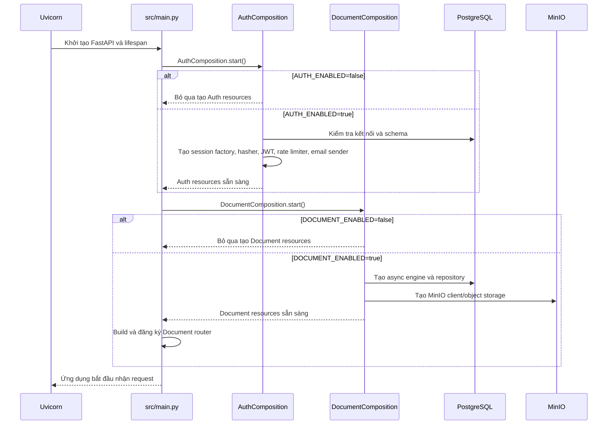
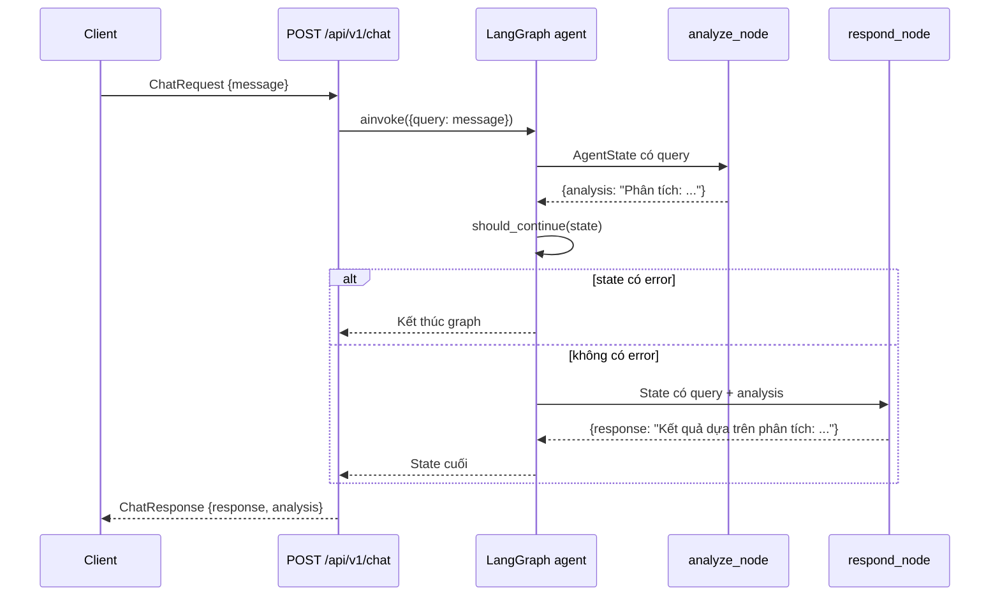
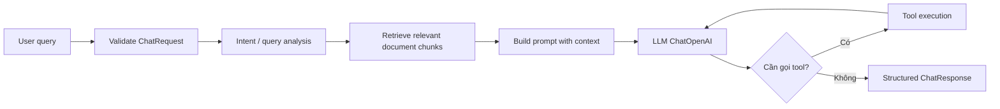
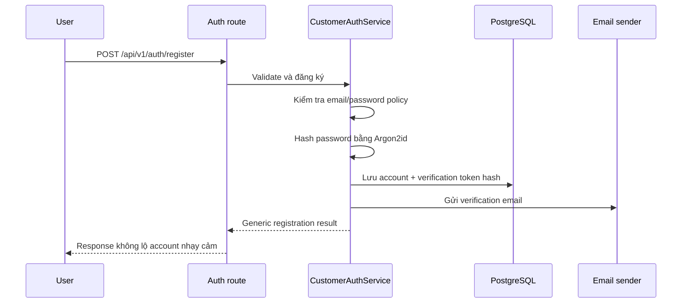
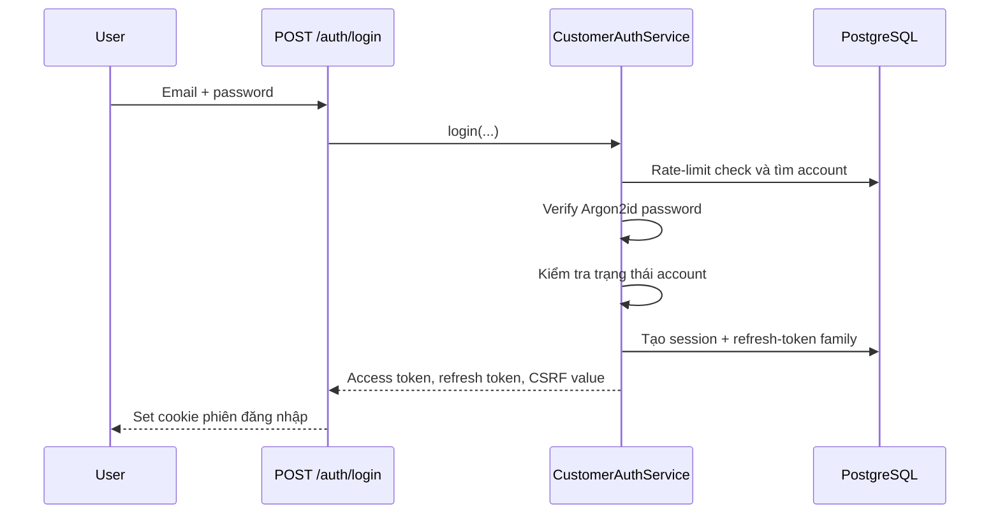
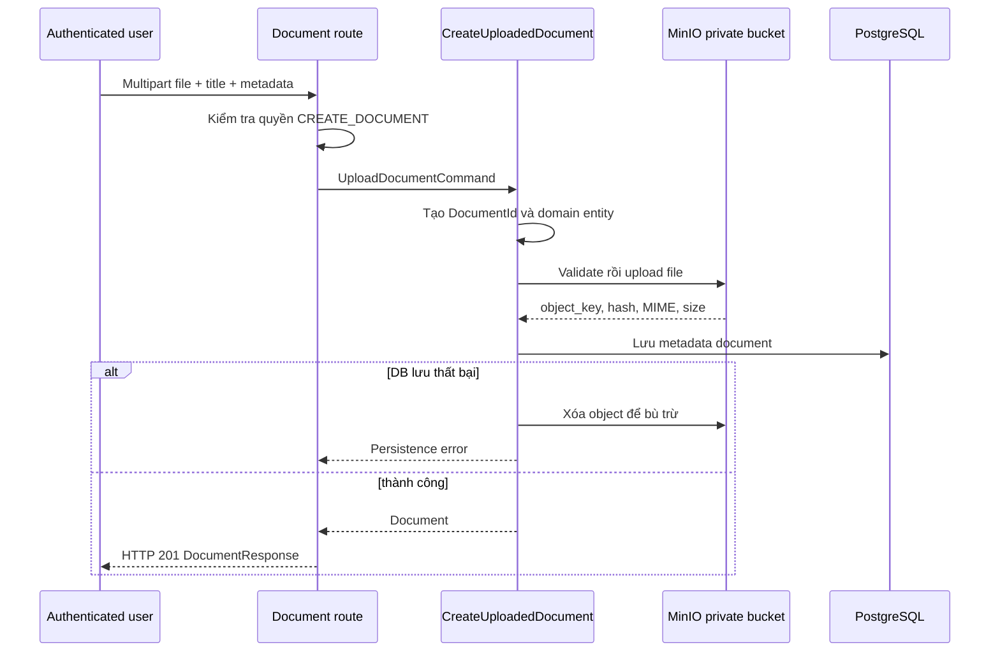

# Tổng quan kiến trúc và luồng hoạt động dự án P-150

Tài liệu này mô tả sơ bộ cách các thành phần của dự án P-150 phối hợp với nhau. Mục tiêu là giúp thành viên mới hiểu request đi vào đâu, dữ liệu được xử lý ở lớp nào, Auth và Document dùng hạ tầng gì, và phần AI hiện đã làm được đến đâu.

> Đây là tài liệu tổng quan. Cách cài đặt và khởi động Swagger được trình bày trong [`STARTUP_GUIDE.md`](../STARTUP_GUIDE.md).

## 1. Mục tiêu của dự án

P-150 là một backend FastAPI gồm bốn nhóm chức năng chính:

1. **API nền tảng**: health check, trạng thái agent và chat.
2. **Auth**: đăng ký, xác minh email, đăng nhập, phiên đăng nhập, đổi/quên/reset mật khẩu và quản lý staff.
3. **Document**: upload, lưu metadata, lưu file, liệt kê, xem chi tiết, download và archive.
4. **AI Agent**: tiếp nhận câu hỏi qua `/api/v1/chat`, đưa dữ liệu qua LangGraph và trả kết quả.

Auth và Document là hai module tùy chọn. Chúng chỉ được khởi tạo khi các biến `AUTH_ENABLED` và `DOCUMENT_ENABLED` được bật.

## 2. Sơ đồ tổng quan

```mermaid
flowchart LR
    U[Người dùng / Frontend / Swagger]
    API[FastAPI src/main.py]

    subgraph Legacy[API nền tảng]
        Health[GET /health]
        Status[GET /api/v1/status]
        Chat[POST /api/v1/chat]
    end

    subgraph AI[AI Agent hiện tại]
        Request[ChatRequest]
        Graph[LangGraph AgentState]
        Analyze[analyze node]
        Respond[respond node]
        Tools[Tools mẫu]
        LLM[ChatOpenAI adapter]
    end

    subgraph Auth[Auth module]
        AuthRoutes[/api/v1/auth/*]
        AuthServices[Application services]
        AuthDomain[Domain policies]
        AuthInfra[SQLAlchemy, Argon2id, JWT, SendGrid]
    end

    subgraph Doc[Document module]
        DocRoutes[/api/v1/documents/*]
        DocUseCases[Document use cases]
        DocDomain[Document domain]
        DocRepo[SQLAlchemy repository]
        ObjectStore[MinIO object storage]
    end

    PG[(PostgreSQL)]
    MinIO[(MinIO private bucket)]
    OpenAI[(OpenAI API)]
    Email[(SendGrid)]

    U --> API
    API --> Health
    API --> Status
    API --> Chat
    API --> AuthRoutes
    API --> DocRoutes

    Chat --> Request --> Graph --> Analyze --> Respond
    Tools -. chưa nối vào graph .-> Graph
    LLM -. đã có adapter nhưng chưa được node gọi .-> OpenAI

    AuthRoutes --> AuthServices --> AuthDomain
    AuthServices --> AuthInfra
    AuthInfra --> PG
    AuthInfra --> Email

    DocRoutes --> DocUseCases --> DocDomain
    DocUseCases --> DocRepo --> PG
    DocUseCases --> ObjectStore --> MinIO
```

Đường nét đứt trong phần AI biểu thị thành phần đã có trong source nhưng chưa được nối vào luồng `/chat` hiện tại.

## 3. Cấu trúc thư mục chính

```text
src/
├── main.py                    # Khởi tạo FastAPI, lifespan, middleware và routers
├── config.py                  # Cấu hình chung của ứng dụng và AI
├── api/
│   └── routes.py              # Chat và agent status
├── agents/
│   ├── graph.py               # Khai báo LangGraph
│   ├── state.py               # AgentState dùng chung giữa các node
│   ├── nodes/                 # Các bước xử lý trong graph
│   └── tools/                 # Tool mẫu cho agent
├── services/
│   └── llm.py                 # Factory tạo ChatOpenAI
├── models/
│   └── schemas.py             # ChatRequest và ChatResponse
├── auth/
│   ├── domain/                # Entity, policy, authorization và domain errors
│   ├── application/           # Use case/service và ports
│   ├── infrastructure/        # PostgreSQL, hash, JWT, email, rate limit
│   ├── presentation/          # FastAPI routes, schemas, cookie và CSRF
│   ├── composition.py         # Ghép các Auth adapter khi startup
│   └── settings.py            # AUTH_* settings
└── document/
    ├── domain/                # Document entity, values và rules
    ├── application/           # Upload/list/detail/download/archive use cases
    ├── infrastructure/        # PostgreSQL, MinIO và settings
    ├── presentation/          # FastAPI routes, dependencies và schemas
    └── composition.py         # Ghép database/storage adapter khi startup
```

## 4. Luồng khởi động ứng dụng

Entry point của ứng dụng là:

```text
src.main:app
```

Ví dụ chạy local:

```bash
uv run uvicorn src.main:app --reload --port 8000
```

### Trình tự startup



### Khi ứng dụng shutdown

FastAPI lifespan gọi theo thứ tự:

1. `DocumentComposition.shutdown()` để dispose Document database engine.
2. `AuthComposition.shutdown()` để dispose Auth database engine.
3. Uvicorn kết thúc process.

Các engine chỉ tồn tại trong vòng đời ứng dụng, không được tạo bên trong domain hoặc từng request.

## 5. Lớp HTTP và router

`src/main.py` đăng ký:

- Router nền tảng từ `src/api/routes.py` với prefix `/api/v1`.
- Auth router với prefix `/api/v1`.
- Document router động với prefix `/api/v1` khi Document được bật.
- Health endpoint trực tiếp tại `/health`.

### CORS và lỗi HTTP

Ứng dụng cho phép credentialed CORS theo danh sách origin của Auth settings. Các method chính là `GET`, `POST` và `OPTIONS`. Header `X-CSRF-Token` được cho phép để phục vụ Auth mutation dùng cookie.

Một số lỗi được map ở cấp ứng dụng:

- Validation lỗi ở Auth được thêm `Cache-Control: no-store`.
- Rate limit trả HTTP `429` và `Retry-After`.
- Auth domain error trả lỗi request tổng quát, không lộ nội bộ.
- Auth startup hoặc database error trả HTTP `503`.

## 6. Luồng API nền tảng

### 6.1. Health check

```text
GET /health
```

Luồng:

```text
Client → FastAPI health() → đọc APP_ENV → trả {status: "ok", env: ...}
```

Endpoint này xác nhận process FastAPI đang nhận request. Nó không thay thế kiểm tra sâu cho toàn bộ OpenAI, SendGrid, PostgreSQL hoặc MinIO.

### 6.2. Agent status

```text
GET /api/v1/status
```

Trả trạng thái tĩnh:

```json
{
  "status": "ready",
  "agent": "LangGraph Agent v1.0"
}
```

Đây là trạng thái router/agent ở mức đơn giản, chưa phải kiểm tra live đến OpenAI.

## 7. Luồng AI Chat hiện tại

Endpoint:

```text
POST /api/v1/chat
```

Request schema:

```json
{
  "message": "Nội dung câu hỏi"
}
```

`message` phải có từ 1 đến 5000 ký tự.

### 7.1. Trình tự xử lý



### 7.2. AgentState

`AgentState` là `TypedDict` dùng để truyền dữ liệu giữa các node:

| Field | Ý nghĩa |
|---|---|
| `query` | Câu hỏi đầu vào của người dùng. |
| `context` | Ngữ cảnh bổ sung, dành cho RAG hoặc dữ liệu tìm kiếm sau này. |
| `analysis` | Kết quả phân tích trung gian. |
| `response` | Câu trả lời cuối. |
| `error` | Lỗi dùng để điều hướng graph. |
| `metadata` | Metadata mở rộng. |

Tất cả field đều optional vì `AgentState` dùng `total=False`.

### 7.3. Graph hiện tại

Graph nằm tại `src/agents/graph.py`:

```text
START → analyze → should_continue
                    ├─ có error → END
                    └─ không lỗi → respond → END
```

- `analyze_node` hiện tạo chuỗi `Phân tích: <query>`.
- `respond_node` hiện tạo chuỗi `Kết quả dựa trên phân tích: <analysis>`.
- Nếu state có `error`, graph kết thúc sớm.

### 7.4. Trạng thái thực tế của AI

Phần AI hiện là **skeleton/mẫu khung**, chưa phải agent gọi mô hình thật:

- `src/services/llm.py` có hàm `get_llm()` để tạo `ChatOpenAI` từ settings.
- Tuy nhiên `analyze_node` và `respond_node` chưa gọi `get_llm()`.
- `search_knowledge` là tool mẫu và chỉ trả chuỗi giả lập.
- `calculate` là calculator thật, dùng Python AST và tập operator cho phép thay vì `eval`.
- Các tool chưa được bind vào model hoặc thêm thành ToolNode trong LangGraph.
- Chưa có vector database/retriever được nối vào graph.
- Document upload hiện lưu metadata/file, chưa tự động chunk, embedding hoặc index cho RAG.

Vì vậy, request `/chat` hiện không gửi dữ liệu đến OpenAI và không tìm kiếm trong các Document đã upload.

### 7.5. Luồng AI mục tiêu khi được hoàn thiện

Luồng dự kiến hợp lý cho giai đoạn sau:



Đây là luồng đề xuất, không phải hành vi đã có trong source hiện tại.

## 8. Luồng Auth

Auth tuân theo hướng Clean Architecture trong `src/auth/`:

```text
Presentation → Application → Domain
Infrastructure ─────────────→ Application ports
```

Domain và Application không phụ thuộc FastAPI, SQLAlchemy, Alembic hoặc SendGrid.

### 8.1. Thành phần Auth khi startup

Khi `AUTH_ENABLED=true`, `AuthComposition`:

1. Tạo SQLAlchemy async engine từ `AUTH_DATABASE_URL`.
2. Kiểm tra kết nối PostgreSQL bằng `SELECT 1`.
3. Kiểm tra schema/migration Auth.
4. Tạo session factory và Unit of Work.
5. Tạo Argon2id password hasher.
6. Tạo secure token factory và JWT issuer.
7. Tạo PostgreSQL rate limiter.
8. Tạo SendGrid email sender.
9. Ghép các service:
   - `CustomerAuthService`
   - `PasswordRecoveryService`
   - `StaffAuthService`

### 8.2. Luồng đăng ký



### 8.3. Luồng đăng nhập và phiên



Các mutation dùng cookie yêu cầu CSRF cookie khớp header `X-CSRF-Token`.

### 8.4. Refresh, logout và recovery

- **Refresh**: kiểm tra refresh token, rotate token, cập nhật session và phát cookie mới. Replay token cũ bị từ chối.
- **Logout**: revoke session hiện tại.
- **Logout all**: revoke mọi session của user.
- **Forgot password**: tạo reset token có hạn và gửi email với response chung cho tài khoản tồn tại/không tồn tại.
- **Reset password**: consume reset token, hash mật khẩu mới và revoke session cũ.
- **Change password**: xác thực người dùng hiện tại, đổi hash và revoke session.
- **Create staff**: chỉ Admin được tạo Advisor với temporary password.

### 8.5. Role và account state

Role chính:

- `CUSTOMER`
- `ADVISOR`
- `ADMIN`

Account state chính:

- `PENDING_VERIFICATION`
- `TEMPORARY_PASSWORD`
- `ACTIVE`
- `DISABLED`

Authorization áp dụng default-deny: hành động phải được role/policy cho phép rõ ràng.

## 9. Luồng Document

Document cũng tách theo Clean Architecture:

```text
Presentation → Application → Domain
Infrastructure ─────────────→ Application ports
```

Metadata được lưu trong PostgreSQL. Nội dung file được lưu trong private MinIO bucket.

### 9.1. Router và use case

| HTTP | Use case | Hạ tầng chính |
|---|---|---|
| `POST /api/v1/documents` | `CreateUploadedDocument` | PostgreSQL + MinIO |
| `GET /api/v1/documents` | `ListDocuments` | PostgreSQL |
| `GET /api/v1/documents/{id}` | `DetailDocument` | PostgreSQL |
| `GET /api/v1/documents/{id}/download` | `DownloadDocument` | PostgreSQL + MinIO |
| `POST /api/v1/documents/{id}/archive` | `ArchiveDocument` | PostgreSQL |

Document routes chỉ được đăng ký khi `DOCUMENT_ENABLED=true` và composition đã tạo resources thành công.

### 9.2. Luồng upload



### 9.3. Quy tắc file

Document hiện chấp nhận:

- PDF: `.pdf`
- Word: `.docx`
- Text: `.txt`
- CSV: `.csv`

Giới hạn upload là 25 MiB. MIME type phải khớp extension. Dữ liệu được đọc theo chunk, tính SHA-256 và upload vào MinIO. Bucket bắt buộc private.

### 9.4. Luồng download

```text
User đã đăng nhập
→ kiểm tra READ_DOCUMENT
→ tìm Document metadata trong PostgreSQL
→ kiểm tra document tồn tại và chưa bị archive
→ yêu cầu MinIO tạo presigned GET URL
→ trả URL tạm thời cho client
```

Presigned URL hết hạn sau 60 giây. Backend không chuyển toàn bộ file qua FastAPI trong luồng này.

### 9.5. Luồng archive

Archive là soft-delete theo domain:

```text
POST /documents/{id}/archive
→ kiểm tra ARCHIVE_DOCUMENT
→ ghi archived_at + archived_by
→ không xóa object MinIO ngay
→ document đã archive không còn được trả như document đang hoạt động
```

## 10. Quan hệ giữa Auth và Document

Document không tự xác thực người dùng. Presentation layer lấy principal từ Auth dependency, sau đó kiểm tra action:

```text
Cookie/JWT Auth
→ resolve principal (actor_id + role)
→ require_document_action(principal, Action.*)
→ chạy Document use case
```

Các action chính:

- `CREATE_DOCUMENT`
- `READ_DOCUMENT`
- `ARCHIVE_DOCUMENT`

Điều này giữ authorization policy ở Auth domain nhưng không làm Document infrastructure phụ thuộc FastAPI hoặc chi tiết cookie.

## 11. Database và migration

Auth và Document có migration history riêng:

| Module | Alembic config | Version table |
|---|---|---|
| Auth | `alembic-auth.ini` | Auth-owned Alembic metadata |
| Document | `alembic-document.ini` | `document_alembic_version` |

Luồng đúng:

```text
Cấu hình database URL
→ chạy migration module tương ứng
→ bật feature flag
→ khởi động ứng dụng
→ composition kiểm tra/tạo adapter
```

Ứng dụng không dùng runtime table creation làm migration path chính.

## 12. Hạ tầng local

Docker Compose cung cấp:

| Service | Vai trò |
|---|---|
| `backend` | FastAPI/Uvicorn tại cổng 8000. |
| `postgres` | PostgreSQL 16 cho Auth và Document metadata. |
| `minio` | Object storage cho file Document tại cổng 9000/9001. |
| `pgadmin` | UI quản trị PostgreSQL tại cổng 5050. |

Dữ liệu PostgreSQL, MinIO và pgAdmin nằm trong named volume nên còn tồn tại sau khi container dừng bình thường.

## 13. Các feature flag quan trọng

| Biến | Ảnh hưởng |
|---|---|
| `AUTH_ENABLED` | Bật Auth resources và hành vi Auth. |
| `DOCUMENT_ENABLED` | Bật Document database/storage và đăng ký Document routes. |
| `AUTH_DATABASE_URL` | PostgreSQL async URL của Auth. |
| `DOCUMENT_DATABASE_URL` | PostgreSQL async URL của Document. |
| `DOCUMENT_MINIO_ENDPOINT` | Endpoint MinIO. |
| `DOCUMENT_BUCKET_NAME` | Private bucket lưu file. |
| `OPENAI_API_KEY` | Credential cho `ChatOpenAI`, chỉ có tác dụng khi node thật sự gọi adapter. |
| `APP_ENV` | Môi trường chạy, ảnh hưởng validation bảo mật. |

Khi Auth hoặc Document bị tắt, composition tương ứng là no-op để các endpoint cũ tiếp tục hoạt động.

## 14. Luồng end-to-end điển hình

Một hành trình đầy đủ của người dùng có thể là:

1. Backend khởi động, Auth và Document composition kết nối hạ tầng.
2. Admin được bootstrap bằng CLI.
3. Customer đăng ký và xác minh email.
4. Customer đăng nhập, nhận access/refresh/CSRF cookie.
5. User có quyền upload Document.
6. Metadata đi vào PostgreSQL, file đi vào MinIO.
7. User list/detail/download Document qua API.
8. User gửi câu hỏi tới `/api/v1/chat`.
9. LangGraph hiện chạy `analyze → respond` bằng logic mẫu.
10. Trong phiên bản AI hoàn thiện sau này, graph sẽ retrieve nội dung liên quan từ Document index, gọi LLM và trả câu trả lời có context.

Bước 10 chưa được triển khai trong code hiện tại.

## 15. Ranh giới và phần chưa triển khai

### Đã có

- FastAPI application và Swagger/OpenAPI.
- LangGraph state/graph cơ bản.
- Chat request validation.
- Calculator tool an toàn.
- Auth MVP với PostgreSQL, JWT, cookie, CSRF, role, session và recovery.
- Document metadata trong PostgreSQL.
- Private file storage trong MinIO.
- Upload/list/detail/download/archive Document.
- Migration riêng cho Auth và Document.

### Chưa nối hoặc chưa có

- Node AI gọi `ChatOpenAI` thật.
- Tool-calling loop trong LangGraph.
- Chunking Document cho RAG.
- Embedding generation.
- Vector database/retriever.
- Liên kết Document upload với knowledge search.
- Citation/source trong ChatResponse.
- Conversation memory/checkpointer dài hạn.
- Streaming chat response.
- Production-grade observability cho AI token, latency và cost.

## 16. Những file nên đọc tiếp

| Muốn hiểu | File bắt đầu |
|---|---|
| FastAPI startup | `src/main.py` |
| Chat API | `src/api/routes.py` |
| LangGraph | `src/agents/graph.py` |
| Agent state | `src/agents/state.py` |
| AI nodes hiện tại | `src/agents/nodes/example_node.py` |
| Agent tools | `src/agents/tools/example_tool.py` |
| OpenAI adapter | `src/services/llm.py` |
| Auth composition | `src/auth/composition.py` |
| Auth HTTP | `src/auth/presentation/` |
| Document composition | `src/document/composition.py` |
| Document HTTP | `src/document/presentation/routes.py` |
| MinIO adapter | `src/document/infrastructure/minio_storage.py` |
| Hướng dẫn chạy | `STARTUP_GUIDE.md` |

## 17. Tóm tắt ngắn

```text
Client
→ FastAPI
   ├→ Health / Status
   ├→ Chat → LangGraph analyze → respond
   ├→ Auth → services/domain → PostgreSQL + JWT/Argon2/SendGrid
   └→ Document → use cases/domain → PostgreSQL metadata + MinIO file
```

Phần Auth và Document đã có luồng nghiệp vụ/hạ tầng rõ ràng. Phần AI hiện mới là khung LangGraph mẫu: adapter OpenAI và tools đã xuất hiện trong codebase nhưng chưa tham gia vào request `/chat`. Đây là ranh giới quan trọng nhất khi đọc hoặc tiếp tục phát triển dự án.
