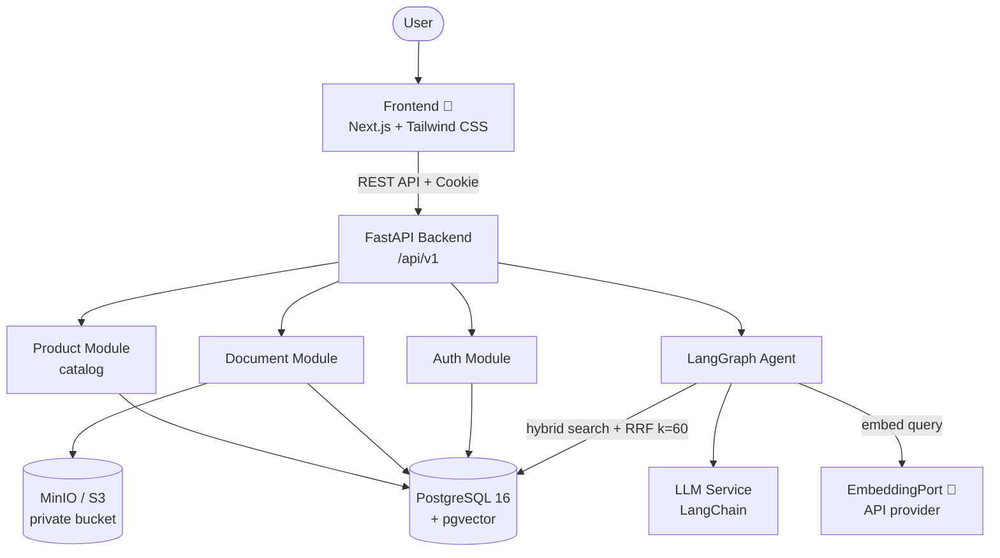

# Architecture Diagram

> Stack đã chốt cho P-150. Chi tiết kiến trúc, bảo mật và deploy: [`ARCHITECTURE.md`](../ARCHITECTURE.md).
> Phần đánh dấu 🎯 là stack mục tiêu đã chốt nhưng **chưa có trong code** (frontend Next.js, adapter embedding).
>
> Chữ "graph" ở đây là **LangGraph** — đồ thị các *bước xử lý* (state machine), **không phải GraphRAG**
> (RAG trên đồ thị tri thức: entity, quan hệ, traversal — dự án không có bước nào như vậy).
> Xem mục 6.8 [`vinfast-agent-mvp.md`](vinfast-agent-mvp.md).

## System Overview

## Agent Flow

19 node của `graph.py` (A4-2, A7-4, Todo 7, Todo 8). Thứ tự cố định trong code — LLM không tự chọn đường đi.

```mermaid
graph LR
    START((Start)) --> CG[confidence_gate]
    CG -->|chưa đủ tin cậy| ENDX((End))
    CG -->|đủ tin cậy| ES[extract_slots]
    ES --> SEG[semantic_escalation_gate]
    SEG -->|semantic handoff| ENDQ
    SEG -->|continue| CS[classify_scope]
    CS -->|ngoài phạm vi| ENDQ((End))
    CS -->|trong phạm vi| GRN[grounded_reaction]
    GRN -->|đã xác nhận| ENDQ
    GRN -->|continue| DB[detect_bottleneck]
    DB --> RI[route_intent]
    RI --> QG[quote_gate]
    QG -->|báo giá rủi ro| EQ
    QG -->|không rủi ro| AOR[ask_or_retrieve]
    AOR -->|còn slot bắt buộc thiếu| ENDQ((End))
    AOR -->|giá niêm yết deterministic| ENDQ
    AOR -->|đủ slot| L1[layer1]
    L1 -->|rỗng, tối đa 2 lần| RX[relax]
    RX --> L1
    L1 -->|quá nhiều candidate| NW[narrow]
    NW --> ENDQ
    L1 -->|1-5 candidate| L2[layer2]
    L2 --> SC[score]
    SC --> TC[tco]
    TC --> SY[synthesize]
    SY --> GR[guardrail]
    GR -->|đạt| DQG[draft_quote_gate]
    GR -->|sai, tối đa 2 lần| SY
    GR -->|sai 3 lần| ENDQ
    DQG -->|bản nháp LLM, luôn chặn| EQ[enqueue_hitl]
    EQ --> ENDQ
```

**Cổng rủi ro báo giá (A7-4).** `quote_gate` và `draft_quote_gate` thay chính sách cũ
"cứ chạm database là chờ người duyệt". Một lượt chỉ bị chặn khi báo giá gửi khách mang
cá nhân hoá, thương lượng, ưu đãi ngoài chính sách chuẩn, cam kết tài chính, hoặc
confidence dưới ngưỡng (`CONFIDENCE_THRESHOLD`, mặc định 0.85). Quyết định là rule-based
và **default-deny**: mọi field không xác định được đều tính là rủi ro. Tra thông số kỹ
thuật/tồn kho/so sánh xe không phải báo giá nên không đi qua chính sách này. Mọi quyết
định — kể cả auto-approve — ghi `quote_audit_log` bất đồng bộ kèm kết quả luồng cũ, để
đo tỷ lệ giảm số lần cần người duyệt (KPI A9).

Truy xuất **hai lớp**, không phải ba: Lớp 1 là SQL hard filter theo nhu cầu; Lớp 2 là
"Need & Feature Retriever" với 5 nhánh 2a–2e ẩn bên trong adapter. Không có node
`layer3` — nhánh đọc tài liệu (2e) nằm *bên trong* `layer2`, sau `FeatureRetrievalPort`.

## Component Details

| Component | Technology | Purpose | Trạng thái |
|-----------|-----------|---------|:---:|
| Frontend | Next.js + Tailwind CSS | Giao diện chat & quản lý tài liệu | 🎯 |
| Backend | FastAPI + Uvicorn | API server, prefix `/api/v1` | ✅ |
| Agent | LangGraph + LangChain | Agentic RAG orchestrated workflow, 19 node | ✅ |
| Database | PostgreSQL 16 | Dữ liệu nghiệp vụ (Auth, Document, Product, Agent) | ✅ |
| Vector Store | pgvector (trong PostgreSQL) | Hybrid search dense + full-text, hợp nhất RRF | ✅ |
| Embedding | API provider sau `EmbeddingPort` | Vector hoá câu hỏi và chunk tài liệu | 🎯 adapter |
| Reranking | **ngoài phạm vi MVP** | PRD 6.2 xếp vào tối ưu retrieval quy mô lớn | ⛔ |
| Object storage | MinIO / S3 | Lưu file gốc, bucket private | ✅ |
| Deploy | Vercel (FE) + Render/Railway (BE) | Hosting | 🎯 |
