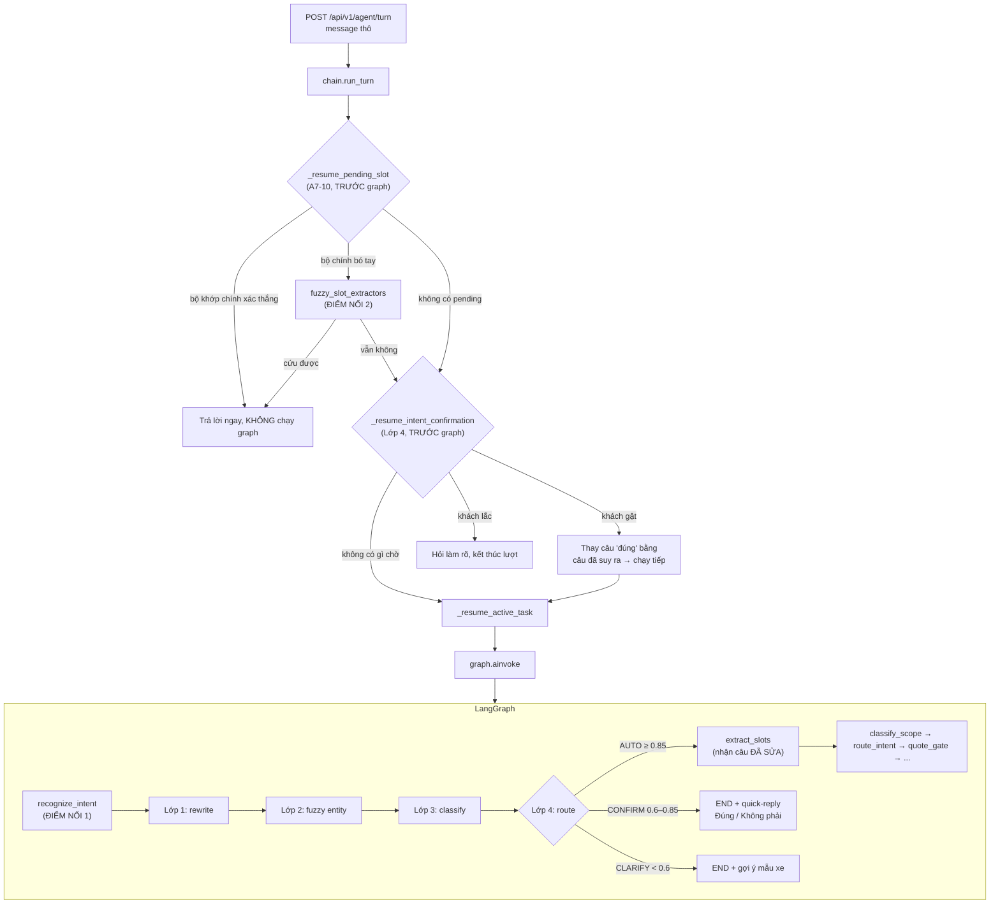

# Nhận diện Intent 4 lớp — Tổng quan

> Triển khai theo `docs/plan_intent_recognition.md`. Tài liệu này mô tả **thứ đã
> được code**, không phải kế hoạch. Chỗ nào lệch với plan đều được ghi rõ ở mục
> "Sai khác so với plan" cuối file.

## 1. Vấn đề đang giải

Bộ phân loại intent cũ đưa câu THÔ của khách thẳng vào một lần gọi LLM function
calling (`extract_slots`). Câu bị gõ tắt, gõ sai, thiếu dấu hoặc viết rời rạc thì
lần gọi đó đoán sai, và không có lớp nào đứng giữa để sửa.

Ca mẫu: **`"tho ti x vf năm"`** = "thông tin xe VF 5".

## 2. Kiến trúc bốn lớp

| Lớp | Trách nhiệm | Có gọi LLM? | Module |
|---|---|---|---|
| 1 | Sửa lỗi chính tả/viết tắt/thiếu dấu, phạm vi bó chặt | Có — **nhưng chỉ khi câu thật sự nhiễu** | `services/rewrite.py`, `domain/rewrite.py` |
| 2 | Khớp mờ câu gốc VÀ câu rewrite với danh mục thực thể tĩnh | Không | `domain/fuzzy_match.py`, `domain/entity_catalog.py` |
| 3 | Phân loại ý định có căn cứ trên entity đã trích | Không | `domain/nlu_confidence.py` |
| 4 | Định tuyến theo confidence (tự động / xác nhận / hỏi làm rõ) | Không | `domain/nlu_confidence.py` |

Chỉ Lớp 1 gọi LLM. Ba lớp còn lại là rule-based thuần và test được mà không cần
mạng — cùng nguyên tắc với `domain/quote_risk.py` của A7-4: *"một quyết định an
toàn không được phụ thuộc vào thứ có thể bịa"*.

## 3. Sơ đồ luồng dữ liệu

**Hai điểm nối, không phải một.** Đây là phát hiện quan trọng nhất của bước
khảo sát: `chain._resume_pending_slot` chạy **trước** `graph.ainvoke` và kết
thúc lượt ngay khi giải được, nên node `recognize_intent` **không bao giờ** nhìn
thấy một lượt đang trả lời câu hỏi slot. Chỉ cắm bốn lớp vào graph thì tính năng
"ưu tiên diễn giải theo slot đang chờ" sẽ không bao giờ chạy.

## 4. Lý do thiết kế — bảy quyết định

### 4.1 Node đặt TRƯỚC `extract_slots` và TRƯỚC `classify_scope`

`extract_slots` gọi LLM bằng chính câu của khách, nên câu phải sạch trước khi
tới đó. Đặt sau thì sửa xong không ai dùng. Đặt trước `classify_scope` nữa để
một câu gõ hỏng nặng không bị gắn `OUT_OF_SCOPE` chỉ vì trông vô nghĩa.

### 4.2 Câu gốc KHÔNG BAO GIỜ bị ghi đè

`state["user_message"]` giữ nguyên đến hết lượt. Bản rewrite chảy vào **đúng
một chỗ**: `nodes/extract_slots._message_for_extraction`. Guardrail (A6-1),
audit báo giá (A7-4) và bộ nhớ hội thoại đều phải trích dẫn được đúng chữ khách
đã viết.

### 4.3 Lớp 1 không được phá ngân sách LLM-call của A4-2

`docs/vinfast-agent-mvp.md` §A4-2 chốt "lượt hỏi slot ≤ 1 lần gọi LLM" và có
test spy canh con số đó. Bước này nằm trước `extract_slots`, nên gọi mô hình ở
mọi lượt sẽ đội **mọi** lượt lên gấp đôi.

Giải pháp: `domain/rewrite.rewrite_trigger` — cổng rule-based rẻ, chỉ cho câu
thật sự nhiễu đi tiếp. Câu sạch tốn **0** lần gọi thêm.

### 4.4 Lớp 1 không được là điểm chết duy nhất

`domain/entity_catalog` sinh alias số-đếm tiếng Việt (`"vf năm"` → `VF 5`), nên
Lớp 2 nhận ra xe **kể cả khi Lớp 1 bị tắt, lỗi, hoặc trả kết quả không dùng
được**. Một sự cố LLM không kéo sập khả năng nhận diện.

### 4.5 `intent_hint` là GỢI Ý, không phải nhãn cuối cùng

Nguồn sự thật duy nhất của `state["intents"]` vẫn là
`domain/intent_reconciliation.reconcile_intents`. Hai bộ cùng ghi một field là
cách chắc chắn nhất để chúng lệch nhau âm thầm ở câu lai (A4-6).

### 4.6 Hai nhánh hỏi lại CHỈ kích hoạt cho input thật sự nhiễu

Bốn lớp này sinh ra để cứu input **bị nhiễu**. Một câu sạch không khớp entity
nào không phải câu gõ hỏng — nó chỉ là câu mà bảng keyword tĩnh không phủ
("chào em", "tôi muốn mua xe"). Những câu đó đã có `classify_scope` (nhãn
`SOCIAL`) và `extract_slots` xử lý bằng LLM, tốt hơn hẳn.

Bỏ guard này thì **câu chào đầu tiên của mọi cuộc hội thoại** nhận về "em chưa
nắm rõ ý anh/chị" — hồi quy nặng hơn hẳn vấn đề đang đi sửa.

### 4.7 Hai cơ chế confidence KHÔNG dùng chung không gian số

| | Đo cái gì | Ngưỡng | Nơi định nghĩa |
|---|---|---|---|
| `nlu_confidence` | Độ chắc chắn **hiểu đúng ý khách** | 0.85 / 0.60 | `domain/nlu_confidence.py` |
| `quote_risk.CONFIDENCE_THRESHOLD` | Độ tin cậy **dữ liệu của một báo giá** | 0.85 | `domain/quote_risk.py` |

Trùng con số 0.85 là ngẫu nhiên. Hai field riêng, hai module riêng, không đường
nào đọc chéo. Node `recognize_intent` **không bao giờ** ghi `awaiting_review`
hay `terminal_reason` — hai field đó đã có nghĩa riêng ở A7-4 và A6-1.

## 5. Tương thích ngược — bốn lối tắt bắt buộc đi thẳng

`domain/nlu_confidence.route_confidence` trả `AUTO` ngay, không xét ngưỡng, khi:

1. **`handoff_active`** — phiên đang chờ người (`PENDING_HANDOFF`). Khách vừa
   được báo "đã chuyển tư vấn viên" mà lại nhận "ý anh/chị là gì ạ?" thì hai câu
   phủ định nhau.
2. **`slot_flow_active`** — phiên đang giữa cuộc tư vấn. Bot hỏi ngân sách,
   khách đáp "700 triệu": câu đó không khớp entity nào nhưng hoàn toàn rõ ràng.
3. **`resolved_via_pending_slot`** — đang trả lời một câu hỏi slot cụ thể.
4. **`not input_looks_noisy`** — câu sạch (mục 4.6).

Cộng thêm `routing_enabled=False` (shadow-mode): bốn lớp vẫn chạy và vẫn ghi log
đầy đủ, nhưng tier luôn `AUTO` nên hành vi hệ thống **y hệt** trước khi có tính
năng này. Đây là nút lùi một bước, cùng khuôn với
`QuoteGateConfig.shadow_mode_enabled` của A7-4.

## 6. Sai khác so với `plan_intent_recognition.md`

| Plan nói | Thực tế đã code | Vì sao |
|---|---|---|
| Ngưỡng 0.75 / 0.45 | **0.85 / 0.60** | Prompt triển khai chỉ định rõ hai số này. |
| Guard "đổi > 40% token → huỷ" | **Đếm token BỊA, không phải token ĐỔI** | Guard theo plan **từ chối chính ca mẫu**: `"tho ti x vf năm"` → `"thông tin xe VF 5"` đổi 4/5 token = 80%. Phát hiện bằng test, xem `01_layer1_rewrite.md` §4. |
| `nlu_pipeline` chỉ cần node graph | Thêm **điểm nối thứ hai** vào `PendingSlotServiceImpl` | Rủi ro #5 trong plan đã thành hiện thực — xem mục 3. |
| Không nêu | Thêm guard **`input_looks_noisy`** | Không có nó thì "chào em" bị CLARIFY cướp lượt (mục 4.6). |
| Không nêu | Thêm guard **`slot_flow_active`** | Không có nó thì "700 triệu" bị CLARIFY cướp lượt. |
| Lớp 2 chỉ ngưỡng phần trăm | Thêm luật **token ngắn phải khớp tuyệt đối** | "cac xe" khớp mờ "can xe" ở 83 điểm — xem `02_layer2_entity_matching.md` §4. |

## 7. Đọc tiếp

| File | Nội dung |
|---|---|
| `01_layer1_rewrite.md` | Prompt, schema, guard, ví dụ thật |
| `02_layer2_entity_matching.md` | Danh mục, thuật toán, ngưỡng, ví dụ thật |
| `03_layer3_intent_classifier.md` | Công thức điểm, tương thích pending-slot |
| `04_layer4_confidence_routing.md` | Bảng ngưỡng, ba nhánh, `PENDING_HANDOFF` |
| `05_files_changed.md` | Toàn bộ file tạo mới / đã sửa |
| `06_assumptions_and_risks.md` | Mọi `[GIẢ ĐỊNH]` và rủi ro còn tồn đọng |
| `07_testing.md` | Test case, cách chạy, kết quả thật |
| `08_preexisting_failures.md` | 11 lỗi test CÓ SẴN: truy nguyên và xử lý |
