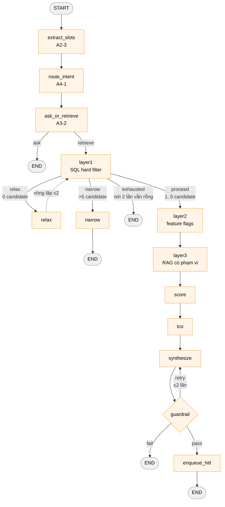
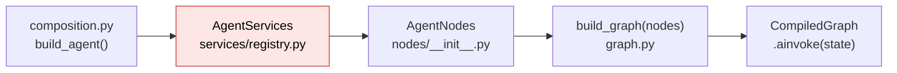

# Kiến trúc Agent — bản đồ để vibe coding

> Đọc file này thay vì đọc lại `src/agents/` từng dòng. Trạng thái tại commit `a546874` (2026-08-06).
> Nguồn kế hoạch gốc: [vinfast-agent-mvp.md](vinfast-agent-mvp.md) mục 6. File này mô tả **cái đang có trong code**, không phải cái plan hứa.

---

## 0. TL;DR — 6 dòng

| | |
|---|---|
| **Pattern** | State machine tường minh bằng LangGraph `StateGraph` — **không** phải ReAct, không phải chain, LLM **không** tự chọn tool |
| **State** | `AgentState` = `TypedDict(total=False)` tại [state.py](../src/agents/state.py) — 15 field phẳng, không reducer |
| **Node** | 13 class callable trong [nodes/](../src/agents/nodes/), mỗi class `async __call__(state) -> dict` (chỉ trả **phần** state cần ghi đè) |
| **Routing** | 3 hàm thuần trong [routing.py](../src/agents/routing.py), đọc state → trả `str` tên nhánh |
| **Lắp ráp** | [graph.py](../src/agents/graph.py) `build_graph(nodes)` — chỉ `add_node`/`add_edge`, không nghiệp vụ |
| **DI** | [composition.py](../src/agents/composition.py) `build_agent()` → `AgentNodes(AgentServices())` → `build_graph()` |

**Trạng thái thi công: toàn bộ 13 node đang là STUB.** Graph compile được, chạy được, test xanh — nhưng chưa node nào gọi LLM hay DB thật. `AgentServices` là dataclass rỗng. Đây là *khung* đúng chuẩn, chờ A1–A7 điền ruột.

---

## 1. Sơ đồ luồng



**4 đường ra END** — mỗi đường là một loại kết thúc lượt khác nhau:

| Đường ra | Ý nghĩa | State khi ra |
|---|---|---|
| `ask` | Lượt chỉ hỏi slot, chưa truy xuất | `pending_question` có, không có `answer` |
| `narrow` | Quá nhiều xe → hỏi thêm 1 slot lọc mạnh | `pending_question` có |
| `exhausted` | Nới 2 lần vẫn 0 xe → chuyển tư vấn viên | *(bản thật sẽ set `terminal_reason`)* |
| `fail` | Guardrail sai quá 2 lần → FAILED, không gì rời hệ thống | *(bản thật set `terminal_reason`)* |
| `enqueue_hitl` | Đường thành công duy nhất — vào hàng đợi người duyệt | `answer` có |

> **Nguyên tắc sống còn:** không có đường nào trả thẳng nội dung cho khách. Đường "pass" đi vào `review_queue`, người duyệt mới gửi.

---

## 2. Bảng 13 node

Tất cả nằm ở [src/agents/nodes/](../src/agents/nodes/), mỗi file 1 class ~22 dòng.

| # | Node | File | Đọc từ state | Ghi vào state | Bản thật sẽ gọi | Stub hiện tại |
|---|---|---|---|---|---|---|
| 1 | `extract_slots` | [extract_slots.py](../src/agents/nodes/extract_slots.py) | `user_message` | `slots`, `intents` | `services.slot_extraction` — **LLM function calling, 1 lần gọi** | `{}` + `["ADVISORY"]` |
| 2 | `route_intent` | [route_intent.py](../src/agents/nodes/route_intent.py) | `intents` | *(chuẩn hoá)* | không LLM — chỉ đọc state | pass-through `{}` |
| 3 | `ask_or_retrieve` | [ask_or_retrieve.py](../src/agents/nodes/ask_or_retrieve.py) | `slots` | `pending_question`, `do_retrieve` | `services.slot_planning.next_question` | `do_retrieve=True` |
| 4 | `layer1` | [layer1.py](../src/agents/nodes/layer1.py) | `slots`, `intents` | `candidates` | `services.retrieval` — **SQL builder trong code, LLM không viết SQL** | 1 candidate giả |
| 5 | `relax` | [relax.py](../src/agents/nodes/relax.py) | `relax_count` | `relax_count += 1` | `services.candidate_tuning.relax` | tăng counter |
| 6 | `narrow` | [narrow.py](../src/agents/nodes/narrow.py) | `candidates` | `pending_question` | `services.candidate_tuning.narrow` | câu hỏi giả |
| 7 | `layer2` | [layer2.py](../src/agents/nodes/layer2.py) | `candidates` | `candidates` | `services.retrieval` — lọc `vehicle_feature_flags` (chỉ APPROVED) | pass-through |
| 8 | `layer3` | [layer3.py](../src/agents/nodes/layer3.py) | `candidates` | `candidates` | `services.retrieval` — **RAG hybrid dense + FTS, hợp nhất RRF** | pass-through |
| 9 | `score` | [score.py](../src/agents/nodes/score.py) | `candidates` | `recommendations` | `services.recommendation` — đọc từ `run_snapshots` | `[]` |
| 10 | `tco` | [tco.py](../src/agents/nodes/tco.py) | `recommendations` | `tco` | `services.tco_estimation` → tool `vinfast_tco_v1` (Decimal, 60 tháng) | `None` |
| 11 | `synthesize` | [synthesize.py](../src/agents/nodes/synthesize.py) | `recommendations`, `tco` | `draft_answer` | `services.synthesis` — **LLM sinh placeholder, không gõ chữ số** | `"STUB draft"` |
| 12 | `guardrail` | [guardrail.py](../src/agents/nodes/guardrail.py) | `draft_answer` | `guardrail_ok`, `guardrail_retries` | `services.verification` — đối chiếu mọi số với snapshot | luôn `True` |
| 13 | `enqueue_hitl` | [enqueue_hitl.py](../src/agents/nodes/enqueue_hitl.py) | `draft_answer` | `answer` | ghi `review_queue` qua UnitOfWork | `"STUB: ..."` |

**LLM chỉ xuất hiện ở 3 node:** `extract_slots`, `synthesize`, và (theo plan) `scope_classifier`. Mọi truy xuất dữ liệu là SQL deterministic. Đây là chủ ý — không cho LLM tự chọn tool.

---

## 3. Routing — 3 hàm quyết định

[routing.py](../src/agents/routing.py) — hàm thuần, dễ test nhất repo, sửa ngưỡng ở đây là xong.

```python
MAX_RELAX = 2              # Lớp 1 rỗng → nới tối đa 2 lần
TOO_MANY_CANDIDATES = 5    # quá ngưỡng → hỏi thêm 1 slot
MAX_GUARDRAIL_RETRIES = 2  # sai quá 2 lần → FAILED
```

| Hàm | Sau node | Trả về | Điều kiện |
|---|---|---|---|
| `route_after_ask_or_retrieve` | `ask_or_retrieve` | `"retrieve"` \| `"ask"` | `state["do_retrieve"]` truthy → retrieve |
| `route_after_layer1` | `layer1` | `"relax"` \| `"exhausted"` \| `"narrow"` \| `"proceed"` | rỗng & `relax_count < 2` → relax; rỗng & hết lượt → exhausted; `> 5` → narrow; còn lại → proceed |
| `route_after_guardrail` | `guardrail` | `"pass"` \| `"retry"` \| `"fail"` | `guardrail_ok` → pass; `retries < 2` → retry; hết → fail |
| `is_terminal` | *(chưa nối vào graph)* | `"end"` \| `"continue"` | `terminal_reason` khác rỗng |

> ⚠️ `is_terminal` đã viết nhưng **chưa hàm nào trong `graph.py` gọi**. Nếu bạn muốn chốt kết thúc tại một chỗ (mục 6.6 của plan), đây là chỗ nối vào.

**Vòng lặp duy nhất trong graph:** `layer1 → relax → layer1`, chặn bởi `relax_count` (node `relax` tự tăng, routing tự đọc). Vòng thứ hai `synthesize → guardrail → synthesize` chặn bởi `guardrail_retries` — **nhưng stub `guardrail` chưa tăng counter nào**, nên bản thật phải nhớ ghi `guardrail_retries` khi fail, nếu không sẽ lặp vô hạn.

---

## 4. State — dữ liệu chảy thế nào

[state.py](../src/agents/state.py) — `TypedDict, total=False`, **mọi field optional**. Node chỉ trả `dict` chứa field nó phụ trách; LangGraph merge vào state (ghi đè, không có reducer tuỳ biến).

```
┌─ Đầu vào lượt ────────────┐
│ session_id: str           │  ← API truyền vào ainvoke()
│ user_message: str         │
├─ Hiểu ý khách ────────────┤
│ slots: dict[str, Any]     │  ← extract_slots
│ intents: list[str]        │  ← extract_slots (A4-6: câu lai có nhiều intent)
├─ Điều phối hỏi/truy xuất ─┤
│ pending_question: str|None│  ← ask_or_retrieve | narrow
│ do_retrieve: bool         │  ← ask_or_retrieve  → routing đọc
├─ Ba lớp truy xuất ────────┤
│ candidates: list[Any]     │  ← layer1/2/3       → routing đọc
│ relax_count: int          │  ← relax            → routing đọc
├─ Đề xuất ─────────────────┤
│ recommendations: list[Any]│  ← score
│ tco: dict|None            │  ← tco
│ draft_answer: str         │  ← synthesize
├─ Guardrail ───────────────┤
│ guardrail_ok: bool        │  ← guardrail        → routing đọc
│ guardrail_retries: int    │  ← guardrail        → routing đọc
├─ Kết quả ─────────────────┤
│ answer: str               │  ← enqueue_hitl
│ terminal_reason: str|None │  ← (chưa node nào ghi)
└───────────────────────────┘
```

**Luật vàng (mục 6.5b của plan):** state **chỉ** đựng domain value và DTO. **Tuyệt đối không** đựng object SQLAlchemy hay DB session. Hiện các field còn là `Any`/`dict` placeholder — A2–A6 sẽ thay bằng domain value thật.

**Không có biến toàn cục nào trong graph.** Mọi thứ đi qua `state` hoặc qua `services` được inject từ constructor. Đây là lý do test graph không cần DB, không cần LLM.

---

## 5. Dependency injection — ai dựng ai



```python
# composition.py — 13 dòng, composition root duy nhất
def build_agent(services: AgentServices | None = None):
    return build_graph(AgentNodes(services or AgentServices()))
```

- `AgentServices` ([services/registry.py](../src/agents/services/registry.py)) — `@dataclass(frozen=True)`, **hiện đang rỗng**. Sẽ chứa 12 use case nhóm advisory: `conversation`, `slot_extraction`, `slot_planning`, `intent_routing`, `retrieval`, `candidate_tuning`, `snapshotting`, `recommendation`, `tco_estimation`, `synthesis`, `verification`, `scope_classifier`.
- **Nhóm `operations` (review/booking/history/notices/analytics) KHÔNG BAO GIỜ vào graph** — chỉ route HTTP gọi thẳng. Đừng thêm chúng vào `AgentServices`.
- Mọi node nhận `services` qua `__init__`, lưu `self._services`. Test chỉ cần truyền `AgentServices` toàn fake.
- Giao ước node: [protocol.py](../src/agents/protocol.py) — `async def __call__(self, state: AgentState) -> dict`.

---

## 6. ⚠️ Hai điều phải biết trước khi sửa

### 6.1. `/chat` đang **vỡ** — app không import được

[src/api/routes.py:3](../src/api/routes.py#L3) làm:

```python
from src.agents.graph import agent   # ← symbol này KHÔNG TỒN TẠI
```

`graph.py` chỉ export `build_graph`. Symbol `agent` nằm ở `legacy_graph.py` với tên `legacy_agent`. Kết quả:

```
ImportError: cannot import name 'agent' from 'src.agents.graph'
```

→ `import src.main` fail → **toàn bộ FastAPI app không khởi động được**. Test `tests/agents/unit/test_graph_skeleton.py` vẫn xanh vì nó không đụng `src.api`.

**Sửa nhanh** (nếu chỉ muốn app chạy lại): đổi thành `from src.agents.legacy_graph import legacy_agent as agent`.
**Sửa đúng** (A4-4): xoá `/chat` legacy, dựng `src/agents/api/routes.py` với endpoint hội thoại thật.

### 6.2. Graph có 13 node nhưng plan mới nói 12

Code hiện tại theo **bản plan cũ**: ba lớp truy xuất tuần tự `layer1 → layer2 → layer3`. Bản plan hiện hành ([vinfast-agent-mvp.md](vinfast-agent-mvp.md) mục 3) đã **gộp layer2 + layer3 thành một node "Need & Feature Retriever"** với 5 nhánh ẩn bên trong (2a/2b khớp vector, 2c/2d SQL flags + need tags, 2e hybrid RRF). Lý do gộp: xe `UNKNOWN` bị kẹt vĩnh viễn ở thiết kế 3 lớp, và nhu cầu mềm ("hay đi trong phố") không khớp `feature_code` nào.

→ Nếu bạn định thi công A1, gộp trước rồi hãy viết ruột, đừng viết ruột cho `layer3` rồi phải xoá.

---

## 7. Điểm mở rộng — sửa ở đâu cho từng loại việc

| Bạn muốn... | Sửa file | Pattern |
|---|---|---|
| **Thêm node mới** | 1. Tạo `nodes/ten_node.py` (class + `async __call__`)<br/>2. Import + gán trong [nodes/\_\_init\_\_.py](../src/agents/nodes/__init__.py)<br/>3. `g.add_node(...)` + `g.add_edge(...)` trong [graph.py](../src/agents/graph.py) | Copy y hệt file node có sẵn — 22 dòng, đổi tên class + docstring + thân `__call__` |
| **Đổi ngưỡng nghiệp vụ** | [routing.py](../src/agents/routing.py) hằng đầu file | Sửa `MAX_RELAX` / `TOO_MANY_CANDIDATES` / `MAX_GUARDRAIL_RETRIES`, không đụng graph |
| **Thêm nhánh rẽ mới** | `routing.py` (thêm nhánh vào return) + `graph.py` (thêm key vào dict `add_conditional_edges`) | Hai chỗ **phải khớp key** — LangGraph không báo lỗi lúc compile nếu thiếu, chỉ nổ lúc runtime |
| **Thêm field state** | [state.py](../src/agents/state.py) | Thêm dòng vào `TypedDict`, `total=False` nên không phá node cũ. Chỉ đựng domain value/DTO |
| **Điền ruột 1 node** | Thân `__call__` của node đó + thêm use case vào [services/registry.py](../src/agents/services/registry.py) | Node **gọi ĐÚNG một service**, ≤15 câu lệnh. Logic thật nằm ở `services/`, không nằm ở node |
| **Thêm tool tính toán** | `src/agents/tools/` (hiện rỗng) | Structured tool deterministic (như `tco.py`), `Decimal`, test bằng golden vector — không LLM |
| **Thêm dependency/adapter** | [composition.py](../src/agents/composition.py) là nơi **DUY NHẤT** được dựng | Node/service không tự `new` adapter, không tự mở DB session |
| **Đổi model LLM** | [src/config.py](../src/config.py) `model_name` / [src/services/llm.py](../src/services/llm.py) | Bản thật sẽ đi qua `LLMPort` trong `agents/ports.py` (chưa có) |
| **Thêm endpoint** | `src/agents/api/` (chưa tạo) → include vào [src/api/router.py](../src/api/router.py) | Route gọi `operations/` service, **không** gọi graph cho việc CRUD |

### Luật import một chiều (có test cưỡng chế ở A0-3)

```
điều phối (graph/state/routing/nodes)  ──→  nghiệp vụ (services/)  ──→  thuần (domain/, tools/)
                                                    ↑
                                       I/O (adapters/, prompts/) implement ports.py
```

- `nodes/` **không** được import `sqlalchemy`, `adapters/`, hay `domain/`.
- `domain/` **không** được import FastAPI / SQLAlchemy / LangGraph / LLM SDK.
- `services/` biết domain + port, **không** biết LangGraph hay SQLAlchemy.

Vi phạm luật này là cách nhanh nhất phá kiến trúc — mọi thứ khác sửa lại được, cái này thì không.

---

## 8. Cái gì đã có, cái gì chưa

| | Có trong code | Chưa có (plan mục 6.0) |
|---|---|---|
| **Điều phối** | `graph.py`, `state.py`, `routing.py`, `protocol.py`, `nodes/` (13 stub) | `chain.py` (dựng initial state từ repo → invoke → DTO) |
| **Hợp đồng** | `models.py` (15 bảng SQLAlchemy ✅ đã migrate thật) | `ports.py`, `contracts.py`, `errors.py`, `settings.py` |
| **Nghiệp vụ** | `services/registry.py` (rỗng) | 12 use case advisory + `services/operations/` (5 file) |
| **Thuần** | — | toàn bộ `domain/` (11 file), `tools/tco.py` |
| **I/O** | — | toàn bộ `adapters/` (8 file), `prompts/` (4 file) |
| **HTTP** | `src/api/routes.py` (legacy, đang vỡ) | `src/agents/api/` (7 file) |
| **DB** | 6 migration `agent_0001`…`0006` đã `upgrade head` trên Postgres thật | — |

**Tóm lại:** schema xong 100%, khung graph xong 100%, ruột 0%. Đường đi từ đây là điền `services/` + `domain/` + `adapters/` rồi thay thân `__call__` của từng node.

---

## 9. Chạy thử ngay

```bash
# Test khung graph (không DB, không LLM, không mạng)
.venv/bin/pytest tests/agents/unit/test_graph_skeleton.py -v

# Gọi graph trong python
.venv/bin/python -c "
import asyncio
from src.agents.composition import build_agent
agent = build_agent()
print(asyncio.run(agent.ainvoke({'session_id':'s1','user_message':'cần xe 7 chỗ'})))
"

# Xem graph dạng mermaid (dán vào file .md để render)
.venv/bin/python -c "
from src.agents.composition import build_agent
print(build_agent().get_graph().draw_mermaid())
"
# (draw_ascii() cần thêm `uv add grandalf`, draw_mermaid() thì không)
```

> `src/main.py` **chưa chạy được** cho tới khi sửa lỗi ở mục 6.1.
