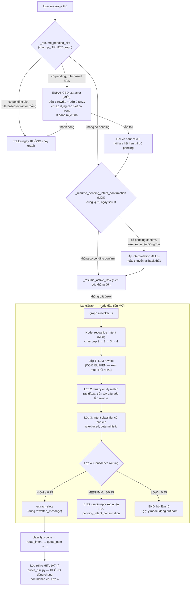

# Kế hoạch triển khai: Kiến trúc nhận diện Intent 4 lớp cho P-150

> Tài liệu PLAN — không chứa code triển khai. Mục tiêu: làm input cho một prompt
> implement one-shot ở bước sau. Mọi điểm chưa rõ trong codebase được đánh dấu
> **[GIẢ ĐỊNH]** kèm lý do, không dừng lại hỏi lại.

---

## 0. Khảo sát codebase hiện trạng (có căn cứ file:dòng)

### 0.1 Entry point nhận raw input đầu tiên từ user

Không có channel adapter (Zalo/webhook) — frontend Next.js gọi thẳng REST API nội bộ.

- `src/agents/api/routes.py:32-42` — `TurnRequest` (Pydantic): `session_id`, `client_turn_id`, `message: str`.
- `src/agents/api/routes.py:85-140` — `POST /api/v1/agent/turn` → gọi `run_turn(...)`.
- `src/agents/chain.py:66` (`run_turn`) — mở session → nạp slot → (nếu có) memory replay → **`_resume_pending_slot()`** (dòng 110) → **`_resume_active_task()`** (dòng 121) → nếu không lượt nào "bắt" được thì `graph.ainvoke(...)` (dòng 140).
- `src/agents/graph.py:64-88` — graph LangGraph: `START → extract_slots → classify_scope → route_intent → quote_gate → ...`.
  - `src/agents/nodes/extract_slots.py:11-40` — **một lần gọi LLM function-calling duy nhất**, trả cả `slots` VÀ `intents` — đây là nơi intent classification thật sự đang chạy hôm nay.
  - `src/agents/nodes/classify_scope.py:14-49` — guardrail out-of-scope, LLM-based (`services.scope_classifier`).
  - `src/agents/nodes/route_intent.py:13-25` — chỉ ĐỌC lại `intents` đã có trong state, không gọi LLM.

**Kết luận:** pipeline nhận diện ý định 4 lớp phải chèn vào **trước `extract_slots`**, tức là trước hoặc ngay đầu `graph.ainvoke`, để đúng yêu cầu "xử lý tuần tự trước khi vào multi-slot extraction".

### 0.2 `VehicleInquiryForm`

`src/agents/domain/inquiry_form.py:80-143` — Pydantic `BaseModel(frozen=True)`, là VIEW có kiểu trên `dict[SlotName, SlotValue]`, không phải kho lưu trữ riêng. Field: `vehicle_type, passenger_count, required_range_km, home_charging, budget_max_vnd, purpose, max_load_kg, habit_need_tags`. `SlotAnswer` phụ (dòng 46-61) có `kind: Literal["exact","range","open","unknown"]`.

### 0.3 Enum `VehicleAttribute`

`src/agents/domain/vehicle_overview.py:17-35` — `StrEnum`, 17 giá trị (`OVERVIEW, PRICE, SEAT_COUNT, DIMENSIONS, POWERTRAIN, RANGE, SUSPENSION, AIR_CONDITIONING, INFOTAINMENT, SAFETY, AIRBAG, SUNROOF, COLOR, INTERIOR_COLOR, SPECS, WARRANTY, UNKNOWN`). Nhận diện bằng bảng từ khoá `FIELD_KEYWORDS` (dòng 59-145), rule-based, khớp thứ tự ưu tiên. **Không có field "pin" riêng** — gộp vào `WARRANTY`/`POWERTRAIN`.

### 0.4 Danh mục xe VinFast

Nguồn thật lúc runtime là DB (`src/products/infrastructure/models.py`: `VehicleRow → "vehicles"`, `CarSpecRow`, `MotorbikeSpecRow`, `VehiclePriceRow`). CSV (`data-p150/catalog/vehicles.csv`) chỉ là seed. Model hiện có: `VF 2, VF 3, VF 5, VF 6, VF 7, VF 8, VF 9, VF Wild` + nhiều xe máy điện. **Không có `VF e34`** trong catalog hiện tại — [GIẢ ĐỊNH] đã ngừng bán/archived.

**Cơ chế khớp tên xe hiện tại — QUAN TRỌNG cho Lớp 2:**
`src/agents/adapters/catalog_reader.py:141-190` (`resolve_vehicle_names`) — so khớp **CHÍNH XÁC** trên chuỗi đã bỏ khoảng trắng (`_squash`), truy vấn SQL `IN (...)`. Comment tự nhận: *"vẫn là khớp CHÍNH XÁC, không phải khớp mờ"*. Đây chính là lỗ hổng Lớp 2 cần lấp — hiện KHÔNG có bất kỳ dung sai edit-distance nào ở tầng này.

### 0.5 Intent hiện có & intent classifier

`src/agents/domain/values.py:29-45` — `Intent` StrEnum chỉ 3 giá trị: `ADVISORY, CATALOG_LOOKUP, CATALOG_BROWSE`. Classifier là **LLM function-calling**, gộp chung một lần gọi với slot extraction (`src/agents/services/slot_extraction.py`, `SlotExtractionServiceImpl.extract`), sau đó qua bộ hoà giải rule-based `src/agents/domain/intent_reconciliation.py:73-142` (`reconcile_intents`) — thuần regex, không gọi LLM thêm.

### 0.6 Logic "pending-slot state fix" (A7-10) — **đã tồn tại, đúng thứ user mô tả**

- `src/agents/domain/pending_slot.py` — `PendingSlotRequest` (dòng 37-117): `intent`, `missing_slot`, `partial_form`, `asked_at`, `turn_count`. `PENDING_TTL = 15 phút`, `MAX_CLARIFY_TURNS = 1` (cả hai đánh dấu `[GIẢ ĐỊNH]` ngay trong code gốc).
- `src/agents/services/pending_slot.py` — `PendingSlotServiceImpl.resolve()` (dòng 56-96): rule-based, `DEFAULT_EXTRACTORS = {"province": detect_province}` — **chỉ có một extractor** cho slot `province`. Bất kỳ `missing_slot` nào khác đều không trích được gì, rơi thẳng vào nhánh "hỏi lại"/"hết hạn".
- Gọi **TRƯỚC** `graph.ainvoke`, tức trước cả `classify_scope`: `src/agents/chain.py:106-120`, hàm `_resume_pending_slot()` (dòng 282-311). Nếu `resolution.handled=True` → trả `TurnResult` luôn, **graph không chạy lượt đó**.

**Kết luận quan trọng:** vì `_resume_pending_slot` chạy và có thể bypass graph hoàn toàn trước khi graph (và do đó node Lớp 1-4 mới) kịp chạy, "tương thích ngược với pending-slot" **không thể** chỉ implement bằng cách đặt node mới ở đầu graph — phải có một điểm nối RIÊNG vào chính `PendingSlotServiceImpl` (xem mục 1 và 3).

### 0.7 Ownership state machine & HITL tiered-risk (A7)

**Không tìm thấy** state machine `AI → PENDING_HANDOFF → HUMAN → AI` đúng hình dạng — đã grep toàn `src/`, không có enum/field nào tên như vậy. Cơ chế gần nhất:
- `awaiting_review: bool` trên `TurnResult` (`src/agents/chain.py:183-206`) — cờ nhị phân, không phải state machine.
- Bảng `review_queue` (`status: PENDING|APPROVED|EDITED|REJECTED`), chiều sản xuất `src/agents/services/hitl.py`, chiều tiêu thụ `src/agents/services/operations/review.py`.
- `src/agents/nodes/enqueue_hitl.py:22-58` — 2 message khác nhau tuỳ `delivery_action`: chờ duyệt nội dung vs chuyển hẳn tư vấn viên.

**A7 tiered-risk routing thật sự nằm ở `src/agents/domain/quote_risk.py`** (534 dòng):
- `QuoteRiskTier` (dòng 52-67): `NON_QUOTE, DETERMINISTIC_AUTO, EVIDENCE_BACKED_AUTO, SYNC_HITL, ADVISOR_HANDOFF`.
- `CONFIDENCE_THRESHOLD: Final[float] = 0.85` (dòng 38) — **đây là một namespace confidence RIÊNG, cho độ tin cậy của báo giá catalog**, không liên quan gì tới confidence của việc hiểu ý định khách. Đây chính là nguy cơ xung đột user đã lường trước — xem mục 4.
- `classify_delivery()` (dòng 140-206) — rule-based thuần, có comment tường minh: *"một quyết định an toàn không được phụ thuộc vào thứ có thể bịa"*.
- Gate đặt ngay sau `route_intent`, trước `ask_or_retrieve`: `src/agents/graph.py:92-99`.
- **Lưu ý:** có HAI bộ numbering A7/A8/A9 khác nhau trong repo — (a) A7-4/A7-9/A7-10 trong code (tiered-risk quote, đã build) và (b) A7-1..A9-3 trong `docs/docs_buildagent_long/khoi4/` (review_queue/claim/approve, booking, KPI dashboard — do bạn, "Long", đã làm 8/10 task). Mục 7 dùng bộ (b) vì đó là "task khác của team".

### 0.8 Thư viện fuzzy-matching

**Không có** — đã kiểm `pyproject.toml`, không có `rapidfuzz`/`fuzzywuzzy`/`python-Levenshtein`/`jellyfish`/`thefuzz`, cũng không dùng `difflib`. → Lớp 2 cần thêm dependency mới thật sự (không trùng lặp).

### 0.9 Ràng buộc ẩn — **quan trọng nhất cho thiết kế Lớp 1**

`docs/vinfast-agent-mvp.md:547` (task A4-2) đã CHỐT và có TEST bằng spy:

> *"lượt hỏi slot ≤ 1 lần gọi LLM (`extract_slots`), lượt đề xuất đầy đủ ≤ 3 (extract + synthesize + tối đa 1 retry), để p95 ≤ 6s (PRD 8.5) là hệ quả có kiểm từ đầu"*

`docs/vinfast-agent-mvp.md:604` (A9-3) nhắc lại: *"hợp đồng số lần gọi LLM đã được chốt sớm ở A4-2"*. Test spy nằm ở `tests/agents/integration/test_graph_flow.py` (và tương tự ở `test_multi_intent.py`).

Ngoài ra, `LLMPort` (`src/agents/ports.py:57-79`) là Protocol **đóng băng** (`docs/team_split.md §2.2`: đổi chữ ký = 1 PR riêng, cả 4 người duyệt), chỉ có đúng 2 method: `extract_slots`, `synthesize`. Mẫu đã được dùng để thêm một khả năng LLM mới **mà không sửa Protocol**: `LlmScopeClassifier` (`src/agents/adapters/scope_source.py:11-21`) tái dùng `synthesize(prompt=...)` rồi tự validate chuỗi trả về ở tầng adapter.

**Hệ quả trực tiếp cho plan này:** nếu Lớp 1 (LLM rewrite) gọi LLM **vô điều kiện ở mọi lượt**, nó sẽ tự động phá vỡ ngân sách "lượt hỏi slot ≤ 1 lần gọi LLM" đã có test khoá cứng — đây là rủi ro kỹ thuật số 1 của toàn bộ plan (chi tiết mục 4 và 6).

---

## Phạm vi & giả định tổng quát

- **[GIẢ ĐỊNH]** "Danh mục từ khóa intent" ở Lớp 2 nghĩa là tái sử dụng các bảng từ khoá rule-based đã có (`FIELD_KEYWORDS` của `VehicleAttribute`, `_MOTORBIKE_KEYWORDS`/`_CAR_KEYWORDS` của `catalog_browse`, cue-pattern của `intent_reconciliation`), KHÔNG dựng một danh sách từ khoá song song mới — tránh hai nguồn sự thật lệch nhau.
- **[GIẢ ĐỊNH]** Slot `province` (dùng cho giá lăn bánh, `detect_province`) KHÔNG nằm trong 3 danh mục thực thể tĩnh mà user liệt kê (xe / `VehicleAttribute` / từ khoá intent). Vì vậy việc "ưu tiên diễn giải theo slot đang chờ" ở vòng triển khai này áp dụng đầy đủ cho các pending-slot tương lai gắn với 3 danh mục đó; với `province` chỉ cải thiện được phần rewrite chính tả (Lớp 1), KHÔNG thêm fuzzy-match tỉnh thành (out of scope, ghi chú follow-up).
- **[GIẢ ĐỊNH]** "Quick-reply" và "nút bấm gợi ý model" ở Lớp 4 chỉ cần BE trả về một danh sách `options: list[{label, value}]` có cấu trúc trong response; việc render nút bấm thật là việc của frontend (ngoài phạm vi plan này — không có tài liệu API contract hiện có cho quick-reply, cần xác nhận với FE).
- **Không đổi** `Intent` enum (3 giá trị), `VehicleAttribute` enum (17 giá trị), `VehicleInquiryForm` — plan này chỉ thêm một tầng NHẬN DIỆN phía trước, không sửa domain hiện có.

---

## 1. Sơ đồ luồng dữ liệu tổng thể

Có **hai điểm nối** vào hệ thống hiện tại, vì `_resume_pending_slot` có thể bypass graph hoàn toàn trước khi node mới kịp chạy (mục 0.6).



**Điểm mấu chốt của sơ đồ:**
1. Đường "pending slot" (A7-10 hiện có) được TĂNG CƯỜNG bằng Lớp 1+2 làm fallback extractor, không bị thay thế.
2. Đường "message mới hoàn toàn" chạy full 4 lớp ở một node graph mới, đặt TRƯỚC `extract_slots`.
3. Nhánh MEDIUM tạo ra một cơ chế "pending" thứ hai (`pending_intent_confirmation`), tách biệt hoàn toàn khỏi `pending_slot_request` (khác bảng ghi nhớ, khác semantics) để không đá nhau với A7-10.
4. `quote_gate`/HITL (A7-4) đứng SAU toàn bộ pipeline này, dùng `CONFIDENCE_THRESHOLD` của riêng nó (0.85, đo độ tin cậy DỮ LIỆU báo giá) — không đọc, không ghi field confidence của Lớp 4 (đo độ tin cậy HIỂU Ý ĐỊNH). Hai cơ chế độc lập theo thiết kế, không phải trùng hợp.

---

## 2. Danh sách file cần tạo mới / sửa

### 2.1 File tạo mới

| File | Lý do |
|---|---|
| `src/agents/domain/text_normalization.py` | Chuẩn hoá tiếng Việt thuần Python (bỏ dấu, lowercase đúng bảng Unicode, squash khoảng trắng) — dùng chung cho Lớp 1 và Lớp 2. Domain thuần (mục 6.5b), test độc lập không cần LLM/DB. |
| `src/agents/domain/entity_catalog.py` | Định nghĩa 3 "danh mục thực thể tĩnh" dạng dữ liệu thuần: alias xe (tái dùng nguồn từ `catalog_reader`, KHÔNG hard-code trùng), alias `VehicleAttribute` (từ `FIELD_KEYWORDS` có sẵn), alias từ khoá intent (từ `intent_reconciliation`/`catalog_browse` có sẵn). Đây là lớp gom-nguồn, không phải nguồn sự thật mới. |
| `src/agents/domain/fuzzy_match.py` | Lớp 2 thuần: hàm `match_entities(text, catalog) -> list[EntityMatch]` dùng `rapidfuzz`. Domain thuần theo quy ước, KHÔNG import SQLAlchemy/LangGraph. |
| `src/agents/domain/nlu_confidence.py` | Lớp 3 + phần logic thuần của Lớp 4: tính điểm confidence, chọn tier (HIGH/MEDIUM/LOW), có tham số `pending_slot_hint` để ưu tiên diễn giải theo slot đang chờ. |
| `src/agents/domain/pending_intent_confirmation.py` | Sibling của `pending_slot.py` (A7-10) nhưng cho việc XÁC NHẬN Ý ĐỊNH thay vì ĐIỀN SLOT. Tách file để không đá vào `PendingSlotRequest`/`DEFAULT_EXTRACTORS` đang hoạt động tốt. |
| `src/agents/services/rewrite.py` | Lớp 1: gọi `LLMPort.synthesize(prompt=...)` (KHÔNG mở rộng Protocol — xem mục 4 rủi ro #2), validate JSON trả về thành `RewriteResult`, áp guard "đổi >40% token thì bỏ". Có cổng điều kiện `should_attempt_rewrite(text) -> bool` để không tốn lần gọi LLM với câu sạch. |
| `src/agents/services/nlu_pipeline.py` | Điều phối Lớp 1→2→3→4 thành một use case, output `NluDecision`. Đây là service mà node graph mới gọi vào — theo đúng convention `nodes/` chỉ gọi `services/`, không tự chứa logic. |
| `src/agents/services/pending_intent_confirmation.py` | Sibling của `services/pending_slot.py`, xử lý resolve khi user trả lời quick-reply "Đúng/Không phải". |
| `src/agents/nodes/recognize_intent.py` | Node graph mới, đặt đầu tiên trước `extract_slots`. Thin wrapper gọi `services.nlu_pipeline`, đúng khuôn `ClassifyScopeNode`. |
| `src/agents/prompts/rewrite_prompts.py` | Prompt Lớp 1, theo khuôn `prompts/intent_prompts.py` — ràng buộc CHẶT "chỉ sửa chính tả/viết tắt/dấu, không suy luận thêm", kèm few-shot tiếng Việt (kể cả ví dụ "tho ti x vf năm" → "thông tin xe VF 5"). |
| `migrations/agents/versions/agent_0019_pending_intent_confirmation.py` | Thêm cột JSON `pending_intent_confirmation` vào `conversation_sessions`, cùng khuôn với `agent_0012_pending_slot_request.py` / `agent_0016_active_task_state.py`. |
| `tests/agents/unit/domain/test_fuzzy_match.py`, `test_nlu_confidence.py`, `test_text_normalization.py` | Test thuần domain, không cần DB/LLM — chạy được ngay từ Phase 1 (mục 6). |
| `tests/agents/integration/test_recognize_intent_node.py` | Test node mới + routing 3 nhánh (HIGH/MEDIUM/LOW), có spy đếm lần gọi LLM để KHÔNG phá ngân sách A4-2. |

### 2.2 File cần sửa

| File | Sửa gì | Lý do |
|---|---|---|
| `src/agents/state.py` | Thêm field `total=False`: `rewritten_message`, `rewrite_confidence`, `rewrite_changed_tokens`, `matched_entities`, `nlu_intent`, `nlu_confidence`, `nlu_confidence_tier`, `nlu_clarification_answer`, `nlu_suggested_models`, `pending_intent_confirmation_request`. **KHÔNG đổi/xoá field nào có sẵn** — đặc biệt không đụng `intents`, `slots`, `quote_tier`, `delivery_action`, `awaiting_review` (mục 4 rủi ro #3). |
| `src/agents/graph.py` | Thêm node `recognize_intent` trước `extract_slots`: `g.add_edge(START, "recognize_intent")`, `g.add_conditional_edges("recognize_intent", route_after_recognize_intent, {"proceed": "extract_slots", "confirm": END, "clarify": END})`. Sửa `g.add_edge(START, "extract_slots")` cũ thành cạnh từ `recognize_intent`. |
| `src/agents/routing.py` | Thêm hàm thuần `route_after_recognize_intent(state) -> str`, cùng khuôn `route_after_scope`/`route_after_quote_gate`. |
| `src/agents/nodes/extract_slots.py` + `src/agents/nodes/classify_scope.py` | Cả hai đổi `state["user_message"]` → `rewritten_or_original(state)` (`state.rewritten_or_original`). Đây là hai chỗ DUY NHẤT nội dung đã rewrite thật sự "chảy" vào pipeline cũ — cả hai vẫn chỉ nhận một chuỗi, không cần biết về Lớp 1-4. `classify_scope` được thêm vào sau khi gộp `build-agent`, khi node đó chuyển lên đứng ngay sau `recognize_intent`. |
| `src/agents/chain.py` | (a) Thêm bước `_resume_pending_intent_confirmation()` ngay sau `_resume_pending_slot()`, trước `_resume_active_task()` — đúng lý do đã ghi ở A7-10 comment: phải chạy TRƯỚC `classify_scope`. (b) Thêm `_remember_pending_intent_confirmation()` cạnh `_remember_pending_slot()` hiện có. |
| `src/agents/services/pending_slot.py` | Thêm cơ chế "extractor nâng cao": khi `self.extractors.get(pending.missing_slot)` trả `None` do không có trong `DEFAULT_EXTRACTORS`, thử gọi qua `nlu_pipeline`'s Lớp 1+2 CHỈ KHI `missing_slot` khớp với một trong 3 danh mục tĩnh (mục "Phạm vi & giả định"). Đây là điểm nối "tương thích ngược" thật sự — không phải chỉ no-op. |
| `src/agents/services/registry.py` (`AgentServices`) | Thêm field service mới: `nlu_pipeline`, `pending_intent_confirmation` — theo đúng khuôn các service khác đã đăng ký (`Optional`, default `None` để không phá composition root hiện có nếu chưa nối). |
| `src/agents/composition.py` (hoặc file tương đương dựng `AgentServices`) | Wire các service/adapter mới vào registry — **[GIẢ ĐỊNH]** tên file composition root chính xác, cần xác nhận lại lúc implement (không đọc trong khảo sát này). |
| `src/agents/adapters/catalog_reader.py` | Thêm method port mới `list_vehicle_aliases() -> list[str]` (đọc toàn bộ `model_name`/`variant_name`/`brand` đang `ACTIVE`) để `entity_catalog.py` nạp danh mục xe — **có cache trong tiến trình** (xem rủi ro #7), KHÔNG query DB mỗi token cần fuzzy-match. |
| `pyproject.toml` | Thêm `"rapidfuzz>=3.0.0"` vào `dependencies`. Chạy `pip-audit` (đã có sẵn trong `dev` deps) trước khi merge. |
| `docs/vinfast-agent-mvp.md` hoặc `docs/agent-schema.md` | Ghi bổ sung cột `pending_intent_confirmation` mới vào tài liệu schema (giữ tài liệu đồng bộ code, đúng thói quen đã thấy ở `docs/a7-4-hitl-quote-risk.md`, `docs/agent-schema.md`). |

---

## 3. Định nghĩa interface/schema dữ liệu giữa các lớp

Tất cả kiểu dữ liệu ở `domain/` — thuần Python/Pydantic, không import SQLAlchemy/LangGraph/LLM SDK (giữ đúng mục 6.5b của codebase).

### 3.1 Lớp 1 — LLM rewrite

```python
# src/agents/domain/text_normalization.py hoặc nlu_confidence.py

class RewriteResult(BaseModel):
    model_config = ConfigDict(frozen=True)

    original_text: str            # luôn giữ nguyên, KHÔNG bị ghi đè
    rewritten_text: str           # "" hoặc = original_text nếu rewrite bị từ chối
    confidence: float             # [0,1] — độ tin cậy của CHÍNH việc rewrite
    changed_tokens: tuple[str, ...]  # token đã đổi, để audit + guard "đổi quá nhiều"
    applied: bool                 # False nếu bị guard chặn (đổi >40% token, hoặc confidence < 0.7)
```

Input: `(user_message: str, pending_slot_hint: str | None)`.
Output: `RewriteResult`. Khi `applied=False`, mọi bước sau dùng `original_text`.

**Ràng buộc bắt buộc trong prompt** (`prompts/rewrite_prompts.py`): chỉ sửa chính tả/viết tắt/dấu; cấm thêm thực thể, số liệu, hoặc suy luận ý định. Few-shot phải có ví dụ phủ định (câu đã đúng chính tả → `rewritten_text == original_text`, `changed_tokens == ()`).

### 3.2 Lớp 2 — Fuzzy entity matching

```python
# src/agents/domain/fuzzy_match.py

class EntityCategory(StrEnum):
    VEHICLE = "VEHICLE"
    ATTRIBUTE = "ATTRIBUTE"        # VehicleAttribute
    INTENT_KEYWORD = "INTENT_KEYWORD"

class EntityMatch(BaseModel):
    model_config = ConfigDict(frozen=True)

    category: EntityCategory
    matched_alias: str             # alias trong danh mục đã khớp
    canonical_value: str           # giá trị chuẩn hoá (vd "VF 5", VehicleAttribute.PRICE.value)
    score: float                   # [0,100] thang rapidfuzz
    source_span: str               # cụm từ trong câu (gốc hoặc rewrite) đã khớp
    matched_on: Literal["original", "rewritten"]

def match_entities(
    *, original_text: str, rewritten_text: str, catalogs: Mapping[EntityCategory, Sequence[str]]
) -> list[EntityMatch]: ...
```

Input: câu gốc + câu rewrite (Lớp 1) + 3 danh mục tĩnh (nạp từ `entity_catalog.py`).
Output: danh sách `EntityMatch`, đã lọc theo ngưỡng (mục 5), sắp theo `score` giảm dần.

### 3.3 Lớp 3 — Intent classifier có căn cứ

```python
# src/agents/domain/nlu_confidence.py

class NluClassification(BaseModel):
    model_config = ConfigDict(frozen=True)

    intent_hint: str | None        # gợi ý cho `Intent` hiện có, hoặc None
    confidence: float              # [0,1]
    evidence: tuple[EntityMatch, ...]   # entity nào dẫn tới quyết định — audit được
    resolved_via_pending_slot: bool     # True nếu quyết định ưu tiên diễn giải theo slot đang chờ

def classify_intent(
    *,
    original_text: str,
    rewritten_text: str,
    entities: Sequence[EntityMatch],
    pending_slot: str | None,       # tên slot đang chờ, nếu có (đọc từ PendingSlotRequest)
) -> NluClassification: ...
```

**QUAN TRỌNG:** `intent_hint` chỉ là GỢI Ý, KHÔNG ghi đè trực tiếp `state["intents"]` do `extract_slots`/`reconcile_intents` tính ra — tránh hai nguồn sự thật intent cạnh tranh nhau (mục 4 rủi ro #4). `intent_hint` chỉ dùng để (a) quyết định tier ở Lớp 4, (b) làm ngữ cảnh bổ sung đưa vào `extract_slots`'s LLM call (giống cách `_expected_slot_context` đang làm ở `slot_extraction.py:296-302`).

### 3.4 Lớp 4 — Confidence routing

```python
class NluTier(StrEnum):
    HIGH = "HIGH"
    MEDIUM = "MEDIUM"
    LOW = "LOW"

class NluDecision(BaseModel):
    model_config = ConfigDict(frozen=True)

    tier: NluTier
    rewrite: RewriteResult
    entities: tuple[EntityMatch, ...]
    classification: NluClassification
    # Render sẵn cho nhánh MEDIUM/LOW — domain thuần, template deterministic
    # (cùng triết lý với domain/catalog_browse.py: câu chữ không cần người duyệt).
    clarification_answer: str | None
    suggested_models: tuple[str, ...]   # nhánh LOW — gợi ý VF3/5/6/7/8/9 phổ biến
```

Node `recognize_intent` map `NluDecision` vào `AgentState` (mục 2.2), routing đọc `state["nlu_confidence_tier"]`.

### 3.5 Domain mới cho nhánh MEDIUM — `PendingIntentConfirmation`

Mirror gần như 1:1 `PendingSlotRequest` (`src/agents/domain/pending_slot.py:37-117`), NHƯNG semantics khác — xác nhận Ý ĐỊNH, không điền SLOT:

```python
# src/agents/domain/pending_intent_confirmation.py

@dataclass(frozen=True, slots=True)
class PendingIntentConfirmation:
    proposed_intent: str
    proposed_entities: tuple[EntityMatch, ...]
    rewritten_text: str
    asked_at: datetime | None = None
    turn_count: int = 0
    # is_expired / exhausted / to_payload / from_payload — cùng khuôn PendingSlotRequest
```

Cột DB mới: `conversation_sessions.pending_intent_confirmation` (JSON, nullable) — migration `agent_0019`.

### 3.6 Cập nhật `AgentState` (chỉ phần thêm mới)

```python
# ── Nhận diện ý định 4 lớp (MỚI)
rewritten_message: str | None
rewrite_confidence: float | None
rewrite_changed_tokens: list[str]
matched_entities: list[Any]          # list[EntityMatch], Any vì nodes/ không import domain/ (mục 6.5b)
nlu_intent: str | None
nlu_confidence: float | None
nlu_confidence_tier: str | None      # "HIGH" | "MEDIUM" | "LOW"
nlu_clarification_answer: str | None
nlu_suggested_models: list[str]
pending_intent_confirmation_request: Any | None   # node ghi, chain.py là nơi DUY NHẤT ghi DB — cùng quy ước pending_slot_request
```

---

## 4. Danh sách rủi ro và điểm dễ vỡ

Xếp theo mức độ nghiêm trọng.

### #1 — [NGHIÊM TRỌNG] Lớp 1 (LLM rewrite) có thể phá ngân sách LLM-call đã chốt ở A4-2

`extract_slots` đã chiếm trọn "1 lần gọi LLM" cho lượt hỏi-slot. Nếu Lớp 1 gọi LLM **vô điều kiện**, mọi lượt hỏi-slot đội lên 2 lần gọi → phá test spy hiện có (`tests/agents/integration/test_graph_flow.py`) và đe doạ p95 ≤ 6s (PRD 8.5).
**Giảm thiểu:** `should_attempt_rewrite(text)` là một hàm rule-based RẺ (không phải LLM) chạy trước — chỉ trigger LLM rewrite khi câu có dấu hiệu nhiễu thật (vd: tỉ lệ token khớp được với danh mục/từ điển cơ bản dưới ngưỡng, hoặc không dấu + độ dài ≥ 4 từ). Câu sạch (phần lớn traffic) đi qua với 0 lần gọi thêm. Cần đo lại ngân sách theo TỈ LỆ lượt bị trigger, không phải cố định ≤1/≤3 nữa — đây là thứ cần cập nhật vào chính tài liệu A4-2/A9-3 khi triển khai xong (mục 7).

### #2 — [CAO] `LLMPort` là Protocol đóng băng, đổi chữ ký cần 4 người duyệt

Không được thêm method `rewrite_text` vào `LLMPort`. Đã xác nhận trong code có sẵn tiền lệ: `LlmScopeClassifier` tái dùng `synthesize(prompt=...)` cho một khả năng phân loại hoàn toàn khác, tự validate ở tầng adapter. Lớp 1 PHẢI đi theo đúng con đường này (`services/rewrite.py` gọi `LLMPort.synthesize`), không mở PR đổi Protocol — tránh vướng quy trình duyệt 4 người của `docs/team_split.md §2.2` mà plan này không kiểm soát được lịch.

### #3 — [CAO] Nhầm lẫn `awaiting_review` (HITL) với nhánh MEDIUM/LOW của Lớp 4

`awaiting_review=True` hiện có nghĩa CHÍNH XÁC là "đã tạo một mục `review_queue` chờ TƯ VẤN VIÊN duyệt" (`src/agents/chain.py:183-206`, dòng comment: *"sự kiện đã xảy ra"*). Nếu nhánh MEDIUM (quick-reply "Đúng/Không phải" hỏi lại KHÁCH, không phải hỏi tư vấn viên) tái dùng cờ này, frontend sẽ hiển thị UI "đang chờ tư vấn viên" sai hoàn toàn cho một câu hỏi bot tự động. **Bắt buộc:** dùng field mới `nlu_confidence_tier`/`nlu_clarification_answer`, KHÔNG bao giờ set `awaiting_review=True` từ node `recognize_intent`.

### #4 — [CAO] Hai nguồn sự thật cho "intent" nếu không cẩn thận

`extract_slots`/`reconcile_intents` đã là nguồn sự thật DUY NHẤT cho `state["intents"]`, có test riêng (`test_multi_intent.py`). Nếu Lớp 3's `intent_hint` được dùng để GHI ĐÈ `state["intents"]` thay vì chỉ làm NGỮ CẢNH đưa vào `extract_slots`, hai cơ chế sẽ lệch nhau âm thầm ở các câu lai (multi-intent). Thiết kế ở mục 3.3 cố ý giữ `intent_hint` là gợi ý một chiều.

### #5 — [TRUNG BÌNH] Xung đột với A7-10 nếu cắm sai chỗ

Nếu implement Lớp 1-4 CHỈ như một node graph mà quên phần "extractor nâng cao" trong `PendingSlotServiceImpl` (mục 2.2), tính năng "ưu tiên diễn giải theo slot đang chờ" sẽ KHÔNG có hiệu lực thật — vì `_resume_pending_slot` luôn chạy và bypass graph trước khi node mới kịp thấy pending state (mục 0.6). Đây là lỗi dễ mắc nhất khi implement, cần review kỹ.

### #6 — [TRUNG BÌNH] Vòng lặp "quick-reply cũng bị hiểu sai"

Câu trả lời quick-reply ("Đúng"/"Không phải") cho nhánh MEDIUM chính là loại tin nhắn ngắn, đứng riêng, dễ bị `classify_scope` gắn `OUT_OF_SCOPE` — CHÍNH XÁC bug gốc mà A7-10 đã fix cho pending-slot. `_resume_pending_intent_confirmation` phải chạy TRƯỚC `classify_scope`, giống hệt lý do A7-10 đã ghi ở `chain.py:106-109`. Nếu implement quên vị trí này (đặt nhầm thành một branch trong graph thay vì trong `chain.py` trước `graph.ainvoke`), bug tái diễn dưới hình hài mới.

### #7 — [TRUNG BÌNH] Hiệu năng: fuzzy-match không được query DB mỗi token

`entity_catalog.py` (danh mục xe) phải cache trong tiến trình (in-memory, refresh theo TTL hoặc theo sự kiện admin cập nhật catalog), KHÔNG gọi `catalog_reader` mỗi lần match — nếu không, mỗi token trong câu khách gõ sẽ trigger một round-trip DB, cộng dồn vào p95.

### #8 — [TRUNG BÌNH] Chuẩn hoá tiếng Việt sai làm fuzzy-match sai

Tiếng Việt có nhiều tổ hợp dấu (NFC vs NFD, ví dụ "ế" có thể là 1 hoặc 2 code point). `text_normalization.py` phải chuẩn hoá Unicode (`unicodedata.normalize("NFC", ...)`) TRƯỚC khi bỏ dấu bằng bảng ánh xạ, và bỏ dấu phải dùng bảng tường minh (không dùng `str.lower()` đơn thuần vì không xử lý dấu). Rủi ro cụ thể: `rapidfuzz` mặc định không hiểu dấu tiếng Việt là "gần nhau" — hai chuỗi "hà nội"/"ha noi" có edit-distance lớn nếu không bỏ dấu trước khi so khớp. Đây là lý do bắt buộc phải chuẩn hoá xong rồi mới đưa vào `rapidfuzz`, không so khớp trực tiếp trên raw string.

### #9 — [THẤP-TRUNG BÌNH] `rapidfuzz` là dependency mới

Cần `pip-audit` (đã có sẵn trong `dev` deps) xác nhận không có CVE trước khi merge. License MIT — không xung đột.

### #10 — [THẤP] E2E đóng băng A9-2 cần dữ liệu seed mới

Bộ seed cố định của A9-2 chưa có case nào cho input nhiễu nặng — thêm node đầu graph nghĩa là MỌI test E2E hiện có đều đi qua `recognize_intent` với tier mặc định phải là HIGH (để không đổi hành vi test cũ). Cần review toàn bộ input mẫu trong E2E hiện có để đảm bảo chúng không vô tình rơi vào tier MEDIUM/LOW do rewrite/fuzzy quá nhạy.

---

## 5. Đề xuất ngưỡng confidence cụ thể (khởi điểm, cần tinh chỉnh)

Theo đúng tinh thần các ngưỡng đã có trong codebase (`quote_risk.py`: *"phỏng đoán khởi đầu, PHẢI tinh chỉnh bằng số liệu shadow-mode trước khi coi là chốt"*).

| Lớp | Tham số | Giá trị khởi điểm | Ghi chú |
|---|---|---|---|
| Lớp 1 | Ngưỡng trigger rewrite (rule-based, không LLM) | Không dấu VÀ ≥ 4 token, HOẶC <60% token khớp catalog/stopword | Giữ ngân sách LLM-call (rủi ro #1) |
| Lớp 1 | `confidence` tối thiểu để tin rewrite | ≥ 0.70 | Dưới ngưỡng → dùng lại `original_text` |
| Lớp 1 | Guard tỉ lệ token đổi | ≤ 40% số token | Vượt ngưỡng → coi là "suy luận thêm", huỷ rewrite, log để review prompt |
| Lớp 2 | `score` chấp nhận — thực thể 1 từ (tên xe dạng "vf5") | ≥ 85 / 100 (rapidfuzz) | |
| Lớp 2 | `score` chấp nhận — cụm nhiều từ (attribute/intent keyword) | ≥ 80 / 100 | Dung sai cao hơn vì cụm dài dễ lệch edit-distance hơn |
| Lớp 2 | Vùng "ứng viên yếu" (không tự chấp nhận, chỉ làm evidence phụ cho Lớp 3) | 70 – 85 | |
| Lớp 3 | Ngưỡng tối thiểu để có `intent_hint` (thay vì `None`) | tổng điểm trọng số ≥ 0.30 | Dưới ngưỡng → không đủ căn cứ, để `intent_hint=None`, đẩy tier xuống LOW ở Lớp 4 |
| Lớp 4 | Tier **HIGH** | `nlu_confidence` ≥ 0.75 | Tự động, dùng `rewritten_message` cho `extract_slots` |
| Lớp 4 | Tier **MEDIUM** | 0.45 ≤ `nlu_confidence` < 0.75 | Quick-reply xác nhận, tạo `pending_intent_confirmation` |
| Lớp 4 | Tier **LOW** | `nlu_confidence` < 0.45 | Hỏi làm rõ + gợi ý model phổ biến (nút bấm) |
| A7-10 mở rộng | Ngưỡng chấp nhận extractor nâng cao (rewrite+fuzzy) thay rule-based cũ | Dùng lại ngưỡng Lớp 2 (≥85/80) — không đặt ngưỡng riêng | Giữ nhất quán, tránh thêm một bộ số cần tinh chỉnh riêng |

**Không dùng chung** với `quote_risk.CONFIDENCE_THRESHOLD = 0.85` (HITL) — hai namespace độc lập theo thiết kế (mục 0.7, rủi ro liên quan đã không xảy ra vì tách field từ đầu, xem mục 3.6).

---

## 6. Thứ tự triển khai đề xuất

Nguyên tắc: bắt đầu từ phần **thuần Python, test độc lập không cần LLM/DB/graph**, để lại phần chạm `LLMPort`/graph (rủi ro cao nhất) sau cùng.

| Phase | Nội dung | Test độc lập như thế nào | Phụ thuộc |
|---|---|---|---|
| **0** | `text_normalization.py` + thêm `rapidfuzz` vào `pyproject.toml` | Unit test thuần: bảng input/output chuẩn hoá (có dấu, không dấu, viết tắt) | Không |
| **1** | `entity_catalog.py` + `fuzzy_match.py` (Lớp 2) | Unit test với danh mục xe/attribute GIẢ LẬP (không cần DB thật) — bảng ví dụ kiểu "tho ti x vf năm" chứa token "vf năm" khớp mờ ra "VF 5" | Phase 0 |
| **2** | `nlu_confidence.py` (Lớp 3, rule-based) | Unit test: cho sẵn `EntityMatch` giả lập → kiểm `NluClassification` đúng ngưỡng mục 5 | Phase 1 |
| **3** | `pending_intent_confirmation.py` (domain) + migration `agent_0019` | Unit test domain thuần (giống test có sẵn cho `PendingSlotRequest`) + test migration `upgrade`/`downgrade` sạch | Có thể làm song song Phase 1-2 |
| **4** | Node `recognize_intent.py` + `routing.py` + sửa `graph.py`/`state.py` (Lớp 4 routing, KHÔNG có Lớp 1 LLM thật — mock rewrite = pass-through) | Integration test graph: 3 nhánh HIGH/MEDIUM/LOW, spy xác nhận graph route đúng | Phase 2, 3 |
| **5** | `services/rewrite.py` (Lớp 1 thật, gọi `LLMPort.synthesize`) + `prompts/rewrite_prompts.py` | Test với LLM fake/stub trả prompt cố định — kiểm guard "đổi >40% token", guard "confidence <0.7" | Phase 4 |
| **6** | Nối `extract_slots.py` dùng `rewritten_message`; nối `PendingSlotServiceImpl` dùng extractor nâng cao (mục 2.2, rủi ro #5) | Regression test toàn bộ suite hiện có KHÔNG được đổi kết quả khi tier=HIGH và rewrite=pass-through | Phase 5 |
| **7** | `chain.py`: thêm `_resume_pending_intent_confirmation` + `_remember_pending_intent_confirmation` | Test kịch bản end-to-end: MEDIUM → quick-reply → user trả lời "Đúng" → lượt sau resume đúng, KHÔNG qua `classify_scope` (rủi ro #6) | Phase 3, 6 |
| **8** | Đo lại ngân sách LLM-call thật (spy trên `test_graph_flow.py`) + cập nhật A9-2 seed data + A9-3 báo cáo | Xác nhận rủi ro #1 và #10 đã được kiểm soát bằng số liệu thật, không chỉ lý thuyết | Phase 7 |

Mỗi phase là một PR/commit độc lập, có thể review riêng — khớp với thói quen "one task, one commit" đã thấy trong `docs/docs_buildagent_long/khoi4/`.

---

## 7. Ước lượng ảnh hưởng tới các task khác của team (A7, A8, A9)

*(Dùng numbering `docs/docs_buildagent_long/khoi4/` — review_queue/booking/KPI — vì đó là "task khác của team"; A7-4/A7-9/A7-10 trong code đã phân tích riêng ở mục 0.7/0.9.)*

| Task | Ảnh hưởng | Chi tiết |
|---|---|---|
| **A7-1/A7-2/A7-3** (review_queue, claim, duyệt) | **Không đổi** | Plan này không tạo thêm mục `review_queue` nào — nhánh MEDIUM/LOW của Lớp 4 tự xử lý bằng bot, không đụng HITL. Rủi ro duy nhất là lập trình SAI khiến ai đó nhầm dùng `awaiting_review` (đã chặn ở mục 4 rủi ro #3). |
| **A8-1/A8-2** (booking lái thử) | **Không đổi trực tiếp** | Booking phụ thuộc `review_queue` đã `APPROVED`, nằm sau toàn bộ pipeline này trong luồng nghiệp vụ. Gián tiếp có lợi: nếu Lớp 1-4 giảm được tỉ lệ hiểu sai ý định ở đầu phễu, nhiều khách hơn có thể đi tới bước đặt lịch — nhưng đây là hiệu ứng phễu, không phải thay đổi kỹ thuật ở A8. |
| **A8-3/A8-4** (lịch sử, thông báo nội bộ) | **Không đổi** | Không liên quan tới nhận diện ý định. |
| **A9-1** (`funnel_metrics` view) | **[GIẢ ĐỊNH] cân nhắc mở rộng, không bắt buộc** | Nếu muốn đo "bao nhiêu % lượt bị hỏi lại vì hiểu nhầm" như một bước phễu mới, cần thêm cột/event log riêng (vd đếm số lần `nlu_confidence_tier != HIGH`). Đây là việc CỦA A9, không phải việc bắt buộc trong plan này — ghi chú follow-up. |
| **A9-2** (E2E đóng băng) | **CẦN CẬP NHẬT — bắt buộc** | Mọi input mẫu hiện có trong bộ seed cố định giờ chạy qua thêm một node (`recognize_intent`). Phải xác nhận toàn bộ case cũ vẫn rơi vào tier HIGH với rewrite pass-through (Phase 4-6 ở mục 6), nếu không E2E sẽ đỏ hàng loạt vì lý do không liên quan tới thay đổi nghiệp vụ đang test. |
| **A9-3** (baseline KPI, ngân sách LLM, p95) | **CẦN ĐO LẠI — bắt buộc, rủi ro cao nhất** | Đây là task bị ảnh hưởng nặng nhất. "Hợp đồng số lần gọi LLM" đã chốt ở A4-2 (mục 0.9) cần được viết lại có điều kiện: *"lượt hỏi slot ≤ 1 lần gọi LLM NẾU không trigger rewrite; ≤ 2 nếu có trigger"* — và p95 ≤ 6s phải đo lại trên tập có tỉ lệ câu nhiễu thực tế, không phải tập sạch cũ. Khuyến nghị: triển khai Lớp 1 trước ở chế độ **shadow-mode** (chạy, log kết quả, KHÔNG đổi hành vi thật) một thời gian để có số liệu tinh chỉnh ngưỡng mục 5 trước khi bật thật — đúng cách A7-4/quote_risk.py đã tự ghi chú cho chính mình. |

---

## Tóm tắt điểm cần xác nhận trước khi implement one-shot

1. Tên chính xác của file composition root hiện tại (mục 2.2, item `composition.py`) — chưa đọc trong khảo sát này.
2. API contract quick-reply/nút bấm giữa BE-FE (mục "Phạm vi & giả định") — chưa có tài liệu, cần thống nhất với FE trước Phase 4.
3. Xác nhận với team liệu Phase 5 (Lớp 1 LLM rewrite) có cần chạy shadow-mode trước hay triển khai thẳng — ảnh hưởng trực tiếp tới báo cáo A9-3 (mục 7).
