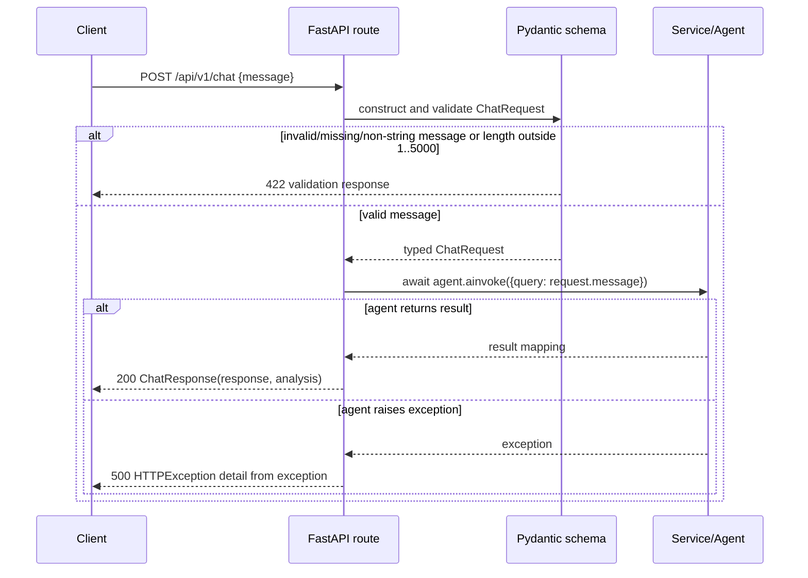

# HTTP trace: `POST /api/v1/chat`

## Route registration

`src/main.py` creates the FastAPI application and attaches the API router with
`app.include_router(router, prefix="/api/v1")`.  The router in
`src/api/routes.py` declares `@router.post("/chat")`, so the effective endpoint
is `POST /api/v1/chat`.

The route-listing command also finds `GET /health`, `GET /api/v1/status`, and
Document routes.  This trace deliberately follows the chat route because the
required test module contains a route-specific validation assertion for it.

## Selected route

- HTTP method/path: `POST /api/v1/chat`.
- Request model: `ChatRequest` (`src/models/schemas.py`).
- Validation constraints: `message` is required, must be a string, and has
  `min_length=1` and `max_length=5000`.
- Handler function: `chat(request: ChatRequest) -> ChatResponse` in
  `src/api/routes.py`.
- Service/agent call: `await agent.ainvoke({"query": request.message})` on the
  module-level `agent` imported from `src.agents.graph`.  This is a concrete
  imported dependency, not FastAPI dependency injection.
- Response model/status: `ChatResponse`, declared by `response_model`; the
  success status is FastAPI's default `200 OK` because the decorator declares
  no alternative status code.  It contains `response` and `analysis` (default
  empty string).
- Expected failure response: an empty `message` is rejected by request-model
  validation with `422 Unprocessable Entity`, before the handler runs.  If the
  handler's agent call raises, its `except Exception` maps it to a `500` HTTP
  error whose `detail` is `str(e)`.

## Source-and-test trace

`tests/conftest.py` builds an `httpx.AsyncClient` with `ASGITransport(app=app)`,
so the designated test reaches the FastAPI app in process.  In
`tests/test_api/test_routes.py::test_chat_empty_message`, the client submits:

```json
{"message": ""}
```

and asserts `response.status_code == 422`.  This is direct evidence for the
validation branch below; it does not exercise the successful agent invocation
or the handler's `500` branch.  The requested pytest command could not run in
this environment because `uv` is not installed, so this assertion is inspected
test evidence rather than an executed test result.



Validation belongs at this presentation boundary because FastAPI can reject an
invalid external payload before it reaches the agent.  The route should then
translate the typed request to an agent call and translate its result to the
HTTP response; embedding broader business decisions here would make the HTTP
boundary harder to reuse and test independently.

## Documentation comparison

`docs/guide/chapter-05.md` describes the same general FastAPI flow: Pydantic
validates input before a handler receives it, and validation failures return
422.  Its code snippets are instructional examples, not proof of this
repository's runtime behavior.  The concrete route, constraints, response, and
failure mapping above come from `src/` and the designated test.

## Checkpoint evidence

### Files read

- `notes/architecture-learning/00-repository-map.md`
- `src/main.py`
- `src/api/routes.py`
- `src/models/schemas.py`
- `tests/test_api/test_routes.py`
- `tests/conftest.py` (to inspect the HTTP test client)
- `docs/guide/chapter-05.md`

### Commands and outcomes

```bash
rg -n '@(app|router)\.(get|post|put|patch|delete)|include_router|FastAPI\(' src tests
```

Outcome: found `POST /chat` and `GET /status` in `src/api/routes.py`, router
inclusions in `src/main.py`, `FastAPI(...)` in `src/main.py`, `GET /health`,
and the separately constructed Document routes/test applications.

```bash
uv run pytest tests/test_api/test_routes.py -v --tb=short
```

Outcome: `/bin/bash: line 2: uv: command not found`; exit status 127 before
pytest collection.  No tests were executed.

### Uncertainties and environment limitations

- The unavailable `uv` executable prevents runtime verification in this
  environment.
- The inspected route test covers only the empty-message `422` branch; it does
  not exercise a successful agent result or the handler's `500` branch.
- Conclusions about success and agent-error behavior are therefore tied to
  route/schema source inspection, not executed tests.

## Execution note

The prescribed command `uv run pytest tests/test_api/test_routes.py -v
--tb=short` ended with `/bin/bash: line 2: uv: command not found` (exit status
127).  No tests were collected or executed.
