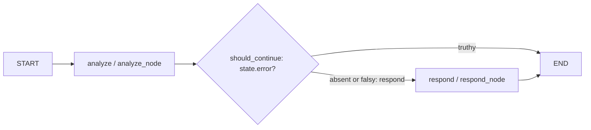

# Agent trace: `POST /api/v1/chat` → LangGraph

## Boundary from HTTP

The `POST /api/v1/chat` handler traced in [01-http-trace.md](01-http-trace.md) calls `await agent.ainvoke({"query": request.message})`. The module-level `agent` is the compiled graph in `src/agents/graph.py`; the HTTP request supplies initial `query` and the returned state supplies response fields.

## Runtime state schema

`AgentState` (`src/agents/state.py:6`) is `TypedDict(total=False)`: transient data for one graph invocation, not a database record. The inspected agent code has no persistence adapter, table mapping, identity, or transaction lifecycle.

| Field | Type | Được tạo bởi | Được đọc bởi | Cách cập nhật |
| --- | --- | --- | --- | --- |
| `query` | `str` | Initial `agent.ainvoke({"query": ...})` input from `src/api/routes.py::chat` (HTTP trace); declaration `state.py:13` | `analyze_node` (`example_node.py:6`) | Initial input; runtime nodes do not overwrite it. |
| `context` | `str` | Declaration only (`state.py:14`); no runtime producer | No runtime reader | No runtime update. |
| `analysis` | `str` | `analyze_node` (`example_node.py:10-12`) | `respond_node` (`example_node.py:17`) | Delta `{ "analysis": analysis }` is merged; no reducer is declared. |
| `response` | `str` | `respond_node` (`example_node.py:20-26`) | HTTP handler consumes final result (HTTP trace); no later node | Delta `{ "response": ... }` is merged. |
| `error` | `str` | Declaration only (`state.py:17`); no runtime node writes it | `should_continue` (`graph.py:9`), `respond_node` (`example_node.py:18`) | May be supplied initially; truthy value selects `END`. |
| `metadata` | `dict` | Declaration only (`state.py:18`); no runtime producer | No runtime reader | No runtime update. |

Nodes return deltas instead of mutating input, making changed-key ownership explicit and allowing graph-managed merging. Input mutation would hide changes, couple nodes via shared mutable state, and make tracing/tests harder. This aligns with the guide's general principle; guide examples are not runtime facts.

## Graph construction and routing

Command run:

```bash
rg -n 'StateGraph|add_node|add_edge|add_conditional_edges|START|END|compile' src/agents
```

Outcome (exit 0): all matches are in `src/agents/graph.py`; construction order is:

1. `StateGraph(AgentState)` (`graph.py:15`).
2. Register `analyze` → `analyze_node` (`graph.py:18`).
3. Register `respond` → `respond_node` (`graph.py:19`).
4. `set_entry_point("analyze")` (`graph.py:22`), the runtime equivalent of `START → analyze`.
5. Add `analyze` conditional routing through `should_continue` (`graph.py:23`).
6. Add direct `respond → END` (`graph.py:24`).
7. `compile()` and assign module-level `agent` (`graph.py:26,29`).

`should_continue` returns `END` for truthy `state.get("error")`, otherwise literal node name `"respond"` (`graph.py:7-11`).



There is no runtime tool node, tool edge, or loop. ReAct, `tools`, `web_search`, research, and review flows in `docs/guide/chapter-04.md` are guide-only examples, **not implemented by this graph**.

## Node contracts

### `analyze` → `analyze_node`

Input state keys: optional `query` (`state.get("query", "")`).

Output state keys: only `analysis`, formatted `"Phân tích: {query}"`.

Side effects: none; no mutation of input state.

External I/O: none; LLM/vector-search references are TODO comments, not calls.

Failure behavior: no local exception handling. Absent `query` yields `"Phân tích: "`; unexpected failures propagate. The implementation does not produce `error`, so error exit is reached only if input/future code supplies it.

### `respond` → `respond_node`

Input state keys: optional `analysis` and `error`.

Output state keys: only `response`; truthy error gives `"Lỗi: {error}"`, otherwise `"Kết quả dựa trên phân tích: {analysis}"`.

Side effects: none; no mutation of input state.

External I/O: none; LLM response logic is only a TODO comment.

Failure behavior: no local exception handling. In this compiled graph a truthy error routes from `analyze` to `END`, so this node's error-response branch is reachable only through direct node invocation or a future routing change.

## Tool boundary

`src/agents/tools/example_tool.py` defines decorated LangChain tools, but `src/agents/graph.py` imports/registers neither. They do not participate in this runtime trace.

| Tool | Contract | Side effects / I/O | Failure behavior |
| --- | --- | --- | --- |
| `search_knowledge(query: str) -> str` (`example_tool.py:20-31`) | Returns `"Kết quả tìm kiếm cho: {query}"`. | None currently; knowledge-base/RAG is TODO. | No local handling; current body has no external call. |
| `calculate(expression: str) -> str` (`example_tool.py:34-51`) | Parses/evaluates numeric AST values using only `_SAFE_OPERATORS`, returns string. | Local CPU only; no `eval`, network, database, or file I/O. | Catches `SyntaxError`, `ValueError`, `TypeError`, and `ZeroDivisionError`, returning `"Lỗi tính toán: {e}"`; others propagate. |

## Test evidence and assertion mapping

Command requested and run:

```bash
uv run pytest tests/test_agents/test_graph.py -v --tb=short
```

Outcome: exit 127 before pytest collection:

```text
/bin/bash: line 1: uv: command not found
```

No tests ran. This mapping is source inspection of `tests/test_agents/test_graph.py`, not passing-test evidence.

| Test assertion | State transition / edge |
| --- | --- |
| `test_agent_basic_flow`: `"response" in result` | Initial `query="Hello"` → analyze delta → no-error conditional → respond delta → `END`. |
| `test_agent_state_structure`: `isinstance(result, dict)` | Returned LangGraph state container after that successful path; not a direct edge assertion. |
| `test_agent_state_structure`: `"query" in result` | Initial input survives `analyze` and `respond`, neither of which overwrites `query`. |

Neither test supplies `error`, asserts the `analyze → END` branch, or invokes a tool.

## Checkpoint evidence

Files read: `notes/architecture-learning/01-http-trace.md`, `src/agents/state.py`, `src/agents/graph.py`, `src/agents/nodes/__init__.py`, `src/agents/nodes/example_node.py`, `src/agents/tools/__init__.py`, `src/agents/tools/example_tool.py`, `tests/test_agents/test_graph.py`, and `docs/guide/chapter-04.md`.

Commands: the required `rg` command succeeded (exit 0); the required `uv run pytest` failed (exit 127) because `uv` is absent; `rg --files src/agents/nodes src/agents/tools tests/test_agents docs/guide` succeeded and confirmed the implementation/test files.

## Uncertainties and limits

- `uv` is unavailable, so test assertions are static mappings only.
- LangGraph supplies merge internals; node deltas and no declared reducers show intended overwrite behavior, but source here does not implement LangGraph internals.
- `context`, `metadata`, and runtime production of `error` are unimplemented; no future behavior is inferred.
- Guide ReAct/RAG/planning/tool examples are not evidence of current runtime nodes, edges, or I/O.
