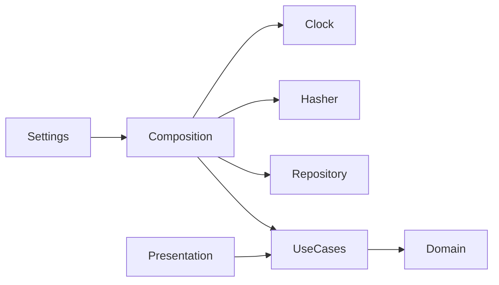

# Auth Clean Architecture: dependency map and lifecycle

## Checkpoint conclusion

Auth currently has a complete framework-independent Domain, concrete
Infrastructure, and a composition/config boundary. `src/auth/application/` and
`src/auth/presentation/` are documented as planned but do not yet exist. The
required direction is therefore the target design, not a fully executable flow:

```text
Presentation → Application → Domain
Infrastructure → implements Application ports; maps to/from Domain
Composition/config → selects concrete adapters and injects them inward
```

The required import scan found no outward Domain import: Domain imports only the
standard library, `src.auth.contracts`, and sibling Domain modules—not FastAPI,
SQLAlchemy, Alembic, Argon2, or Infrastructure.

## 1. Layer classification

| Layer / boundary | Files | Reason |
| --- | --- | --- |
| Domain | `domain/__init__.py`, `accounts.py`, `authorization.py`, `clock.py`, `errors.py`, `hashing.py`, `passwords.py`, `sessions.py`, `values.py` | Framework-independent entities, values, errors, policies, and `Clock`/`PasswordHasher` protocols. |
| Application (planned) | Documented `application/__init__.py`, `ports/{repositories,unit_of_work,email_sender,token_service,rate_limiter}.py`, `use_cases/{customer_auth,staff_auth,password_recovery}.py`; absent now | Will orchestrate flows and define ports without FastAPI/SQLAlchemy. Absence is not a violation. |
| Infrastructure | `infrastructure/__init__.py`, `argon2_hasher.py`, `clock.py`, `migrations.py`, `models.py`, `repositories.py` | Concrete Argon2id, wall clock, Alembic, SQLAlchemy ORM, PostgreSQL repositories/UoW. |
| Presentation (planned) | Documented `presentation/__init__.py`, `routes.py`, `schemas.py`, `dependencies.py`, `cookies.py`, `csrf.py`, `errors.py`; absent now | Will translate FastAPI/Pydantic/cookie/CSRF/HTTP concerns to Application. |
| Composition/config boundary | `composition.py`, `settings.py`, `contracts.py` | Bootstrap configuration, frozen contracts, engine/session creation, migration verification. |
| Package declaration | `src/auth/__init__.py` | Package marker; it does not itself implement a Clean Architecture layer or composition/config behavior. |

Tests follow that split: `tests/auth/unit/domain/` protects Domain (plus the
Argon2 adapter/port boundary); `tests/auth/integration/` protects composition,
migrations, and real PostgreSQL behavior.

### Checkpoint evidence

- **Files read:** `docs/backend-auth-directory-architecture.md`; all
  `src/auth/domain/*.py`; `src/auth/{composition,settings,contracts}.py`; and
  `src/auth/infrastructure/{argon2_hasher,clock,migrations,models,repositories}.py`.
- **Commands and outcomes:** `find docs src/auth tests/auth -maxdepth 4 -type f | sort`
  identified the current Auth tree; it showed no `src/auth/application/` or
  `src/auth/presentation/` directory. `git status --short` showed pre-existing
  untracked `docs/superpowers/` and `notes/`; neither was overwritten.
- **Uncertainty:** the architecture document labels Application and Presentation
  `[Dự kiến]`; classification of those files is planned design, not filesystem
  evidence of implementation.

## 2. Import-direction checkpoint

```bash
rg -n '^from |^import ' src/auth/domain src/auth/application src/auth/infrastructure src/auth/presentation 2>/dev/null
```

Outcome: exit `0`. It printed imports from existing Domain and Infrastructure;
the command suppresses errors for absent planned Application/Presentation.

| Finding | Assessment |
| --- | --- |
| Domain → standard library / sibling Domain / `contracts` | Allowed inward-safe imports. `contracts.py` is constant-only; it must stay framework/config-free. |
| Domain → FastAPI/SQLAlchemy/Alembic/Argon2/Infrastructure | None found; no actual violation. |
| Infrastructure → Domain | `argon2_hasher.py` consumes Domain secret/hash types; `repositories.py` maps ORM rows to Domain types. Permitted adapter direction. |
| Infrastructure → SQLAlchemy/Alembic/Argon2 | Correctly contained in Infrastructure. |
| Application/Presentation references in the architecture document | `[Dự kiến]` planned files, not current imports or violations. |

### Checkpoint evidence

- **Files read:** all current files under `src/auth/domain/` and
  `src/auth/infrastructure/`, plus `docs/backend-auth-directory-architecture.md`
  to distinguish planned paths from current source.
- **Commands and outcomes:** the required `rg` command above exited `0` and
  printed only the imports summarized in this section. No Domain import named
  FastAPI, SQLAlchemy, Alembic, Argon2, or Infrastructure.
- **Uncertainty:** nonexistent Application/Presentation paths are hidden by the
  required `2>/dev/null`; the command can establish the current import boundary,
  not validate future files.

## 3. Password and session lifecycle

```text
input password (future Presentation schema/dependency)
→ PlaintextPassword redaction + domain validate_password
→ PasswordHasher protocol / Argon2idHasher (m=65536 KiB, t=3, p=4)
→ User.password_hash only; UserRepository writes auth_users.password_hash
→ active User creates refresh family; only token_hash persists
→ RefreshToken validity/rotation/revocation plus repository lock/conditional update
→ authorize(role, action) default-deny decision (future Application/Presentation enforcement)
```

- `User.assert_can_start_session()` permits only `ACTIVE`; pending verification,
  temporary-password, and disabled states are typed rejections.
- Wrong or malformed password hashes yield `False`; `auth_users` has no plaintext
  password column.
- Rotation revokes one current token and adds one successor without extending the
  30-day family deadline. A rotated token is a replay; family-scoped and all-device
  revocation are deliberately distinct.
- Email verification/reset tokens are hashed, purpose/user-bound, exact-expiry,
  single-use, latest-token-wins values; locks/conditional updates protect against
  concurrent use.
- JWT/cookies/routes/use cases do not currently exist, so HTTP authorization and
  access-token issuance are intended architecture, not runtime evidence.

### Checkpoint evidence

- **Files read:** `domain/{accounts,passwords,hashing,sessions,authorization,values,clock}.py`,
  `infrastructure/{argon2_hasher,models,repositories}.py`, `contracts.py`, and
  the lifecycle-focused domain and repository tests.
- **Commands and outcomes:** source inspection used `rg` to locate password,
  session, token, and authorization symbols in these files; no lifecycle command
  was executed because the prescribed runtime command is the pytest command in
  checkpoint 4.
- **Uncertainty:** Presentation input parsing, use-case orchestration, JWT
  issuance, cookie handling, and HTTP authorization are absent, so the endpoints
  represented in the arrows are explicitly future boundaries.

## 4. Test mapping (source-inspected)

| Invariant | Guarding layer | Test evidence |
| --- | --- | --- |
| Email normalization, Gmail policy, secret redaction | Domain | `unit/domain/test_values.py` |
| Password bounds/classes/control characters/no transformation | Domain | `unit/domain/test_passwords.py` |
| Argon2id behavior/parameters/malformed hashes/port isolation | Adapter + Domain port | `unit/domain/test_hashing.py` |
| UTC and exact expiry | Domain | `unit/domain/test_clock.py` |
| Account state/verification/temp password/reset/disable; active-only sessions | Domain | `unit/domain/test_accounts.py` |
| Role-action/default deny/target/last-admin rules | Domain | `unit/domain/test_authorization.py` |
| Refresh rotation/replay/expiry/revocation; one-time token binding/use | Domain | `unit/domain/test_sessions.py` |
| Startup fail-fast/resource lifetime/redaction | Composition/config | `integration/test_lifespan.py` |
| Alembic head/upgrade/downgrade/model drift/legacy isolation | Infrastructure migration | `integration/test_migrations.py` |
| Hash-only rows, unique email, rollback, concurrency, limiter/events | Infrastructure/database | `integration/test_repositories.py` |

```bash
uv run pytest tests/auth/unit/domain tests/auth/integration -v --tb=short
```

Actual outcome: exit `127` before collection: `/bin/bash: line 1: uv: command
not found`. No tests ran; the table above maps directly inspected source.

### Checkpoint evidence

- **Files read:** first every `tests/auth/unit/domain/*.py`, then every
  `tests/auth/integration/*.py`, together with the implementation symbols they
  name.
- **Commands and outcomes:** `uv run pytest tests/auth/unit/domain
  tests/auth/integration -v --tb=short` exited `127` before test collection with
  `/bin/bash: line 1: uv: command not found`; therefore no pass/fail count exists.
- **Uncertainty:** this is source-level test mapping, not observed PostgreSQL,
  Alembic, or Argon2 behavior in this environment.

## 5. Composition root



This is the required target graph. At present `AuthComposition` builds/disposes
the SQLAlchemy engine/session factory and gates startup on connectivity and the
Alembic head. It does not yet wire `SystemClock`, `Argon2idHasher`,
`AuthUnitOfWork`, use cases, or Presentation. Composition is allowed to choose
concrete adapters because it is an outer bootstrap layer. If Domain imported
FastAPI/SQLAlchemy, policy tests would need transport/database dependencies;
repository row mapping prevents that coupling.

### Checkpoint evidence

- **Files read:** `src/auth/composition.py`, `settings.py`,
  `infrastructure/{clock,argon2_hasher,repositories}.py`, Domain protocols in
  `domain/{clock,hashing}.py`, and the planned composition table in
  `docs/backend-auth-directory-architecture.md`.
- **Commands and outcomes:** direct source inspection confirmed
  `AuthComposition.start()` currently creates an engine/session factory and
  verifies connectivity/migration state; it does not construct the adapters or
  use cases shown as target nodes.
- **Uncertainty:** the Mermaid graph is the exact required target graph. It must
  not be read as evidence that all of its nodes are currently wired.

## Evidence and limits

Files read: `docs/backend-auth-directory-architecture.md`; all
`src/auth/domain/*.py`; `src/auth/{composition,settings,contracts}.py`; all
required `models.py`/`repositories.py`, plus concrete adapter context
`argon2_hasher.py`, `clock.py`, `migrations.py`; all `tests/auth/unit/domain/`
then all `tests/auth/integration/`; and inputs `00-repository-map.md` and
`04-data-and-migrations.md`.

The data/migration artifact is Document-specific; only its boundary principle
(Domain independent of persistence; Infrastructure owns ORM/transactions) is
reused here. `uv` is unavailable, and Application/Presentation remain planned,
so cookie/CSRF/JWT/email/HTTP claims are architectural intent rather than
executed evidence.
