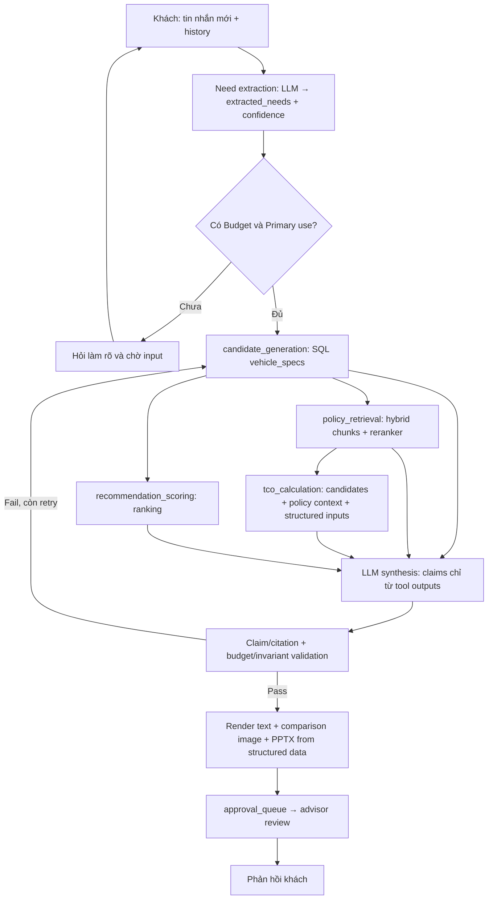

# Luồng nghiệp vụ RAG/Agent tư vấn xe VinFast

## Kết luận checkpoint

Thiết kế VinFast phân vai rõ ràng: LLM chỉ trích nhu cầu, chọn/gọi tool và tổng hợp ngôn ngữ; dữ liệu giá, thông số, TCO và slide phải do dữ liệu structured cùng tool xác định tạo ra. RAG chỉ truy xuất ngữ cảnh chính sách/tài liệu có kiểm soát. Vì vậy không được để LLM tự bịa giá hoặc TCO, và PowerPoint phải render bằng code từ `vehicle_specs`, không phải do LLM viết nội dung/định dạng tự do.

Đây là **thiết kế nghiệp vụ mục tiêu** trong `docs/kien-truc-du-lieu-va-rag-agent.md`, chưa phải runtime hiện tại: agent đang có chỉ là graph `analyze → respond`, không đăng ký tool hay RAG loop (xem [02-agent-trace.md](02-agent-trace.md)). Các guide LangGraph/RAG cung cấp pattern tổng quát (state, node delta, edge có điều kiện, tool, retrieve-then-generate), không phải bằng chứng rằng hệ thống hiện tại đã triển khai flow dưới đây.

## 1. Input slot của khách

`need extraction` nhận tin nhắn mới nhất và lịch sử hội thoại, dùng LLM trích JSON có confidence rồi lưu theo `conversation_id` trong `extracted_needs`. `missing information` chỉ cho vào tool orchestration khi tối thiểu có ngân sách và mục đích sử dụng; các slot “theo nghiệp vụ” có thể trở thành điều kiện cần khi tình huống cần lọc/tính tương ứng.

| Slot | Bắt buộc để đi tiếp? | Nơi lưu | Ảnh hưởng |
| --- | --- | --- | --- |
| Budget | Có | `extracted_needs` | SQL candidate filter |
| Primary use | Có | `extracted_needs` | scoring/recommendation |
| Passenger count | Theo nghiệp vụ | `extracted_needs` | seats filter |
| Daily distance | Theo nghiệp vụ | `extracted_needs` | range safety factor |
| Home charging | Theo nghiệp vụ | `extracted_needs` | TCO |

Nếu thiếu Budget hoặc Primary use, graph dừng ở câu hỏi làm rõ và chờ khách trả lời, thay vì suy đoán hay retrieval sớm. Đây là state theo phiên/conversation, không phải thay thế bản ghi catalog: Task 3 xác nhận `AgentState` hiện tại là transient `TypedDict`; thiết kế VinFast mới ghi nhu cầu vào bảng bền vững `extracted_needs`.

## 2. Bốn tool chính

| Tool | Input | Output | Loại và nguồn dữ liệu | Bảo đảm nghiệp vụ |
| --- | --- | --- | --- | --- |
| `candidate_generation` | Budget, passenger count khi áp dụng, daily distance khi áp dụng, category/hiệu năng và thời điểm tư vấn | 3–5 `model_id` ứng viên và dữ liệu structured đã lọc | Deterministic/structured: query trực tiếp `vehicle_specs`, không qua LLM/RAG | Chỉ lấy bản `approved`, đúng `market`, trong hiệu lực; lọc `price_vnd <= budget_max_vnd`, `seats >= passenger_count`, `range_km >= daily_distance_km * hệ_số_an_toàn`. Giá là VND gốc. |
| `policy_retrieval` | Candidate list, câu hỏi/chủ đề chính sách, thời điểm tư vấn | Context chunks cùng `document_id`/`chunk_id` để citation | Retrieval: hybrid trên `document_chunks` rồi rerank | Chỉ chunk `approved`, còn hiệu lực (`effective_from <= now <= effective_to`), đúng ngữ cảnh/model; trả chính sách giá, bảo hành, pin. |
| `tco_calculation` | Candidate list, policy context (giá sạc/chính sách pin), daily distance, home charging và thời hạn N năm | TCO mua/thuê pin, điện, bảo dưỡng ước tính; **danh sách assumptions bắt buộc** | Deterministic calculation trên input structured; policy context là dữ liệu truy xuất có citation, không phải LLM tự tính | Phân biệt `battery_rental_fee_vnd_month = null` (mua đứt) với thuê pin; mọi giả định như giá điện và thay pin phải được công khai. Dữ liệu `source_tier=secondary` không được dùng cho TCO. |
| `recommendation_scoring` | Candidate list, extracted needs và kết quả liên quan từ các tool | Ranking cùng lý do | Deterministic/structured, ban đầu rule-based; có thể calibrate bằng dataset scenario chuyên gia | Chấm mức khớp nhu cầu, không tạo candidate mới và không được vượt qua hard filters của `candidate_generation`. |

Tài liệu nghiệp vụ ghi “4 tool chạy song song trong 1 LangGraph step”, nhưng contract ngay bên dưới tạo dependency dữ liệu: `candidate_generation` phải tạo candidate list trước khi `policy_retrieval`, `tco_calculation` và `recommendation_scoring` tiêu thụ list đó; `tco_calculation` còn cần policy context. Vì vậy không được hiểu đây là bốn lời gọi vô điều kiện song song trong cùng lượt. Lịch biểu an toàn khi chưa có candidate trong state là candidate generation → policy retrieval và recommendation scoring (có thể song song sau candidate) → TCO calculation → synthesis. Chỉ khi `candidate_ids` hợp lệ từ state/lượt trước đã được xác nhận còn approved và effective thì ba tool phụ thuộc mới có thể bắt đầu mà không gọi lại candidate generation. Tài liệu nguồn chưa quyết định rõ trường hợp state/lượt trước này hay lịch biểu thực thi; đó là ambiguity cần chốt trước implementation. Đây vẫn là một ứng dụng cụ thể của guide: node nhận state và trả delta; tool có input/output có kiểu, mô tả rõ và tự xử lý lỗi. Tuy nhiên, bốn tool này chưa có trong runtime hiện tại.

## 3. Validation và citation flow

```text
candidate_generation
→ policy_retrieval + recommendation_scoring (sau khi có candidates)
→ tco_calculation (sau khi có candidates + policy context)
→ LLM synthesis
→ claim/citation validation
→ budget/invariant validation
→ retry có giới hạn hoặc approval queue
```

1. `LLM synthesis` chỉ nhận output của bốn tool. Mỗi claim phải gắn citation về `document_id`/`chunk_id`; nếu tool không có dữ liệu, LLM phải nói “chưa có thông tin”, không suy đoán.
2. `claim/citation validation` kiểm mọi claim văn bản có citation hợp lệ. Citation của RAG phải trace được từ chunk về document nguồn; bản ghi `vehicle_specs.source_document_id` là đường trace cho số liệu structured.
3. `budget/invariant validation` kiểm giá, TCO và thông số trong câu trả lời đều trace được về tool output/`vehicle_specs`; kiểm không có candidate vượt ngân sách hay vi phạm seats/range/approval/effective-date. Đây là hàng rào Budget Violation Rate.
4. Nếu lỗi, feedback cụ thể đưa flow quay lại orchestration hoặc synthesis nhưng có số lượt retry giới hạn để tránh loop vô hạn. Nếu qua, tạo package text + ảnh so sánh + PPTX rồi đưa `approval_queue` để advisor duyệt, chỉnh nhẹ, hoặc từ chối có lý do.

## 4. Hybrid retrieval

| Cách truy vấn | Dùng cho | Vì sao |
| --- | --- | --- |
| SQL filter | giá, range, seats, approval/effective dates | cần đầy đủ và chính xác |
| Dense vector | semantic context | tìm nội dung tương đồng |
| Lexical/tsvector | mã xe, điều khoản, từ khóa chính xác | tránh dense search bỏ sót |
| Reranker | xếp lại candidate chunks | tăng precision |

Luồng policy retrieval là: query được BGE-M3 biểu diễn; dense pgvector và sparse/`tsvector` chạy song song; hợp nhất bằng reciprocal-rank fusion hoặc weighted sum để lấy top-N (ví dụ 20); BGE-reranker-v2-m3 xếp lại và lấy top-k cuối (ví dụ 5) cho LLM. SQL không phải một nhánh RAG thay thế hybrid: nó giữ tập vehicle và điều kiện hiệu lực hoàn chỉnh/chính xác; hybrid tìm ngữ cảnh tự nhiên trong `document_chunks` cho các candidate đó.

So với guide `rag-pattern.md` (mẫu đơn giản `Query → Embed → Vector DB → Top-K → Context + Query → LLM`), thiết kế VinFast thêm lexical retrieval, reranking, filter approval/effective date, citations và validation sau synthesis. Vì thế không suy từ generic vector Top-K rằng kết quả đáp ứng đầy đủ điều kiện giá/chỗ ngồi/range.

## 5. End-to-end RAG/Agent flow



`generate_comparison_pptx` lấy `model_ids` từ candidate generation, query các dòng `vehicle_specs` đang approved/còn hiệu lực, dùng `image_path` nguồn duy nhất, điền template cố định bằng code và tái dùng TCO đã có. LLM chỉ quyết định có gọi tool hay không và danh sách model; không được viết PPTX. Cách này giữ giá/thông số/ảnh nhất quán với output đã validate và cho advisor preview thông qua payload trong `approval_queue`.

Điểm cần chốt: business document vừa nói bốn tool “chạy song song”, vừa định nghĩa `policy_retrieval`/`tco_calculation` cần candidate list. Note này ưu tiên dependency của contract input/output; nếu implementation muốn chạy song song, nó phải chứng minh `candidate_ids` hợp lệ đã có từ state/lượt trước và còn qua approval/effective-date validation.

## Checkpoint evidence

Files read:

- `docs/kien-truc-du-lieu-va-rag-agent.md` — nguồn thiết kế nghiệp vụ VinFast: schema, hybrid retrieval, 4 tool, validation/HITL và PPTX.
- `docs/guide/patterns/rag-pattern.md`, `docs/guide/langgraph/state.md`, `docs/guide/langgraph/nodes-and-edges.md`, `docs/guide/langgraph/tools.md` — guide tổng quát, không phải implementation proof.
- `notes/architecture-learning/02-agent-trace.md` — bằng chứng graph runtime hiện chưa có tool/RAG; runtime source trực tiếp được đối chiếu ở Task 3 gồm `src/agents/graph.py`, `src/agents/state.py`, `src/agents/nodes/example_node.py`, và `src/agents/tools/example_tool.py`.
- `notes/architecture-learning/04-data-and-migrations.md` — ví dụ trước đó về phân biệt entity, persistence, transaction và source-level evidence.

Commands run:

```bash
git status --short
rg --files docs notes/architecture-learning .superpowers/sdd/2026-07-30-system-architecture-learning-roadmap | sort
rg -l -i 'vinfast|candidate_generation|policy_retrieval|tco_calculation|recommendation_scoring' docs notes/architecture-learning .superpowers/sdd/2026-07-30-system-architecture-learning-roadmap
rg -n '^## |^### |candidate_generation|policy_retrieval|tco_calculation|recommendation_scoring|hybrid|rerank|claim|citation|approval.queue|approval_queue|extracted_needs|PowerPoint|PPTX|budget|invariant|retry' docs/kien-truc-du-lieu-va-rag-agent.md
uv --version; uv run pytest tests/test_agents/test_graph.py -v --tb=short
```

Outcomes: `git status --short` showed pre-existing untracked `docs/superpowers/` and `notes/`; discovery/search commands exited 0 and located the specified source material; the final command exited 127 because `uv` is not installed (`/bin/bash: uv: command not found`), so no tests ran. The `02-agent-trace.md` evidence was read rather than re-running its source trace.

## Uncertainties and limits

- The VinFast RAG/agent flow, tables, four tools, and PPTX tool are architecture decisions in the business document, not source-implemented behavior in the inspected current graph.
- The business document states that four tools run in parallel but also makes policy retrieval and TCO depend on candidate list; it does not define whether valid candidate IDs can arrive from prior state/turn. The documented safe schedule is therefore dependency-first unless that state contract is explicitly added.
- `hệ_số_an_toàn`, TCO horizon N, electric-price assumptions, scoring weights, retry limit, and final fusion/reranking thresholds are specified conceptually but no exact operational values are fixed in the required sources.
- The generic guides recommend string-returning tools and local error handling, while this business design requires structured, citation-bearing tool outputs; an implementation must settle concrete Pydantic contracts without treating the guide snippet as a binding interface.
- No executable verification was possible because `uv` is absent; all runtime-status claims rely on the prior task’s inspected source trace.
